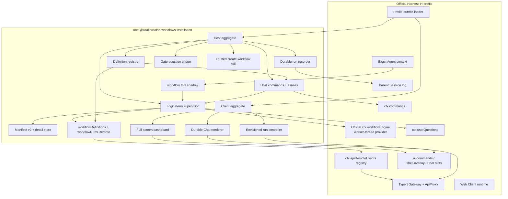
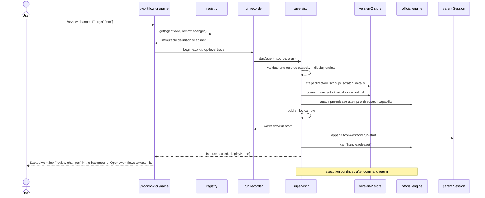
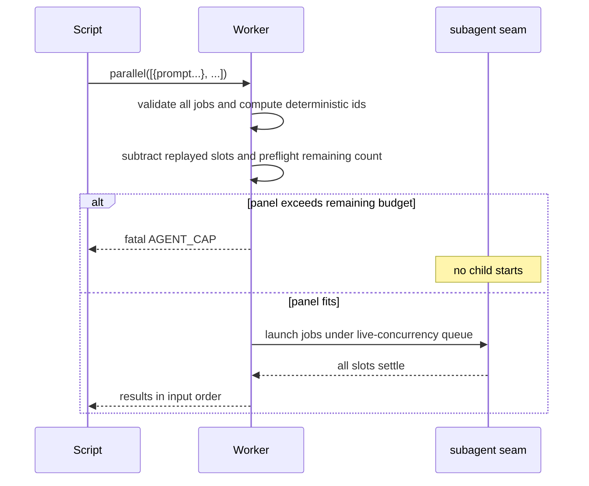

# Requirements

## Introduction

This feature extracts the saved-workflow and supervised-run product from the DeepSeek Harness development fork into one installable npm package, `@zaalipro/dsh-workflows`, for the official DeepSeek Harness. It serves Web and headless users who need reusable JavaScript workflows, immediate background launch, durable run inspection, same-process pause/resume, and a polished full-screen dashboard without maintaining a permanent Harness fork. The package reproduces Grok-style workflow semantics but contains no Grok CLI code, runtime dependency, protocol, branding dependency, or Rhai evaluator.

## Requirements

### Requirement 1: One installable product
**User Story:** As a Harness operator, I want one package to install, so that I can add or remove the complete workflow product without maintaining a fork.

#### Acceptance Criteria
1.1 WHEN an operator runs `dsh plugin --profile web add @zaalipro/dsh-workflows` against the compatible official release `H` defined by criterion 1.4 THEN the profile SHALL gain exactly one top-level dependency and exactly one bundle entry named `@zaalipro/dsh-workflows`.
1.2 WHEN the package is installed into `web` THEN the Host registry, supervisor, recorder, question bridge, commands, model tool adapter, dashboard, and durable Chat renderer SHALL all load from that package's tarball.
1.3 WHEN the package is installed into `headless` THEN the Host registry, supervisor, recorder, question bridge, commands, and model tool adapter SHALL load while no browser-only code is evaluated.
1.4 `H` SHALL mean the first future official DeepSeek Harness release that contains every prerequisite listed in Design; compatibility metadata SHALL name `H` and only later releases verified against the same prerequisites, SHALL reject stock `0.1.0-rc.8`, and SHALL NOT assume that `0.1.0-rc.9` or any other unverified version is compatible.
1.5 WHEN the package is removed with `dsh plugin --profile <profile> remove @zaalipro/dsh-workflows` THEN the bundle entry and dependency SHALL disappear and the unmodified official profile SHALL boot successfully.
1.6 WHEN package contents or dependency metadata are inspected THEN there SHALL be no Grok CLI package, executable, source, wire call, environment-variable dependency, or Rhai implementation.
1.7 WHEN the initial prerelease is packed THEN its identity SHALL be `@zaalipro/dsh-workflows@0.1.0-rc.1`, its license SHALL be MIT, its Node range SHALL be `^22.19.0 || >=24.0.0`, and its package manager SHALL be `pnpm@11.7.0`.

### Requirement 2: Saved workflow definitions
**User Story:** As a workflow author, I want strict project, user, and bundled definitions, so that names resolve predictably and scripts remain data until the engine runs them.

#### Acceptance Criteria
2.1 WHEN definitions are listed for a workspace THEN roots SHALL be read in precedence order `bundled`, nearest Git project `<root>/.dsh/workflows`, then `<dshHome>/workflows`, with the first definition of each name winning and final output sorted by name.
2.2 WHEN no `.git` file or directory exists above the supplied cwd THEN that cwd SHALL be the project root.
2.3 WHEN a saved definition is read THEN only a flat `<name>.workflow.json` UTF-8 file whose JSON object has exactly `meta` and `script` SHALL be accepted; unknown envelope, metadata, or phase fields SHALL reject the whole observation with the offending path.
2.4 WHEN a definition name is validated THEN it SHALL contain 1–64 UTF-16 code units, start with `[a-z]`, continue in lowercase kebab-case, exclude `pause`, `resume`, `save`, `stop`, `workflow`, `workflows`, and `create-workflow`, exclude Windows device basenames `con`, `prn`, `aux`, `nul`, `com1`–`com9`, and `lpt1`–`lpt9`, and equal the filename stem.
2.5 WHEN a definition root is absent THEN it SHALL contribute no definitions; WHEN a matching file is malformed, oversized, invalid UTF-8, a link, or not a regular file THEN discovery SHALL fail loudly rather than omit that file.
2.6 WHEN a definition is read or saved THEN the final path component SHALL be opened without following links, the resolved root SHALL remain within its allowed base, and no raced link target SHALL be read, changed, or deleted.
2.7 WHEN a project or user definition is saved THEN bytes SHALL be exactly `JSON.stringify({ meta, script }, null, 2) + "\n"`, publication SHALL use a guarded create-or-versioned-replace operation, and `workflows/change` SHALL emit only after successful publication.
2.8 WHEN an eligible unnumbered, non-built-in run is saved THEN its current editable script projection and validated metadata SHALL publish as a new or updated project/user definition keyed by `meta.name`; a same-name definition hidden by higher precedence MAY be written but SHALL NOT become the winner, while built-in runs and numbered duplicate handles such as `name-2` SHALL expose no Save action and SHALL require an explicitly edited copy with a new unique `meta.name`.
2.9 WHEN filesystem watching is enabled THEN add, change, unlink, root create, and root removal events SHALL produce a coalesced refresh hint, project watcher ownership SHALL remain bounded at 128 roots, and stale callbacks SHALL not publish after watcher replacement or disposal.
2.10 WHEN the registry is disabled THEN list SHALL return `[]`, snapshot SHALL return `{ definitions: [], complete: true }`, get SHALL return `undefined`, and save SHALL reject `workflow registry is disabled`.

### Requirement 3: JavaScript workflow execution
**User Story:** As a workflow author, I want deterministic orchestration hooks with strict limits, so that a script can coordinate many agents and resume safely.

#### Acceptance Criteria
3.1 WHEN a workflow runs THEN its body SHALL be plain JavaScript with top-level `await`; metadata SHALL arrive as validated JSON data beside the body and SHALL never be evaluated as host code.
3.2 WHEN `agent(prompt, opts)` runs THEN supported options SHALL be exactly `label`, `phase`, `schema`, `provider`, and `model`; unsupported options including `fork_context` SHALL terminate the run with `UNSUPPORTED_OPTION`.
3.3 WHEN an agent has no schema THEN its script-visible result SHALL be final text; WHEN it has a schema THEN the result SHALL be the validated JSON object; an ordinary child failure SHALL yield `null`, while infrastructure and hook misuse SHALL terminate the workflow.
3.4 WHEN `parallel()` receives thunks or declarative `{ prompt, label?, phase?, schema?, provider?, model? }` jobs THEN it SHALL be a barrier, preserve slot order, return `null` for ordinary failed slots, and reject mixed forms; declarative jobs SHALL atomically preflight the whole unreplayed panel before launching any slot, while thunk bodies SHALL retain per-host-call admission because their future agent count is unknowable before execution.
3.5 WHEN `pipeline(items, ...stages)` runs THEN each item SHALL advance independently between stages, the returned array SHALL preserve input order, and fatal workflow errors SHALL not be converted to `null`.
3.6 WHEN `complete(value)` is called THEN the first valid JSON value SHALL settle the run successfully even if script code catches the internal sentinel; later hooks SHALL perform no effect.
3.7 WHEN `await_user(kind, message)` parks THEN acknowledged resume SHALL continue past that committed gate; WHEN `pause(kind, message)` parks THEN resume SHALL evaluate and emit the same uncommitted gate again if its condition remains unchanged.
3.8 WHEN `budget()` is called THEN it SHALL return `{ total, spent, reserved: 0, remaining }`, with default total 128, allowed totals 1–1024, cumulative spend across attempts, and replayed or schema-correction calls spending zero.
3.9 WHEN scratch hooks run THEN they SHALL use only the supervisor-supplied capability for that logical run, expose no ambient absolute scratch path to the generic engine, require names matching `^[A-Za-z0-9][A-Za-z0-9._-]*$`, return one UTF-8 file or `undefined` on read, publish writes atomically, and enforce quotas of 4,096 operations, 64 pending operations, 64 files, 1 MiB per file, and 8 MiB total unless configuration lowers them.
3.10 WHEN replay-capable saved or resumed scripts execute THEN `Date`, `Math.random`, `Atomics`, `SharedArrayBuffer`, `WeakRef`, and `FinalizationRegistry` SHALL be unavailable while deterministic `Math` functions remain available.
3.11 WHEN a script calls `phase(title)` or `log(message)` THEN the event text SHALL be bounded to 64 KiB UTF-8, committed once, and replay SHALL restore phase without duplicating observer output.
3.12 WHEN an object schema uses `minItems` or `maxItems` THEN non-negative integer bounds SHALL be enforced inclusively only on array nodes, `minItems <= maxItems` SHALL be required, and either keyword beside `oneOf` SHALL reject.
3.13 WHEN a workflow tries to call another workflow through a script hook THEN no such hook SHALL exist; nested workflow launches remain unsupported.

### Requirement 4: Background supervision and controls
**User Story:** As a user, I want workflows to run independently of the launching turn, so that I can keep using Chat and control long work.

#### Acceptance Criteria
4.1 WHEN a live launch is durably admitted THEN its command or tool call SHALL return only after the initial manifest row is committed, private starting authority owns an attached engine attempt, and public run/lifecycle state is published, but before the workflow result settles; caller or RPC abort SHALL cancel only work before durable admission, after which the supervisor owns the detached run.
4.2 WHEN the first run of a metadata name starts in one Session THEN its display name SHALL equal that name; later launches SHALL be `name-2`, `name-3`, and so on, with ordinals reserved atomically and never reused after restart or eviction.
4.3 WHEN a launch is admitted THEN the exact script and arguments SHALL be snapshotted, `script.js` SHALL be written as an editable projection under the run directory, and later edits to either source SHALL not mutate the live run.
4.4 WHEN a run changes THEN its status SHALL be one of `running`, `pausing`, `stopping`, `needs-input`, `paused`, `budget-limited`, `completed`, `failed`, `cancelled`, or `interrupted` and SHALL follow only the transition table in Design.
4.5 WHEN Pause is requested for a running run THEN new work SHALL stop, the active attempt SHALL cancel and dispose, committed host calls SHALL remain, and `paused` SHALL publish only after attempt cleanup and manifest commit.
4.6 WHEN Stop is requested THEN the attempt and every admitted child/scratch operation SHALL be cancelled, paired member-end events SHALL publish, and terminal `cancelled` SHALL publish only after bounded cleanup and manifest commit.
4.7 WHEN a replay-capable engine attempt's result has settled and its `dispose()` has fulfilled THEN synchronous `checkpoint()` SHALL remain available from a retained detached ledger and return only host-call results committed before `checkpoint()` returns, cumulative agent spend, and the next member sequence; before both result settlement and disposal it SHALL fail with `CHECKPOINT_NOT_READY`, and when replay authority was never requested or has been destroyed it SHALL fail with `CHECKPOINT_UNAVAILABLE`; that checkpoint SHALL be the supervisor's sole replay authority, observe-only events SHALL not be authoritative, incomplete effectful calls SHALL be absent and MAY run again, and same-process replay divergence SHALL reject before any new external effect while preserving the original immutable script and args.
4.8 WHEN a run is `budget-limited` THEN human `/workflow resume` and dashboard Resume SHALL reject with `workflow "<display-name>" requires a higher agent_budget to resume`; model resume SHALL require an absolute `agent_budget` greater than the old total and no greater than 1,024, and an absent, equal, lower, or greater-than-1,024 cap SHALL return that same rejection without launching a new attempt.
4.9 WHEN an eligible logical run settles THEN the same terminal transaction SHALL atomically change completion-notice state from nonterminal `none` to terminal `claimed` before the terminal row becomes visible, and a terminal row with `none` SHALL be invalid; each `claimed` state SHALL authorize at most one owner-visible append attempt, become `delivered` only after that append succeeds, and become `abandoned` after a failed attempt or restart recovery, with no retry from `claimed`, `delivered`, or `abandoned`, so a crash may omit but SHALL never duplicate the notice; attempted content SHALL prefer bounded `scratch/report.md` over the inline result and end with `Open /workflows to inspect the run.`
4.10 WHEN multiple eligible completions arrive while the owner is busy THEN notices SHALL coalesce into owner wake cohorts of at most 20 notices and 262,144 UTF-8 bytes (256 KiB) total and SHALL open at most 3 consecutive completion-driven turns before new human input; excess notices SHALL remain eligible for a later cohort without bypassing the persisted notice-state transitions.
4.11 WHEN supervisor or Agent teardown begins THEN start admission SHALL close, every pending start transaction SHALL be aborted and awaited, no start SHALL publish afterward, and published attempts plus lifecycle/durable/notice work SHALL drain to a fixed point before teardown returns.
4.12 WHEN configured active limits are reached THEN the 65th active run in one Session or the 1,025th active run globally SHALL reject before creating a run directory or reserving a display ordinal.

### Requirement 5: Durable retained runs
**User Story:** As a returning user, I want completed and interrupted run records retained, so that I can inspect history without pretending execution survived a process death.

#### Acceptance Criteria
5.1 WHEN run persistence initializes THEN it SHALL use `<dshHome>/workflow-runs`, store Session catalogs at `sessions/<sha256(sessionId)>/manifest.json`, and store each run in one manifest-selected, relative, single-component directory under `runs/` containing `script.js`, `scratch/`, and `details/`; `staging/` and `quarantine/` SHALL be separate root children and no manifest field SHALL contain an absolute or multi-component run-directory path.
5.2 WHEN retained state is written THEN the version-2 Session manifest SHALL remain a bounded head/index of at most 8 MiB UTF-8, bounded member outcomes, logs, and results SHALL live in detail sidecars whose aggregate is at most 32 MiB per run, and omitted, truncated, or evicted detail SHALL retain an explicit deterministic preview/state rather than disappear ambiguously; total committed storage under the runs root SHALL not exceed 512 MiB, unknown fields and impossible lifecycle relationships SHALL reject, and admission that cannot fit after deterministic terminal eviction SHALL fail before publication.
5.3 WHEN launch publication succeeds THEN guarded staging SHALL first publish the script projection and initial manifest row with its display ordinal, private `starting` authority SHALL then attach and own the engine attempt, public in-memory maps and lifecycle SHALL publish only after attachment, and only then SHALL launch return `started`; failure after durable insertion SHALL terminalize the retained row instead of deleting history, and a public running row SHALL never exist without an owned attempt.
5.4 WHEN eager startup recovery inventories storage THEN one shared limit SHALL count every entry enumerated beneath `sessions/`, `runs/`, `staging/`, and `quarantine/`, including nested Session, run, detail, script, and scratch entries; a complete inventory of at most 4,096 entries SHALL be validated before active persisted rows become dashboard status `interrupted`, running members become cancelled, error text becomes `Process exited before workflow settlement.`, and Resume and Save become unavailable, while the 4,097th entry SHALL fail before any Session admission or partial recovery with code `WORKFLOW_STORAGE_UNSAFE` and message `workflow storage path "<runs-root>" is unsafe: recovery scan exceeds 4096 entries`.
5.5 WHEN persistence bootstraps THEN it SHALL create or validate only the runs root and permanent `.workflow-storage.lock` anchor before taking a nonblocking native lifetime advisory lease, create or validate `sessions/`, `runs/`, `staging/`, and `quarantine/` and perform eager global recovery only after acquisition, retain the locked descriptor until awaited idempotent teardown, and release the lease last; contention from another cooperating process SHALL have code `WORKFLOW_STORAGE_OWNED` and exact message `workflow storage root is already owned by another live process`, absent native advisory-lock support SHALL have code `WORKFLOW_STORAGE_UNSUPPORTED` and message `safe workflow storage is unavailable on <platform>`, and detected path, identity, or I/O compromise SHALL have code `WORKFLOW_STORAGE_UNSAFE` and message `workflow storage path "<path>" is unsafe: <detail>` without stale timers, heartbeats, PID records, retries, age takeover, or lock-file deletion.
5.6 WHEN the descriptor-rooted storage capability observes that the runs root, lock anchor, or any Session/run/staging/quarantine/details/scratch component is a link, junction, changed inode/device, multi-link file, unexpected type, wrong-owner path, owner-inaccessible path, directory more permissive than `0700`, or file more permissive than `0600` THEN the affected operation SHALL stop with `WORKFLOW_STORAGE_UNSAFE` before publication; the advisory lease SHALL coordinate cooperating same-user Harness processes and SHALL NOT be presented as protection against a malicious process running as the same OS user and ignoring the lease or replacing its anchor.
5.7 WHEN retained rows exceed 256 for a Session or committed bytes approach the 512 MiB root cap THEN only oldest terminal rows SHALL be evicted in deterministic settlement order; active rows SHALL never be evicted, display ordinals SHALL remain, and cleanup SHALL be bounded and SHALL never recurse through a path whose identity changed.
5.8 WHEN process death is recovered THEN no journal, Agent reference, args, script authority, gate authority, or external side-effect claim SHALL be reconstructed; cross-process execution resume is forbidden.
5.9 WHEN a recovered internal `interrupted` run is projected into official `tool-workflow/*` durable Chat vocabulary THEN its terminal stop reason SHALL be `cancelled`; the dashboard SHALL still label it `Interrupted`.

### Requirement 6: Model-facing workflow tool
**User Story:** As a model explicitly asked for orchestration, I want one background workflow tool, so that I can start, validate, and resume runs without blocking my turn.

#### Acceptance Criteria
6.1 WHEN the tool receives a fresh request THEN exactly one source SHALL be present: `name`, `script` with `meta`, or `script_path`; WHEN it receives `resume_from_run_id` THEN no source, `meta`, `args`, or `validate_only` SHALL be present.
6.2 WHEN `args` is present THEN it SHALL be a JSON object; arrays and scalars SHALL be rejected with `workflow args must be a JSON object (wrap arrays/scalars in a field)`.
6.3 WHEN a live launch succeeds THEN output SHALL be `{ status: "started", displayName, runId, script_path? }`; WHEN resume succeeds THEN output SHALL be `{ status: "resumed", displayName, runId }`.
6.4 WHEN `validate_only: true` succeeds THEN output SHALL be `{ status: "validated", ok: true, result? }`, no child, run directory, manifest, display ordinal, dashboard row, completion notice, or `tool-workflow/*` event SHALL be created, and a gate SHALL return a bounded `would pause: <message>` smoke-stop.
6.5 WHEN validation runs THEN the full script SHALL parse first, only the args-selected path SHALL execute with canned schema-shaped agent results, and diagnostics SHALL include workflow filename and line context while stating that branches and live tools were not covered.
6.6 WHEN the tool runs without `exec.agent` THEN it SHALL reject `workflow tool requires a calling agent (exec.agent was undefined)`.
6.7 WHEN an Agent context exposes a `workflow` tool and `tool:workflow` prompt THEN the package SHALL shadow them only after both are proven to be the official exported contributions for compatible release `H`; an absent contribution or custom same-name tool/prompt SHALL remain untouched, while a verified pair SHALL be replaced atomically so no request sees two effective workflow tools or two guidance sections.
6.8 WHEN a preset exposes no workflow tool THEN the package SHALL not add one, preserving `minimal` and custom preset capability choices.
6.9 WHEN the tool card renders THEN it SHALL retain the generic workflow call/result card, never show an internal run id in human prose, and direct authors to the bundled JavaScript reference.
6.10 WHEN model guidance is assembled THEN it SHALL say to use workflows only for an explicit workflow request or large multi-agent orchestration; one or two delegations SHALL remain ordinary subagent calls.

### Requirement 7: Slash commands and authoring skill
**User Story:** As a Web user, I want commands and a guided authoring workflow, so that I can create, launch, and control workflows without sending command syntax to the model.

#### Acceptance Criteria
7.1 WHEN `/workflow <name> [<json-object>]` is submitted THEN it SHALL resolve a saved definition and return exactly `Started workflow "<display-name>" in the background. Open /workflows to watch it.` without waiting for completion.
7.2 WHEN `/workflow pause|resume|stop|save <display-name>` succeeds THEN the exact text SHALL respectively be `Paused workflow "<display-name>". Open /workflows to resume or stop it.`, `Resumed workflow "<display-name>". Open /workflows to watch it.`, `Stopped workflow "<display-name>".`, or `Saved workflow "<display-name>" to <path>.`.
7.3 WHEN `/workflow` is bare in a headless surface THEN it SHALL return the exact usage and examples in Design; WHEN it is bare in Web THEN the existing command row SHALL open a saved-definition picker showing name, description, `whenToUse`, and scope.
7.4 WHEN malformed trailing JSON is supplied THEN the command SHALL return `trailing args for "<name>" must be one JSON object — <input>`; WHEN parsed JSON is not an object THEN it SHALL return `trailing args for "<name>" must be a JSON object (wrap arrays/scalars in a field)`.
7.5 WHEN exact bare `/workflows` is invoked in Web THEN a client-owned action SHALL open the dashboard without invoking Host command execution, without appending `command/run` or `command/done`, and without producing a `workflows · Completed` Chat row; `/workflows` with arguments or attachments SHALL remain unchanged in the composer command plane, open nothing, invoke neither Host nor model, and preserve its text and attachments.
7.6 WHEN a saved name has no ordinary command collision THEN `/<name> [<json-object>]` SHALL launch it; WHEN a collision exists THEN the ordinary command SHALL keep the bare name and the workflow alias SHALL use the first free repeated `workflow-` prefix, continuously reconciling as commands mount and unmount.
7.7 WHEN an unknown slash command is submitted THEN its text and attachments SHALL remain unchanged in the composer command plane, no Host command lifecycle SHALL start, and it SHALL not become a model message.
7.8 WHEN `/create-workflow [detail]` is invoked THEN it SHALL steer exactly `/create-workflow[ detail]` as a user message and return `Opened the workflow authoring skill.`.
7.9 WHEN the create-workflow skill runs THEN it SHALL gather intent, fan-out and verification design, artifact, agent tolerance, kebab name, and project/user scope; author plain JavaScript; run one `validate_only` path with representative args; save only after success; offer but not force a real background run; and report path, smoke result and limits, run syntax, and maximum fan-out.
7.10 WHEN the packaged authoring skill collides with a project or user skill named `create-workflow` THEN the package-owned trusted definition SHALL be the effective skill loaded by `/create-workflow` regardless of filesystem scope or rank, while project/user collisions and ordinary discovery precedence for every other skill name SHALL remain unchanged.
7.11 WHEN command support is added upstream THEN existing image-aware command admission, `/plan`, popupSelect behavior, fuzzy matching, and command lifecycle pairing SHALL remain byte-for-byte compatible outside the new fallback/action cases.

### Requirement 8: Human gates
**User Story:** As a user supervising a parked workflow, I want an explicit question tied to the exact run attempt, so that an old answer cannot resume the wrong work.

#### Acceptance Criteria
8.1 WHEN a run emits a gate THEN the question SHALL have id `workflow-gate`, header `Workflow · <display-name>`, body equal to the gate message, and one option labelled `Resume workflow`.
8.2 WHEN the gate is resumable THEN the option description SHALL be `Continue past this input request.`; otherwise it SHALL be `Retry the paused condition; it may ask again when nothing changed.`.
8.3 WHEN the exact option is acknowledged THEN only the matching Session, Agent instance, logical run id, engine execution id, and gate id SHALL resume.
8.4 WHEN the question is dismissed, cancelled, withdrawn, or aborted THEN the run SHALL remain parked and no replacement question SHALL be fabricated.
8.5 WHEN a stale answer arrives after stop, a new attempt, Agent replacement, or plugin disposal THEN it SHALL do nothing and SHALL not change the newer run revision.
8.6 WHEN the question bridge unloads THEN it SHALL abort and await all active asks and contain provider/resume failures without leaving an unhandled rejection.

### Requirement 9: Durable Chat workflow records
**User Story:** As a Chat user, I want one durable workflow node per top-level run, so that refresh preserves meaningful progress without duplicate completion messages.

#### Acceptance Criteria
9.1 WHEN an explicitly attributed top-level workflow launches THEN the parent Session SHALL append exactly one `tool-workflow/run-start` carrying only `{ runId, name }`, paired `tool-workflow/agent-start` carrying `{ runId, seq, label, phase?, childId }` and `tool-workflow/agent-end` carrying `{ runId, seq, outcome }`, and at most one `tool-workflow/run-end` carrying `{ runId, stopReason }`, using one stable logical run id across attempts; no durable phase or log event SHALL be invented.
9.2 WHEN a nested, internal, validate-only, or unattributed launch occurs THEN it SHALL append no second durable workflow record.
9.3 WHEN Session append fails THEN the recorder SHALL preserve a legal continuous prefix, disable later writes for that trace, and never fabricate an end that violates the official invariant.
9.4 WHEN recorder reload or Session recovery sees an unfinished prefix THEN it SHALL reconcile atomically against one supervisor snapshot, buffer concurrent lifecycle, pair open members, and append no duplicate start or terminal event.
9.5 WHEN the browser folds append, prepend, or full replay THEN all three SHALL produce identical workflow node data; an update-only history tail SHALL produce no node until its start arrives.
9.6 WHEN the launching turn or step closes while the background run continues THEN the Chat node SHALL remain running; only logical run terminal state SHALL settle it.
9.7 WHEN phase is omitted versus the empty string THEN the Chat UI SHALL keep those groups distinct; abnormal or running layers SHALL be forced open and clean completed layers SHALL be user-toggleable.
9.8 WHEN a member is clicked THEN navigation SHALL occur only if the current catalog contains the exact direct `kind: "child"`, `mode: "one-shot"`, parent id, and child id; otherwise the row SHALL remain non-navigable.
9.9 WHEN command text, notices, Chat labels, accessible names, or dashboard titles render THEN internal UUIDs SHALL never appear; opaque ids remain allowed only in model tool JSON and authorized Remote requests.

### Requirement 10: Authorized bounded Remote API
**User Story:** As a browser client, I want live, paged, revisioned run data, so that large workflows remain inspectable without stale controls or unbounded frames.

#### Acceptance Criteria
10.1 WHEN the package Remote contribution mounts THEN it SHALL expose direct `workflowDefinitions.list` and `workflowRuns.list`, `detail`, `members`, `memberDetail`, `logs`, `result`, `artifacts`, `artifact`, and `control` methods with the signatures in Design, each taking the resolved `Agent` as its explicit first argument rather than relying on an ambient Remote scope.
10.2 WHEN a list/page limit is omitted THEN 50 items SHALL be returned; a supplied non-safe-integer or value outside 1–200 SHALL return code `invalid-page-limit` and message `workflow page limit must be a safe integer from 1 through 200`; an artifact `maxBytes` SHALL default to 32,768 and a supplied non-safe-integer or value outside 4–131,072 SHALL return `invalid-artifact-limit` and `workflow artifact maxBytes must be a safe integer from 4 through 131072`; an invalid cursor kind, owner, process baseline, or offset SHALL return `invalid-cursor` and `workflow page cursor is invalid or belongs to another collection`, while a valid cursor with an outdated collection revision SHALL return `stale-cursor` and `workflow page cursor is stale; refresh the collection`, in every case before protected or partial data is returned.
10.3 WHEN a control's `expectedRevision` differs from the authoritative row THEN it SHALL return code `revision-conflict`, exact message `workflow run changed; refresh it before applying a control`, and the authorized current run head with no side effect; a successful control SHALL return the authoritative updated run head.
10.4 WHEN `workflows/run-change` is forwarded THEN its event value SHALL be exactly `{ kind: "invalidate", sessionId, revision }` or, after explicit invalidation or overflow, exactly `{ kind: "invalidate-all" }`, with no epoch, run head, display name, member, result, log, artifact, or other protected field; addressed hints SHALL retain only the latest revision for each authorized Session, at most 256 Session keys per client, and overflow SHALL replace the whole pending workflow lane with one `invalidate-all`, after which epoch and authoritative data SHALL be obtained only from an authorized baseline/page and its cursors.
10.5 WHEN a Remote request names a run or member THEN the exact resolved Agent/Session SHALL own it; cross-Session, cross-Agent, forged id, and foreign cursor access SHALL return no protected data.
10.6 WHEN connection generation is lost THEN outstanding reads SHALL abort and sources SHALL become `reconnecting`; after `connection/reset` each observed Session SHALL fetch a fresh epoch baseline before applying incremental events.
10.7 WHEN a Session disappears THEN its controller source, cursors, selections, and requests SHALL be removed; late responses SHALL not recreate it.
10.8 WHEN child navigation is requested THEN the client SHALL refresh the direct-child catalog and open only an exact healthy one-shot address; no new central Session-runtime helper is required.
10.9 WHEN the browser plugin activates THEN it SHALL mount its own generated Remote contribution with `ctx.remote.$mount(remote)` before constructing consumers, and disposal SHALL unmount it after consumers abort.

### Requirement 11: Workflow dashboard and member inspection
**User Story:** As a user watching many runs, I want a polished responsive dashboard with complete member outcomes, so that I can understand what each agent did and control work safely.

#### Acceptance Criteria
11.1 WHEN `/workflows` opens with no runs THEN a full-screen dialog labelled `Workflows` SHALL show heading `No workflow runs yet`, body `Launch a saved workflow to see its progress here.`, and a control labelled `Close workflows`.
11.2 WHEN runs exist THEN the navigator SHALL show display name, status, current phase, agents spent/total, running/settled counts, and result/error/stop reason; active runs SHALL sort oldest first and history SHALL sort newest settlement first.
11.3 WHEN a run is selected THEN the execution pane SHALL show the declared phase rail plus live exact-string phase, members grouped by actual started phase, logs, final result, scratch artifacts, retention disclosure, and only actions listed by `allowedActions`.
11.4 WHEN a member is selected THEN the inspector SHALL use exactly one outcome heading from `Pending`, `JSON outcome`, `Text outcome`, `Value outcome`, `Truncated outcome`, `No outcome produced`, or `Outcome evicted`; `JSON outcome` SHALL render complete JSON including `null`, `Truncated outcome` SHALL show retained and total byte counts without presenting the preview as complete JSON, unavailable navigation SHALL add `Child transcript unavailable` without hiding a retained outcome, and a request failure SHALL instead show `Unable to load member outcome` with a control labelled `Retry`.
11.5 WHEN logs or artifacts are inspected THEN the UI SHALL distinguish never produced from fully evicted/omitted, retain already loaded pages after a later-page error, and allow chunked UTF-8 artifact reads without splitting a code point.
11.6 WHEN Pause, Resume, Stop, or Save is activated THEN the UI SHALL send the current expected revision, disable duplicate submission, and merge the returned authoritative row; a stale control SHALL show exactly `workflow run changed; refresh it before applying a control`, while a budget-limited Resume SHALL show exactly `workflow "<display-name>" requires a higher agent_budget to resume`, with no control side effect.
11.7 WHEN the focused dialog receives `P`, `R`, `X`, or `S` outside editable controls and without modifiers/repeat THEN it SHALL invoke the corresponding allowed action; disallowed shortcuts SHALL do nothing.
11.8 WHEN the dialog opens or closes THEN it SHALL trap Tab/Shift+Tab, recover escaped focus, set and later restore the exact prior sibling `inert` and `aria-hidden` values, close on Escape, and restore focus to the invoking composer element.
11.9 WHEN viewport width is at least 1200 px THEN the dashboard SHALL use three independently scrolling panes; below 1200 px it SHALL use navigator plus one detail pane; below 768 px it SHALL use explicit runs → execution → inspector drill-down; at 320 px it SHALL have no horizontal page overflow.
11.10 WHEN rendered in light/dark themes, reduced motion, keyboard-only use, or mobile THEN the UI SHALL use only `--dsw-alias-*` tokens and CSS Modules, provide text in addition to color, visible `:focus-visible`, semantic roles/live regions, reduced motion, sufficient contrast, and at least 44 px mobile action targets.
11.11 WHEN a page or detail request fails for a reason not assigned an exact message in criterion 10.2 or 11.6 THEN the affected pane SHALL show exactly `Unable to load workflow data. Retry.` and a control labelled `Retry`; WHEN another control request fails THEN it SHALL show exactly `Unable to update workflow. Retry.` and that control; successful older data SHALL remain visible, while cancellation and superseded responses SHALL render no error.

### Requirement 12: Package composition, artifacts, and configuration
**User Story:** As a package maintainer, I want deterministic external builds and effect-owned composition, so that the published tarball works without source-tree accidents.

#### Acceptance Criteria
12.1 WHEN the manifest is inspected THEN public exports SHALL be exactly `.`, `./registry`, `./supervisor`, `./run-recorder`, `./user-questions`, `./commands`, `./tool`, `./client`, `./types`, `./invariant`, `./typert`, `./remote`, `./cordis.patch.yml`, `./skills/create-workflow/SKILL.md`, and `./package.json`; `./src/*` SHALL not be exported.
12.2 WHEN dependencies are installed THEN Cordis, React, and identity-bearing DSH services SHALL resolve as peers, pure libraries SHALL be ordinary dependencies, the native lifetime lease SHALL use exactly `fs-native-extensions@1.5.0` with its Apache-2.0 attribution in `NOTICE.md`, and the packed manifest SHALL contain no `proper-lockfile`, `workspace:`, `link:`, file checkout, or duplicated runtime identity.
12.3 WHEN the bundle patch composes THEN the official Host workflow engine SHALL be available to the supervisor, the official Web `ui-workflow-run` row SHALL be disabled, and one bare Loader row named `@zaalipro/dsh-workflows` SHALL own Host aggregation and client discovery.
12.4 WHEN Host aggregation activates or unloads THEN every child plugin, registry contribution, listener, watcher, pending operation, Agent-scoped shadow, and Remote registration SHALL be owned by a Cordis effect and unwind without duplicate registration during HMR.
12.5 WHEN Typert artifacts build from the repository-root package THEN generation SHALL use a copied temporary `<staging>/packages/dsh-workflows` mini-workspace, never a symlink or hand-maintained Remote descriptor.
12.6 WHEN `lib/client.js` builds THEN it SHALL be a classic lazy-CJS `window.__ModuleLoader__.load({ id: "@zaalipro/dsh-workflows", factory })` artifact with baseline externals, inlined package Remote/clsx code, and lifecycle-owned Lightning CSS Modules.
12.7 WHEN runtime paths are resolved THEN worker, client, skill, patch, and asset locations SHALL derive from `import.meta.url`, never `process.cwd()`.
12.8 WHEN the packaged skill is registered THEN its exact asset SHALL be read from the installed package and missing/invalid content SHALL fail plugin activation loudly; no assumption SHALL be made that filesystem skill discovery scans `node_modules`.
12.9 WHEN configuration is omitted THEN every default in Design SHALL apply through Schemastery resolution; deployment-varying limits SHALL remain real config fields and invalid cross-field relationships SHALL fail at load.
12.10 WHEN a Git URL install is used THEN `prepare` MAY build after pnpm `allowBuilds['@zaalipro/dsh-workflows'] = true`; WHEN an npm tarball is installed THEN no install-time build SHALL be required.
12.11 WHEN a release tag is published THEN one prebuilt tarball SHALL be packed once, hashed with SHA-256, tested unchanged, published with public npm provenance under `next` for prereleases or `latest` for stable versions, and attached unchanged to the matching GitHub Release.

### Requirement 13: Verification and documentation
**User Story:** As a maintainer, I want release evidence at every real boundary, so that extraction regressions and packaging-only failures are caught before users see them.

#### Acceptance Criteria
13.1 WHEN owned package runtime code is measured THEN statements, branches, functions, and lines SHALL each be 100% per file, with only narrow browser/generated exclusions backed by browser tests.
13.2 WHEN upstream prerequisites are prepared from official commit `141eb6f` (`dsh-v0.1.0-rc.8`) THEN focused unit, type, lint, doc-sync, hygiene, source-worker, built-worker, Ralph, command-image, and Remote-stream tests SHALL pass; donor commit `391c829` SHALL be reference-only and no RC5-derived file SHALL be copied wholesale into the official tree.
13.3 WHEN assembled keyless snapshots run THEN ACP/headless background launch, one completion notice, durable Chat reconstruction, dashboard semantic states, and restart interruption SHALL match reviewed fixtures on macOS and Linux.
13.4 WHEN the package is accepted THEN tests SHALL install the exact `npm pack` tarball into a temporary consumer outside both repositories, boot official Web and headless profiles, import every public export under plain Node/strict NodeNext, serve the client bundle from the tarball, and prove uninstall restores stock boot.
13.5 WHEN CI runs THEN Node 22.19, 24, and current supported newer Node SHALL cover Ubuntu; Node 24 SHALL cover macOS, Windows, Chromium, race stress, and the release pack path, with Windows limitations asserted rather than silently skipped.
13.6 WHEN `DEEPSEEK_API_KEY` is available THEN a real-provider workflow SHALL launch exactly two logical children labelled `alpha` and `beta`, require each to write its own label to `alpha.txt` or `beta.txt` and return that label through a bounded structured response, complete with exactly `{ "alpha": "alpha", "beta": "beta" }`, verify both file bytes and the final result, and cleanly dispose every child, worker, Agent, Host, lease, and temporary directory; without the key the file SHALL report exactly one skipped test with reason `DEEPSEEK_API_KEY is not set`.
13.7 WHEN final Web acceptance is performed THEN Ego Lite SHALL be used against the tarball-installed real server and model flow, no sessions/cookies/storage SHALL be wiped, and only the task space SHALL be closed afterward.
13.8 WHEN product-visible GUI behavior changes THEN a GIF from the real PR server/model flow SHALL demonstrate launch, live updates, member outcome inspection, controls, and narrow layout.
13.9 WHEN lifecycle/security stress runs THEN aggregate cancellation pairing, pending-start teardown, worker death, link substitution, multi-process lease, stale answer/control, completion coalescing, and reconnect races SHALL pass repeatedly with no orphan worker, child, timer, watcher, or unhandled rejection.
13.10 WHEN code changes land THEN current-state English and Chinese package docs, affected official subsystem docs, public JSDoc, and non-trivial Agent Notes SHALL ship in the same PRs and pass their documentation gates.
13.11 WHEN the donor aggregate cancellation test is ported THEN it SHALL pass both alone and under the aggregate suite repeatedly; a passing rerun SHALL not excuse the race.

## Non-Functional Requirements
- Performance: Host protocol frames are capped at 8 MiB, journal at 64 MiB, prompts at 1 MiB, events at 64 KiB, manifests at 8 MiB, definitions/projections at 1 MiB, detail sidecars at 32 MiB per run, the committed run store at 512 MiB, pages at 200 rows, startup recovery at 4,096 entries, completion cohorts at 20 notices/262,144 bytes, workflow invalidation keys at 256 pending Sessions, active runs at 64 per Session/1,024 global, and all client lists are lazy/paged; no workflow path may create an unbounded queue.
- Security: Definitions use guarded final-component no-follow operations; run projections, manifests, scratch data, reports, and artifacts are accessed through the compatible Host's descriptor-rooted private-directory capability with identity, owner, mode, type, link-count, and Agent/Session authorization checks. The kernel advisory lease coordinates cooperating same-user Harness processes but is not a defense against a malicious process running as that user. The worker `node:vm` is API shaping and event-loop containment, not a hostile-code security boundary; scripts have the same trust premise as existing model shell access.
- Reliability: Starts are durable-before-visible and attempt-owned-before-public, committed host-call results replay without repeating their effects, effects whose result was not committed may repeat, teardown closes admission and drains owned work, one kernel-held runs-root advisory lease prevents concurrent writes by cooperating package instances, notice delivery is at-most-once, and process death produces non-resumable Interrupted history rather than false continuation.
- Usability: Human surfaces use display names only, background launch acknowledgements are immediate, each eligible completion is attempted at most once, member outcomes are inspectable, all errors are actionable, the dashboard is keyboard/screen-reader/mobile usable, and `/workflows` never creates a duplicate completion Chat row.

## Out of Scope
- Cloning, vendoring, calling, or depending on Grok CLI; Grok account/quota integration.
- Rhai parsing or evaluation; workflows remain plain JavaScript.
- Cross-process execution resume, exactly-once external side effects, or distributed/multi-Host run ownership.
- Nested workflow launches from workflow scripts.
- Treating `node:vm`, an empty worker environment, or omitted globals as a malicious-code sandbox; defending run storage from a malicious process running as the same OS user and ignoring the advisory lease or replacing its anchor.
- Replacing or redesigning Ralph, subagent approval policy, permissions, or Agent Loop.
- A second npm package, a second workflow engine, or a permanent fork-only composition.
- Automatic migration of unknown/newer manifest formats; version 2 is accepted and every other version fails before mutation.
- Publishing credentials or executing an npm publication as part of implementation; the release automation and dry-run evidence are in scope.

# Design

## Overview

This design extracts the workflow product into one independently installable package, `@zaalipro/dsh-workflows@0.1.0-rc.1`, rather than preserving a permanent Harness fork or adding a second engine. A prerequisite patch is prepared against official Harness commit `141eb6f` (`dsh-v0.1.0-rc.8`) and is released as the symbolic compatibility floor **H** only when every prerequisite in this Design is present; unmodified RC8 is intentionally rejected and no specific `rc9` (or other unverified release) is assumed. The package then mounts one Host aggregate and, only in Web, one Client aggregate.

The package owns the definition registry, detached logical-run supervisor, version-2 retained store and lifetime lease, recorder, gate bridge, commands/tool shadow, generated Remote methods, packaged authoring skill, dashboard, member inspector, and durable Chat renderer. The official worker-thread workflow seam remains the only evaluator and child-agent engine. Fresh launches are durable-before-visible and return before settlement; committed host-call results and a quiescent checkpoint provide same-process replay; process recovery is terminal `Interrupted`. `/workflows` is a Client-owned action, not a Host command, so opening it creates no command lifecycle or duplicate `workflows · Completed` row. Human-facing surfaces use display handles, while only the model-facing result and authorized internal APIs may carry the branded run id.

The implementation order is official prerequisites (`[DSH]`) first, then package Host/storage/Remote/Client code (`[PKG]`), then packed, snapshot, browser, stress, provider, documentation, and release evidence. Every component, file, and task is cut from the architecture and file-plan trees; no donor RC5 files are copied wholesale.

## Code Reuse Analysis

The following APIs and files were inspected in the official checkout at `/Users/zaali/dev/research/deepseek-harness` (`141eb6f`, tag `dsh-v0.1.0-rc.8`). They are extension seams or behavioral authorities, not permission to duplicate an engine or to copy the development fork wholesale.

- **Workflow service and worker provider** (`packages/workflow/workflow/src/index.ts`, `runtime-types.ts`, `types.ts`; `packages/workflow/workflow-worker-thread/src/index.ts`, `host.ts`, `runtime.ts`, `session.ts`, `protocol.ts`, `types.ts`, `meta.ts`): reuse `WorkflowEngine.start`, `WorkflowStartRequest`, holder-owned `WorkflowRun`, `WorkflowError`, `validateMeta`, `WorkerRun`, `WorkflowExecution.drive()`, `runWorkerSession()`, child RPC, cancellation, bounded disposal, and observe-only `workflow/*` events. H extends these exact files with replay/checkpoint, gates, scratch, validation, and deferred start; the package never evaluates JavaScript itself or adds a parallel worker.
- **Shared JSON and schema authority** (`packages/core/tools/src/json-schema.ts`, `schema.ts`, `types.ts`; `packages/core/session/src/json.ts`): use `assertSupportedJsonSchema`, `validateJsonSchemaValue`, the author-schema compiler, and `snapshotJsonValue` for array bounds, structured child output, journal/result detachment, and bounded value views. Do not create a workflow-specific validator or JSON serializer.
- **Existing workflow tool and durable projection** (`packages/workflow/tool-workflow/src/index.ts`, `types.ts`, `invariant.ts`; `packages/session/session-projection/src/index.ts`, `types.ts`; `packages/client/ui-workflow-run/src/client/workflow-definition.ts`, `WorkflowRunPanel.tsx`, `locales.ts`): preserve the four official `tool-workflow/*` event payloads and the current in-chat node/fold semantics, including omitted phase versus `''` and direct child identity. H extends the existing Session projection seam as listed in the file plan; the package then adds its richer dashboard/inspector and recorder without inventing durable phase/log events. The profile patch disables the stock renderer only where the package renderer is mounted, avoiding two consumers of the same node.
- **Host command plane** (`packages/interaction/commands/src/index.ts`, `types.ts`): use `CommandRuntime.register`, scoped lookup, `parseCommand`, `execute`, image admission, and `command/run`/`command/done` lifecycle. H adds only the narrow fallback/action hook needed to keep unknown and argued slash input in the command plane; existing `/plan`, fuzzy matching, attachment admission, and command error semantics remain unchanged. Package command handlers call the supervisor and await authoritative returned heads for controls.
- **Plan and skill composition patterns** (`packages/plan/plan-mode/src/index.ts`, `types.ts`; `packages/skill/skill/src/index.ts`; `packages/skill/skill-filesystem/src/index.ts`): follow the `/plan` `agent.steer()` composition for `/create-workflow`, use `ctx.skills.register`/provider invocation metadata for the trusted packaged skill, and reuse `resolveDshHome`, bundled/project/user root concepts, Chokidar invalidation, generation fencing, and bounded project watcher ownership. A real bundled-skill precedence/trust seam is an H prerequisite; a low rank alone must not allow a scoped project/user collision to shadow the packaged authoring skill.
- **Scoped tool and prompt registries** (`packages/core/tools/src/index.ts` and `types.ts`; `packages/core/system-prompt/src/index.ts`): use `ToolRuntime` and `SystemPrompt` scoped layers and effect disposers. H exposes exact official workflow contribution identities and replacement methods; the package replaces an existing official `workflow` tool and `tool:workflow` section only in the exact launching Agent context, rolls back atomically on partial failure, and leaves presets without that tool unchanged.
- **Filesystem capability and atomic publication** (`packages/fs/fs/src/index.ts`, `types.ts`; `packages/fs/fs-local/src/index.ts`, `fsio.ts`; `packages/fs/fs-sandbox/src/index.ts`; `packages/util/home-paths`): reuse `FileSystem`, `FsWriteIntent`, `FsWriteOutcome`, sandbox policy, `writeFileAtomic`, path/target error taxonomy, and DSH-home resolution. H adds fail-loud final-component no-follow and descriptor-rooted private-directory operations; the package uses those operations for definitions, manifests, sidecars, script projections, scratch, and cleanup instead of composing `lstat` with ordinary path I/O.
- **Remote and wire runtime** (`packages/api/remotes/src/index.ts`, `agent-lookup.ts`, `remote-events.ts`, `types.ts`; `packages/api/gateway/src/client/index.ts`; `packages/host/apiproxy/src/api-proxy.ts`; `packages/client/connection/src/client/index.ts`, `connection.ts`; `packages/client/runtime/src/client/index.ts`, `packages/client/runtime/tests/wire-events.client.spec.ts`): use generated Typert contributions, `ctx.remote.$mount`, explicit Agent authorization/lookup, generic `HostFrame` remote-event transport, connection description/reset lifecycle, and existing stream sinks. H adds `ApiRemoteEventRegistry` and lane-aware bounded forwarding. Workflow events contain only revision invalidations (`{ kind: 'invalidate', sessionId, revision }` or `{ kind: 'invalidate-all' }`); run heads/results remain behind authorized paged Remote reads.
- **Typert/build contracts** (`packages/typert/generator/src/workspace.ts`, `index.ts`, `emitter.ts`; official root `tsconfig.json`, `tsconfig.host.json`, `tsconfig.client.json`): invoke `WorkspaceTypertGenerator.generate()` for a focused package/face and consume returned artifacts. The package build uses a temporary copied mini-workspace with a staging-root aggregate `tsconfig.host.json`, the package-root `tsconfig.client.json`, and one staging-only copied-package `tsconfig.json`; it does not assume the generator writes files or use obsolete nested package-specific Host/Client staging configs faces. Host TSC precedes Typert, Client TSC follows generated artifacts, and the lazy-CJS browser bundle keeps baseline externals while inlining package Remote/`clsx` code.
- **User questions and lifecycle ownership** (`packages/interaction/user-questions/src/index.ts`, `types.ts`; `packages/core/agent/src/index.ts`; `packages/util/brand/src/index.ts`): use `ctx.userQuestions.ask`, exact live Agent identity, branded opaque ids, and effect-owned teardown. Gate answers are fenced by Session, Agent object, logical run, execution, and gate id; dismissal/stale answers leave the run parked, and unload aborts/awaits all asks.


The exact RC8 insertion lines are quoted here so implementation starts from verified source rather than remembered API names:

```ts
// packages/workflow/workflow/src/index.ts
  abstract start(request: WorkflowStartRequest): WorkflowRun

// packages/interaction/commands/src/index.ts
  register(definition: CommandDefinition): () => void {
    const registered = normalizeDefinition(definition)
    return this.layers.effect(
      this.ctx,
      layer => layer.commands.insert(registered.definition.name, registered),
      { label: 'commands.register()' },
    )
  }
}

// packages/typert/generator/src/workspace.ts
  generate(packages?: readonly string[], faces?: readonly TypertFace[]): WorkspaceEmitResult[] {
```

The current Remote bootstrap begins exactly as follows in `packages/api/remotes/src/remote-events.ts`; U18 renames this verified RC8 symbol and changes its role from exhaustive allowlist to built-in bootstrap list:

```ts
export const API_REMOTE_FORWARDED_EVENTS = [
  'agent-preset/selected',
  'commands/change',
  'credentials/updated',
```

The development donor at commit `391c829` is consulted only for behavioral intent and UI wording. It is not a source of RC8-compatible files; every upstream change is reapplied narrowly to the verified official tree.

## Architecture

The work has two release units and one runtime product. First, a prerequisite change lands in the official DeepSeek Harness and is released as **H**, where H means the first official release that contains every prerequisite listed below. Second, the independent repository publishes one package, `@zaalipro/dsh-workflows@0.1.0-rc.1`, built against H. Installing that one package contributes the complete Host and Client workflow product. Stock `0.1.0-rc.8` at commit `141eb6f` is the API-reality baseline, but it is deliberately incompatible. Commit `391c829` in the development fork is a behavioral donor only; files based on its older RC5 substrate are not copied wholesale.

The package does not contain a second engine. H extends the existing `@deepseek-ai/dsh-workflow` seam and `@deepseek-ai/dsh-workflow-worker-thread` provider with resumable hooks, checkpointing, validation, and run-scoped scratch access. The external package consumes that official engine from the exact launching Agent context. It owns definition discovery, detached logical-run supervision, version-2 retained storage, commands, the replacement workflow tool, durable Chat projection, the user-question bridge, and the Web dashboard.

### Upstream prerequisite H

H must expose the following capabilities before the external package claims compatibility:

1. **Workflow attempt seam.** The official workflow types and worker-thread provider support `complete`, `pause`, `await_user`, `budget`, scratch calls, validation mode, declarative parallel jobs, cumulative budget/sequence inputs, deterministic replay entries, fatal error codes, and a quiescent `checkpoint()`. The start API has an explicit deferred/pre-release phase: the supervisor can attach ownership, observer handlers, and cancellation before releasing execution, so no script hook or child starts during durable admission. The provider remains the only engine and continues to emit observe-only `workflow/*` events. The package's `workflows/run-start`, `workflows/run-change`, and related supervisor lifecycle publications are package-owned durable events and may be published after the attached inert handle is admitted but before `release()`; they are not official engine `workflow/*` events. The official `workflow/start`, `workflow/phase`, `workflow/log`, child, gate, and end callbacks remain forbidden until the one-shot `release()` call.
2. **Identity-checked exact-Agent replacement.** Agent setup exposes effect-owned, synchronous `ToolRuntime.replace` and `SystemPrompt.replaceSection` operations scoped to the exact Agent context. Each operation requires reference equality with H's exported official workflow contribution (`WORKFLOW_TOOL_DEFINITION`, `WORKFLOW_PROMPT_SECTION`, and `isOfficialWorkflowTool`); a missing or custom same-name tool is not replaced. The package commits both replacements synchronously with rollback if the second fails, before Agent publication and before the first model request. A preset that omitted the official tool remains without a workflow tool, and no request can observe duplicate tools or prompt sections.
3. **Client-owned command actions.** `packages/client/ui-commands/src/client/index.ts` accepts an exact, no-argument browser action for `/workflows`. The action is considered before Host execution; argued `/workflows <anything>` and every unknown slash command remain in the command plane and are not sent to the model. Existing image admission, `/plan`, fuzzy matching, popup selection, leading input, and Host command lifecycle behavior are unchanged.
4. **External Remote contributions.** Typert-generated Remote contributions from installed packages can be mounted by the package Client. Direct `@Remote` methods accept an explicit first `Agent` argument resolved by the existing Agent lookup and a final `AbortSignal`; no method also uses `@RemoteScope('agent')`.
5. **Generic bounded forwarded-event transport.** H exposes an effect-owned `ApiRemoteEventRegistry` for dynamic package event registrations and a lane-aware bounded ApiProxy queue. Each event selects FIFO or keyed-latest retention; workflow invalidations are keyed-latest by Session, limited to 256 pending Session keys per client, and collapse their lane to one `invalidate-all` hint on overflow. Registration/removal is generation-safe and late registrations join open streams without importing workflow types into ApiProxy. The prerequisite is covered in `packages/host/apiproxy/tests/api-proxy-remote-events.spec.ts`; frames carry no protected run heads.
6. **Durable vocabulary compatibility.** The official Session accepts the existing four event names and exact payloads: `tool-workflow/run-start { runId, name }`, `tool-workflow/agent-start { runId, seq, label, phase?, childId }`, `tool-workflow/agent-end { runId, seq, outcome }`, and `tool-workflow/run-end { runId, stopReason }`. There are no durable phase or log events. Internal Interrupted recovery projects to official `stopReason: 'cancelled'` while the dashboard preserves `Interrupted`.
7. **External build support.** `WorkspaceTypertGenerator` remains callable from an external temporary mini-workspace and returns artifacts instead of writing them. Client reconnect state remains observable through `ctx.connection.hostDescription` and `connection/reset`.
8. **Trusted packaged authoring skill.** H's skill registry exposes a trusted/same-effective-layer contribution mechanism that lets the installed package's `create-workflow` asset outrank project and user filesystem skills for that name only. Other skill names retain ordinary scoped precedence; a rank-only filesystem registration is not sufficient.

Package boot performs a version/capability check before Session admission. A missing prerequisite rejects activation with a diagnostic naming H as the compatibility floor and explicitly stating that stock `0.1.0-rc.8` is unsupported; it never partially activates a degraded product.

### Runtime ownership



`src/index.ts` is the Host aggregate and the only bare Cordis row added by the bundle patch. Every child plugin is mounted under `ctx.effect()` or `ctx.plugin()` and unwinds in reverse dependency order. `src/client/index.ts` is separately compiled and is discovered only by the Web client loader; Headless never imports it. The package's generated Host Typert contribution is mounted with the Host aggregate. The Client mounts the package's generated `./remote` contribution with `await ctx.remote.$mount(remote)` before constructing any Remote consumer and unmounts it only after controllers and pending reads have aborted.

The bundle patch uses `import.meta.url`-relative assets and does three things only: mounts the Host aggregate, advertises the package Client bundle, and disables the official `ui-workflow-run` renderer so the package-owned durable renderer is the sole consumer of the same Session vocabulary. It does not edit a shipped profile file in place and does not mount browser code into Headless.

### Definition plane

The definition registry is independent from the run registry. It resolves the bundled root, nearest Git-root project directory, and user directory on each observation. The absence of a root is valid; an observed matching file that is unsafe or invalid fails the complete observation. Watchers emit only coalesced `workflows/change` hints; list/get always re-read authoritative bytes. A generation token fences callbacks from replaced or disposed watchers, and the 128-root LRU bound disposes an evicted project watcher before publishing a replacement.

Definitions are UTF-8 `<name>.workflow.json` envelopes containing exactly `meta` and `script`. Metadata is parsed and validated as data with the official `validateMeta`; it never enters the evaluator as source. Saving serializes `JSON.stringify({ meta, script }, null, 2) + "\n"` and uses a same-directory guarded temporary publication with no-follow open, device/inode/link-count revalidation, fsync, and a create-or-versioned-replace check. Built-in > project > user resolution is independent of write scope, so a successfully saved shadowed file remains shadowed and the returned path says where it was written.

The command plugin maintains a separately disposable registration for each visible definition. A normal command keeps a colliding bare name. The workflow alias is the first free name obtained by repeatedly prefixing `workflow-`; there is no command-name length cap or fabricated “namespace exhausted” error. Changes in either registry trigger one full deterministic reconciliation. `/workflow <name>` is always the canonical escape hatch.

### Engine attempt and deterministic checkpoint

The official validation request and attempt handle have these authority-bearing surfaces:

```ts
interface WorkflowCheckpoint {
  readonly journal: readonly WorkflowJournalEntry[]
  readonly agentSpend: number
  readonly agentSeq: number
}

interface WorkflowValidateRequest {
  readonly script: string
  readonly meta: WorkflowMeta
  readonly args?: JsonValue
  readonly maxTotalAgents?: number
  readonly signal?: AbortSignal
}

interface WorkflowValidationSpec extends WorkflowValidateRequest {
  /** Package-owned source label retained for diagnostic filename/line context. */
  readonly filename: string
}

interface WorkflowRun {
  readonly id: WorkflowRunId
  readonly meta: WorkflowMeta
  readonly result: Promise<WorkflowResult>
  release(): void
  checkpoint(): WorkflowCheckpoint
  resume(): void
  cancel(reason?: string): void
  dispose(): Promise<void>
}
```

`start({ deferStart: true })` returns an inert attempt; `release()` is the one-shot operation that permits execution, and no hook, child, or observe-only workflow event may occur before it. Ordinary starts release internally before returning.

`checkpoint()` is a synchronous read of the retained detached ledger, not an observer callback. For a run started with replay enabled, the engine first settles the attempt result, drains every admitted child and scratch operation, and fulfills `dispose()`; `dispose()` retains the immutable committed-journal/agent-spend ledger after releasing worker resources. Only then does `checkpoint()` return a detached deep-frozen snapshot. Calling it before result settlement or before disposal completes throws `CHECKPOINT_NOT_READY`; calling it for a legacy/non-replay run, validation run, or attempt whose ledger is no longer retained throws `CHECKPOINT_UNAVAILABLE`. The same post-result/post-dispose rule applies after cancellation, a gate converted to a replay boundary, a budget stop, or forced worker cleanup. `workflow/journal-commit` remains an observe-only event and is never the supervisor's checkpoint authority.

Every journaled hook receives a deterministic numeric tuple `callId: readonly [number, ...number[]]` of positive safe integers, never an ordinal or settlement counter. A root hook or combinator claims a local node; a parallel or pipeline item `i` appends `i + 1` to that combinator scope, and nested hooks append their local invocation index. Pipeline stages execute sequentially in the same item scope and do not append a stage segment. Thunks are invoked in array order to establish branch scopes before asynchronous work proceeds. Checkpoint entries are sorted by numeric lexicographic tuple order (shorter equal prefixes first), not code-unit order or settlement order. The journal is keyed and serialized by this tuple; every entry also stores a fingerprint of hook kind and effective JSON arguments. On replay, a matching committed entry returns its result or suppresses its already-committed effect. A callId/fingerprint disagreement fails with `JOURNAL_DIVERGENCE` before a new external effect. An effect whose result had not committed may run again, so workflows that perform effects through agents must remain idempotent.

The budget uses `{ total, spent, reserved: 0, remaining }`. `spent` advances immediately before each live child admission and never for replay or schema-correction retries. A declarative job-map panel has a knowable cardinality, so the runtime validates and fingerprints the whole panel, counts unreplayed jobs, and rejects the entire panel before any child launches if it cannot fit. An arbitrary thunk may contain zero, one, or many later `agent()` calls; it therefore retains atomic admission per concrete host call rather than pretending the whole future panel can be preflighted. This distinction is intentional and must also replace any broader wording in Requirement 3.4.

The generic engine request receives a run-scoped scratch capability, never an ambient absolute `scratchDir`:

```ts
interface WorkflowScratch {
  read(name: string, signal: AbortSignal): Promise<string | undefined>
  write(name: string, content: string, signal: AbortSignal): Promise<void>
}
```

The supervisor constructs this capability from its securely opened run directory. The worker reaches it only through Host RPC. The capability owns name validation, quotas, atomic publication, cancellation, and pending-operation drainage.

`complete(value)` validates and materializes the first JSON value, records it as the attempt's terminal authority, wakes the Host result immediately, and marks every later hook as ineffective. It races the user script promise rather than relying on an internal exception escaping user `catch`; the worker is terminated after bounded cleanup even if caught script code continues. `pause()` produces an uncommitted parked result and therefore reappears on a replayed attempt. `await_user()` parks the current attempt; acknowledgement resumes that exact engine execution and only then commits the satisfied gate so a later replay skips it.

The supervisor accepts a package-owned `WorkflowValidationSpec` whose `filename` labels diagnostics, then calls `workflowEngine.validate({ script, meta, args, maxTotalAgents, signal })` directly. The official request has no public validation-mode flag or filename field; the supervisor prefixes compiler/runtime diagnostics with the retained filename and line context. The engine compiles the complete body before driving it with canned Agent results, an in-memory scratch capability, and the supplied args. It executes only the selected control-flow path. A gate returns one bounded `would pause: <message>` result. Validation creates no workflow run or handle and never calls disposal, the supervisor store, allocator, recorder, notifier, Session, or a real subagent provider. `validate_only` remains solely a model-tool selector and is never forwarded as a public `validateOnly` engine field.

### Logical-run supervisor

The supervisor separates stable logical identity from replaceable engine attempts. It holds the exact launching `Agent` object, its Session, immutable meta/script/args, current absolute budget, same-process checkpoint, current attempt id, gate fence, run-directory handles, and completion-delivery state. Internal UUIDs are available only to the model tool result and authorized Remote calls. Every human-facing string is derived from `displayName`.

The status transition table is closed:

| From | Operation or settlement | To |
|---|---|---|
| private start reservation | initial durable commit and public admission | `running` |
| `running` | Pause requested | `pausing` |
| `pausing` | attempt quiescent, checkpoint and manifest committed | `paused` |
| `running` | resumable gate emitted | `needs-input` |
| `needs-input` | exact `await_user` answer | `running` on the same attempt |
| `needs-input` | exact `pause` answer | a new replay attempt, then `running` or `needs-input` again |
| `paused` | ordinary resume | `running` on a new replay attempt |
| `running`, `pausing`, `needs-input`, `paused`, `budget-limited` | Stop requested | `stopping` |
| `running` | `AGENT_CAP` result | `budget-limited` |
| `budget-limited` | model resume with a strictly higher absolute cap | `running` on a new replay attempt |
| any nonterminal status | clean result | `completed` |
| any nonterminal status | fatal result | `failed` |
| `stopping` | all attempt/child/scratch cleanup and terminal commit finish | `cancelled` |
| persisted nonterminal row during process startup | recovery commit | `interrupted` |

Terminal states never transition. Human Resume is absent from `allowedActions` for `budget-limited` and every recovered `interrupted` row. Save is absent for built-ins, numbered display handles, recovered rows, and any row without a safe live projection.

Fresh launch is a transaction, not “start and then persist”:

1. Validate Agent ownership, source, args, budget, active limits, and store availability without creating paths.
2. Reserve the Session/global active slots and next display ordinal in private memory.
3. Create one owner-only staging directory, write and fsync `script.js`, initialize `scratch/` and `details/`, and atomically publish its single-component run-directory id.
4. Commit the version-2 Session manifest containing the ordinal and initial row. This is the durable-admission point.
5. Install a private `starting` authority so every engine callback has an owner even though public maps are not visible yet.
6. Attach a pre-release official engine attempt and all observer handlers. No script hook or child can run before this attachment is complete.
7. Publish the in-memory row, emit the logical `workflows/run-start` lifecycle, arm an explicitly requested recorder trace, and call the attempt handle's one-shot `release()` operation.
8. Return `{ status: 'started', displayName, runId, scriptPath }` without awaiting `run.result`.

This reconciles durable-before-visible publication with listener-before-execution safety. A caller/RPC abort applies only before step 4. After durable admission the run is detached and owned by the supervisor; aborting the launching command or tool call cannot orphan or cancel it. A failure after step 4 terminalizes the retained row as `failed` instead of deleting its history. A failure before step 4 rolls back staging, reservations, and the provisional ordinal.

Pause and Stop close new attempt admission before cancellation. Pause calls `cancel`, awaits `result`, awaits `dispose`, obtains the authoritative checkpoint, commits `paused`, and only then publishes the row. Stop follows the same cleanup but discards resume authority, pairs every admitted member end, commits terminal `cancelled`, and then publishes. Resume first commits a private attempt reservation; it uses immutable script/args and the last checkpoint, never the edited projection. All `resume`, `resumeById`, `resumeGate`, and save/control methods that perform durable work return `Promise`, and callers await their authoritative returned head.

Supervisor teardown is fixed-point drainage. It closes start admission, aborts and awaits every pre-commit start, prevents any later public start, stops published attempts, drains their child/scratch cleanup, commits terminal rows, lets the recorder finish legal prefixes, settles or abandons completion delivery, and rechecks until no owned work was added by a completion-driven turn. Parked gates are withdrawn and cannot keep teardown alive. The storage lease is released only after this fixed point.

### Version-2 storage and lifetime lease

The store layout is:

```text
<dshHome>/workflow-runs/
├── .workflow-storage.lock
├── sessions/
│   └── <sha256(sessionId)>/manifest.json
├── runs/
│   └── <runDirectory: 32 lowercase hex characters>/
│       ├── script.js
│       ├── scratch/
│       └── details/
│           └── <detailId: 32 lowercase hex characters>.json
├── staging/
└── quarantine/
```

Bootstrap order is fixed:

1. Validate or create only the owner-only runs root and permanent `.workflow-storage.lock` anchor.
2. Open the anchor without following links and validate regular-file type, one link, current owner, owner-only mode, and stable device/inode identity.
3. Call nonblocking `tryLock(fd)` from `fs-native-extensions@1.5.0` and retain the `FileHandle` for process lifetime.
4. Only after the kernel lease succeeds, create and validate `sessions`, `runs`, `staging`, and `quarantine`.
5. Recover every Session manifest and reconcile all staging/orphan entries before any Session or workflow start is admitted.

The secure storage guarantee assumes cooperating processes sharing the runs root. The advisory kernel lease prevents a second cooperating Host from mutating the store, while descriptor/identity checks detect replacement and fail closed. Node does not expose a portable `openat` primitive; H therefore must provide an equivalent descriptor-rooted `FsPrivateDirectory` operation, and the package refuses activation when it is unavailable. A malicious same-user process can replace a permanent lock-anchor inode between checks on platforms without stronger descriptor APIs; this design does not claim to defeat that actor or use the lock file as a tamper-proof security boundary.

`tryLock(fd) === false` alone maps to code `WORKFLOW_STORAGE_OWNED` and message `workflow storage root is already owned by another live process`. A platform/native inability maps to `WORKFLOW_STORAGE_UNSUPPORTED`. Anchor identity or filesystem I/O compromise maps to `WORKFLOW_STORAGE_UNSAFE`. The design has no stale threshold, heartbeat, PID, timestamp, retry, deletion, or age-based takeover. Awaited idempotent shutdown calls `unlock(fd)`, closes the retained handle, and leaves the permanent anchor in place. Process death releases the advisory lock in the kernel. `NOTICE.md` attributes the Apache-2.0 dependency.

The manifest is a bounded version-2 head/index, not an output warehouse. It stores Session ownership data, durable display ordinals, bounded run heads, lifecycle and collection revisions, safe one-component 32-hex run-directory identifiers, one immutable detail-snapshot reference per run head, retention state, and the discriminated `completionNotice` state. It never stores an ambient absolute path or inline detail payload. Unknown fields, wrong version, unsafe identifiers, inconsistent counts, impossible transitions, or more than 8 MiB reject the manifest before mutation. Ordinal high-water marks are never evicted; after the configured default maximum of 4,096 distinct metadata names has been reached in one Session, a launch with a new name rejects while launches of already-recorded names continue. This keeps handles monotonic without an unbounded name map.

Large member outcomes, logs, results, and artifact indexes live in one immutable detail snapshot referenced directly by each run head. Each update serializes and fsyncs a complete compacted version-2 `details/<detailId>.json` document, where `detailId` is a store-generated 32-character lowercase hexadecimal component, then atomically publishes the Session manifest with the new `{ id, bytes, sha256, snapshotRevision }` reference. A snapshot is created with create-if-absent and is never overwritten or appended. The manifest points directly to the current snapshot; there is no auxiliary detail-index file, JSONL stream, committed byte cut, in-place detail rewrite, or per-field result/member file. A crash before the manifest commit leaves an unreferenced snapshot for bounded quarantine; a committed head always points to one fully fsynced immutable snapshot. The current referenced snapshot is capped at 32 MiB per run and the complete run store is capped at 512 MiB. Deterministic compaction records explicit `evicted` detail states; retention then removes the oldest eligible terminal rows beyond 256 per Session or as required by the root quota. Active rows, claimed completion notices, and ordinal history are never selected. Orphan/staging reconciliation is bounded per startup pass and moves identity-uncertain entries to `quarantine` rather than recursively deleting them.

Every path walk opens one component at a time without following links and revalidates root containment, owner, type, link count, device, and inode before use and before cleanup. Run-directory and detail-snapshot components are accepted only when they match lowercase `[0-9a-f]{32}`; the validated component, not a path copied from JSON, is the addressing authority. Cleanup removes only an identity-pinned run directory; if identity changed, it fails closed without recursion. The store never trusts a path copied from JSON beyond its validated one-component identifier.

Recovery is process-global and eager. A formerly nonterminal row is committed as `interrupted`, every running member is committed `cancelled`, and the row error becomes exactly `Process exited before workflow settlement.`. Recovery restores inspection data and display ordinals only. It reconstructs no Agent, immutable args/script authority, checkpoint, journal, gate, child reference, or external-effect claim. Recovered rows therefore cannot Resume or Save.

### Completion delivery and durable Chat

Completion outbox state is part of the same serialized run-head transaction. Non-terminal rows use `completionNotice: { state: 'none' }`. The transaction that makes a row terminal atomically publishes `completionNotice: { state: 'claimed', claimId, processEpoch, claimedAt }`; no terminal `none` row is valid. After one synchronous enqueue attempt to the exact live launching Agent, a revision-checked compare-and-set finalizes only that claim as `delivered` or `abandoned`. Startup converts a leftover `claimed` state to `abandoned` with reason `process-lost` and never retries it; a recovered active `none` row becomes Interrupted plus `abandoned(process-lost)`. No Agent pointer is persisted, and claimed rows remain pinned from eviction until finalization.

The notifier stores run ids rather than unbounded rendered text. It loads and UTF-8-bounds each notice at delivery, prefers `scratch/report.md`, falls back to the result preview, and ends with `Open /workflows to inspect the run.` The package Config supplies real `completionCohortMaxItems` and `completionCohortMaxBytes` fields, resolved by Schemastery to defaults of 20 run ids and 256 KiB rendered bytes. The first notice in an eligible cohort may wake the exact Agent; remaining notices inject into that turn. At most three consecutive completion-driven turns are opened until claimed human input resets the counter. Thus several runs completing together cannot reproduce the observed repeated `workflows · Completed` messages.

The run recorder is an observer with explicit attribution. `/workflow` and a root workflow tool call open one recorder trace around the one supervisor launch they own. Nested, internal, validate-only, and unattributed launches never enter it. A trace appends exactly the official four-event vocabulary under the stable logical run id; member sequence remains monotonic across attempts. Pause/gates/budget limits leave the run record open. A terminal recorder end occurs only after attempt disposal and terminal manifest commit. First append failure disables later writes for that trace and leaves a legal prefix.

At recorder activation, it scans unfinished official prefixes and obtains one atomic `recordingSnapshot()` per candidate while buffering concurrent logical lifecycle. A same-process live run stays open; a recovered/missing attempt pairs open members and ends with official `cancelled`. It never invents phase/log Session events or a second completion assistant message.

### Commands, skill, and exact-Agent tool

The Host plugin registers `/workflow`, `/create-workflow`, and dynamic definition aliases with `ctx.commands` (using H's fallback registration where an alias must yield continuously to an ordinary built-in). It does not register `/workflows`. All command parsers consume the exact Agent supplied by the command execution context and call async supervisor operations by display handle. Bare `/workflow` returns the specified multiline usage in Headless; Web decorates it with a saved-definition popup and treats the following space as leading input. `/create-workflow` steers exactly `/create-workflow[ detail]` through the Agent and returns its fixed acknowledgement. H's command admission keeps unknown slash lines in the command plane rather than forwarding them as model messages; an argued `/workflows ...` follows that same unresolved-command path.

The package reads its trusted authoring skill from `import.meta.url` and registers that exact content independently of filesystem skill discovery. Missing or invalid content aborts plugin activation. The package-owned copy wins only for `create-workflow`; other skills keep existing discovery precedence.

During exact-Agent setup, the tool adapter proves the visible definition is H's official contribution with `isOfficialWorkflowTool` and reference-compares both `WORKFLOW_TOOL_DEFINITION` and `WORKFLOW_PROMPT_SECTION`. If the tool is absent or a custom same-name contribution is visible, it contributes nothing. If both official identities match, `ToolRuntime.replace` and `SystemPrompt.replaceSection` synchronously shadow them in that exact `agent.ctx`; failure of the second operation immediately restores the first. The replacement uses the package supervisor and reuses the official generic call/result presentation. There is never a time at which prompt assembly sees two effective tools, two guidance sections, or a half replacement. Disposing or replacing the Agent unwinds both restoring disposers.

Fresh tool requests resolve exactly one of saved name, inline script plus meta, or safe script path. Resumes resolve only `resume_from_run_id`; the first explicit Agent argument and supervisor lookup prove ownership. A live launch returns immediately. Validation stays engine-only. Budget-limited model resume requires a higher absolute cap. `runId` remains in model JSON because it is the model resume token, but renderer prose, commands, dashboard titles, notices, and accessible names omit it.

### Authorized Remote and live invalidation

The Host exposes two generated Typert namespaces. Every direct Remote method is decorated `@Remote`, takes the resolved `Agent` as its explicit first parameter, and takes a final non-optional `AbortSignal`. No method also uses `@RemoteScope('agent')`. All ordinary domain outcomes use one non-nested result union:

```ts
type WorkflowRemoteResult<T> =
  | { readonly ok: true; readonly value: T }
  | { readonly ok: false; readonly error: WorkflowRemoteFailure }

workflowDefinitions.list(
  agent: Agent,
  request: WorkflowDefinitionListRequest,
  signal: AbortSignal,
): Promise<WorkflowRemoteResult<WorkflowDefinitionListPage>>

workflowRuns.list(
  agent: Agent,
  request: WorkflowRunListRequest,
  signal: AbortSignal,
): Promise<WorkflowRemoteResult<WorkflowRunListPage>>
workflowRuns.detail(
  agent: Agent,
  request: WorkflowRunRequest,
  signal: AbortSignal,
): Promise<WorkflowRemoteResult<WorkflowRunDetail>>
workflowRuns.members(
  agent: Agent,
  request: WorkflowRunMembersRequest,
  signal: AbortSignal,
): Promise<WorkflowRemoteResult<WorkflowRunMemberPage>>
workflowRuns.memberDetail(
  agent: Agent,
  request: WorkflowRunMemberRequest,
  signal: AbortSignal,
): Promise<WorkflowRemoteResult<WorkflowRunMemberDetail>>
workflowRuns.logs(
  agent: Agent,
  request: WorkflowRunLogsRequest,
  signal: AbortSignal,
): Promise<WorkflowRemoteResult<WorkflowRunLogPage>>
workflowRuns.result(
  agent: Agent,
  request: WorkflowRunRequest,
  signal: AbortSignal,
): Promise<WorkflowRemoteResult<WorkflowRunResultView>>
workflowRuns.artifacts(
  agent: Agent,
  request: WorkflowRunArtifactsRequest,
  signal: AbortSignal,
): Promise<WorkflowRemoteResult<WorkflowRunArtifactPage>>
workflowRuns.artifact(
  agent: Agent,
  request: WorkflowRunArtifactRequest,
  signal: AbortSignal,
): Promise<WorkflowRemoteResult<WorkflowRunArtifactChunk>>
workflowRuns.control(
  agent: Agent,
  request: WorkflowRunControlRequest,
  signal: AbortSignal,
): Promise<WorkflowRemoteResult<WorkflowRunControlResult>>
```

`WorkflowRunControlResult` is a plain value (for example `{ run: WorkflowRunHead }`), not another `ok`/error union. Transport codec, Agent lookup, cancellation, and unexpected faults remain outer carrier failures; expected business failures such as stale revision, budget-limited action, or unavailable Save use the one inner `WorkflowRemoteResult` union. The exact resolved Agent object is the authorization root: its exact Session must own every addressed run, member, cursor, and control. A foreign or forged identifier yields no protected data. Cursors encode collection kind, owner Session, logical run where applicable, revision, and offset; the Host authenticates every field before reading data. Limits default to 50 and accept 1–200.

`workflows/run-change` is an invalidation hint, never a protected run-head transport. Its only two payload forms are exactly `{ kind: 'invalidate', sessionId, revision }` and `{ kind: 'invalidate-all' }`; no epoch, run head, member, result, log, artifact, or display data is carried. The package registers the typed event with the canonical H policy:

```ts
ctx.apiRemoteEvents.register('workflows/run-change', {
  kind: 'keyed-latest',
  maxKeys: config.remoteQueueMaxSessions,
  select: change =>
    change.kind === 'invalidate-all'
      ? { kind: 'invalidate-all' }
      : { kind: 'key', key: String(change.sessionId) },
  invalidationArgs: [{ kind: 'invalidate-all' }],
})
```

ApiProxy's generic lane-aware queue keeps only the latest revision per Session for at most 256 pending keys. An explicit global invalidation or overflow replaces only this event lane with the owner-supplied `invalidationArgs`. Epoch belongs to authorized baselines/cursors, not the event. Client code treats any epoch mismatch from a baseline, revision gap, overflow, reconnect, or stale cursor as a reason to fetch a new authorized baseline.

`control` performs compare-and-set using `expectedRevision`. A mismatch rejects before a side effect. A successful control awaits the durable operation and returns the new authoritative head inside the one result union. Remote/request abort can cancel an unadmitted read or control, but cannot undo a control after its durable commit.

### Client controller and presentation

The package Client owns a `WorkflowRunsController` per observed Session. It lazily loads a baseline when the dashboard opens, subscribes to invalidation events, aborts reads on Session removal or connection loss, and marks sources `reconnecting` when `ctx.connection.hostDescription` clears. After `connection/reset`, it fetches a fresh epoch baseline before accepting later invalidations. Generation tokens suppress late responses; a removed Session cannot be recreated by a stale promise.

Only run heads are eager. Detail, member pages, member outcome, logs, result, artifact roster, and artifact chunks load after selection. Each source keeps already successful pages when a later page fails and exposes an inline Retry state. UTF-8 artifact cursors are byte offsets adjusted to complete code-point boundaries. Child navigation refreshes the existing direct-child catalog and opens only an exact healthy `{ kind: 'child', mode: 'one-shot', parentId, childId }` address.

The exact no-argument `/workflows` client action stores the invoking composer element, opens a labelled dialog in `shell.overlay`, and creates no Host command lifecycle. The layout has three independent panes at 1200 px and wider, two-pane navigation below 1200 px, and explicit runs → execution → inspector drill-down below 768 px. Member rows are real selection controls whose inspector renders full JSON (including `null`), Markdown/text, primitives, truncated previews, not-produced, evicted, unavailable child transcript, and request error distinctly.

Focus containment records every sibling's exact prior `inert` and `aria-hidden` state and restores those values on close. Escape closes; Tab and Shift+Tab wrap; escaped focus is recovered; final focus returns to the invoking composer. P/R/X/S shortcuts act only when the dialog owns focus, no modifier or repeat is present, the target is not editable, and `allowedActions` includes the operation. CSS is module-scoped and consumes only `--dsw-alias-*` tokens, with text plus color status, `:focus-visible`, reduced motion, semantic live regions, and 44 px narrow targets.

### Build and publication architecture

The repository is a normal pnpm package, not a synthetic copy of Harness workspaces. The package root owns `tsconfig.json`, `tsconfig.host.json`, and `tsconfig.client.json`; Host and Client remain separate TypeScript programs. The build order is **Host TSC → Typert → Client TSC → lazy CJS**: Host TSC emits the package's type/runtime inputs, focused Typert generation returns the Host contribution and Client Remote projection, Client TSC consumes the generated client types, and the browser bundler emits the lazy-CJS artifact. `lib/client.js` is the classic `window.__ModuleLoader__.load({ id: "@zaalipro/dsh-workflows", factory })` artifact. Baseline Client externals remain external; package-local Remote and `clsx` code are inlined; Lightning CSS owns CSS Module names and disposal.

Typert generation constructs a copied temporary mini-workspace. The staging root owns only the aggregate Host compiler face, while the copied package owns one staging-only `tsconfig.json` and has no nested aggregate or package-specific compiler faces:

```text
<staging>/
├── tsconfig.host.json             # aggregate Host face
└── packages/dsh-workflows/
    ├── tsconfig.json              # copied package staging face
    └── <copied package sources and analysis manifest>
```

There is no staging-root Client config, obsolete package-specific Host staging config, obsolete package-specific Client staging config, or nested `tsconfig.host.json`/`tsconfig.client.json` in the copied package; Client TSC uses the package-root `tsconfig.client.json`. Its analysis manifest omits the Markdown skill export so RC8-era discovery cannot treat `SKILL.md` as source. The build calls:

```js
new WorkspaceTypertGenerator(staging).generate(
  ['@zaalipro/dsh-workflows'],
  ['host'],
)
```

`generate()` returns artifacts; it does not write them. The build script writes exactly `lib/typert.host.js`, `lib/typert.host.d.ts`, `lib/typert.remote-client.js`, and `lib/typert.remote-client.d.ts` (plus a map only when the returned artifact includes one). It does not publish broad invented `lib/remote.*` paths. Client TSC runs after these generated declarations exist, and lazy-CJS bundling runs last.

The npm package peers Cordis, React, and identity-bearing DSH services, including `@deepseek-ai/dsh-client-connection`; the development manifest also installs those peers for builds/tests. Pure libraries such as `chokidar`, `clsx`, and `fs-native-extensions@1.5.0` are ordinary dependencies. The tarball contains no workspace/link/file dependency and requires no install-time build. Git installs may use `prepare` only when the consumer explicitly allows package build scripts. Release automation packs once, hashes once, tests that unchanged tarball outside both repositories, publishes the same bytes with provenance, and attaches those bytes to the matching GitHub Release.

### Main Flows

#### Install, boot, lease, and global recovery

```mermaid
sequenceDiagram
  actor Operator
  participant CLI as dsh plugin
  participant Loader as H bundle loader
  participant Pkg as package Host aggregate
  participant Lease as fs-native-extensions
  participant Store as version-2 store
  participant Agent as Agent registry

  Operator->>CLI: add @zaalipro/dsh-workflows
  CLI->>Loader: reconcile one dependency + one bundle patch
  Loader->>Pkg: activate before Session admission
  Pkg->>Pkg: verify every H prerequisite
  Pkg->>Store: validate/create root + permanent lock anchor only
  Store->>Lease: tryLock(retained fd)
  alt another live owner
    Lease-->>Store: false
    Store-->>Pkg: WORKFLOW_STORAGE_OWNED
    Pkg-->>Loader: fail activation; no recovery or mutation
  else lease acquired
    Store->>Store: validate/create sessions, runs, staging, quarantine
    Store->>Store: recover all manifests and bounded orphans
    Store->>Store: commit former active rows as Interrupted
    Store-->>Pkg: recovered catalog ready
    Pkg->>Agent: open Session admission
  end
```

#### Definition refresh and alias reconciliation

```mermaid
sequenceDiagram
  participant Watch as chokidar watcher
  participant Reg as definition registry
  participant Cmd as command plugin
  participant Commands as ctx.commands
  participant Web as ui-commands

  Watch->>Reg: coalesced refresh hint(generation)
  Reg->>Reg: re-read all safe roots; validate complete observation
  alt one observed workflow is invalid
    Reg-->>Cmd: reject refresh with offending path
    Cmd->>Cmd: retain prior complete catalog
  else valid catalog
    Reg-->>Cmd: workflows/change
    Cmd->>Commands: dispose old dynamic registrations
    Cmd->>Cmd: allocate first free repeated-prefix aliases
    Cmd->>Commands: register new aliases atomically
    Commands-->>Web: command catalog change
  end
```

#### Saved workflow background launch



#### Engine child call, deterministic commit, and replay

```mermaid
sequenceDiagram
  participant Script
  participant Worker
  participant Host as worker Host RPC
  participant Child as subagent seam
  participant Sup as supervisor

  Script->>Worker: agent(prompt, opts) at structured callId
  Worker->>Worker: validate fingerprint; check replay table
  alt committed entry exists
    Worker-->>Script: replay retained result; spend zero
  else new call
    Worker->>Worker: atomically spend one budget unit
    Worker->>Host: start child(callId, seq, fingerprint)
    Host->>Child: start exact child under parent Agent
    Child-->>Host: settled result
    Host-->>Worker: materialized text/object/null
    Worker->>Worker: commit journal entry only after result
    Worker-->>Sup: observe journal commit (not authority)
    Worker-->>Script: result
  end
  Note over Sup,Worker: after quiescence supervisor reads run.checkpoint()
```

#### Declarative panel budget rejection



#### Manual Pause and same-process Resume

```mermaid
sequenceDiagram
  actor User
  participant UI as dashboard/command
  participant Sup as supervisor
  participant Eng as current attempt
  participant Store as retained store
  participant Next as replay attempt

  User->>UI: Pause(displayName, expectedRevision)
  UI->>Sup: control(pause)
  Sup->>Store: commit pausing
  Sup->>Eng: cancel; await result; await dispose
  Sup->>Eng: checkpoint()
  Eng-->>Sup: journal + cumulative spend + seq
  Sup->>Store: commit paused + new revision
  Sup-->>UI: authoritative paused head
  User->>UI: Resume(displayName, current revision)
  UI->>Sup: control(resume)
  Sup->>Next: start immutable script/args with checkpoint
  Sup->>Store: commit running + revision
  Sup-->>UI: authoritative running head
  Note over Next: matching effects replay; uncommitted effects may repeat
```

#### Human gate acknowledgement and stale answer

```mermaid
sequenceDiagram
  participant Eng as engine attempt
  participant Sup as supervisor
  participant Bridge as question bridge
  participant Q as ctx.userQuestions
  actor User

  Eng->>Sup: gate(kind, message, executionId, gateId)
  Sup->>Bridge: workflows/gate-request with exact Agent + fences
  Bridge->>Q: ask workflow-gate
  Q-->>User: Workflow · display-name / Resume workflow
  alt exact acknowledgement still current
    User-->>Q: Resume workflow
    Q-->>Bridge: acknowledged
    Bridge->>Sup: resumeGate(session, agent, logical, execution, gate)
    alt await_user
      Sup->>Eng: resume same live attempt
      Eng->>Eng: commit satisfied await-user entry
    else pause
      Sup->>Eng: dispose parked attempt and start journal replay
      Note over Eng: unchanged condition asks again
    end
  else dismissed or stale
    User-->>Q: dismiss/late answer
    Bridge->>Bridge: withdraw or ignore
    Note over Sup: run remains parked; newer revision unchanged
  end
```

#### Terminal publication, one completion notice, and Chat end

```mermaid
sequenceDiagram
  participant Eng as engine attempt
  participant Sup as supervisor
  participant Store
  participant Rec as recorder
  participant Notice as notifier
  participant Agent as exact owner Agent
  participant Chat as parent Session

  Eng-->>Sup: terminal result
  Sup->>Eng: await dispose
  Sup->>Notice: reserve exact-owner wake cohort
  Sup->>Store: write immutable detail snapshot; commit terminal head + claimed completionNotice atomically
  Sup-->>Rec: publish workflows/run-end
  Rec->>Chat: append one tool-workflow/run-end
  Notice->>Notice: cohort and bound report/result text
  alt exact owner can receive
    Notice->>Agent: followup first or inject remainder
    Notice->>Store: CAS claimed -> delivered
  else owner gone/teardown
    Notice->>Store: CAS claimed -> abandoned
  end
  Note over Chat: no /workflows command row and no duplicate completion
```

#### Browser-owned dashboard, invalidation, and member inspection

```mermaid
sequenceDiagram
  actor User
  participant UI as ui-commands
  participant Dash as dashboard
  participant Ctrl as WorkflowRunsController
  participant Remote as generated workflowRuns Remote
  participant Sup as supervisor
  participant Proxy as forwarded invalidations

  User->>UI: /workflows
  UI->>Dash: open client action; remember composer focus
  Note over UI: no Host command/run or command/done
  Dash->>Ctrl: observe selected Session
  Ctrl->>Remote: list(agent, {limit: 50})
  Remote->>Sup: authorize exact Agent/Session and page
  Sup-->>Ctrl: epoch + sessionRevision + bounded heads
  Sup-->>Proxy: {kind: invalidate, sessionId, revision}
  Proxy-->>Ctrl: latest bounded invalidation hint
  Ctrl->>Remote: list fresh baseline or selected collection
  User->>Dash: select member
  Dash->>Ctrl: memberDetail(runId, memberId)
  Ctrl->>Remote: authorized on-demand request
  Remote-->>Ctrl: full JSON/null/text/preview/absence state
  Ctrl-->>Dash: render inspector outcome
```

#### Reconnect and overflow recovery

```mermaid
sequenceDiagram
  participant Conn as ctx.connection
  participant Ctrl as controller
  participant Proxy as ApiProxy
  participant Remote

  Conn-->>Ctrl: hostDescription cleared
  Ctrl->>Ctrl: abort reads; mark reconnecting; reject late generations
  Proxy-->>Ctrl: {kind: invalidate-all} (more than 256 pending Session keys)
  Ctrl->>Ctrl: mark every observed baseline stale
  Conn-->>Ctrl: connection/reset with new ready generation
  Ctrl->>Remote: fetch fresh baseline for each observed Session
  Remote-->>Ctrl: new epoch + revisions
  Ctrl->>Ctrl: accept new invalidations only after baseline
```

#### Process restart converts active rows to Interrupted

```mermaid
sequenceDiagram
  participant Boot as new Host process
  participant Lease
  participant Store
  participant Rec as recorder reconciliation
  participant UI as dashboard

  Boot->>Lease: acquire kernel lifetime lock
  Boot->>Store: eager global recovery
  Store->>Store: validate manifest v2 detail references and immutable snapshots
  Store->>Store: active -> interrupted; members -> cancelled
  Store->>Store: claimed completionNotice -> abandoned(process-lost); discard resume authority
  Store-->>Boot: recovered bounded catalog
  Rec->>Store: atomic recordingSnapshot for open Chat prefixes
  Rec->>Rec: pair open members; append official cancelled end
  UI->>Store: list through authorized Remote
  Store-->>UI: Interrupted, no Resume, no Save
```

#### Teardown with a concurrent start

```mermaid
sequenceDiagram
  participant Owner as plugin/Agent teardown
  participant Sup as supervisor
  participant Start as pending start transaction
  participant Runs as published attempts
  participant Notice as completion work
  participant Lease

  Owner->>Sup: dispose
  Sup->>Sup: close admission
  Sup->>Start: abort and await every pre-commit transaction
  Sup->>Runs: stop/cancel, dispose, commit terminal state
  Sup->>Notice: drain or abandon claimed delivery
  Sup->>Sup: recheck recorder/notice/turn work to fixed point
  Sup->>Lease: unlock fd; close handle last
  Sup-->>Owner: teardown complete
```

### Architectural failure rules

- A request rejected before durable admission creates no run directory, display ordinal, Chat prefix, notice, or dashboard row.
- A failure after durable admission never deletes history; it commits a terminal Failed row with bounded diagnostic text.
- Storage ownership, unsafe path identity, schema/meta errors, unsupported hook options, journal divergence, stale revision/cursor, and cross-owner access fail loudly at their owning boundary; none silently degrades.
- Observe-only listener, recorder, and Client rendering failures cannot alter engine execution. Recorder failure preserves a legal Session prefix; Client errors preserve successful pages and expose Retry.
- Worker death resolves the attempt as fatal and drives the logical run to Failed. Host process death is different: eager next-process recovery labels the retained row Interrupted and never reconstructs execution authority.
- A budget-limited run is not an ordinary pause. Human Resume is rejected with guidance to use the model tool and a higher absolute `agent_budget`; Stop remains available.
- External effects are not exactly once. The journal guarantees only that a committed matching result is replayed rather than repeated; a launched effect whose result did not commit can execute again.
- Browser open/close state is Client-only and never enters the Session log. Workflow progress shown in Chat remains derived solely from the four official durable events.

## File Structure Plan

Every task-owned source path is listed once below. `[DSH]` paths are relative to `/Users/zaali/dev/research/deepseek-harness` and must land in release `H`; `[PKG]` paths are relative to `/Users/zaali/dev/dsh-workflows`. Generated `lib/**`, temporary staging workspaces, tarballs, coverage, screenshots, and GIFs are artifacts rather than task-owned source. A path not listed here is outside task scope.

### Official Harness prerequisites (`[DSH]`)

- `[DSH new] .agents/notes/implemented/architecture/2026-08-20-external-workflow-prerequisites.i18n.yaml` — tasks U33.
- `[DSH new] .agents/notes/implemented/architecture/2026-08-20-external-workflow-prerequisites.md` — tasks U33.
- `[DSH new] .agents/notes/implemented/architecture/2026-08-20-external-workflow-prerequisites.zh.md` — tasks U33.
- `[DSH edit] docs/subsystems/commands.i18n.yaml` — tasks U32.
- `[DSH edit] docs/subsystems/commands.md` — tasks U32.
- `[DSH edit] docs/subsystems/commands.zh.md` — tasks U32.
- `[DSH edit] docs/subsystems/workflow.i18n.yaml` — tasks U31.
- `[DSH edit] docs/subsystems/workflow.md` — tasks U31.
- `[DSH edit] docs/subsystems/workflow.zh.md` — tasks U31.
- `[DSH edit] packages/api/remotes/README.i18n.yaml` — tasks U29.
- `[DSH edit] packages/api/remotes/README.md` — tasks U29.
- `[DSH edit] packages/api/remotes/README.zh.md` — tasks U29.
- `[DSH edit] packages/api/remotes/package.json` — tasks U19.
- `[DSH edit] packages/api/remotes/src/index.ts` — tasks U17, U19.
- `[DSH new] packages/api/remotes/src/registry.ts` — tasks U17.
- `[DSH edit] packages/api/remotes/src/remote-events.ts` — tasks U18.
- `[DSH edit] packages/api/remotes/src/types.ts` — tasks U18.
- `[DSH edit] packages/api/remotes/tests/built-lib.e2e.ts` — tasks U19.
- `[DSH new] packages/api/remotes/tests/registry.spec.ts` — tasks U17.
- `[DSH edit] packages/api/remotes/tsconfig.host.json` — tasks U18.
- `[DSH edit] packages/client/ui-commands/README.i18n.yaml` — tasks U28.
- `[DSH edit] packages/client/ui-commands/README.md` — tasks U28.
- `[DSH edit] packages/client/ui-commands/README.zh.md` — tasks U28.
- `[DSH edit] packages/client/ui-commands/src/client/contract.ts` — tasks U15.
- `[DSH edit] packages/client/ui-commands/src/client/index.ts` — tasks U15.
- `[DSH edit] packages/client/ui-commands/src/client/service.ts` — tasks U15, U38.
- `[DSH edit] packages/client/ui-commands/tests/browser-plugin.client.spec.ts` — tasks U16.
- `[DSH edit] packages/client/ui-commands/tests/service.client.spec.ts` — tasks U16, U38.
- `[DSH edit] packages/core/system-prompt/README.i18n.yaml` — tasks U42.
- `[DSH edit] packages/core/system-prompt/README.md` — tasks U42.
- `[DSH edit] packages/core/system-prompt/README.zh.md` — tasks U42.
- `[DSH edit] packages/core/system-prompt/src/index.ts` — tasks U35.
- `[DSH edit] packages/core/system-prompt/tests/scoped.spec.ts` — tasks U35.
- `[DSH edit] packages/core/tools/README.i18n.yaml` — tasks U41.
- `[DSH edit] packages/core/tools/README.md` — tasks U41.
- `[DSH edit] packages/core/tools/README.zh.md` — tasks U41.
- `[DSH edit] packages/core/tools/src/index.ts` — tasks U34.
- `[DSH edit] packages/core/tools/src/json-schema.ts` — tasks U1.
- `[DSH edit] packages/core/tools/src/schema.ts` — tasks U1.
- `[DSH edit] packages/core/tools/tests/json-schema.spec.ts` — tasks U1.
- `[DSH edit] packages/core/tools/tests/scoped.spec.ts` — tasks U34.
- `[DSH edit] packages/fs/fs-local/README.i18n.yaml` — tasks U23.
- `[DSH edit] packages/fs/fs-local/README.md` — tasks U23.
- `[DSH edit] packages/fs/fs-local/README.zh.md` — tasks U23.
- `[DSH edit] packages/fs/fs-local/src/fsio.ts` — tasks U3, U4.
- `[DSH edit] packages/fs/fs-local/src/index.ts` — tasks U5.
- `[DSH edit] packages/fs/fs-local/tests/filesystem.spec.ts` — tasks U4.
- `[DSH edit] packages/fs/fs-local/tests/fsio.spec.ts` — tasks U3.
- `[DSH edit] packages/fs/fs-sandbox/src/index.ts` — tasks U5.
- `[DSH edit] packages/fs/fs-sandbox/tests/fs-sandbox.spec.ts` — tasks U5.
- `[DSH edit] packages/fs/fs/README.i18n.yaml` — tasks U22.
- `[DSH edit] packages/fs/fs/README.md` — tasks U22.
- `[DSH edit] packages/fs/fs/README.zh.md` — tasks U22.
- `[DSH edit] packages/fs/fs/src/index.ts` — tasks U2.
- `[DSH edit] packages/fs/fs/tests/service.spec.ts` — tasks U2.
- `[DSH edit] packages/host/apiproxy/README.i18n.yaml` — tasks U30.
- `[DSH edit] packages/host/apiproxy/README.md` — tasks U30.
- `[DSH edit] packages/host/apiproxy/README.zh.md` — tasks U30.
- `[DSH edit] packages/host/apiproxy/src/api-proxy.ts` — tasks U21.
- `[DSH new] packages/host/apiproxy/src/frame-queue.ts` — tasks U20.
- `[DSH edit] packages/host/apiproxy/src/index.ts` — tasks U21.
- `[DSH new] packages/host/apiproxy/tests/api-proxy-remote-events.spec.ts` — tasks U21.
- `[DSH new] packages/host/apiproxy/tests/frame-queue.spec.ts` — tasks U20.
- `[DSH edit] packages/interaction/commands/README.i18n.yaml` — tasks U27.
- `[DSH edit] packages/interaction/commands/README.md` — tasks U27.
- `[DSH edit] packages/interaction/commands/README.zh.md` — tasks U27.
- `[DSH edit] packages/interaction/commands/src/index.ts` — tasks U14.
- `[DSH edit] packages/interaction/commands/tests/commands.spec.ts` — tasks U14.
- `[DSH edit] packages/skill/skill/README.i18n.yaml` — tasks U43.
- `[DSH edit] packages/skill/skill/README.md` — tasks U43.
- `[DSH edit] packages/skill/skill/README.zh.md` — tasks U43.
- `[DSH edit] packages/skill/skill/src/index.ts` — tasks U37.
- `[DSH edit] packages/skill/skill/tests/skill.spec.ts` — tasks U37.
- `[DSH edit] packages/workflow/README.i18n.yaml` — tasks U26.
- `[DSH edit] packages/workflow/README.md` — tasks U26.
- `[DSH edit] packages/workflow/README.zh.md` — tasks U26.
- `[DSH edit] packages/workflow/tool-ralph/tests/integration.spec.ts` — tasks U45.
- `[DSH edit] packages/workflow/tool-workflow/README.i18n.yaml` — tasks U44.
- `[DSH edit] packages/workflow/tool-workflow/README.md` — tasks U44.
- `[DSH edit] packages/workflow/tool-workflow/README.zh.md` — tasks U44.
- `[DSH edit] packages/workflow/tool-workflow/src/index.ts` — tasks U36.
- `[DSH edit] packages/workflow/tool-workflow/tests/tool-workflow.spec.ts` — tasks U36.
- `[DSH edit] packages/workflow/workflow-worker-thread/README.i18n.yaml` — tasks U25.
- `[DSH edit] packages/workflow/workflow-worker-thread/README.md` — tasks U25.
- `[DSH edit] packages/workflow/workflow-worker-thread/README.zh.md` — tasks U25.
- `[DSH edit] packages/workflow/workflow-worker-thread/src/host.ts` — tasks U11, U40.
- `[DSH edit] packages/workflow/workflow-worker-thread/src/index.ts` — tasks U12, U40.
- `[DSH edit] packages/workflow/workflow-worker-thread/src/protocol.ts` — tasks U7.
- `[DSH edit] packages/workflow/workflow-worker-thread/src/runtime.ts` — tasks U8, U9, U10.
- `[DSH edit] packages/workflow/workflow-worker-thread/src/session.ts` — tasks U10.
- `[DSH edit] packages/workflow/workflow-worker-thread/src/types.ts` — tasks U7.
- `[DSH edit] packages/workflow/workflow-worker-thread/tests/built-worker.e2e.ts` — tasks U45.
- `[DSH new] packages/workflow/workflow-worker-thread/tests/contract-regressions.spec.ts` — tasks U9.
- `[DSH new] packages/workflow/workflow-worker-thread/tests/deferred-start.spec.ts` — tasks U40.
- `[DSH new] packages/workflow/workflow-worker-thread/tests/hooks.spec.ts` — tasks U8.
- `[DSH new] packages/workflow/workflow-worker-thread/tests/host-lifecycle-coverage.spec.ts` — tasks U11.
- `[DSH new] packages/workflow/workflow-worker-thread/tests/host-scratch-coverage.spec.ts` — tasks U11.
- `[DSH new] packages/workflow/workflow-worker-thread/tests/index-journal-validation.spec.ts` — tasks U12.
- `[DSH edit] packages/workflow/workflow-worker-thread/tests/integration.spec.ts` — tasks U13.
- `[DSH new] packages/workflow/workflow-worker-thread/tests/protocol-edge-coverage.spec.ts` — tasks U7.
- `[DSH new] packages/workflow/workflow-worker-thread/tests/runtime-edge-coverage.spec.ts` — tasks U8.
- `[DSH edit] packages/workflow/workflow-worker-thread/tests/session.spec.ts` — tasks U10.
- `[DSH edit] packages/workflow/workflow-worker-thread/tests/source-worker.compat.spec.ts` — tasks U45.
- `[DSH edit] packages/workflow/workflow-worker-thread/tests/workflow-worker-thread.spec.ts` — tasks U13.
- `[DSH edit] packages/workflow/workflow/README.i18n.yaml` — tasks U24.
- `[DSH edit] packages/workflow/workflow/README.md` — tasks U24.
- `[DSH edit] packages/workflow/workflow/README.zh.md` — tasks U24.
- `[DSH edit] packages/workflow/workflow/src/index.ts` — tasks U6, U39.
- `[DSH edit] packages/workflow/workflow/src/runtime-types.ts` — tasks U6, U39.
- `[DSH edit] packages/workflow/workflow/src/types.ts` — tasks U6.
- `[DSH edit] packages/workflow/workflow/tests/workflow.spec.ts` — tasks U13, U39.

### Installable package (`[PKG]`)

- `[PKG new] .agents/notes/implemented/architecture/2026-08-20-installable-workflows-package.i18n.yaml` — tasks RD20.
- `[PKG new] .agents/notes/implemented/architecture/2026-08-20-installable-workflows-package.md` — tasks RD20.
- `[PKG new] .agents/notes/implemented/architecture/2026-08-20-installable-workflows-package.zh.md` — tasks RD20.
- `[PKG new] .github/workflows/ci.yml` — tasks RD22.
- `[PKG new] .github/workflows/release.yml` — tasks RD23.
- `[PKG new] LICENSE` — tasks RD21.
- `[PKG new] NOTICE.md` — tasks RD21.
- `[PKG new] README.i18n.yaml` — tasks RD16.
- `[PKG new] README.md` — tasks RD16.
- `[PKG new] README.zh.md` — tasks RD16.
- `[PKG new] cordis.patch.yml` — tasks RD2.
- `[PKG new] docs/architecture.i18n.yaml` — tasks RD17.
- `[PKG new] docs/architecture.md` — tasks RD17.
- `[PKG new] docs/architecture.zh.md` — tasks RD17.
- `[PKG new] docs/testing.i18n.yaml` — tasks RD18.
- `[PKG new] docs/testing.md` — tasks RD18.
- `[PKG new] docs/testing.zh.md` — tasks RD18.
- `[PKG new] docs/user-guide.i18n.yaml` — tasks RD19.
- `[PKG new] docs/user-guide.md` — tasks RD19.
- `[PKG new] docs/user-guide.zh.md` — tasks RD19.
- `[PKG new] examples/workflows-keyless/cordis.snapshot.yml` — tasks RD4.
- `[PKG new] examples/workflows-keyless/input.json` — tasks RD4.
- `[PKG new] examples/workflows-keyless/session.expected.jsonl` — tasks RD5.
- `[PKG new] examples/workflows-keyless/session.jsonl` — tasks RD4.
- `[PKG new] examples/workflows-keyless/stdout.expected.jsonl` — tasks RD5.
- `[PKG new, then edit] package.json` — tasks RD24, RS1.
- `[PKG new] scripts/browser-smoke.mjs` — tasks RD9.
- `[PKG new] scripts/build.mjs` — tasks RC20.
- `[PKG new] scripts/check-release.mjs` — tasks RD24.
- `[PKG new] scripts/packed-consumer.mjs` — tasks RD7.
- `[PKG new] scripts/verify-docs.mjs` — tasks RD15.
- `[PKG new] scripts/verify-package.mjs` — tasks RD3.
- `[PKG new] skills/create-workflow/SKILL.md` — tasks SH18.
- `[PKG new] src/client/WorkflowMemberInspector.tsx` — tasks RC15.
- `[PKG new] src/client/WorkflowRunPanel.module.css` — tasks RC13.
- `[PKG new] src/client/WorkflowRunPanel.tsx` — tasks RC13.
- `[PKG new, then edit] src/client/WorkflowsDashboard.module.css` — tasks RC14, RC16, RC18.
- `[PKG new, then edit] src/client/WorkflowsDashboard.tsx` — tasks RC14, RC15, RC16, RC17, RC18.
- `[PKG new] src/client/adapter.ts` — tasks RC11.
- `[PKG new] src/client/contract.ts` — tasks RC9.
- `[PKG new, then edit] src/client/controller.ts` — tasks RC9, RC10.
- `[PKG new] src/client/css-modules.d.ts` — tasks RC19a.
- `[PKG new, then edit] src/client/index.ts` — tasks RC21, RC22.
- `[PKG new, then edit] src/client/locales.ts` — tasks RC12, RC22.
- `[PKG new] src/client/store.ts` — tasks RC11.
- `[PKG new] src/client/workflow-definition.ts` — tasks RC12.
- `[PKG new] src/commands/aliases.ts` — tasks SH17.
- `[PKG new, then edit] src/commands/index.ts` — tasks SH16, SH18.
- `[PKG new] src/commands/parser.ts` — tasks SH15.
- `[PKG new] src/config.ts` — tasks RS2.
- `[PKG new] src/fs-native-extensions.d.ts` — tasks RS12.
- `[PKG new] src/index.ts` — tasks RD1.
- `[PKG new] src/invariant.ts` — tasks RS21.
- `[PKG new] src/registry/definition.ts` — tasks RS5.
- `[PKG new, then edit] src/registry/index.ts` — tasks RS7, RS8, RS9.
- `[PKG new] src/registry/names.ts` — tasks RS4.
- `[PKG new] src/registry/remote.ts` — tasks RC2.
- `[PKG new] src/registry/roots.ts` — tasks RS6.
- `[PKG new] src/registry/types.ts` — tasks RS3.
- `[PKG new] src/registry/watchers.ts` — tasks RS9.
- `[PKG new] src/remote-events.ts` — tasks RC8.
- `[PKG new, then edit] src/run-recorder.ts` — tasks SH12, SH13.
- `[PKG new, then edit] src/supervisor/completion-notice.ts` — tasks SH9, SH10.
- `[PKG new] src/supervisor/cursors.ts` — tasks RC1.
- `[PKG new, then edit] src/supervisor/index.ts` — tasks SH3, SH4, SH5, SH6, SH7, SH8, SH11.
- `[PKG new, then edit] src/supervisor/remote.ts` — tasks RC3, RC4, RC5, RC6, RC7.
- `[PKG new] src/supervisor/storage/bounded-file.ts` — tasks RS10.
- `[PKG new] src/supervisor/storage/details-codec.ts` — tasks RS15.
- `[PKG new] src/supervisor/storage/index.ts` — tasks RS20.
- `[PKG new] src/supervisor/storage/lease.ts` — tasks RS12.
- `[PKG new] src/supervisor/storage/manifest-codec.ts` — tasks RS14.
- `[PKG new, then edit] src/supervisor/storage/manifest-store.ts` — tasks RS17, RS18.
- `[PKG new] src/supervisor/storage/manifest-types.ts` — tasks RS3.
- `[PKG new, then edit] src/supervisor/storage/private-root.ts` — tasks RS11, RS13.
- `[PKG new] src/supervisor/storage/recovery.ts` — tasks RS19.
- `[PKG new] src/supervisor/storage/run-files.ts` — tasks RS16.
- `[PKG new] src/supervisor/types.ts` — tasks SH1.
- `[PKG new] src/supervisor/value-view.ts` — tasks SH2.
- `[PKG new, then edit] src/tool/index.ts` — tasks SH20, SH21, SH22.
- `[PKG new] src/tool/schema.ts` — tasks SH19.
- `[PKG new] src/types.ts` — tasks RS3.
- `[PKG new] src/user-questions.ts` — tasks SH14.
- `[PKG new] tests/__snapshots__/dashboard-snapshot.client.spec.tsx.snap` — tasks RD6.
- `[PKG new] tests/browser-smoke.spec.ts` — tasks RD10.
- `[PKG new, then edit] tests/build-artifacts.spec.ts` — tasks RC20, RC23.
- `[PKG new] tests/bundle-patch.spec.ts` — tasks RD2.
- `[PKG new] tests/ci-workflow.spec.ts` — tasks RD22.
- `[PKG new, then edit] tests/client-actions.client.spec.ts` — tasks RC11, RC21, RC22.
- `[PKG new, then edit] tests/client-chat-renderer.client.spec.tsx` — tasks RC12, RC13.
- `[PKG new, then edit] tests/client-controller.client.spec.ts` — tasks RC9, RC10.
- `[PKG new, then edit] tests/client-dashboard.client.spec.tsx` — tasks RC14, RC16, RC17, RC18.
- `[PKG new] tests/client-member-inspector.client.spec.tsx` — tasks RC15.
- `[PKG new] tests/client-race-stress.client.spec.ts` — tasks RD13.
- `[PKG new] tests/command-aliases.spec.ts` — tasks SH17.
- `[PKG new] tests/command-parser.spec.ts` — tasks SH15.
- `[PKG new] tests/commands.spec.ts` — tasks SH16.
- `[PKG new] tests/completion-cohorts.spec.ts` — tasks SH10.
- `[PKG new] tests/completion-notice.spec.ts` — tasks SH9.
- `[PKG new] tests/config.spec.ts` — tasks RS2.
- `[PKG new] tests/create-workflow-skill.spec.ts` — tasks SH18.
- `[PKG new] tests/dashboard-snapshot.client.spec.tsx` — tasks RD6.
- `[PKG new] tests/docs.spec.ts` — tasks RD15.
- `[PKG new] tests/keyless-snapshot.spec.ts` — tasks RD5.
- `[PKG new] tests/packed-consumer.spec.ts` — tasks RD8.
- `[PKG new] tests/race-stress.spec.ts` — tasks RD11.
- `[PKG new] tests/real-provider.spec.ts` — tasks RD14.
- `[PKG new] tests/registry-definition.spec.ts` — tasks RS5.
- `[PKG new] tests/registry-discovery.spec.ts` — tasks RS7.
- `[PKG new] tests/registry-names.spec.ts` — tasks RS4.
- `[PKG new] tests/registry-roots.spec.ts` — tasks RS6.
- `[PKG new] tests/registry-save.spec.ts` — tasks RS8.
- `[PKG new] tests/registry-storage.integration.spec.ts` — tasks RS21.
- `[PKG new] tests/registry-watchers.spec.ts` — tasks RS9.
- `[PKG new] tests/release-workflow.spec.ts` — tasks RD23.
- `[PKG new, then edit] tests/remote-api.spec.ts` — tasks RC1, RC2, RC3, RC4, RC5, RC6, RC7.
- `[PKG new] tests/remote-events.spec.ts` — tasks RC8.
- `[PKG new] tests/root-composition.spec.ts` — tasks RD1.
- `[PKG new] tests/run-recorder-recovery.spec.ts` — tasks SH13.
- `[PKG new] tests/run-recorder.spec.ts` — tasks SH12.
- `[PKG new] tests/storage-bootstrap.spec.ts` — tasks RS20.
- `[PKG new] tests/storage-bounded-file.spec.ts` — tasks RS10.
- `[PKG new] tests/storage-details-codec.spec.ts` — tasks RS15.
- `[PKG new] tests/storage-lease.spec.ts` — tasks RS12.
- `[PKG new] tests/storage-manifest-codec.spec.ts` — tasks RS14.
- `[PKG new] tests/storage-manifest-store.spec.ts` — tasks RS17.
- `[PKG new] tests/storage-private-layout.spec.ts` — tasks RS13.
- `[PKG new] tests/storage-private-root.spec.ts` — tasks RS11.
- `[PKG new] tests/storage-recovery.spec.ts` — tasks RS19.
- `[PKG new] tests/storage-retention.spec.ts` — tasks RS18.
- `[PKG new] tests/storage-run-files.spec.ts` — tasks RS16.
- `[PKG new] tests/storage-stress.spec.ts` — tasks RD12.
- `[PKG new] tests/supervisor-controls.spec.ts` — tasks SH5.
- `[PKG new] tests/supervisor-resume.spec.ts` — tasks SH6.
- `[PKG new] tests/supervisor-save.spec.ts` — tasks SH7.
- `[PKG new] tests/supervisor-settlement.spec.ts` — tasks SH4.
- `[PKG new] tests/supervisor-start.spec.ts` — tasks SH3.
- `[PKG new] tests/supervisor-teardown.spec.ts` — tasks SH11.
- `[PKG new] tests/supervisor-types.spec.ts` — tasks SH1.
- `[PKG new] tests/supervisor-validation.spec.ts` — tasks SH8.
- `[PKG new] tests/tool-schema.spec.ts` — tasks SH19.
- `[PKG new] tests/tool-shadow.spec.ts` — tasks SH22.
- `[PKG new] tests/tool-sources.spec.ts` — tasks SH20.
- `[PKG new] tests/tool-workflow.spec.ts` — tasks SH21.
- `[PKG new] tests/user-questions.spec.ts` — tasks SH14.
- `[PKG new] tests/value-view.spec.ts` — tasks SH2.
- `[PKG new] tests/verify-package.spec.ts` — tasks RD3.
- `[PKG new] tsconfig.client.json` — tasks RC19.
- `[PKG new, then edit] tsconfig.host.json` — tasks RC19, RS1.
- `[PKG new, then edit] tsconfig.json` — tasks RC19, RS1.

## Components and Interfaces

The paths below are exact implementation paths. Paths beginning `official:` are prerequisite edits in the official Harness checkout; all other paths are relative to the `@zaalipro/dsh-workflows` repository. Public package exports re-export only the interfaces explicitly marked public below.

### Official Harness prerequisite release `H`
- **Purpose:** Supply only the upstream extension points an external package cannot safely emulate: deferred workflow attempts with retained checkpoints, descriptor-rooted filesystem access, exact-Agent identity-checked tool/prompt replacement, trusted packaged-skill precedence, command-plane fallback/actions, and dynamically registered bounded Remote events. `H` is the first official release containing every prerequisite; stock `0.1.0-rc.8` is incompatible and no later release number is assumed.
- **Files:** `official:packages/core/tools/src/json-schema.ts`, `official:packages/core/tools/src/schema.ts`, `official:packages/core/tools/src/index.ts`, `official:packages/core/system-prompt/src/index.ts`, `official:packages/fs/fs/src/index.ts`, `official:packages/fs/fs-local/src/fsio.ts`, `official:packages/fs/fs-local/src/index.ts`, `official:packages/fs/fs-sandbox/src/index.ts`, `official:packages/workflow/workflow/src/runtime-types.ts`, `official:packages/workflow/workflow/src/types.ts`, `official:packages/workflow/workflow/src/index.ts`, `official:packages/workflow/workflow-worker-thread/src/index.ts`, `official:packages/workflow/workflow-worker-thread/src/host.ts`, `official:packages/workflow/workflow-worker-thread/src/runtime.ts`, `official:packages/workflow/workflow-worker-thread/src/session.ts`, `official:packages/workflow/workflow-worker-thread/src/protocol.ts`, `official:packages/workflow/workflow-worker-thread/src/realm.ts`, `official:packages/workflow/workflow-worker-thread/src/types.ts`, `official:packages/interaction/commands/src/index.ts`, `official:packages/client/ui-commands/src/client/contract.ts`, `official:packages/client/ui-commands/src/client/service.ts`, `official:packages/client/ui-commands/src/client/index.ts`, `official:packages/skill/skill/src/index.ts`, `official:packages/api/remotes/src/registry.ts`, `official:packages/api/remotes/src/index.ts`, `official:packages/host/apiproxy/src/frame-queue.ts`, `official:packages/host/apiproxy/src/api-proxy.ts`, `official:packages/host/apiproxy/src/index.ts`.
- **Interfaces:**
  ```ts
  export type WorkflowJournalCallId = readonly [number, ...number[]]
  export interface WorkflowCheckpoint {
    readonly journal: readonly WorkflowJournalEntry[]
    readonly agentSpend: number
    readonly agentSeq: number
  }
  export interface WorkflowReplayOptions { readonly checkpoint?: WorkflowCheckpoint }
  export interface WorkflowScratch {
    read(name: string, signal: AbortSignal): Promise<string | undefined>
    write(name: string, content: string, signal: AbortSignal): Promise<void>
  }
  export interface WorkflowStartRequest {
    readonly script: string
    readonly meta: WorkflowMeta
    readonly args?: JsonValue
    readonly subagentProvider?: string
    readonly maxTotalAgents?: number
    readonly replay?: WorkflowReplayOptions
    readonly scratch?: WorkflowScratch
    readonly parent: Agent
    readonly signal?: AbortSignal
    readonly deferStart?: boolean
  }
  export interface WorkflowValidateRequest {
    readonly script: string
    readonly meta: WorkflowMeta
    readonly args?: JsonValue
    readonly maxTotalAgents?: number
    readonly signal?: AbortSignal
  }
  export type WorkflowValidationResult =
    | { readonly ok: true; readonly status: 'completed'; readonly value: JsonValue }
    | { readonly ok: true; readonly status: 'would-pause'; readonly value: string }
    | { readonly ok: false; readonly status: 'error'; readonly error: string; readonly errorCode?: WorkflowErrorCode }
  export interface WorkflowRun {
    readonly id: WorkflowRunId
    readonly meta: WorkflowMeta
    readonly result: Promise<WorkflowResult>
    release(): void
    checkpoint(): WorkflowCheckpoint
    resume(): void
    cancel(reason?: string): void
    dispose(): Promise<void>
  }
  export abstract class WorkflowEngine extends Service {
    abstract start(request: WorkflowStartRequest): WorkflowRun
    abstract validate(request: WorkflowValidateRequest): Promise<WorkflowValidationResult>
  }

  export interface FsPrivateDirectory {
    openDirectory(name: string, signal?: AbortSignal): Promise<FsPrivateDirectory>
    readBytes(name: string, signal: AbortSignal | undefined, maxBytes: number): Promise<Uint8Array>
    writeText(name: string, content: string, expected: FsWriteIntent, signal?: AbortSignal, sandboxPolicy?: SandboxExecutionPolicy): Promise<FsWriteOutcome>
    assertIdentity(signal?: AbortSignal): Promise<void>
    close(): Promise<void>
  }
  export interface FileSystem {
    readBytesNoFollow(path: string, options: { cwd?: string }, signal: AbortSignal | undefined, maxBytes: number): Promise<Uint8Array>
    writeTextNoFollow(path: string, options: { cwd?: string }, content: string, expected: FsWriteIntent, signal?: AbortSignal, sandboxPolicy?: SandboxExecutionPolicy): Promise<FsWriteOutcome>
    openPrivateDirectory(path: string, options: { cwd?: string; create?: boolean }, signal?: AbortSignal): Promise<FsPrivateDirectory>
  }

  export interface ToolRuntime {
    replace(name: string, expected: ToolDefinition, replacement: ToolDefinition): () => void
  }
  export interface SystemPrompt {
    replaceSection(name: string, expected: PromptSection, replacement: PromptSection): () => void
  }
  export const WORKFLOW_TOOL_DEFINITION: ToolDefinition
  export const WORKFLOW_PROMPT_SECTION: PromptSection
  export function isOfficialWorkflowTool(definition: ToolDefinition): boolean
  export interface SkillRuntime {
    registerTrustedPackageSkill(registration: SkillRegistration, options: { readonly protectedName: 'create-workflow' }): () => void
  }
  export interface CommandRuntime {
    registerFallback(definition: CommandDefinition): () => void
  }
  export interface ActionCommandUiSpec {
    readonly kind: 'action'
    run(session: ClientSessionContext): void | Promise<void>
  }
  ```
  `start({ deferStart: true })` returns a fully owned but inert handle: no script hook, child, or workflow observer event may occur before `release()`. `release()` exists on every handle and is an idempotent synchronous release; ordinary callers omit `deferStart`, and the provider releases before `start()` returns so legacy behavior remains unchanged. The supervisor attaches its private authority and every observer before its one `release()` call.

  Fresh deterministic attempts pass `replay: {}` and same-process attempts pass `replay: { checkpoint }`. A replay-capable attempt's result settles first; awaited idempotent `dispose()` then drains children, scratch RPCs, member pairing, and worker frames while retaining a detached private committed-journal/spend/sequence ledger. Only after both steps does synchronous `checkpoint()` return a fresh deep-frozen snapshot. Earlier calls throw `CHECKPOINT_NOT_READY`; legacy/non-replay, validation, or released-ledger calls throw `CHECKPOINT_UNAVAILABLE`. Forced cleanup follows the same result → dispose → checkpoint order. Observe-only journal events never become authority.

  `WorkflowJournalEntry.callId` is a positive-safe-integer tuple. Entries sort by numeric lexicographic comparison with shorter equal prefixes first. A combinator item appends its one-based item index; every pipeline stage for that item shares the item scope; nested hooks append local invocation segments. There is no ordinal, stage segment, code-unit order, or settlement-order identity. Replay validates kind and SHA-256 fingerprint before returning a recorded result or suppressing an effect. The checkpoint carries cumulative admitted `agentSpend` and greatest reserved `agentSeq`; uncommitted effects may run again with new sequence/spend.

  `FsPrivateDirectory` is the fail-loud descriptor-rooted/no-follow primitive used for multi-component private storage. Path-shaped methods protect only the final component. Providers that cannot retain and revalidate every ancestor/root identity reject rather than compose `lstat` plus ordinary path I/O. The package's advisory lease coordinates cooperating same-user Harness processes; neither the lease nor Node path checks claim protection from a malicious same-user process ignoring the lock.

  Exact-Agent replacement first obtains H's opaque identities for the effective official workflow tool and `tool:workflow` section. A missing tool, a custom same-name contribution, an identity mismatch, or a preset omission yields no replacement. `replace`/`replaceSection` require those exact identities and exact `Agent` scope, are synchronous, return restoring disposers, and reject if the visible contribution changed; the package rolls back the first replacement if the second fails before Agent publication. `registerTrustedPackageSkill` protects only the exact `create-workflow` packaged contribution so filesystem scope/rank cannot shadow it; every other skill retains normal precedence.

  H's command admission handles exact bare client actions before Host execution. Unknown slash lines and argued `/workflows ...` remain unresolved in the command plane, keep their draft/attachments, render the existing local unresolved-command notice, and never become model messages. Action success consumes the exact token only afterward; failure and teardown preserve it. `/plan`, popupSelect, fuzzy matching, images, and paired Host command lifecycle remain unchanged.
- **Dependencies:** Existing `WorkflowExecution.drive()/resume()`, `runWorkerSession(...)`, `validateJsonSchemaValue(...)`, `ScopedLayers`, Cordis effects, command admission, skill provider resolution, and Host ApiProxy.
- **Reuses:** Official RC8 workflow capability and worker isolation, filesystem and sandbox seams, command plane, skill registry, durable `tool-workflow/*` vocabulary, Typert carrier, and Client runtime. Donor `391c829` is behavioral reference only; no RC5-derived file is copied wholesale.
- **Satisfies:** 3.1, 3.2, 3.3, 3.4, 3.5, 3.6, 3.7, 3.8, 3.10, 3.11, 3.12, 3.13, 6.4, 6.5, 6.7, 7.5, 7.7, 7.10, 7.11, 9.5, 9.6, 9.7, 9.8, 10.4, 12.4, 13.2

### Generic bounded Remote event registry and queue in `H`
- **Purpose:** Let external packages contribute typed, bounded Remote invalidations without adding workflow knowledge or unbounded queues to ApiProxy.
- **Files:** `official:packages/api/remotes/src/registry.ts`, `official:packages/api/remotes/src/index.ts`, `official:packages/host/apiproxy/src/frame-queue.ts`, `official:packages/host/apiproxy/src/api-proxy.ts`, `official:packages/host/apiproxy/src/index.ts`.
- **Interfaces:**
  ```ts
  export type ForwardedEventArgs<E extends TypertForwardableEvent> =
    Events[E] extends (...args: infer A) => void ? readonly [...A] : never
  export type ApiRemoteEventSelection =
    | { readonly kind: 'key'; readonly key: string }
    | { readonly kind: 'invalidate-all' }
  export type ApiRemoteEventRetentionPolicy<E extends TypertForwardableEvent> =
    | { readonly kind: 'latest' }
    | { readonly kind: 'fifo'; readonly maxPending: number; readonly overflow: 'close-stream' }
    | {
        readonly kind: 'keyed-latest'
        readonly maxKeys: number
        readonly select: (args: ForwardedEventArgs<E>) => ApiRemoteEventSelection
        readonly invalidationArgs: ForwardedEventArgs<E>
      }
  export interface ApiRemoteEventRegistration<E extends TypertForwardableEvent> {
    readonly event: E
    readonly policy: ApiRemoteEventRetentionPolicy<E>
  }
  export class ApiRemoteEventRegistry extends Service {
    register<E extends TypertForwardableEvent>(event: E, policy: ApiRemoteEventRetentionPolicy<E>): () => void
    list(): readonly ApiRemoteEventRegistration<TypertForwardableEvent>[]
    subscribe(listener: (change: ApiRemoteEventRegistryChange) => void): () => void
  }
  ```
  Every forwarded event must select one policy; an unbounded FIFO is invalid. `latest` retains one unread event. `fifo` closes only that client stream when `maxPending` would be exceeded. `keyed-latest` replaces by `select(args).key`; an explicit `invalidate-all` selection or a new key beyond `maxKeys` atomically replaces the entire event lane with one event carrying `invalidationArgs`, which remains sticky until consumed. Registration and removal are generation-safe, purge only their lane, and join/leave already-open streams. Policies and callbacks stay Host-local; only lossless JSON args cross the existing `host/remote-event` frame. Built-ins register with explicit policies during bootstrap, and cleanup closes queues/listeners exactly once.
- **Dependencies:** `TypertForwardableEvent`, Cordis events/effects, the existing Host Remote event carrier, and ApiProxy stream lifecycle.
- **Reuses:** The RC8 fixed forwarded-event list and private frame queue, generalized without workflow imports.
- **Satisfies:** 10.4, 10.6, 10.9, 12.4, 13.2, 13.9

### Package manifest, compatibility check, and exported types
- **Purpose:** Make the product one installable artifact and fail at activation when the official Host does not implement `H`.
- **Files:** `package.json`, `src/types.ts`, `src/config.ts`, `src/invariant.ts`, `src/index.ts`, `NOTICE.md`.
- **Interfaces:**
  ```ts
  export const name = 'dsh-workflows'
  export const version = '0.1.0-rc.1'

  export type WorkflowPackageErrorCode =
    | 'WORKFLOW_INCOMPATIBLE_HOST' | 'WORKFLOW_REGISTRY_DISABLED'
    | 'WORKFLOW_DEFINITION_INVALID' | 'WORKFLOW_STORAGE_OWNED'
    | 'WORKFLOW_STORAGE_UNSUPPORTED' | 'WORKFLOW_STORAGE_UNSAFE'
    | 'WORKFLOW_STORAGE_CORRUPT' | 'WORKFLOW_STORAGE_LIMIT'
    | 'WORKFLOW_RUN_NOT_FOUND' | 'WORKFLOW_RUN_NOT_OWNED'
    | 'WORKFLOW_INVALID_STATE' | 'WORKFLOW_STALE_REVISION'
    | 'WORKFLOW_LIMIT' | 'WORKFLOW_CURSOR_INVALID'

  export class WorkflowPackageError extends HarnessError {
    constructor(message: string, code: WorkflowPackageErrorCode, options?: ErrorOptions)
  }

  export function assertCompatibleHost(ctx: Context): void
  export function applyInvariant(ctx: Context): void
  ```
  `assertCompatibleHost` checks explicit prerequisite version/capability markers exported by `H`, not method-presence duck typing. It runs before storage initialization or Session admission. The manifest's public exports are exactly `.`, `./registry`, `./supervisor`, `./run-recorder`, `./user-questions`, `./commands`, `./tool`, `./client`, `./types`, `./invariant`, `./typert`, `./remote`, `./cordis.patch.yml`, `./skills/create-workflow/SKILL.md`, and `./package.json`. The package declares MIT, Node `^22.19.0 || >=24.0.0`, and `packageManager: pnpm@11.7.0`; `fs-native-extensions@1.5.0` is an ordinary dependency and its Apache-2.0 attribution is copied to `NOTICE.md`.
- **Dependencies:** `@deepseek-ai/dsh-llm` for `HarnessError`; official prerequisite marker packages.
- **Reuses:** Official invariant registry and branded-id utility.
- **Satisfies:** 1.4, 1.6, 1.7, 12.1, 12.2

### Aggregate Host plugin and resolved configuration
- **Purpose:** Resolve every deployment limit, mount every Host consumer in one Loader row, register the packaged trusted skill, and unwind all resources in reverse order.
- **Files:** `src/config.ts`, `src/index.ts`.
- **Interfaces:**
  ```ts
  export interface Config {
    readonly enabled?: boolean                         // true (aggregate enable)
    readonly dshHome?: string
    readonly runsRoot?: string                        // <dshHome>/workflow-runs
    readonly bundledDefinitionsDir?: string           // import.meta.url asset
    readonly definitionWatch?: boolean               // true
    readonly definitionMaxBytes?: number              // 1_048_576
    readonly maxDefinitionsPerRoot?: number           // 256
    readonly watchMaxProjects?: number          // 128
    readonly watchUsePolling?: boolean                // false
    readonly watchStabilityThresholdMs?: number       // 200
    readonly watchPollIntervalMs?: number             // 100
    readonly defaultAgentBudget?: number              // 128
    readonly maxAgentBudget?: number                  // 1_024
    readonly maxConcurrentAgents?: number             // 32
    readonly maxActiveRunsPerSession?: number         // 64
    readonly maxActiveRunsGlobal?: number             // 1_024
    readonly maxRetainedRunsPerSession?: number       // 256
    readonly maxWorkflowNamesPerSession?: number      // 4_096
    readonly maxMembersPerRun?: number                // 2_048
    readonly maxManifestBytes?: number                // 8_388_608
    readonly maxRecoveryEntries?: number               // 4_096; may only be lowered
    readonly maxRunDetailsBytes?: number              // 33_554_432
    readonly maxRunStoreBytes?: number                // 536_870_912
    readonly maxTerminalResultBytes?: number          // 1_048_576
    readonly maxScriptBytes?: number                  // 1_048_576
    readonly maxScriptProjectionBytes?: number        // 1_048_576
    readonly maxJournalBytes?: number                 // 67_108_864
    readonly maxPromptBytes?: number                  // 1_048_576
    readonly maxEventTextBytes?: number               // 65_536
    readonly maxGateKindBytes?: number                // 64
    readonly maxGateMessageBytes?: number             // 65_536
    readonly memberOutcomeMaxBytes?: number           // 131_072
    readonly maxLogLines?: number             // 4_096
    readonly maxLogLineBytes?: number                 // 65_536
    readonly maxLogTotalBytes?: number                // 33_554_432
    readonly scratchMaxOperations?: number            // 4_096
    readonly scratchMaxPendingOperations?: number     // 64
    readonly scratchMaxFiles?: number                 // 64
    readonly scratchMaxFileBytes?: number             // 1_048_576
    readonly scratchMaxTotalBytes?: number            // 8_388_608
    readonly maxRetainedArtifactsPerRun?: number      // 256
    readonly maxArtifactNameBytes?: number             // 255
    readonly artifactChunkDefaultBytes?: number       // 32_768
    readonly artifactChunkMaxBytes?: number           // 131_072
    readonly remotePageDefault?: number               // 50
    readonly remotePageMax?: number                   // 200
    readonly remoteQueueMaxSessions?: number          // 256
    readonly remoteHeadTextMaxBytes?: number          // 131_072
    readonly remoteDetailMaxPhases?: number           // 256
    readonly completionNoticeMaxBytes?: number        // 16_384
    readonly completionCohortMaxItems?: number        // 20
    readonly completionCohortMaxBytes?: number        // 262_144
    readonly maxConsecutiveCompletionWakes?: number   // 3
    readonly saveScope?: 'project' | 'user'            // project
  }
  export const Config: Schema<Config>
  export const inject: readonly ['agents', 'commands', 'fs', 'skills', 'userQuestions', 'workflowEngine']
  export function apply(ctx: Context, config: Config): void
  ```
  `WorkflowPackageConfigSchema` and `resolveWorkflowPackageConfig()` in `src/config.ts` supply every default and reject invalid cross-field relationships before filesystem access. `definitionMaxBytes` defaults to 1,048,576; `maxRecoveryEntries` defaults to and may not exceed 4,096 for one process-global recursive inventory; `remoteQueueMaxSessions` defaults to and may not exceed 256. Schemastery supplies every default. `apply` calls `assertCompatibleHost`, securely bootstraps and recovers storage globally, then mounts registry, supervisor, recorder, gate bridge, commands, exact-Agent tool shadow, trusted skill, and Remote events using `ctx.effect()`. It reads the skill and bundled definitions through `new URL(..., import.meta.url)` and rejects a missing or invalid asset. It closes start admission and awaits the supervisor fixed point before disposing recorder, questions, registry/watchers, storage, and the lifetime lease last. Headless composition never imports `./client`.
- **Dependencies:** All Host components below and official Cordis Loader.
- **Reuses:** `resolveDshHome`, Schemastery, `ctx.effect`, official trusted skill registry.
- **Satisfies:** 1.2, 1.3, 12.4, 12.7, 12.8, 12.9

### Workflow definition registry
- **Purpose:** Discover, validate, watch, and safely save strict `.workflow.json` definitions.
- **Files:** `src/registry/types.ts`, `src/registry/names.ts`, `src/registry/definition.ts`, `src/registry/roots.ts`, `src/registry/watchers.ts`, `src/registry/remote.ts`, `src/registry/index.ts`.
- **Interfaces:**
  ```ts
  export type WorkflowScope = 'bundled' | 'project' | 'user'
  export type WorkflowSaveScope = Exclude<WorkflowScope, 'bundled'>
  export const WORKFLOW_SCOPE_PRECEDENCE: readonly WorkflowScope[]

  export interface RegistryConfig {
    readonly enabled?: boolean
    readonly dshHome?: string
    readonly bundledDefinitionsDir?: string
    readonly definitionWatch?: boolean
    readonly definitionMaxBytes?: number
    readonly maxDefinitionsPerRoot?: number
    readonly watchMaxProjects?: number
    readonly watchUsePolling?: boolean
    readonly watchStabilityThresholdMs?: number
    readonly watchPollIntervalMs?: number
  }
  export const RegistryConfig: Schema<RegistryConfig>

  export interface WorkflowDefinitionSummaryView {
    readonly name: string
    readonly description: string
    readonly whenToUse?: string
    readonly scope: WorkflowScope
  }
  export interface WorkflowDefinitionSummary extends WorkflowDefinitionSummaryView {
    readonly phases?: readonly WorkflowPhase[]
    readonly path: string
  }
  export interface WorkflowDefinition extends WorkflowDefinitionSummary { readonly script: string }
  export interface WorkflowDefinitionEnvelope { readonly meta: WorkflowMeta; readonly script: string }
  export interface WorkflowLookupOptions { readonly cwd?: string; readonly signal?: AbortSignal }
  export interface WorkflowSaveOptions extends WorkflowLookupOptions { readonly scope: WorkflowSaveScope }
  export interface WorkflowCatalogSnapshot {
    readonly definitions: readonly WorkflowDefinitionSummary[]
    readonly complete: boolean
  }
  export type WorkflowDefinitionCursor = Branded<'WorkflowDefinitionCursor'>
  export interface WorkflowDefinitionListRequest { readonly cursor?: WorkflowDefinitionCursor; readonly limit?: number }
  export interface WorkflowDefinitionListPage {
    readonly items: readonly WorkflowDefinitionSummaryView[]
    readonly nextCursor?: WorkflowDefinitionCursor
    readonly total: number
    readonly revision: number
  }

  export function isWorkflowName(name: string): boolean
  export function parseDefinitionFile(
    raw: string,
    path: string,
    expectedName: string,
  ): Omit<WorkflowDefinition, 'scope'>

  declare module '@deepseek-ai/cordis' {
    interface Context { workflows: WorkflowRegistry }
    interface Events { 'workflows/change'(): void }
  }

  export class WorkflowRegistry extends Service {
    static readonly inject: readonly ['fs']
    constructor(ctx: Context, config: RegistryConfig)
    list(options?: WorkflowLookupOptions): Promise<readonly WorkflowDefinitionSummary[]>
    snapshot(options?: WorkflowLookupOptions): Promise<WorkflowCatalogSnapshot>
    get(name: string, options?: WorkflowLookupOptions): Promise<WorkflowDefinition | undefined>
    save(envelope: WorkflowDefinitionEnvelope, options: WorkflowSaveOptions): Promise<WorkflowDefinition>
  }
  export class WorkflowDefinitionsRemote extends TypertRemoteService {
    static readonly inject: readonly ['workflows']
    constructor(ctx: Context) // super(ctx, 'workflowDefinitionsRemote', { namespace: 'workflowDefinitions' })
    @Remote('list')
    list(agent: Agent, request: WorkflowDefinitionListRequest, signal: AbortSignal): Promise<WorkflowRemoteResult<WorkflowDefinitionListPage>>
  }
  ```
  The Remote method is ordinary `@Remote` with an explicit first `Agent`, never `@RemoteScope`; it derives only `agent.session.header.cwd`. Name validation is 1–64 UTF-16 code units, `/^[a-z][a-z0-9]*(?:-[a-z0-9]+)*$/u`, excludes the seven reserved command words and Windows device basenames, and matches the file stem. The codec accepts exactly envelope keys `meta,script`, metadata keys `name,description,whenToUse,phases`, and phase keys `title,detail,provider,model`. Discovery reads roots in `bundled, project, user` precedence, takes the first name, and code-unit sorts winners. A missing root is empty; a matching malformed or unsafe entry rejects the observation. Save emits `workflows/change` only after guarded publication of `JSON.stringify({ meta, script }, null, 2) + '\n'`. Chokidar is an invalidation hint only; watcher identities fence late callbacks and project roots use an LRU bounded at 128.
- **Dependencies:** Official `ctx.fs` safe operations, `chokidar`, `resolveDshHome`, `validateMeta`, Typert.
- **Reuses:** RC8 filesystem containment and watch conventions; donor registry only as a behavioral reference.
- **Satisfies:** 2.1, 2.2, 2.3, 2.4, 2.5, 2.6, 2.7, 2.8, 2.9, 2.10, 10.1

### Runs-root lifetime lease and secure run storage
- **Purpose:** Ensure one live Host owns the runs root and provide descriptor/identity-checked private directories before any recovery or mutation.
- **Files:** `src/supervisor/storage/private-root.ts`, `src/supervisor/storage/lease.ts`, `src/supervisor/storage/bounded-file.ts`, `src/fs-native-extensions.d.ts`.
- **Interfaces:**
  ```ts
  export interface WorkflowStorageAnchor {
    readonly root: string
    readonly anchorPath: string
    readonly rootDirectory: FsPrivateDirectory
    readonly file: FileHandle
    readonly identity: { readonly dev: number; readonly ino: number }
    assertCurrent(): Promise<void>
    close(): Promise<void>
  }
  export function openWorkflowStorageAnchor(
    options: { readonly runsRoot: string; readonly signal?: AbortSignal },
  ): Promise<WorkflowStorageAnchor>
  export interface WorkflowStorageLease {
    readonly anchor: WorkflowStorageAnchor
    assertCurrent(): Promise<void>
    release(): Promise<void>
  }
  export function acquireWorkflowStorageLease(
    anchor: WorkflowStorageAnchor,
    signal?: AbortSignal,
  ): Promise<WorkflowStorageLease>
  export interface WorkflowStorageLayout {
    readonly anchor: WorkflowStorageAnchor
    readonly sessions: FsPrivateDirectory
    readonly runs: FsPrivateDirectory
    readonly staging: FsPrivateDirectory
    readonly quarantine: FsPrivateDirectory
  }
  export interface VerifiedRunDirectory {
    readonly id: string
    readonly directory: FsPrivateDirectory
    readonly scriptPath: string
    assertIdentity(): Promise<void>
  }
  export function openVerifiedRunDirectory(
    layout: WorkflowStorageLayout,
    runDirectory: string,
    signal?: AbortSignal,
  ): Promise<VerifiedRunDirectory>
  declare module 'fs-native-extensions' {
    export function tryLock(
      fd: number,
      offset?: number,
      length?: number,
      options?: { readonly shared?: boolean },
    ): boolean
    export function unlock(fd: number, offset?: number, length?: number): void
  }
  ```
  Bootstrap validates/creates only the owner-only runs root and permanent `.workflow-storage.lock`, opens the lock without following links, verifies regular file, one link, owner, mode, device and inode, calls nonblocking `tryLock(fd)`, and retains the `FileHandle` privately for process lifetime. `assertCurrent()` compares descriptor and current root/anchor identities before every store operation. Only after acquisition does bootstrap create/validate `sessions`, `runs`, `staging`, and `quarantine`, then perform eager global recovery. Release is awaited and idempotent: `unlock(fd)` then close, preserving the first error while still attempting both. `tryLock === false` alone maps to `WORKFLOW_STORAGE_OWNED`; missing/dlopen-failed native module or `ENOSYS`, `ENOTSUP`, `EOPNOTSUPP`, or `ENOLCK` maps to `WORKFLOW_STORAGE_UNSUPPORTED`; every unexpected open/read/write/identity/unlock/close error maps to `WORKFLOW_STORAGE_UNSAFE` with its cause. Cancellation propagates. There is no deletion, stale timer, heartbeat, PID, timestamp, retry, or age takeover. The advisory lifetime lease coordinates cooperating same-user Harness processes; it is not a defense against a malicious same-user process that ignores the lease or replaces an inode. Every directory is owner-only `0700`; every regular file rejects extra hard links and identity changes.
- **Dependencies:** `fs-native-extensions@1.5.0`, Node descriptor APIs.
- **Reuses:** Official defensive lifecycle and atomic-write patterns.
- **Satisfies:** 5.1, 5.5, 5.6

### Version-2 manifest and bounded run-detail store
- **Purpose:** Retain a bounded Session catalog and independently bounded member/log/result detail without storing execution authority.
- **Files:** `src/supervisor/storage/manifest-types.ts`, `src/supervisor/storage/manifest-codec.ts`, `src/supervisor/storage/details-codec.ts`, `src/supervisor/storage/manifest-store.ts`, `src/supervisor/storage/run-files.ts`, `src/supervisor/storage/recovery.ts`, `src/supervisor/storage/index.ts`.
- **Interfaces:**
  ```ts
  export interface WorkflowStoreOptions {
    readonly runsRoot: string
    readonly maxManifestBytes: number
    readonly maxRunDetailsBytes: number
    readonly maxRunStoreBytes: number
    readonly maxRetainedRunsPerSession: number
    readonly maxWorkflowNamesPerSession: number
    readonly maxMembersPerRun: number
    readonly maxRecoveryEntries: number
  }
  export interface RecoveredRun extends WorkflowRunHeadRecord { readonly executionAvailable: false }
  export type WorkflowRunHeadDraftV2 = Omit<
    WorkflowRunHeadRecord,
    'displayName' | 'numberedHandle' | 'runDirectory' | 'revision' | 'detail'
  >
  export interface WorkflowRunIdentity {
    readonly displayName: string
    readonly numberedHandle: boolean
    readonly runDirectory: string
  }
  export interface WorkflowRunInsertRequest {
    readonly sessionId: SessionId
    readonly name: string
    readonly runId: SupervisedWorkflowRunId
    readonly script: string
  }
  export interface WorkflowRunCommitRequest {
    readonly sessionId: SessionId
    readonly runId: SupervisedWorkflowRunId
    readonly expectedRevision: number
    readonly head: Omit<WorkflowRunHeadRecord, 'detail' | 'completionNotice'>
    readonly detail?: WorkflowRunDetailPayloadV2
  }
  export interface WorkflowTerminalCommitRequest extends Omit<WorkflowRunCommitRequest, 'head'> {
    /** The store mints and commits the claimed notice object atomically with this terminal head. */
    readonly head: Omit<WorkflowRunHeadRecord, 'detail' | 'completionNotice'>
  }
  export interface DetailReadRequest { readonly kind: 'members' | 'logs' | 'result' | 'artifacts' | 'artifact'; readonly cursor?: WorkflowRunCursor; readonly name?: string; readonly maxBytes?: number }
  export interface DetailReadResult { readonly value: JsonValue; readonly revision: number; readonly nextCursor?: WorkflowRunCursor }

  export interface WorkflowRunStore {
    initialize(signal?: AbortSignal): Promise<readonly RecoveredRun[]>
    insertWithNextDisplayName(
      request: WorkflowRunInsertRequest,
      create: (identity: WorkflowRunIdentity) => {
        readonly head: WorkflowRunHeadDraftV2
        readonly detail: WorkflowRunDetailPayloadV2
      },
      signal?: AbortSignal,
    ): Promise<WorkflowRunHeadRecord>
    commitRun(request: WorkflowRunCommitRequest, signal?: AbortSignal): Promise<WorkflowRunHeadRecord>
    commitTerminalAndClaimNotice(request: WorkflowTerminalCommitRequest, signal?: AbortSignal): Promise<WorkflowRunHeadRecord>
    finalizeCompletionNotice(
      sessionId: SessionId,
      runId: SupervisedWorkflowRunId,
      expectedRevision: number,
      finalization: WorkflowCompletionNoticeFinalization,
      signal?: AbortSignal,
    ): Promise<WorkflowRunHeadRecord>
    readSession(sessionId: SessionId, signal?: AbortSignal): Promise<readonly WorkflowRunHeadRecord[]>
    readDetails(runId: SupervisedWorkflowRunId, request: DetailReadRequest, signal?: AbortSignal): Promise<DetailReadResult>
    dispose(): Promise<void>
  }
  export class FileWorkflowRunStore implements WorkflowRunStore {
    constructor(options: WorkflowStoreOptions, lease: WorkflowStorageLease)
    initialize(signal?: AbortSignal): Promise<readonly RecoveredRun[]>
    insertWithNextDisplayName(
      request: WorkflowRunInsertRequest,
      create: (identity: WorkflowRunIdentity) => {
        readonly head: WorkflowRunHeadDraftV2
        readonly detail: WorkflowRunDetailPayloadV2
      },
      signal?: AbortSignal,
    ): Promise<WorkflowRunHeadRecord>
    commitRun(request: WorkflowRunCommitRequest, signal?: AbortSignal): Promise<WorkflowRunHeadRecord>
    commitTerminalAndClaimNotice(request: WorkflowTerminalCommitRequest, signal?: AbortSignal): Promise<WorkflowRunHeadRecord>
    finalizeCompletionNotice(
      sessionId: SessionId,
      runId: SupervisedWorkflowRunId,
      expectedRevision: number,
      finalization: WorkflowCompletionNoticeFinalization,
      signal?: AbortSignal,
    ): Promise<WorkflowRunHeadRecord>
    readSession(sessionId: SessionId, signal?: AbortSignal): Promise<readonly WorkflowRunHeadRecord[]>
    readDetails(runId: SupervisedWorkflowRunId, request: DetailReadRequest, signal?: AbortSignal): Promise<DetailReadResult>
    dispose(): Promise<void>
  }
  ```
  `sessions/<sha256(sessionId)>/manifest.json` is an 8 MiB maximum version-2 head/index containing ordinals and bounded run heads only. Each safe one-component `runDirectory` addresses `runs/<runDirectory>/script.js`, `scratch/`, and `details/`. The store, not its callers, mints transaction, run-directory, and detail ids. `insertWithNextDisplayName` serializes per Session, validates active/global/retention quotas before reserving an ordinal or creating a directory, stages script plus initial detail, renames the run directory, and commits the initial head and ordinal as one operation; an abort leaks neither. `commitRun` is revision-checked and per-Session serialized; `detail: undefined` is a head-only update that preserves the existing detail reference and every detail collection revision. `commitTerminalAndClaimNotice` makes terminal state and `completionNotice: { state: 'claimed'; claimId: string; processEpoch: string; claimedAt: number }` visible in one transaction, so a terminal `none` row is never published. Detail sidecars retain member outcomes, result, and logs under a 32 MiB per-run cap with deterministic oldest-detail eviction and explicit `evicted` counters/states. Per-Session commits reserve the 512 MiB global quota before publication; only oldest terminal, non-claimed runs are evicted, active or notice-claimed rows never are, and ordinals survive row eviction. Publication is staging directory, projection, initial manifest/ordinal transaction, private supervisor authority/attached attempt, then in-memory public maps/lifecycle. A failure after manifest insertion terminalizes history. Startup is eager and global before Session admission: recovery validates every manifest/detail reference before exposing any row, bounds staging/orphan reconciliation, makes every active row non-resumable `interrupted`, cancels open members, and converts orphaned notice claims to `abandoned`. No journal, args, script authority, Agent, gate token, or effect claim is reconstructed.
- **Dependencies:** Secure run storage, atomic guarded publication, SHA-256.
- **Reuses:** Official Session log integrity conventions.
- **Satisfies:** 4.2, 4.3, 5.1, 5.2, 5.3, 5.4, 5.7, 5.8

### Run-scoped scratch store
- **Purpose:** Give the engine only the scratch authority for its owning run while enforcing operation, concurrency, file, and byte quotas.
- **File:** `src/supervisor/storage/run-files.ts`.
- **Interfaces:**
  ```ts
  export interface ScratchStoreOptions {
    readonly maxOperations: number
    readonly maxPendingOperations: number
    readonly maxFiles: number
    readonly maxFileBytes: number
    readonly maxTotalBytes: number
  }
  export class RunScratchStore implements WorkflowScratch {
    constructor(directory: VerifiedRunDirectory, options: ScratchStoreOptions)
    read(name: string, signal: AbortSignal): Promise<string | undefined>
    write(name: string, content: string, signal: AbortSignal): Promise<void>
    list(signal?: AbortSignal): Promise<readonly WorkflowRunArtifactView[]>
    readChunk(name: string, offsetBytes: number, maxBytes: number, expectedRevision?: number, signal?: AbortSignal): Promise<WorkflowRunArtifactChunk>
    cancel(reason?: unknown): void
    dispose(): Promise<void>
  }
  ```
  The supervisor creates this capability and passes it as `WorkflowStartRequest.scratch`; no ambient absolute `scratchDir` crosses the generic engine seam. Names match `^[A-Za-z0-9][A-Za-z0-9._-]*$`. Reads and guarded atomic writes use verified no-follow descriptors, UTF-8 fatal decoding, and identity checks. Cancel aborts and drains all admitted operations. Chunk offsets are byte offsets and end only at complete UTF-8 code points.
- **Dependencies:** `VerifiedRunDirectory`, official `WorkflowScratch`.
- **Reuses:** Atomic-write and abort/drain patterns.
- **Satisfies:** 3.9, 4.6, 5.1, 5.6, 11.5

### Background workflow supervisor
- **Purpose:** Own durable admission, detached engine attempts, display handles, checkpoint replay, controls, paged reads, and teardown.
- **Files:** `src/supervisor/types.ts`, `src/supervisor/index.ts`.
- **Interfaces:**
  ```ts
  export type SupervisedWorkflowRunId = Branded<'SupervisedWorkflowRunId'>
  export type WorkflowMemberId = Branded<'WorkflowMemberId'>
  export type WorkflowGateId = Branded<'WorkflowGateId'>
  export type WorkflowRunStatus =
    | 'running' | 'pausing' | 'stopping' | 'needs-input' | 'paused'
    | 'budget-limited' | 'completed' | 'failed' | 'cancelled' | 'interrupted'
  export type WorkflowRunAction = 'pause' | 'resume' | 'stop' | 'save'

  export interface SupervisorConfig {
    readonly enabled?: boolean; readonly dshHome?: string; readonly runsRoot?: string
    readonly defaultAgentBudget?: number; readonly maxAgentBudget?: number; readonly maxConcurrentAgents?: number
    readonly saveScope?: WorkflowSaveScope; readonly completionNoticeMaxBytes?: number
    readonly completionCohortMaxItems?: number; readonly completionCohortMaxBytes?: number
    readonly maxConsecutiveCompletionWakes?: number; readonly memberOutcomeMaxBytes?: number
    readonly maxRetainedRunsPerSession?: number; readonly maxWorkflowNamesPerSession?: number; readonly maxRecoveryEntries?: number; readonly remoteQueueMaxSessions?: number
    readonly maxMembersPerRun?: number; readonly maxManifestBytes?: number
    readonly maxRunDetailsBytes?: number; readonly maxRunStoreBytes?: number
    readonly maxActiveRunsPerSession?: number; readonly maxActiveRunsGlobal?: number
    readonly maxLogLines?: number; readonly maxLogLineBytes?: number; readonly maxLogTotalBytes?: number
    readonly maxRetainedArtifactsPerRun?: number; readonly maxArtifactNameBytes?: number
    readonly maxGateKindBytes?: number; readonly maxGateMessageBytes?: number
    readonly maxScriptProjectionBytes?: number; readonly remotePageDefault?: number; readonly remotePageMax?: number                   // 200
    readonly artifactChunkDefaultBytes?: number; readonly artifactChunkMaxBytes?: number
    readonly remoteHeadTextMaxBytes?: number; readonly remoteDetailMaxPhases?: number
  }
  export const SupervisorConfig: Schema<SupervisorConfig>

  export type WorkflowArgs = Readonly<Record<string, JsonValue>>
  export interface WorkflowLaunchSpec {
    readonly definition?: WorkflowDefinition
    readonly script?: string
    readonly meta?: WorkflowMeta
    readonly args?: WorkflowArgs
    readonly agentBudget?: number
    readonly parent: Agent
    readonly signal?: AbortSignal
  }
  export interface WorkflowValidateSpec extends Omit<WorkflowLaunchSpec, 'definition' | 'parent'> {
    readonly definition?: WorkflowDefinition
    readonly parent?: Agent
    readonly filename: string
  }
  export interface WorkflowLaunched {
    readonly status: 'started'
    readonly displayName: string
    readonly runId: SupervisedWorkflowRunId
    readonly scriptPath?: string
  }
  export type WorkflowValidation =
    | { readonly ok: true; readonly status: 'completed'; readonly value: JsonValue }
    | { readonly ok: true; readonly status: 'would-pause'; readonly value: string }
    | { readonly ok: false; readonly status: 'error'; readonly error: string; readonly errorCode?: WorkflowErrorCode }

  export interface WorkflowGateRequest {
    readonly info: SupervisedWorkflowRunInfo
    readonly executionId: WorkflowRunId
    readonly gateId: WorkflowGateId
    readonly gate: WorkflowGateInfo
    readonly parent: Agent
    readonly signal: AbortSignal
  }

  declare module '@deepseek-ai/cordis' {
    interface Context { workflowSupervisor: WorkflowSupervisor }
    interface Events {
      'workflows/run-start'(info: SupervisedWorkflowRunInfo): void
      'workflows/member-start'(info: SupervisedWorkflowRunInfo, member: SupervisedWorkflowMemberLifecycleInfo): void
      'workflows/member-end'(info: SupervisedWorkflowRunInfo, member: SupervisedWorkflowMemberLifecycleInfo): void
      'workflows/run-end'(info: SupervisedWorkflowRunInfo, result: SupervisedWorkflowResultInfo): void
      'workflows/run-change'(change: WorkflowRunChange): void
      'workflows/gate-request'(request: WorkflowGateRequest): void
    }
  }

  export class WorkflowSupervisor extends Service {
    static readonly inject: readonly ['workflowEngine', 'workflows']
    constructor(ctx: Context, config: SupervisorConfig, store: WorkflowRunStore)
    initialize(signal?: AbortSignal): Promise<void>
    start(spec: WorkflowLaunchSpec): Promise<WorkflowLaunched>
    validate(spec: WorkflowValidateSpec): Promise<WorkflowValidation>
    pause(displayName: string, agent: Agent, signal?: AbortSignal): Promise<WorkflowRunHead>
    resume(displayName: string, agent: Agent, signal?: AbortSignal): Promise<WorkflowRunHead>
    resumeById(runId: SupervisedWorkflowRunId, agent: Agent, higherBudget?: number, signal?: AbortSignal): Promise<WorkflowRunHead>
    resumeGate(runId: SupervisedWorkflowRunId, executionId: WorkflowRunId, gateId: WorkflowGateId, agent: Agent, signal?: AbortSignal): Promise<boolean>
    stop(displayName: string, agent: Agent, signal?: AbortSignal): Promise<WorkflowRunHead>
    save(displayName: string, agent: Agent, scope?: WorkflowSaveScope, signal?: AbortSignal): Promise<string>
    recordingSnapshot(agent: Agent, runId: SupervisedWorkflowRunId, signal?: AbortSignal): Promise<WorkflowRunRecordingSnapshot | undefined>
    whenOwnerQuiescent(agent: Agent, signal?: AbortSignal): Promise<void>
    closeAdmission(): void
    dispose(): Promise<void>
  }
  ```
  Caller/RPC abort owns work only before the durable initial insertion; after commit the supervisor owns the detached run and ignores caller abort. Start ordering is initial durable row, private starting authority, attached engine attempt, public maps/lifecycle/change, return `started`. Pause cancels the attempt, awaits result, awaits `handle.dispose()`, reads the authoritative `handle.checkpoint()` from the retained private ledger; it commits it to process memory (never durable resume data), and publishes `paused`. Resume awaits a new attempt using the immutable script/args, `replay: { checkpoint }`, cumulative cap, and increasing member sequence. A budget-limited model resume must raise the absolute cap; human resume cannot. Stop cancels the attempt, children, and scratch, pairs member ends, disposes, commits terminal, then publishes. Every mutation uses a per-run transaction queue and revision compare-and-set. Admission reservations enforce 64 active per Session and 1,024 global before directory/ordinal creation. Teardown closes admission, aborts and awaits pending starts, then drains attempts, durable writes, lifecycle writes, notice work, and completion-woken turns to a fixed point before store disposal.
- **Dependencies:** Official engine, definition registry, run store, scratch store, completion notifier.
- **Reuses:** Official Agent ownership and Cordis event/effect lifecycle.
- **Satisfies:** 4.1, 4.2, 4.3, 4.4, 4.5, 4.6, 4.7, 4.8, 4.11, 4.12, 10.1, 10.3

### Completion-notice outbox and bounded owner cohorts
- **Purpose:** Attempt one post-settlement conversation notice without duplicate assistant turns after crash or an unbounded wake storm.
- **Files:** `src/supervisor/completion-notice.ts`, `src/supervisor/storage/manifest-types.ts`.
- **Interfaces:**
  ```ts
  /** UTF-8 text already bounded and detached by the manifest codec. */
  export type WorkflowRunManifestText = string
  export type WorkflowCompletionNoticeState =
    | { readonly state: 'none' }
    | { readonly state: 'claimed'; readonly claimId: string; readonly processEpoch: string; readonly claimedAt: number }
    | { readonly state: 'delivered'; readonly claimId: string; readonly processEpoch: string; readonly claimedAt: number; readonly finalizedAt: number; readonly lane: 'followup' | 'inject' }
    | { readonly state: 'abandoned'; readonly finalizedAt: number; readonly reason: 'process-lost' | 'owner-disposed' | 'enqueue-failed' | 'teardown'; readonly claimId?: string; readonly processEpoch?: string; readonly claimedAt?: number; readonly error?: WorkflowRunManifestText }
  export type WorkflowCompletionNoticeFinalization =
    | { readonly state: 'delivered'; readonly claimId: string; readonly processEpoch: string; readonly claimedAt: number; readonly finalizedAt: number; readonly lane: 'followup' | 'inject' }
    | { readonly state: 'abandoned'; readonly claimId: string; readonly processEpoch: string; readonly claimedAt: number; readonly finalizedAt: number; readonly reason: 'owner-disposed' | 'enqueue-failed' | 'teardown'; readonly error?: WorkflowRunManifestText }
  export interface WorkflowCompletionNoticeInput {
    readonly runId: SupervisedWorkflowRunId
    readonly displayName: string
    readonly status: 'completed' | 'failed' | 'cancelled' | 'interrupted'
    readonly report?: string
    readonly result?: WorkflowRunValueView
    readonly error?: string
  }
  export class WorkflowCompletionNotifier {
    constructor(ctx: Context, store: WorkflowRunStore, options: CompletionNoticeOptions)
    reserve(runId: SupervisedWorkflowRunId, parent: Agent): void
    notify(input: WorkflowCompletionNoticeInput): Promise<boolean>
    humanInput(agent: Agent): void
    whenOwnerQuiescent(agent: Agent, signal?: AbortSignal): Promise<void>
    dispose(): Promise<void>
  }
  export function renderWorkflowCompletionNotice(input: WorkflowCompletionNoticeInput, maxBytes: number): string
  ```
  Non-terminal heads always persist `completionNotice: { state: 'none' }`. On an `abandoned` value, `claimId`, `processEpoch`, and `claimedAt` are either all present or all absent. `commitTerminalAndClaimNotice(...)` mints `{ state: 'claimed', claimId, processEpoch, claimedAt }` and makes the terminal state plus claim durable in the same revision before any delivery attempt. `finalizeCompletionNotice(...)` records `{ state: 'delivered', ... }` or `{ state: 'abandoned', ... }`; recovery converts an orphaned claimed terminal row to abandoned and never repeats it. A terminal `{ state: 'none' }` row is invalid. A bounded `scratch/report.md` wins over inline result. Every rendered notice ends exactly `Open /workflows to inspect the run.` Cohorts hold at most 20 notices and 256 KiB; excess claimed notices remain queued for a later eligible cohort, and completion delivery may drive at most three consecutive turns before claimed human input resets the counter.
- **Dependencies:** Agent steering/inbox and workflow store.
- **Reuses:** Agent fixed-point/idle semantics and output retention.
- **Satisfies:** 4.9, 4.10

### Model-facing workflow tool and exact-Agent shadow
- **Purpose:** Parse the widened model contract, attribute one top-level durable record, and replace the official tool only where the selected Agent already exposes it.
- **Files:** `src/tool/schema.ts`, `src/tool/index.ts`.
- **Interfaces:**
  ```ts
  export interface ToolConfig { readonly toolName?: string; readonly maxResultChars?: number; readonly definitionMaxBytes?: number }
  export const ToolConfig: Schema<ToolConfig>
  export interface WorkflowToolArgs {
    readonly name?: string
    readonly script?: string
    readonly script_path?: string
    readonly meta?: WorkflowMeta
    readonly args?: WorkflowArgs
    readonly validate_only?: boolean
    readonly resume_from_run_id?: string
    readonly agent_budget?: number
  }
  export type WorkflowToolOutput =
    | { readonly status: 'started'; readonly displayName: string; readonly runId: string; readonly script_path?: string }
    | { readonly status: 'resumed'; readonly displayName: string; readonly runId: string }
    | { readonly status: 'validated'; readonly ok: true; readonly result?: JsonValue }
  export function createWorkflowTool(ctx: Context, options: ToolOptions): ToolDefinition
  export function isOfficialWorkflowTool(definition: ToolDefinition): boolean
  export function installWorkflowShadow(agent: Agent, tool: ToolDefinition): () => void
  export function applyToolShadow(ctx: Context, config: ToolConfig): void
  ```
  Fresh calls accept exactly one source. Resume accepts only `resume_from_run_id` and optional `agent_budget`. `script_path` reads a safe bounded Session-world file; envelope paths own metadata, bare scripts require metadata. Args must be a non-array object. The execute callback rejects absent `exec.agent`, wraps only fresh top-level `start` in `ctx.workflowRunRecorder.launch`, and returns immediately. Validation invokes the supervisor/engine validation API and produces no run resource or record. Reconciliation occurs after preset selection/rebind by disposing a prior package layer, then re-inspecting the inherited official definition; it does not loop on its own replacement's tools/change event. `installWorkflowShadow` first checks the visible definition with `isOfficialWorkflowTool`; absent or custom means do nothing. An exact official match uses the H `replace`/`replaceSection` operations against `WORKFLOW_TOOL_DEFINITION` and `WORKFLOW_PROMPT_SECTION` on that exact `agent.ctx`, rolls back if either fails, and disposes both together. The generic card remains and human prose omits `runId`; model JSON may include it. Tool description points to the one packaged JavaScript authoring reference and states the one/two-delegation policy.
- **Dependencies:** Agent-scoped Tools/SystemPrompt, Host filesystem, supervisor, recorder, registry.
- **Reuses:** `defineTool`, scoped tool/prompt registries, generic presentation.
- **Satisfies:** 6.1, 6.2, 6.3, 6.4, 6.5, 6.6, 6.7, 6.8, 6.9, 6.10

### Workflow commands and dynamic aliases
- **Purpose:** Keep workflow grammar in the Host command plane while reserving `/workflows` as a browser action.
- **File:** `src/commands/parser.ts`, `src/commands/aliases.ts`, `src/commands/index.ts`.
- **Interfaces:**
  ```ts
  export interface CommandsConfig { readonly enabled?: boolean }
  export const CommandsConfig: Schema<CommandsConfig>
  export type WorkflowCommand =
    | { readonly kind: 'launch'; readonly name: string; readonly args?: WorkflowArgs }
    | { readonly kind: 'control'; readonly action: 'pause' | 'resume' | 'stop' | 'save'; readonly displayName: string }
  export const WORKFLOW_COMMAND_HELP: string
  export function parseWorkflowCommand(rawInput: string): WorkflowCommand
  export function workflowAliasName(definitionName: string, occupied: ReadonlySet<string>): string
  export function applyCommands(ctx: Context, config: CommandsConfig): void
  ```
  `WORKFLOW_COMMAND_HELP` is the exact multiline usage/examples text fixed in Design's command-flow subsection. `/workflow` returns the exact Requirements strings. `/create-workflow [detail]` calls `agent.steer()` once with exactly `/create-workflow[ detail]`. Dynamic aliases reconcile on `workflows/change` and `commands/change`; the first free candidate is `name`, then `workflow-name`, `workflow-workflow-name`, continuing without a fabricated length ceiling. The bare `/workflow` Web decoration invokes the definitions picker. `/workflows` is not registered as a Host command: the client action opens only for exact bare input; argued input remains an unresolved slash command and therefore remains in the command plane.
- **Dependencies:** `ctx.commands`, registry, supervisor, recorder, exact Agent.
- **Reuses:** Official command collision/disposer behavior and `/plan` steering composition.
- **Satisfies:** 7.1, 7.2, 7.3, 7.4, 7.5, 7.6, 7.7, 7.8, 7.11

### Trusted create-workflow skill
- **Purpose:** Provide the single authoritative conversational authoring procedure as an installed package asset.
- **File:** `skills/create-workflow/SKILL.md`.
- **Interfaces:** The frontmatter is `name: create-workflow`, `user-invocable: true`, and a description explicitly naming `/create-workflow`. The aggregate registers this exact content through H's trusted/same-effective-layer skill contribution mechanism, so nearest project/user filesystem skill precedence cannot replace it; ordinary other skill discovery remains unchanged.
- **Dependencies:** Official skill registry and model workflow tool.
- **Reuses:** Harness skill format.
- **Satisfies:** 7.9, 7.10

### Human-gate question bridge
- **Purpose:** Turn a process-owned gate token into one existing Web question and resume only the exact attempt that produced it.
- **File:** `src/user-questions.ts`.
- **Interfaces:**
  ```ts
  export function workflowGateQuestion(displayName: string, gate: WorkflowGateInfo): AskUserQuestionItem
  export function applyUserQuestions(ctx: Context): void
  ```
  `workflowGateQuestion` returns id `workflow-gate`, header `Workflow · <display-name>`, the exact gate message, and one `Resume workflow` option with the required resumable/non-resumable description. The bridge combines attempt and plugin signals, awaits every active ask on teardown, treats dismissal/cancel/withdrawal as no-op, and calls awaited `resumeGate(runId, executionId, gateId, parent, signal)`. The supervisor's exact Agent identity plus all three ids fence stale answers.
- **Dependencies:** `ctx.userQuestions`, supervisor gate event.
- **Reuses:** `UserQuestionError` cancellation taxonomy.
- **Satisfies:** 8.1, 8.2, 8.3, 8.4, 8.5, 8.6

### Durable workflow run recorder
- **Purpose:** Project explicitly attributed top-level logical runs into the official Session vocabulary, preserving one legal prefix through failures and reload.
- **File:** `src/run-recorder.ts`.
- **Interfaces:**
  ```ts
  export class WorkflowRunRecorder extends Service {
    constructor(ctx: Context)
    launch(session: Session, start: () => Promise<WorkflowLaunched>): Promise<WorkflowLaunched>
    dispose(): Promise<void>
  }
  declare module '@deepseek-ai/cordis' {
    interface Context { workflowRunRecorder: WorkflowRunRecorder }
  }
  ```
  The recorder writes only official fields: `tool-workflow/run-start { runId, name }`, `agent-start { runId, seq, label, phase?, childId }`, `agent-end { runId, seq, outcome }`, and `run-end { runId, stopReason }`. There are no durable phase/log events. `AsyncLocalStorage` attributes exactly the one synchronous logical identity created inside `launch`; nested, internal, validation, and unattributed starts are ignored. First append failure disables later writes for that trace. Reload obtains one atomic `recordingSnapshot`, buffers concurrent lifecycle, pairs open members, maps internal `interrupted` to durable `cancelled`, and appends no duplicate terminal.
- **Dependencies:** Session append, Agent list, supervisor lifecycle/snapshot.
- **Reuses:** Official `ui-workflow-run` event vocabulary and invariants.
- **Satisfies:** 5.9, 9.1, 9.2, 9.3, 9.4, 9.6

### Authorized Remote API
- **Purpose:** Expose bounded run data and revision-checked controls without putting protected heads into broadcast events.
- **Files:** `src/supervisor/remote.ts`.
- **Interfaces:**
  ```ts
  export type WorkflowRemoteFailureCode =
    | 'invalid-page-limit' | 'invalid-artifact-limit' | 'invalid-cursor' | 'stale-cursor'
    | 'workspace-unavailable' | 'definition-invalid' | 'run-not-found' | 'member-not-found'
    | 'artifact-not-found' | 'artifact-changed' | 'revision-conflict'
    | 'action-unavailable' | 'storage-unavailable'
  export type WorkflowRemoteFailure =
    | {
        readonly code: Exclude<WorkflowRemoteFailureCode, 'revision-conflict' | 'action-unavailable'>
        readonly message: string
      }
    | {
        readonly code: 'revision-conflict'
        readonly message: 'workflow run changed; refresh it before applying a control'
        readonly details: { readonly run: WorkflowRunHead }
      }
    | {
        readonly code: 'action-unavailable'
        readonly message: string
        readonly details: {
          readonly reason: 'budget-limited' | 'invalid-state' | 'save-ineligible'
          readonly run?: WorkflowRunHead
        }
      }
  export type WorkflowRemoteResult<T> = { readonly ok: true; readonly value: T } | { readonly ok: false; readonly error: WorkflowRemoteFailure }
  export class WorkflowRunsRemote extends TypertRemoteService {
    static readonly inject: readonly ['workflowSupervisor']
    constructor(ctx: Context) // super(ctx, 'workflowRunsRemote', { namespace: 'workflowRuns' })
    @Remote('list') list(agent: Agent, request: WorkflowRunListRequest, signal: AbortSignal): Promise<WorkflowRemoteResult<WorkflowRunListPage>>
    @Remote('detail') detail(agent: Agent, request: WorkflowRunRequest, signal: AbortSignal): Promise<WorkflowRemoteResult<WorkflowRunDetail>>
    @Remote('members') members(agent: Agent, request: WorkflowRunMembersRequest, signal: AbortSignal): Promise<WorkflowRemoteResult<WorkflowRunMemberPage>>
    @Remote('memberDetail') memberDetail(agent: Agent, request: WorkflowRunMemberRequest, signal: AbortSignal): Promise<WorkflowRemoteResult<WorkflowRunMemberDetail>>
    @Remote('logs') logs(agent: Agent, request: WorkflowRunLogsRequest, signal: AbortSignal): Promise<WorkflowRemoteResult<WorkflowRunLogPage>>
    @Remote('result') result(agent: Agent, request: WorkflowRunRequest, signal: AbortSignal): Promise<WorkflowRemoteResult<WorkflowRunResultView>>
    @Remote('artifacts') artifacts(agent: Agent, request: WorkflowRunArtifactsRequest, signal: AbortSignal): Promise<WorkflowRemoteResult<WorkflowRunArtifactPage>>
    @Remote('artifact') artifact(agent: Agent, request: WorkflowRunArtifactRequest, signal: AbortSignal): Promise<WorkflowRemoteResult<WorkflowRunArtifactChunk>>
    @Remote('control') control(agent: Agent, request: WorkflowRunControlRequest, signal: AbortSignal): Promise<WorkflowRemoteResult<WorkflowRunControlResult>>
  }
  ```
  Every method is direct `@Remote` with first `Agent` and no `@RemoteScope`. The exact resolved Agent/Session must own every run/member/cursor. Defaults are 50 and accepted limits are integers 1–200. Cursors are authenticated opaque encodings of kind, Session owner, run/member owner where applicable, revision, and byte/row offset. Controls require `expectedRevision`; expected business failures return the inner `WorkflowRemoteResult` union because RC8 collapses ordinary throws to outer `internal`; the browser never parses prose for stale or budget-limited state. Strict codec, Agent lookup, cancellation, transport, and unexpected faults remain outer carrier failures. Authorization/forgery rejects before returning any protected data.
- **Dependencies:** Typert, supervisor, scratch store.
- **Reuses:** Official Agent lookup injection and AbortSignal Remote convention.
- **Satisfies:** 10.1, 10.2, 10.3, 10.5

### Browser Remote source and dashboard state
- **Purpose:** Mount the package-generated Remote contribution, maintain revisioned Session sources across reconnect, and suppress stale responses.
- **Files:** `src/client/controller.ts`, `src/client/store.ts`, `src/client/adapter.ts`, `src/client/contract.ts`, `src/client/index.ts`.
- **Interfaces:**
  ```ts
  export interface WorkflowRunsSourceSnapshot {
    readonly phase: 'idle' | 'loading' | 'ready' | 'error' | 'reconnecting'
    readonly runs: readonly WorkflowRunHead[]
    readonly error?: string
    readonly nextCursor?: WorkflowRunCursor
    readonly total: number
  }
  export interface WorkflowRunsOperations {
    observe(sessionId: SessionId | undefined): void
    refresh(sessionId: SessionId): Promise<void>
    loadMore(sessionId: SessionId, signal?: AbortSignal): Promise<void>
    detail(sessionId: SessionId, runId: SupervisedWorkflowRunId, signal?: AbortSignal): Promise<WorkflowRunDetail>
    members(sessionId: SessionId, runId: SupervisedWorkflowRunId, cursor?: WorkflowRunCursor, signal?: AbortSignal): Promise<WorkflowRunMemberPage>
    memberDetail(sessionId: SessionId, runId: SupervisedWorkflowRunId, memberId: WorkflowMemberId, signal?: AbortSignal): Promise<WorkflowRunMemberDetail>
    logs(sessionId: SessionId, runId: SupervisedWorkflowRunId, cursor?: WorkflowRunCursor, signal?: AbortSignal): Promise<WorkflowRunLogPage>
    result(sessionId: SessionId, runId: SupervisedWorkflowRunId, signal?: AbortSignal): Promise<WorkflowRunResultView>
    artifacts(sessionId: SessionId, runId: SupervisedWorkflowRunId, cursor?: WorkflowRunCursor, signal?: AbortSignal): Promise<WorkflowRunArtifactPage>
    artifact(sessionId: SessionId, runId: SupervisedWorkflowRunId, name: string, cursor?: WorkflowRunCursor, expectedRevision?: number, signal?: AbortSignal): Promise<WorkflowRunArtifactChunk>
    control(sessionId: SessionId, runId: SupervisedWorkflowRunId, action: WorkflowRunAction, expectedRevision: number, signal?: AbortSignal): Promise<WorkflowRunControlResult>
    resolveAndOpenChild(parentSessionId: SessionId, childSessionId: SessionId): Promise<boolean>
  }
  export class WorkflowRunsRemoteError extends Error {
    readonly code: WorkflowRemoteFailureCode
    readonly details?: JsonValue
    constructor(code: WorkflowRemoteFailureCode, message: string, details?: JsonValue)
  }

  export class WorkflowRunsController implements WorkflowRunsOperations {
    constructor(remote: ClientRemote['workflowRuns'], agents: ClientAgentCatalog, openConversation: (id: SessionId) => void)
    source(sessionId: SessionId): ObservableSnapshot<WorkflowRunsSourceSnapshot>
    handleChange(change: WorkflowRunChange): void
    handleDisconnected(): void
    handleConnected(): void
    removeSession(sessionId: SessionId): void
    dispose(): void
    // plus every WorkflowRunsOperations method above with the identical signature
  }
  export async function apply(ctx: ClientContext): Promise<void>
  ```
  Client `apply` injects `slots`, `sessions`, `connection`, `commandUi`, `locale`, `conversationEvents`, and `remote`; it first calls `ctx.remote.$mount(TYPERT_REMOTE)` from `./typert.remote-client.js`, then constructs consumers; teardown aborts consumers before unmount. The source is inert until first subscriber. Connection loss uses `ctx.connection.hostDescription` generation, aborts reads, and marks sources `reconnecting`. Reset fetches a fresh epoch/list baseline for every observed Session before honoring revision invalidations. Events contain only `{kind:'invalidate',sessionId,revision}` or `{kind:'invalidate-all'}`; the controller refetches protected heads. Removing a Session aborts requests and deletes source, cursors, and selections. Direct-child navigation calls `ctx.sessions.refreshSubagents(parentSessionId)`, reads `sessions.list.getSnapshot().subagentsByParent[parent]`, requires `state === 'ready'` plus exact `{ kind:'child', id:childId, mode:'one-shot' }`, then calls `openSubagent({ parentSessionId, childSessionId, mode:'one-shot' })`; no central runtime helper is added.
- **Dependencies:** `@deepseek-ai/dsh-client-connection`, generated package Remote, sessions/catalog runtime.
- **Reuses:** Client observable/store utilities and conversation opener.
- **Satisfies:** 10.6, 10.7, 10.8, 10.9

### Durable Chat renderer
- **Purpose:** Keep the existing in-chat workflow node while adding disclosure-safe member outcome navigation behavior.
- **Files:** `src/client/workflow-definition.ts`, `src/client/chat-renderer.tsx`, `src/client/WorkflowRunPanel.tsx`, `src/client/WorkflowRunPanel.module.css`.
- **Interfaces:**
  ```ts
  export const workflowMessageDefinition: MessageDefinition<'workflow-run'>
  export interface WorkflowRunPanelProps {
    readonly node: WorkflowRunNode
    readonly sessionId: SessionId
    readonly resolveAndOpenChild: (childId: SessionId) => Promise<boolean>
  }
  export function WorkflowRunPanel(props: WorkflowRunPanelProps): ReactElement
  ```
  Append, prepend, and full replay use the same reducer. Update-only tails remain buffered until start. Omitted phase and empty string use distinct group keys. Running/abnormal layers force open; clean completed layers expose a real button toggle. Member clicks call the guarded controller; unavailable/foreign children are not links. Labels and accessible names contain display handles only.
- **Dependencies:** Official message renderer and Session projection.
- **Reuses:** RC8 `ui-workflow-run` visuals/semantics, adapted into this package because the official row is disabled by the bundle.
- **Satisfies:** 9.5, 9.7, 9.8, 9.9

### Responsive workflows dashboard
- **Purpose:** Present live and retained runs, complete member outcomes, logs, results, artifacts, and safe controls in one accessible full-screen surface.
- **Files:** `src/client/WorkflowsDashboard.tsx`, `src/client/WorkflowMemberInspector.tsx`, `src/client/WorkflowsDashboard.module.css`, `src/client/locales.ts`.
- **Interfaces:**
  ```ts
  export interface WorkflowsDashboardProps {
    readonly operations: WorkflowRunsOperations
    readonly source: WorkflowRunsSourceSnapshot
    readonly sessionId?: SessionId
    readonly open: boolean
    readonly invoker: HTMLElement | null
    readonly onClose: () => void
  }
  export interface WorkflowMemberInspectorProps {
    readonly member?: WorkflowRunMemberDetail
    readonly loading: boolean
    readonly error?: string
    readonly onRetry: () => void
    readonly onOpenChild: () => Promise<boolean>
  }
  export function WorkflowMemberInspector(props: WorkflowMemberInspectorProps): ReactElement
  export function WorkflowsDashboard(props: WorkflowsDashboardProps): ReactElement | null
  ```
  The client action registers an entry in `shell.overlay` and opens the labelled modal without Host command lifecycle. The navigator displays required head data and sorts active oldest-first/history newest settlement-first. With no rows it renders dialog label `Workflows`, heading `No workflow runs yet`, body `Launch a saved workflow to see its progress here.`, and close control `Close workflows`. Selection lazily loads run detail and member/log/result/artifact pages. The inspector renders exactly one heading from `Pending`, `JSON outcome`, `Text outcome`, `Value outcome`, `Truncated outcome`, `No outcome produced`, or `Outcome evicted`; JSON outcome includes `null`, truncated views show retained and total bytes, unavailable navigation adds `Child transcript unavailable` without hiding a retained outcome, and request failure shows `Unable to load member outcome` plus `Retry`. Already loaded pages survive later errors. Controls send current revision once, disable duplicates, merge success/rejection's authoritative row, and show exact stale text `workflow run changed; refresh it before applying a control` or budget text `workflow "<display-name>" requires a higher agent_budget to resume`, with no side effect. Focus trap, sibling `inert`/`aria-hidden` preservation, Escape, focus restoration, P/R/X/S guards, breakpoints at 1200/768/320, reduced motion, 44 px mobile targets, live regions, and `--dsw-alias-*`-only CSS are mandatory.
- **Dependencies:** Browser controller/store, `shell.overlay`, locale, React.
- **Reuses:** Official slot runtime, design tokens, focus utilities where available.
- **Satisfies:** 7.5, 11.1, 11.2, 11.3, 11.4, 11.5, 11.6, 11.7, 11.8, 11.9, 11.10, 11.11

### Bundle patch and installation contract
- **Purpose:** Let `dsh plugin add/remove` compose the package as one top-level dependency and one Loader row.
- **File:** `cordis.patch.yml`.
- **Interfaces:** The patch adds one bare Loader row `@zaalipro/dsh-workflows`, ensures the official Host workflow engine provider is mounted before it, disables the official Web `ui-workflow-run` client row, and declares `dsh.client: ./client` on the same package row. It does not add internal package modules as profile dependencies. Removal reverses only these patch operations and restores stock profile behavior.
- **Dependencies:** Official bundle patch merger and Loader.
- **Reuses:** `dsh plugin --profile <profile> add/remove` patch reconciliation.
- **Satisfies:** 1.1, 1.5, 12.3

### External Host, Typert, and client build
- **Purpose:** Produce ES2024/Bundler Host types/runtime (with strict NodeNext exercised only by the packed consumer), generated package Remote artifacts, and the exact classic client bundle without relying on Harness workspace paths.
- **Files:** `scripts/build.mjs`, `tsconfig.json`, `tsconfig.host.json`, `tsconfig.client.json`.
- **Interfaces:**
  ```ts
  export async function build(): Promise<void>
  export async function generateTypert(stagingRoot: string): Promise<void>
  export async function buildClient(): Promise<void>
  ```
  Build order is Host TSC to `lib/types/**`, Typert, Client TSC, then lazy-CJS client bundle. The temporary mini-workspace is a real copied `<staging>/packages/dsh-workflows`, never a symlink. The package root contains `tsconfig.json`, `tsconfig.host.json`, and `tsconfig.client.json`. The staging root contains only generated `tsconfig.host.json`; Client TSC uses package-root `tsconfig.client.json`; the copied `packages/dsh-workflows` contains one derived `tsconfig.json` and neither `tsconfig.host.json` nor package-host/package-client configs. During Typert analysis the copied manifest omits the Markdown skill export. The generator call is exactly `new WorkspaceTypertGenerator(staging).generate(['@zaalipro/dsh-workflows'], ['host'])`; returned artifacts are explicitly written to `lib/typert.host.js`, `lib/typert.host.d.ts`, `lib/typert.remote-client.js`, `lib/typert.remote-client.d.ts`, plus a local map only when returned. `lib/client.js` is classic `window.__ModuleLoader__.load({ id: '@zaalipro/dsh-workflows', factory })`, keeps baseline peers external, inlines package Remote/clsx code, and injects lifecycle-owned Lightning CSS Modules.
- **Dependencies:** TypeScript, WorkspaceTypertGenerator, tsdown, Lightning CSS.
- **Reuses:** Official external-plugin and client-loader build conventions.
- **Satisfies:** 12.5, 12.6, 12.7

### Pack, release, and verification assets
- **Purpose:** Prove source, packed artifact, real transport, lifecycle races, and release identity at their actual boundaries.
- **Files:** `scripts/verify-docs.mjs`, `tests/packed-consumer/**`, `tests/stress/**`, `tests/browser/**`, `tests/real-provider/**`, `examples/workflows-keyless/session.jsonl`, `.github/workflows/ci.yml`, `.github/workflows/release.yml`.
- **Interfaces:**
  ```ts
  export async function installPackedConsumer(tarball: string, harnessRoot: string): Promise<PackedConsumer>
  export async function runWorkflowStress(options: StressOptions): Promise<StressReport>
  export async function runRealProviderWorkflow(): Promise<void>
  ```
  Unit coverage is 100% per owned runtime file. Keyless snapshot fixtures cover background headless launch, exactly one completion, durable Chat reconstruction, all dashboard semantic states, and restart interruption. Packed-consumer tests create a temporary project outside both repositories, install one unchanged `npm pack` tarball into official `H`, boot Web/headless, import every export under plain Node and strict NodeNext, load the served client bundle, uninstall, and boot stock. CI covers Ubuntu Node 22.19/24/current and Node 24 macOS/Windows/Chromium/stress/release-pack; unsupported Windows lease behavior is an asserted `WORKFLOW_STORAGE_UNSUPPORTED`, not a skip. The key-gated provider test launches a child and checks a world-state/result assertion, otherwise self-skips. Release packs once, hashes once, tests those bytes, publishes provenance under `next`/`latest`, and attaches the identical tarball. Manual Ego Lite acceptance and GIF recording remain release acceptance procedures, not implementation tasks: never wipe browser state and close only the task space.
- **Dependencies:** Vitest, Vitest Browser/Chromium, pnpm pack, official snapshot harness, npm/GitHub provenance.
- **Reuses:** Harness test and release scripts where they operate on external tarballs.
- **Satisfies:** 12.10, 12.11, 13.1, 13.3, 13.4, 13.5, 13.6, 13.7, 13.8, 13.9, 13.11

### Documentation and Agent Notes
- **Purpose:** Document current installed behavior and the upstream extension decisions in both repositories.
- **Files:** package `README.md`, `README.zh.md`, `README.i18n.yaml`, `docs/architecture.md`, `docs/architecture.zh.md`, `docs/architecture.i18n.yaml`, `docs/testing.md`, `docs/testing.zh.md`, `docs/testing.i18n.yaml`, `docs/user-guide.md`, `docs/user-guide.zh.md`, `docs/user-guide.i18n.yaml`, `tests/docs.spec.ts`, package `.agents/notes/implemented/architecture/2026-08-20-installable-workflows-package.md`, package `.agents/notes/implemented/architecture/2026-08-20-installable-workflows-package.zh.md`, package `.agents/notes/implemented/architecture/2026-08-20-installable-workflows-package.i18n.yaml`; official `docs/subsystems/workflow.md`, `docs/subsystems/workflow.zh.md`, `docs/subsystems/workflow.i18n.yaml`, official `.agents/notes/implemented/architecture/2026-08-20-external-workflow-prerequisites.md` and its bilingual pair.
- **Interfaces:** Public JSDoc stays with every exported symbol above. Package docs own installation, compatibility `H`, workflow file/script reference, commands, dashboard, same-process resume caveat, storage lease, and uninstall. Official docs own only the prerequisite seams. Notes record durable-start ordering, checkpoint authority, exact-Agent shadow, browser command action, and invalidation-only Remote events as current decisions.
- **Dependencies:** Harness doc gates and package docs verifier.
- **Reuses:** Documentation standards and bilingual triplets.
- **Satisfies:** 13.10

## Data Models

### Workflow metadata and saved envelope

```ts
interface WorkflowPhase {
  title: string
  detail?: string
  provider?: string
  model?: string
}
interface WorkflowMeta {
  name: string
  description: string
  whenToUse?: string
  phases?: WorkflowPhase[]
}
interface WorkflowDefinitionEnvelope {
  meta: WorkflowMeta
  script: string
}
```

Every object uses exactly the displayed keys. Strings are JSON strings; `name` has the stricter registry grammar; `description` and phase `title` are nonempty. Example serialized bytes (including the final LF) are:

```json
{
  "meta": {
    "name": "review-changes",
    "description": "Review a diff and verify findings",
    "whenToUse": "Before merge",
    "phases": [
      {
        "title": "Review",
        "detail": "One reviewer per dimension"
      },
      {
        "title": "Verify",
        "detail": "One skeptic per finding"
      }
    ]
  },
  "script": "phase(\"Review\");\ncomplete({ summary: \"done\" });"
}
```

### Journal and authoritative checkpoint

```ts
type WorkflowJournalCallId = readonly [number, ...number[]]
type WorkflowJournalEntry = {
  readonly callId: WorkflowJournalCallId
  readonly fingerprint: string
} & (
  | { readonly kind: 'agent'; readonly seq: number; readonly result: JsonValue }
  | { readonly kind: 'phase'; readonly title: string }
  | { readonly kind: 'log'; readonly message: string }
  | { readonly kind: 'scratch-read'; readonly content?: string }
  | { readonly kind: 'scratch-write' }
  | { readonly kind: 'await-user' }
)

interface WorkflowCheckpoint {
  readonly journal: readonly WorkflowJournalEntry[]
  readonly agentSpend: number
  readonly agentSeq: number
}
```

`callId` is a deterministic positive-safe-integer path. Each execution scope owns a 1-based local node counter: a root hook is `[N]`; a combinator claims `[N]`; its item `i` gets scope `[..., N, i + 1]`; and nested hooks append their local node. Pipeline stages execute sequentially in the same item scope and do not append a stage segment. Checkpoints sort call ids by numeric lexicographic order, with shorter equal prefixes first. They never include time, UUID, settlement order, or a journal ordinal. `fingerprint` is lowercase SHA-256 over canonical JSON of call kind and effective arguments. A checkpoint is authoritative only after the attempt is quiescent, contains a unique call-id set in numeric lexicographic order, has `agentSpend >= count(agent entries)`, and `agentSeq` at least every agent `seq`. Replay rejects a missing expected call, an extra unreachable committed call at completion, a kind/fingerprint change, or repeated id/seq before invoking a new effect. Observe-only `workflow/journal-commit` events can update UI telemetry but are never supervisor resume authority.

### Run status and transition table

| From | Allowed next states |
|---|---|
| new private start | `running`, `failed`, `cancelled` |
| `running` | `pausing`, `stopping`, `needs-input`, `budget-limited`, `completed`, `failed`, `cancelled` |
| `pausing` | `paused`, `stopping`, `failed`, `cancelled` |
| `needs-input` | `running`, `stopping`, `cancelled` |
| `paused` | `running`, `stopping`, `cancelled` |
| `budget-limited` | `running` only through model resume with a higher cap; `stopping`, `cancelled` |
| `stopping` | `cancelled`, `failed` |
| `completed`, `failed`, `cancelled`, `interrupted` | none |
| active row during startup recovery | `interrupted` |

Public `allowedActions` is derived, never persisted as authority: running permits Pause/Stop and Save only when eligible; needs-input/paused permit Resume/Stop and eligible Save; budget-limited permits Stop and eligible Save but not Resume; terminal process-owned rows permit eligible Save; interrupted permits none. Built-ins and numbered handles never permit Save.

### Browser-safe run and value models

```ts
interface WorkflowRunMemberCounts {
  total: number; running: number; completed: number; failed: number; cancelled: number
}
type WorkflowRunOutcomeState = 'pending' | 'available' | 'not-produced' | 'evicted'
interface WorkflowRunTerminalSummary {
  stopReason: 'completed' | 'cancelled' | 'error' | 'interrupted'
  resultState: Exclude<WorkflowRunOutcomeState, 'pending'>
  preview?: string
  error?: string
}
interface WorkflowRunHead {
  runId: SupervisedWorkflowRunId
  displayName: string
  name: string
  description: string
  status: WorkflowRunStatus
  phase?: string
  budget: { total: number; spent: number; remaining: number }
  memberCounts: WorkflowRunMemberCounts
  startedAt: number
  settledAt?: number
  terminal?: WorkflowRunTerminalSummary
  allowedActions: readonly WorkflowRunAction[]
  revision: number
  detailRevision: number
  membersRevision: number
  logsRevision: number
  resultRevision: number
  artifactsRevision: number
}

type WorkflowRunValueView =
  | { state: 'pending' }
  | { state: 'not-produced' }
  | { state: 'evicted' }
  | { state: 'available'; content: { kind: 'value'; value: JsonValue }; totalBytes: number; truncated: false }
  | { state: 'available'; content: { kind: 'preview'; text: string }; totalBytes: number; truncated: true }
```

`undefined` is represented by an absence state, never JSON `null`; `null` is an available JSON value. Preview text is bounded and explicitly truncated. `WorkflowRunDetail` adds declared phases, live gate, retained error, and optional editable script path. Member heads include branded member id, monotonically increasing `seq`, label, optional phase, lifecycle timestamps/status, and outcome state. Member detail adds exact child Session id and value view. Log pages carry indexed text, `evicted`, `total`, revision, and cursor. Artifact pages carry name/bytes, `omitted`, `total`, revision, and cursor. Artifact chunks carry byte offsets/counts, total bytes, revision, and a cursor ending at a UTF-8 boundary.

### Remote requests, pages, controls, and invalidations

```ts
type WorkflowRunCursor = Branded<'WorkflowRunCursor'>
type WorkflowRunFeedEpoch = Branded<'WorkflowRunFeedEpoch'>
interface WorkflowRunListRequest { cursor?: WorkflowRunCursor; limit?: number }
interface WorkflowRunRequest { runId: SupervisedWorkflowRunId }
interface WorkflowRunMembersRequest extends WorkflowRunRequest { cursor?: WorkflowRunCursor; limit?: number }
interface WorkflowRunMemberRequest extends WorkflowRunRequest { memberId: WorkflowMemberId }
interface WorkflowRunLogsRequest extends WorkflowRunRequest { cursor?: WorkflowRunCursor; limit?: number }
interface WorkflowRunArtifactsRequest extends WorkflowRunRequest { cursor?: WorkflowRunCursor; limit?: number }
interface WorkflowRunArtifactRequest extends WorkflowRunRequest {
  name: string; cursor?: WorkflowRunCursor; maxBytes?: number; expectedRevision?: number
}
interface WorkflowRunControlRequest extends WorkflowRunRequest {
  action: WorkflowRunAction; expectedRevision: number
}
interface WorkflowRunControlResult { run: WorkflowRunHead }
type WorkflowRunChange =
  | { kind: 'invalidate-all' }
  | { kind: 'invalidate'; sessionId: SessionId; revision: number }
```

A list page is `{ epoch, sessionRevision, items, nextCursor?, total }`; all subordinate pages include their collection revision. Cursor payloads are integrity-protected and bound to kind, Session, selected entity, revision, and offset. Invalidation events are lossless JSON but deliberately contain no run/member/head data. keyed-latest by Session coalescing can discard intermediate hints because a fresh authorized list/detail call is authoritative.

### Version-2 Session manifest head

```ts
interface SessionManifestV2 {
  version: 2
  sessionId: SessionId
  revision: number
  ordinals: readonly { name: string; lastOrdinal: number }[]
  runs: readonly WorkflowRunHeadRecord[]
}
interface WorkflowRunDetailReferenceV2 {
  id: string
  bytes: number
  sha256: string
  snapshotRevision: number
}
interface WorkflowRunHeadRecord {
  runId: SupervisedWorkflowRunId
  displayName: string
  meta: WorkflowMeta
  status: WorkflowRunStatus
  phase?: string
  budget: { total: number; spent: number }
  memberCounts: WorkflowRunMemberCounts
  builtin: boolean
  numberedHandle: boolean
  runDirectory: string
  startedAt: number
  settledAt?: number
  stopReason?: 'completed' | 'cancelled' | 'error' | 'interrupted'
  terminalPreview?: string
  error?: string
  completionNotice: WorkflowCompletionNoticeState
  revision: number
  detailRevision: number
  membersRevision: number
  logsRevision: number
  resultRevision: number
  artifactsRevision: number
  detail: WorkflowRunDetailReferenceV2
}
interface WorkflowRunDetailPayloadV2 {
  version: 2
  sessionId: SessionId
  runId: SupervisedWorkflowRunId
  runDirectory: string
  detailId: string
  snapshotRevision: number
  declaredPhases: readonly WorkflowPhase[]
  gate?: { gateId: WorkflowGateId; kind: string; message: string; resumable: boolean }
  error?: string
  members: readonly WorkflowRunMemberDetail[]
  logs: readonly { index: number; text: string; bytes: number }[]
  result: WorkflowRunValueView
  artifacts: readonly { name: string; bytes: number; omitted: boolean }[]
}
```

Root and row reject unknown fields. `runDirectory` and detail ids are lowercase hexadecimal one-component ids; no absolute or nested durable path is accepted. Detail digests are lowercase SHA-256. Impossible timestamp, status, stop-reason, notice, count, or revision relationships reject the whole manifest before mutation. Complete UTF-8 bytes are at most 8 MiB. A head-only completionNotice update preserves `detail.id`, `bytes`, `sha256`, `snapshotRevision`, and all detail collection revisions. Ordinals are monotonic and never reduced by eviction.

### Per-run details

`WorkflowRunDetailPayloadV2` is one version-2 immutable snapshot payload containing identity, declared phases, gate/error summaries, member heads, indexed logs, terminal result, and artifact heads; it is never an execution authority. The Session manifest stores only its immutable `{ id, bytes, sha256, snapshotRevision }` reference; there is no mutable detail-index file, JSONL stream, append-only sidecar, or in-place detail rewrite. Member detail records hold member id/seq/status/child Session/outcome view; log records hold stable index/text/byte count; terminal result holds one `WorkflowRunValueView`. No sidecar contains script, args, journal, Agent reference, gate token, or resume authority. A committed manifest head references only one fully fsynced immutable snapshot. Total referenced detail is at most 32 MiB per run; global manifests, scripts, details, and scratch are at most 512 MiB. Recovery quarantines bounded unreferenced staging files and rejects a referenced digest/identity mismatch.

### Run directory and completion state

```text
workflow-runs/
  .workflow-storage.lock
  sessions/<sha256(sessionId)>/manifest.json
  runs/<runDirectory>/
    script.js
    scratch/<single-component-name>
    details/<32-lowercase-hex>.json
  staging/<bounded-private-transaction>
  quarantine/<bounded-recovery-entry>
```

All directories are `0700`; regular data/lock files are owner-only, regular, one link, and identity-checked. A non-terminal row has `completionNotice: { state: 'none' }`; the same transaction that makes a row terminal changes it to `claimed`; only `claimed -> delivered|abandoned` is valid afterward. A terminal row with `none` is invalid.

### Durable Session event model

```ts
interface SessionEventMap {
  'tool-workflow/run-start': { runId: SupervisedWorkflowRunId; name: string }
  'tool-workflow/agent-start': { runId: SupervisedWorkflowRunId; seq: number; label: string; phase?: string; childId: SessionId }
  'tool-workflow/agent-end': { runId: SupervisedWorkflowRunId; seq: number; outcome: 'completed' | 'failed' | 'cancelled' }
  'tool-workflow/run-end': { runId: SupervisedWorkflowRunId; stopReason: 'completed' | 'cancelled' | 'error' }
}
```

The package adds no durable workflow phase/log event. Internal `interrupted` projects as durable `cancelled` while the dashboard keeps `interrupted`.

## Error Handling

1. **Scenario: incompatible official Harness.**
   - **Handling:** `assertCompatibleHost` throws `WorkflowPackageError` code `WORKFLOW_INCOMPATIBLE_HOST` before storage or Session creation. Stock `0.1.0-rc.8` always takes this path.
   - **User impact:** boot reports `@zaalipro/dsh-workflows requires a DeepSeek Harness release with the external workflow prerequisites; 0.1.0-rc.8 is not compatible` and exits through the normal plugin-load failure.

2. **Scenario: disabled registry or supervisor.**
   - **Handling:** Registry list/snapshot/get return the exact inert values; registry save throws `WORKFLOW_REGISTRY_DISABLED`. Supervisor rejects new operations and creates nothing.
   - **User impact:** save reports exactly `workflow registry is disabled`; launch reports exactly `workflow supervisor is disabled`.

3. **Scenario: malformed or unsafe workflow definition.**
   - **Handling:** Fail the complete discovery observation, prefixing the offending absolute path. Do not silently omit a matching file.
   - **User impact:** stable suffixes are `not valid JSON — <detail>`, `a workflow envelope must be a JSON object with { meta, script }`, `unknown envelope field(s) <keys> (expected { meta, script })`, `envelope "script" must be a string`, `filename stem "<stem>" is not a valid workflow name`, `filename "<stem>.workflow.json" must match meta.name "<name>"`, `definition is not valid UTF-8`, `definition exceeds the <N>-byte limit`, `workflow definition must be a regular file; symbolic-link definitions are not allowed`, `workflow root must be a directory`, `symbolic-link workflow roots are not allowed`, `workflow root escapes its <scope> scope through a symbolic-link ancestor`, or `found <actual> workflow definitions; maximum is <N>`.

4. **Scenario: guarded definition publication races.**
   - **Handling:** Never retry as an unconditional write. Propagate official `FS_STALE_VERSION`, `FS_NOT_OBSERVED`, or `FS_NOT_REGULAR_FILE`; emit no `workflows/change`.
   - **User impact:** command/tool returns the filesystem's actionable raced-publication message and leaves the observed/new file untouched.

5. **Scenario: missing Session cwd for Remote definition listing.**
   - **Handling:** Reject before reading Host cwd or any root.
   - **User impact:** `workflow definition listing requires a session cwd`.

6. **Scenario: storage lease contention.**
   - **Handling:** Only `tryLock(fd) === false` maps to `WORKFLOW_STORAGE_OWNED`; no stale takeover or retry occurs.
   - **User impact:** code `WORKFLOW_STORAGE_OWNED`, message exactly `workflow storage root is already owned by another live process`.

7. **Scenario: native locking unsupported.**
   - **Handling:** Close the descriptor, mutate nothing, and throw `WORKFLOW_STORAGE_UNSUPPORTED`.
   - **User impact:** `workflow storage locking is not supported on this platform`.

8. **Scenario: storage identity, owner, mode, link, or I/O safety failure.**
   - **Handling:** Abort before recovery/mutation, quarantine only when the verified root still owns the entry, and throw `WORKFLOW_STORAGE_UNSAFE`. A manifest semantic/format failure is `WORKFLOW_STORAGE_CORRUPT`; version other than 2 is never migrated.
   - **User impact:** `workflow storage path is unsafe: <reason>` or `workflow run manifest "<path>" is corrupt: <reason>`.

9. **Scenario: manifest/detail/global quota exceeded.**
   - **Handling:** First evict deterministic eligible terminal detail/rows, never active rows or ordinals. If still too large, reject the transaction atomically with `WORKFLOW_STORAGE_LIMIT`.
   - **User impact:** message names the exact cap, e.g. `workflow run details exceed the 33554432-byte limit` or `workflow run store exceeds the 536870912-byte limit`.

10. **Scenario: process starts with active retained rows.**
    - **Handling:** Eager recovery commits `interrupted`, cancels running member heads, uses `Process exited before workflow settlement.`, abandons claimed notice, and exposes no Resume/Save.
    - **User impact:** dashboard shows `Interrupted` and that exact error. Command errors say `workflow "<display-name>" was interrupted by process exit and cannot resume`.

11. **Scenario: source selection or args are invalid.**
    - **Handling:** Reject before supervisor admission. Resume combined with source/meta/args/validate is rejected.
    - **User impact:** `workflow requires one source: name, script (with meta), or script_path`; `workflow accepts exactly ONE source: name, script, or script_path — not a combination`; or `workflow args must be a JSON object (wrap arrays/scalars in a field)`.

12. **Scenario: model tool has no calling Agent.**
    - **Handling:** Reject without validation/launch side effects.
    - **User impact:** exactly `workflow tool requires a calling agent (exec.agent was undefined)`.

13. **Scenario: validate-only parse/runtime/gate outcome.**
    - **Handling:** Parse the full filename first; errors include filename, 1-based line/column, bounded source context, and selected-path limitation. A gate succeeds as a smoke stop; no run/event/file is produced.
    - **User impact:** gate result is `would pause: <message>`; every success states `Validated one args-selected path with canned agent results; other branches, live tools, and live schema responses were not covered.`

14. **Scenario: unsupported script hook option/schema or non-deterministic/journal divergence.**
    - **Handling:** Official `WorkflowError` is fatal and bypasses script catches/combinator nulling. No later effect is launched after divergence.
    - **User impact:** codes remain `UNSUPPORTED_OPTION`, `UNSUPPORTED_SCHEMA`, `INVALID_ARGUMENT`, or `JOURNAL_DIVERGENCE` with filename/line context where available.

15. **Scenario: child settles as an ordinary failure versus infrastructure failure.**
    - **Handling:** Ordinary child failure commits `null`, emits paired member end `failed`, and lets script continue. Provider start/result infrastructure failure terminates the logical run after pairing admitted members.
    - **User impact:** inspector shows available JSON `null` for ordinary failure; failed run shows the infrastructure message.

16. **Scenario: declarative panel exceeds remaining budget.**
    - **Handling:** Reject entire panel before any new slot launch and settle logical run `budget-limited`; arbitrary thunks check each reached `agent()`.
    - **User impact:** dashboard shows `Budget limited`; human Resume is absent. Model resume error says `workflow "<display-name>" requires a higher agent_budget to resume`.

17. **Scenario: invalid human control state.**
    - **Handling:** No side effect. Host command throws `WORKFLOW_INVALID_STATE`; Remote control returns `{ ok:false, error:{ code:'action-unavailable', message, details:{ reason, run } } }`.
    - **User impact:** examples: `workflow "<name>" is not running (<status>)`, `workflow "<name>" cannot resume from <status>`, or `workflow "<name>" already settled (<status>)`.

18. **Scenario: stale dashboard control revision.**
    - **Handling:** Compare before mutation and return the inner failure `{ code:'revision-conflict', message:'workflow run changed; refresh it before applying a control', details:{ run:<authoritative> } }`.
    - **User impact:** inline exact message `workflow run changed; refresh it before applying a control` plus Retry; successful older data remains.

19. **Scenario: built-in, duplicate, or interrupted Save.**
    - **Handling:** No file read/write. Save stays absent in `allowedActions` and direct commands fail.
    - **User impact:** `workflow "<name>" is a built-in: save an edited copy under a new meta.name`; `workflow "<name>-2" is a numbered handle: save an edited copy under a new unique meta.name`; interrupted uses the process-exit error above.

20. **Scenario: active-run limit reached.**
    - **Handling:** Release the reservation and reject before run directory or ordinal allocation.
    - **User impact:** `workflow active-run limit reached for this Session (64)` or `workflow global active-run limit reached (1024)`.

21. **Scenario: scratch name/quota/identity/UTF-8 error.**
    - **Handling:** Reject the operation as fatal hook misuse or infrastructure failure, cancel pending scratch on Stop, and never follow/replace an unsafe entry.
    - **User impact:** `scratch file name must be a single component (letters, digits, . _ -)` or an exact message naming operation/pending/file/per-file/total quota; artifact inspector reports invalid UTF-8/change inline with Retry.

22. **Scenario: malformed `/workflow` trailing JSON.**
    - **Handling:** Parser performs no launch/control.
    - **User impact:** exactly `trailing args for "<name>" must be one JSON object — <input>` for parse failure, or `trailing args for "<name>" must be a JSON object (wrap arrays/scalars in a field)` for array/scalar.

23. **Scenario: missing saved definition or run/member.**
    - **Handling:** Host lookup returns no foreign data; local command lookup throws. Remote authorization deliberately does not distinguish absent from foreign.
    - **User impact:** `no saved workflow named "<name>"`; `workflow "<display-name>" was not found in this Session`; or generic authorized Remote `workflow run was not found`/`workflow member was not found in this run`.

24. **Scenario: forged/foreign Remote id or cursor.**
    - **Handling:** Reject before reading protected detail. Cursor kind/owner/revision mismatch invalidates the request; no partial page is returned.
    - **User impact:** `workflow run was not found`; `workflow page cursor does not belong to this collection`; or `workflow page cursor is stale; refresh the collection`.

25. **Scenario: Remote page/chunk bound invalid.**
    - **Handling:** Reject before read.
    - **User impact:** `workflow page limit must be a safe integer from 1 through 200` or `workflow artifact maxBytes must be a safe integer from 4 through 131072`.

26. **Scenario: connection generation changes or Session disappears.**
    - **Handling:** Abort outstanding requests; abort/stale responses do not mutate state or render as errors. Sources become `reconnecting`, then replace baseline after reset. Removed Session state cannot be recreated by a late response.
    - **User impact:** cached rows remain with reconnecting indication; real new failures show inline Retry.

27. **Scenario: question dismissed, aborted, provider fails, or answer is stale.**
    - **Handling:** Dismiss/withdraw leaves parked. Provider failure is logged/contained. `resumeGate` returns false for mismatched Agent/run/execution/gate; no replacement ask is fabricated.
    - **User impact:** run remains Needs input/Paused; no unhandled rejection or unrelated resume occurs.

28. **Scenario: Session recorder append fails or reload races lifecycle.**
    - **Handling:** Preserve the accepted legal prefix, disable later trace writes, buffer while reconciling one snapshot, and never fabricate end/start.
    - **User impact:** execution/dashboard continue; warning identifies the failed official event. Refresh never shows two workflow nodes or duplicate completion notices.

29. **Scenario: completion delivery crashes/fails or owner is busy.**
    - **Handling:** Claim before delivery; failure becomes `abandoned`, never retried after recovery. Bounded cohorts coalesce excess and enforce the three-turn limit.
    - **User impact:** at most one notice attempt per run and no repeated `workflows · Completed` rows; dashboard retains the authoritative result/report.

30. **Scenario: teardown races a start or live attempt.**
    - **Handling:** Close admission, abort/await every pending transaction, prevent post-close publication, cancel/dispose attempts and scratch, pair member ends, drain durable/lifecycle/notice work to a fixed point, then release lease last.
    - **User impact:** shutdown completes without an orphan worker/child/timer/watcher or a run appearing after teardown began.

31. **Scenario: package client fails to mount generated Remote or packaged asset is missing.**
    - **Handling:** Plugin activation fails loudly; it does not fall back to a hand-authored descriptor or filesystem skill discovery.
    - **User impact:** load error names `lib/typert.remote-client.js`, `skills/create-workflow/SKILL.md`, or the missing import-meta-resolved asset.

32. **Scenario: browser page/detail/control fails.**
    - **Handling:** Keep prior successful state, store the failure at the affected request level, suppress abort/stale failures, and expose exactly `Unable to load workflow data. Retry.` with a `Retry` control; control failures use exactly `Unable to update workflow. Retry.`. Domain control failures use the discriminated result, not prose parsing.
    - **User impact:** inline actionable error remains visible; no blank dashboard and no loss of loaded earlier pages.

## Testing Strategy

Testing is layered so a passing unit suite cannot hide an integration, artifact, race, or browser failure.

- **Official prerequisite lane:** Each U task runs its named focused Vitest/typecheck/doc command in `/Users/zaali/dev/research/deepseek-harness`; U45 is the aggregate prerequisite gate (schema, filesystem, workflow worker, command/image, Remote forwarding, `pnpm run typecheck`, `pnpm run lint`, and `pnpm run doc-sync`). The lane must also exercise source-worker and built-worker paths, Ralph compatibility, exact-Agent shadowing, command fallback, and the donor aggregate-cancellation regression. The checkout must remain at the official base plus the specified prerequisite edits; donor files are never substituted.
- **Package unit and component coverage:** Run each registry, storage/lease, supervisor, recorder, question, command/parser, alias, skill, tool, Remote, invalidation, configuration, composition, controller, Chat, dashboard, and inspector spec named by Tasks with `pnpm exec vitest run ...`. Enforce 100% statements, branches, functions, and lines per owned runtime source file; generated code and browser-only exclusions are narrow and must have the corresponding browser tests. Tests use deterministic clocks/promises, fixed revisions/cursors, numeric call-id tuples, and temporary roots; they never touch the user's real DSH home.
- **Lifecycle, storage, and race integration:** `tests/race-stress.spec.ts`, `tests/storage-stress.spec.ts`, and `tests/client-race-stress.client.spec.ts` repeatedly cover durable-before-visible admission, concurrent same-name ordinals, pause/stop/teardown, worker death, scratch cancellation, link/inode substitution, lease contention/release, stale gate answers and CAS controls, reconnect generations, invalidation overflow, completion coalescing, and absence of orphan workers/children/timers/watchers/unhandled rejections. The storage tests assume the documented cooperating-process/same-user threat model for advisory locking; they must not claim impossible protection against a malicious same-user process that can replace an inode without an OS descriptor-rooted primitive.
- **Assembled keyless evidence:** `examples/workflows-keyless/cordis.snapshot.yml`, fixed input/session JSONL, and `tests/keyless-snapshot.spec.ts` replay a real source-resolved composition outside mock-only fixtures. `tests/dashboard-snapshot.client.spec.tsx` locks empty, running, needs-input, completed, failed, cancelled, budget-limited, and interrupted dashboard semantics, including member inspector outcomes and UUID-free accessible text. Replayed fixtures must be stable on macOS and Linux.
- **Build and packed-consumer evidence:** Run `pnpm run build`, `pnpm exec vitest run tests/build-artifacts.spec.ts`, `tests/verify-package.spec.ts`, and `tests/packed-consumer.spec.ts`. Pack once with `pnpm pack --json`, derive the emitted filename and SHA-256, and install that unchanged tarball into a temporary consumer outside both Harness checkouts. The consumer boots Web and headless profiles, imports all public exports under plain Node/strict NodeNext, mounts generated Remote artifacts, serves `lib/client.js`, and verifies uninstall restores stock boot; it must not resolve package source or run an install-time npm build for tarballs.
- **Browser and real-flow evidence:** `tests/browser-smoke.spec.ts`/`scripts/browser-smoke.mjs` use Chromium automation against the tarball-installed real server for slash discovery, background launch, dashboard disclosure, member outcome inspection, controls, responsive 320px layout, reconnect, and no duplicate completion row. Final manual acceptance uses Ego Lite against the same real server/model flow, never wipes sessions, cookies, or storage, and closes only its task space. Any product-visible GUI change also requires the real-flow GIF specified by the repository's `record-browser-gif` skill.
- **Provider and release evidence:** `tests/real-provider.spec.ts` self-skips only when `DEEPSEEK_API_KEY` is absent. With a key it launches exactly two logical children labelled `alpha` and `beta`; each writes its own label to `alpha.txt` or `beta.txt` and returns that label through a bounded structured response, the workflow completes with exactly `{ "alpha": "alpha", "beta": "beta" }`, both file bytes and the final result are verified, and every child/worker/Agent/Host/lease/temp directory is disposed. CI covers Ubuntu Node 22.19/24/current supported newer, macOS and Windows Node 24, Chromium, race, and release-pack lanes; platform limitations are asserted rather than silently skipped. `pnpm run doc-sync`, package `node scripts/verify-docs.mjs`, and `pnpm run check:release` are final gates; release automation packs once, hashes once, tests unchanged bytes, and publishes only the tested artifact.

## Assumptions

- **Task ordering:** The task sequence is U -> RS -> SH -> RC -> RD because the external package cannot compile before H's prerequisite seams and later package work depends on earlier storage and Host types. This concrete dependency order supersedes the generic data/logic/wiring/tests example in `~/.spec.md`; task 136 (RD24) is the single final aggregate release gate.
- **Task count:** The plan intentionally retains the standalone CSS-module declaration task `RC19a` instead of hiding it inside compiler-face task RC19. The resulting total is 136 tasks (U45 + RS21 + SH22 + RC24 + RD24), and numbering is contiguous 1–136.
- **Compatibility floor:** `H` is a symbolic name for the first future official release containing every listed prerequisite. Stock `0.1.0-rc.8` (`141eb6f`) is a development baseline and is rejected; no `rc9` or other tag is presumed compatible until verified.
- **Distribution:** The product is exactly one MIT npm package, `@zaalipro/dsh-workflows@0.1.0-rc.1`, with no permanent fork, second package, Grok dependency, Rhai runtime, or second workflow engine. The official worker-thread engine remains the execution authority.
- **Execution and replay:** Resume is same-process only. A process restart projects active rows to `Interrupted` and reconstructs no execution authority. A committed journal result is replayed; an effect whose result was not committed may run again, so effectful workflow steps must be idempotent. Completion notices are at-most-once, not exactly-once.
- **Checkpoint lifecycle:** A replay-capable attempt is canonicalized only after its result settles and `dispose()` has drained child and scratch operations. The synchronous `checkpoint()` then reads a retained detached private ledger; it is not reconstructed from observer events and remains available after disposal. Calls before those conditions throw `CHECKPOINT_NOT_READY`; calls on a non-replay/evicted authority throw `CHECKPOINT_UNAVAILABLE`.
- **Journal identity:** A call id is a numeric tuple ordered by numeric lexicographic comparison; there is no settlement ordinal. A parallel/pipeline item at zero-based index `i` appends the one-based segment `i + 1` to the combinator scope; pipeline stages share that item scope, and nested hooks append local invocation segments. Replay validates kind and fingerprint before a new effect.
- **Completion outbox:** An eligible terminal transaction atomically commits the terminal head with `completionNotice` state `claimed`; delivery then transitions to `delivered` or `abandoned` and never retries either terminal state. All Requirements, architecture, components, and tasks use this single state machine.
- **Remote privacy:** Forwarded workflow events are invalidation-only and exactly `{ kind: 'invalidate', sessionId, revision }` or `{ kind: 'invalidate-all' }`; epoch belongs to collection baselines/cursors, not event payloads. Every direct Remote method has an explicit first `Agent` parameter and does not combine it with `@RemoteScope`.
- **Storage threat model:** `fs-native-extensions@1.5.0` supplies a cooperating-process advisory lifetime lock held on a retained descriptor. Node's stock APIs do not provide `openat`; the design therefore requires H's descriptor-rooted/private-directory primitive for ancestor-race safety and limits its claims to cooperating same-user processes. It has no stale/PID/heartbeat takeover and never deletes the permanent lock anchor. A hostile same-user process with arbitrary filesystem privileges is outside the guarantee.
- **Build faces:** The package is TypeScript ESM and uses pnpm. The repository root owns aggregate `tsconfig.json`, `tsconfig.host.json`, and `tsconfig.client.json`; the temporary Typert workspace owns one staging-root Host aggregate and one copied-package staging-only `tsconfig.json`; Client TSC uses the package-root `tsconfig.client.json`. No nested `tsconfig.host.json` or package-specific Host/Client staging configs files are introduced.
- **Client ownership:** Bare `/workflows` is handled by a Client action and opens the dashboard without Host command lifecycle or a duplicate completion row. `/workflow`, `/create-workflow`, and saved aliases remain Host command registrations; unknown and argued slash input remains in the command plane.
- **Asset and path authority:** Saved envelopes keep metadata as JSON data beside a plain JavaScript body. Worker, skill, patch, client, and package assets resolve from `import.meta.url`; no `process.cwd()` or model-written metadata evaluation is used. Packaged `create-workflow` content is trusted and must win scoped collisions through an explicit upstream precedence/trust seam.
- **Evidence and manual acceptance:** The real-provider lane uses exactly two `alpha`/`beta` children, the exact aggregate `{ "alpha": "alpha", "beta": "beta" }`, and both file-byte assertions; it alone may self-skip without `DEEPSEEK_API_KEY`. Browser acceptance and the required GUI GIF are release evidence, not implementation shortcuts; Ego Lite must never wipe user sessions/cookies/storage and may close only its task space.
- **Template-language contradiction:** The mandatory EOF block copied from `~/.spec.md` says the implementer is working on an Elixir project and requires `mix compile --warnings-as-errors`/`mix test`. That block is retained byte-for-byte because the template is normative, but this product is a TypeScript ESM pnpm package. Each task's explicit `pnpm` Check command and the final package/official gates are authoritative; the implementer must not run `mix` commands or create Elixir files. The contradiction is documented here rather than silently rewriting the required EOF block.

# Tasks

- [x] 1. [U] Extend the shared JSON Schema subset with inclusive array bounds
  - Files: `packages/core/tools/src/json-schema.ts` (edit), `packages/core/tools/src/schema.ts` (edit), `packages/core/tools/tests/json-schema.spec.ts` (edit)
  - Purpose: Let workflow authors constrain structured array results without creating a workflow-only validator. The shared validator is the authority used by tools, subagents, and the worker engine, so accepting the keywords anywhere else would create inconsistent validation.
  - Do:
    1. Add optional `minItems` and `maxItems` number fields to `JsonSchemaNode` and `ArrayValueSchemaSpec`, and copy both own properties when the author-schema compiler builds an array node.
    2. In `assertSupportedJsonSchema`, accept each keyword only on a node whose own `type` is `"array"`; reject it beside `oneOf`, on an untyped node, and on every other type.
    3. Validate each supplied bound as a finite, non-negative, safe integer; reject `-0`, fractions, strings, `NaN`, infinities, and an own property whose value is `undefined`; reject a node whose `minItems` is greater than its `maxItems`.
    4. In `validateJsonSchemaValue`, enforce the bounds inclusively after confirming the value is a dense lossless JSON array, while still validating every item against `items`.
    5. Add tests named `validates inclusive array-length bounds and their ordering`, `enforces inclusive array-length bounds`, and `accepts and enforces the workflow findings maxItems schema`; extend the existing oneOf, misplaced-keyword, own-property, and author-compiler cases for both keywords.
  - Details:
    - Use the existing public function name `validateJsonSchemaValue`; do not invent `assertJsonSchemaValue` or add a validator under `packages/workflow`.
    - Length `minItems` and `maxItems` are valid. A value one shorter or one longer produces one path-qualified violation using the existing diagnostic style.
    - TypeScript and Python schema renderers continue to render ordinary array/list types; the numeric bounds are validation metadata, not a new rendered type.
  - Check: `(cd /Users/zaali/dev/research/deepseek-harness && pnpm exec vitest run --config vitest.config.ts --no-passWithNoTests packages/core/tools/tests/json-schema.spec.ts packages/core/tools/tests/schema.spec.ts packages/core/tools/tests/ts-types.spec.ts packages/core/tools/tests/py-types.spec.ts packages/core/tools/tests/tools.spec.ts >/tmp/dsh-u1-vitest.log && echo U1_SCHEMA_OK)` prints a final line exactly `U1_SCHEMA_OK`.
  - _Leverage: `packages/core/tools/src/json-schema.ts` (`assertSupportedJsonSchema`, `validateJsonSchemaValue`) and `packages/core/tools/src/schema.ts` (`runSchemaCompiler`); `packages/workflow/workflow-worker-thread/src/runtime.ts` already imports this authority._
  - _Requirements: 3.3, 3.12, 6.5, 13.2_

- [x] 2. [U] Add fail-loud no-follow and descriptor-rooted filesystem methods
  - Files: `packages/fs/fs/src/index.ts` (edit), `packages/fs/fs/tests/service.spec.ts` (edit)
  - Purpose: Give external persistence plugins one atomic provider operation instead of the substitution-racy `lstat` then read/write composition. Providers that cannot make the guarantee must fail rather than emulate it unsafely.
  - Do:
    1. Add concrete `FileSystem.readBytesNoFollow(path: string, opts: { cwd?: string }, signal: AbortSignal | undefined, maxBytes: number): Promise<Uint8Array>` and `writeTextNoFollow(path: string, opts: { cwd?: string }, content: string, expected: FsWriteIntent, signal?: AbortSignal, sandboxPolicy?: SandboxExecutionPolicy): Promise<FsWriteOutcome>`.
    2. Define and export `FsPrivateDirectory` with descriptor-owned `openDirectory(name, signal): Promise<FsPrivateDirectory>`, `readBytes(name, signal, maxBytes): Promise<Uint8Array>`, `writeText(name, content, expected, signal?, sandboxPolicy?): Promise<FsWriteOutcome>`, `assertIdentity(signal?): Promise<void>`, and idempotent `close(): Promise<void>`; add concrete `FileSystem.openPrivateDirectory(path: string, opts: { cwd?: string; create?: boolean }, signal?: AbortSignal): Promise<FsPrivateDirectory>`.
    3. Make each base implementation of all three entry points reject with `FsError` code `FS_IO_ERROR` and text naming the unsupported guarantee; never compose `lstat`, `resolve`, and ordinary I/O. The private-directory capability must pin every opened ancestor identity and fail if an ancestor or root is replaced before a relative operation.
    4. Document that path-shaped methods protect only the final lexical component, while private-directory methods are the required descriptor-rooted capability for multi-component run storage; callers must not fall back to path concatenation after opening a private directory.
    5. Extend `FakeFileSystem` coverage to prove all inherited methods reject with `FS_IO_ERROR` while existing providers remain source-compatible.
  - Details:
    - The two file methods are path-shaped because `resolve()` deliberately follows links and therefore cannot represent the final lexical entry. `openPrivateDirectory` is the only approved way to retain a secure root for nested workflow files.
    - A guarded write requires `createIfAbsent` or `replaceIfVersion`; it never accepts an unconditional write.
    - `packages/e2b/fs-e2b` intentionally inherits the failure until it can supply an equivalent provider primitive.
  - Check: `(cd /Users/zaali/dev/research/deepseek-harness && pnpm exec vitest run --config vitest.config.ts --no-passWithNoTests packages/fs/fs/tests/service.spec.ts packages/e2b/fs-e2b/tests/filesystem.spec.ts >/tmp/dsh-u2-vitest.log && echo U2_FS_SEAM_OK)` prints a final line exactly `U2_FS_SEAM_OK`.
  - _Leverage: `packages/fs/fs/src/index.ts` existing `lstat`, `readBytes`, `writeText`, `FsWriteIntent`, and `SandboxExecutionPolicy` vocabulary._
  - _Requirements: 2.5, 2.6, 2.7, 3.9, 5.6, 13.2, 13.9_

- [x] 3. [U] Implement descriptor-owned no-follow reads in the local filesystem
  - Files: `packages/fs/fs-local/src/fsio.ts` (edit), `packages/fs/fs-local/tests/fsio.spec.ts` (edit)
  - Purpose: Prevent a final filename from being replaced with a symbolic link between inspection and reading. The opened file, not the mutable path, must remain the read authority.
  - Do:
    1. Export `readPathBytesNoFollow(cwd, path, signal, maxBytes, internals = {}): Promise<Uint8Array>` and `openPrivateDirectoryNoFollow(cwd, path, create, signal, internals = {}): Promise<FsPrivateDirectory>`; add `inspectReadBytesNoFollowAfterOpen?(path)` and descriptor/open-directory hooks to `FsIoInternals`.
    2. On POSIX, open the resolved lexical path with `O_RDONLY | O_NOFOLLOW | O_NONBLOCK`, use that same handle's `stat()` to require a regular file, and reject a preflight size above `maxBytes`.
    3. Read through that handle in at most 64 KiB chunks and at most `maxBytes + 1` bytes; check cancellation before open and between reads, and reject growth beyond the inclusive bound with `FS_TOO_LARGE`.
    4. Close the descriptor in `finally` and map missing, directory/final-link, permission, cancellation, and other I/O failures into the existing `FsError` taxonomy.
    5. Fail with `FS_IO_ERROR` before opening when the platform is `win32`, `O_NOFOLLOW` is absent, or its value is zero; do not emulate with `lstat`.
    6. Implement `LocalPrivateDirectory.openDirectory/readBytes/writeText/assertIdentity/close` relative to retained directory descriptors (or an equivalent descriptor-rooted native primitive); every component is opened no-follow and every operation rechecks the pinned ancestor/root identity. Fail closed with `FS_IO_ERROR` when the platform cannot provide descriptor-rooted relative publication.
    7. Test exact-limit success, linked ancestors, missing/directory/final-link/oversize/abort failures, post-open path substitution, growth after stat, descriptor closure, private-directory ancestor replacement, nested relative publication, and unsupported-platform refusal.
  - Details:
    - A final symbolic link maps to `FS_NOT_REGULAR_FILE`; a missing target maps to `FS_NOT_FOUND`.
    - The substitution test must rename the already-opened file and put a link at the old path; returned bytes must still come from the open descriptor.
    - Never use `readFile(path)` or `createReadStream(path)` after the no-follow open.
  - Check: `(cd /Users/zaali/dev/research/deepseek-harness && pnpm exec vitest run --config vitest.config.ts --no-passWithNoTests packages/fs/fs-local/tests/fsio.spec.ts >/tmp/dsh-u3-vitest.log && echo U3_NOFOLLOW_READ_OK)` prints a final line exactly `U3_NOFOLLOW_READ_OK`.
  - _Leverage: `packages/fs/fs-local/src/fsio.ts` existing `readWholeBytes`, `throwIfAborted`, `probeNoFollow`, and `FsError` mappings._
  - _Requirements: 2.5, 2.6, 3.9, 5.6, 13.9_

- [x] 4. [U] Implement guarded no-follow publication in the local filesystem
  - Files: `packages/fs/fs-local/src/fsio.ts` (edit), `packages/fs/fs-local/tests/filesystem.spec.ts` (edit)
  - Purpose: Save definitions and scratch data without opening or mutating the target of a raced final link. Publication must preserve create/version intent through the atomic commit point.
  - Do:
    1. Export `writePathTextNoFollow(cwd, path, content, expected, signal, internals = {}): Promise<FsWriteOutcome>`; require `expected.kind` to be `createIfAbsent` or `replaceIfVersion`.
    2. Probe the final entry without following it, reject every existing non-regular entry, enforce absence for create and exact `FsVersion` for replace, then stage through the existing private owner-only sibling directory.
    3. Extend `writeFileAtomic` with explicit create and replace publication guards: hard-link publication for no-replace create, and immediate final-entry identity/version revalidation before replace rename. Expose the same guarded publication relative to a retained `FsPrivateDirectory` descriptor for nested files.
    4. If a link, ancestor, or different inode/version appears before replace publication, reject without removing/replacing the raced entry and without changing its target; always clean owned staging residue.
    5. Return `{ operation, version, before: null, after: normalizeLineEndings(content) }`; fail with `FS_IO_ERROR` on Windows or when descriptor-relative publication is unavailable instead of claiming an atomic guarantee unavailable there.
    6. Add tests for guarded create/replace, stale and blind overwrite rejection, static link refusal, pre-publication link substitution, outside-target preservation, private-directory nested publication and ancestor replacement, abort cleanup, and unsupported-platform refusal.
  - Details:
    - Destination publication is the only commit point. Cleanup errors before it fail the write; cleanup errors after a successful commit follow the existing atomic-write policy.
    - Do not unlink a destination link as cleanup and do not follow it for a diff basis; `before` is always `null`.
    - Keep the existing ordinary target-shaped `writeText` behavior unchanged.
  - Check: `(cd /Users/zaali/dev/research/deepseek-harness && pnpm exec vitest run --config vitest.config.ts --no-passWithNoTests packages/fs/fs-local/tests/filesystem.spec.ts packages/fs/fs-local/tests/fsio.spec.ts >/tmp/dsh-u4-vitest.log && echo U4_NOFOLLOW_WRITE_OK)` prints a final line exactly `U4_NOFOLLOW_WRITE_OK`.
  - _Leverage: `packages/fs/fs-local/src/fsio.ts` existing `writeFileAtomic`, `throwGuardedCreateFailure`, staging ownership, and `probeNoFollow`._
  - _Requirements: 2.6, 2.7, 3.9, 5.6, 13.9_

- [x] 5. [U] Expose no-follow operations through local and sandbox providers
  - Files: `packages/fs/fs-local/src/index.ts` (edit), `packages/fs/fs-sandbox/src/index.ts` (edit), `packages/fs/fs-sandbox/tests/fs-sandbox.spec.ts` (edit)
  - Purpose: Make the new filesystem seam usable in official Web/headless composition while retaining permission policy. A secure primitive bypassing the sandbox would not be a usable prerequisite.
  - Do:
    1. Override `LocalFileSystem.readBytesNoFollow` to call `readPathBytesNoFollow` with `opts.cwd ?? config.cwd`, override `writeTextNoFollow` to serialize by the resolved lexical path before calling `writePathTextNoFollow`, and override `openPrivateDirectory` to return the descriptor-rooted local capability.
    2. In `SandboxedFileSystem.writeTextNoFollow` and `openPrivateDirectory`, resolve and canonicalize only the parent/root for policy evaluation while preserving lexical child names; use the exact per-call `SandboxExecutionPolicy` and then delegate to the local descriptor capability.
    3. Ensure `read-only` refuses before staging/opening, `workspace-write` accepts a parent contained by a writable root, an escaped linked ancestor refuses with `FS_SANDBOX_DENIED`, and `danger-full-access` delegates unchanged. A directory identity change after open fails closed rather than writing through a replacement.
    4. Add the three regression tests `denies a path-shaped no-follow write before publication`, `a no-follow write under the workspace lands`, and `a no-follow write through an existing escaped ancestor is denied`, plus private-directory root/ancestor identity tests.
  - Details:
    - The local provider's `cwd` is a resolution default, not a containment boundary.
    - Do not call `resolve()` on the final existing link and then publish through that resolved target; only the parent is canonicalized for the policy check.
    - Preserve ordinary `writeText`, `editText`, and every existing sandbox diagnostic byte-for-byte.
  - Check: `(cd /Users/zaali/dev/research/deepseek-harness && pnpm exec vitest run --config vitest.config.ts --no-passWithNoTests packages/fs/fs/tests/service.spec.ts packages/fs/fs-local/tests/filesystem.spec.ts packages/fs/fs-local/tests/fsio.spec.ts packages/fs/fs-sandbox/tests/fs-sandbox.spec.ts packages/e2b/fs-e2b/tests/filesystem.spec.ts >/tmp/dsh-u5-vitest.log && echo U5_FS_PROVIDERS_OK)` prints a final line exactly `U5_FS_PROVIDERS_OK`.
  - _Leverage: `LocalFileSystem.withLock`, `SandboxedFileSystem.checkedTarget`, and `packages/shell/sandbox-seatbelt/src/writable-roots.ts` through the existing `writableRoots` helper._
  - _Requirements: 2.6, 2.7, 3.9, 5.6, 7.11, 13.2, 13.9_

- [x] 6. [U] Define replay, validation, and authoritative checkpoint vocabulary
  - Files: `packages/workflow/workflow/src/runtime-types.ts` (edit), `packages/workflow/workflow/src/types.ts` (edit), `packages/workflow/workflow/src/index.ts` (edit)
  - Purpose: Give an external supervisor the official replay, gate, scratch, validation, and checkpoint seam without making observe-only events the resume authority. Legacy callers that omit replay remain source-compatible and keep their existing foreground behavior.
  - Do:
    1. Define and export `WorkflowJournalCallId = readonly [number, ...number[]]` and `WorkflowJournalEntry` with shared `{ callId, fingerprint }` plus exact variants: agent `{ seq, result }`, phase `{ title }`, log `{ message }`, scratch-read `{ content? }`, scratch-write, and await-user. Do not add an ordinal field.
    2. Define and export `WorkflowCheckpoint { journal: readonly WorkflowJournalEntry[]; agentSpend: number; agentSeq: number }`, `WorkflowScratch` with mandatory `read(name, signal): Promise<string | undefined>` and `write(name, content, signal): Promise<void>`, and `WorkflowReplayOptions { checkpoint?: WorkflowCheckpoint }`.
    3. Keep `WorkflowStartRequest` fields `script`, `meta`, `args`, `subagentProvider`, `maxTotalAgents`, `parent`, and `signal`; add `replay?: WorkflowReplayOptions`, `scratch?: WorkflowScratch`, and `deferStart?: boolean`. Do not add `resume`, `initialAgentSpend`, `initialAgentSeq`, `journal`, or `scratchDir`.
    4. Add `WorkflowValidateRequest` with script/meta/args/maxTotalAgents/signal and `WorkflowValidationResult` variants `{ ok:true,status:'completed',value:JsonValue }`, `{ ok:true,status:'would-pause',value:string }`, and `{ ok:false,status:'error',error:string,errorCode?:WorkflowErrorCode }`; extend `WorkflowEngine` with `validate(request): Promise<WorkflowValidationResult>`.
    5. Extend `WorkflowRun` with synchronous `checkpoint(): WorkflowCheckpoint`, `resume(): void`, and `release(): void`; checkpoint is available only for a run started with `replay` and only after its result has resolved and idempotent `dispose()` has fulfilled, otherwise throw `WorkflowError` code `CHECKPOINT_UNAVAILABLE` or `CHECKPOINT_NOT_READY`. Disposal retains the detached private ledger until the holder releases the run.
    6. Add `WorkflowGateKind`, `WorkflowGateInfo`, JSON-typed `WorkflowResult.value`, and `errorCode`; extend `WorkflowErrorCode` with `JOURNAL_DIVERGENCE`, `CHECKPOINT_UNAVAILABLE`, and `CHECKPOINT_NOT_READY`.
    7. Declare observe-only `workflow/gate` and `workflow/journal-commit` events and export their names/types; document that the private checkpoint ledger—not listener delivery—is replay authority. Numeric-lexicographic `callId` ordering is the only checkpoint order.
  - Details:
    - `callId` is a deterministic positive-safe-integer tuple; `fingerprint` is lowercase SHA-256 over canonical JSON of call kind and effective arguments.
    - `replay: {}` opts a fresh run into deterministic globals and checkpoint capture; same-process resume passes `replay: { checkpoint }`; omitting replay preserves legacy callers such as Ralph.
    - There is no ambient scratch path and no nested workflow hook. `WorkflowRun.dispose()` remains idempotent and retains the detached checkpoint ledger; `checkpoint()` is available only after result settlement and fulfilled disposal.
  - Check: `(cd /Users/zaali/dev/research/deepseek-harness && pnpm exec tsc -b packages/workflow/workflow/tsconfig.json --pretty false && echo U6_WORKFLOW_TYPES_OK)` prints exactly `U6_WORKFLOW_TYPES_OK`.
  - _Leverage: `packages/workflow/workflow/src/runtime-types.ts` holder-owned `WorkflowRun`, `snapshotJsonValue` from `@deepseek-ai/dsh-session`, and existing contained event dispatch._
  - _Requirements: 3.1, 3.6, 3.7, 3.8, 3.9, 3.11, 4.5, 4.7, 4.8, 5.8, 6.4, 6.5, 8.1, 8.2, 8.3_

- [x] 7. [U] Extend the worker protocol for replay, gates, scratch, and validation
  - Files: `packages/workflow/workflow-worker-thread/src/types.ts` (edit), `packages/workflow/workflow-worker-thread/src/protocol.ts` (edit), `packages/workflow/workflow-worker-thread/tests/protocol-edge-coverage.spec.ts` (new)
  - Purpose: Carry replay state and every new hook/control over a closed validated protocol so malformed worker messages cannot become trusted checkpoint state or filesystem calls.
  - Do:
    1. Add `replay?: WorkflowReplayOptions` and an internal `validateOnly?: boolean` mode to `WorkerInit`; add Host limits for protocol bytes, journal bytes, prompt bytes, event text bytes, and scratch quotas `{ maxOperations, maxPendingOperations, maxFiles, maxFileBytes, maxTotalBytes }`.
    2. Extend `ChildPort` with `readScratch(name, signal): Promise<string | undefined>` and `writeScratch(name, content, signal): Promise<void>`; keep filesystem paths out of worker data and protocol payloads.
    3. Add worker-to-host tags and exact payloads for Gate, JournalCommit, ScratchRead, and ScratchWrite; add host-to-worker Resume plus success/failure replies correlated by numeric scratch call id.
    4. Validate every inbound message as an own-property plain object with only the variant's fields; validate gate kinds, journal discriminants/call-id tuples/fingerprints/JSON results, scratch names/content, safe integers, and maximum approximate frame bytes before dispatch.
    5. Add eight protocol tests covering each valid new direction, unknown/extra fields, malformed journal variants, over-limit messages, scratch reply correlation, replay payloads, and closed-union exhaustiveness.
  - Details:
    - Protocol input is a worker/process boundary and requires runtime validation even though the TypeScript union is closed.
    - The worker never receives an absolute scratch path or a Host capability object. `Resume` carries `{}`; it does not carry new args, script, checkpoint, or budget.
    - A validation worker is canned-only and emits no lifecycle events; its request/response uses `WorkflowEngine.validate()` at the Service Definition.
  - Check: `(cd /Users/zaali/dev/research/deepseek-harness && pnpm exec vitest run --config vitest.config.ts --no-passWithNoTests packages/workflow/workflow-worker-thread/tests/protocol-edge-coverage.spec.ts >/tmp/dsh-u7-vitest.log && echo U7_PROTOCOL_OK)` prints a final line exactly `U7_PROTOCOL_OK`.
  - _Leverage: `packages/workflow/workflow-worker-thread/src/protocol.ts` payload maps and `assertNever`; `packages/workflow/workflow-worker-thread/src/types.ts` existing `ChildPort` bridge._
  - _Requirements: 3.7, 3.9, 3.11, 4.5, 4.7, 5.8, 13.2, 13.9_

- [ ] 8. [U] Add deterministic terminals and budget-aware panels to WorkflowExecution
  - Files: `packages/workflow/workflow-worker-thread/src/runtime.ts` (edit), `packages/workflow/workflow-worker-thread/tests/runtime-edge-coverage.spec.ts` (new), `packages/workflow/workflow-worker-thread/tests/hooks.spec.ts` (new)
  - Purpose: Supply the JavaScript authoring semantics while keeping orchestration inside the isolated worker. Replay mode is deterministic; legacy mode retains existing behavior for consumers that omit replay.
  - Do:
    1. In the existing `WorkflowExecution`, expose `complete(value)` and `budget()` globals; latch complete out of band before throwing a private sentinel so a script that catches it cannot execute later hooks or replace the terminal value.
    2. When `WorkerInit.replay` is present, initialize cumulative spend/member sequence from `replay.checkpoint`; return `{ total, spent, reserved: 0, remaining: total - spent }`, and make replayed calls and canned validation calls free. When replay is omitted, preserve legacy global behavior.
    3. Keep `parallel(thunks)` and add declarative jobs `{ prompt, label?, phase?, schema?, provider?, model? }`; reject mixed arrays, retain the barrier and slot order, and return `null` only for ordinary item/child failures.
    4. For a declarative panel, resolve replay entries first and atomically reserve every unreplayed direct agent before launching any; if the full reservation exceeds remaining budget, launch none. For thunk panels, retain per-call admission because a thunk's future agent count is unknowable.
    5. Assign structured call scopes from deterministic combinator kind/index paths; derive monotonically increasing member sequences from admission order, never promise settlement order.
    6. In replay mode remove ambient nondeterminism by making `Date`, `Math.random`, `Atomics`, `SharedArrayBuffer`, `WeakRef`, and `FinalizationRegistry` unavailable while preserving deterministic `Math` members. Omitted replay leaves these legacy globals unchanged.
    7. Add tests for caught complete, invalid complete value, budget accounting, declarative atomic refusal, thunk per-call admission, null slot/order behavior, stable tuple call ids under reversed settlement, and unavailable globals only in replay mode.
  - Details:
    - `parallel()` remains a barrier; it does not race-to-first, stream, or add timeouts.
    - `pipeline()` remains supported and fatal `WorkflowError` values still propagate.
    - Default and maximum budgets remain engine configuration, not constants hidden inside `WorkflowExecution`.
  - Check: `(cd /Users/zaali/dev/research/deepseek-harness && pnpm exec vitest run --config vitest.config.ts --no-passWithNoTests packages/workflow/workflow-worker-thread/tests/runtime-edge-coverage.spec.ts packages/workflow/workflow-worker-thread/tests/hooks.spec.ts >/tmp/dsh-u8-vitest.log && echo U8_RUNTIME_OK)` prints exactly `U8_RUNTIME_OK`.
  - _Leverage: `WorkflowExecution.drive()/resume()`, the existing `AsyncLocalStorage`-compatible worker runtime, `assertObjectJsonSchema`, `validateJsonSchemaValue`, `materializeFromRealm`, and concurrency slot queue._
  - _Requirements: 3.2, 3.3, 3.4, 3.5, 3.6, 3.8, 3.10, 3.13, 4.7, 4.8, 6.4, 6.5_

- [ ] 9. [U] Implement tuple-addressed fingerprint replay and commit ordering
  - Files: `packages/workflow/workflow-worker-thread/src/runtime.ts` (edit), `packages/workflow/workflow-worker-thread/tests/contract-regressions.spec.ts` (new)
  - Purpose: Resume committed effects without repeating them and reject a changed path before any repeated effect. Concurrent settlement order must never become replay authority.
  - Do:
    1. Canonicalize effective host-call arguments with recursively sorted object keys and hash `{ kind, request }` with SHA-256; include derived label/current phase for agent calls.
    2. Index replay entries by exact deterministic `WorkflowJournalCallId` tuple; on each host hook require both discriminant and fingerprint to match before returning the retained result or suppressing the effect.
    3. Record each committed entry by call-id in a private map independent of settlement order. Checkpoint serialization sorts entries by numeric lexicographic tuple (shorter equal prefixes first), and duplicate tuple/sequence commits are fatal.
    4. On successful terminal settlement, reject with `JOURNAL_DIVERGENCE` if any supplied replay call id was not visited on the selected path, or if a replayed call kind/fingerprint changed, before invoking any new external effect.
    5. Journal agent text/object/null results, phase/log effects, scratch read values, scratch write acknowledgements, and satisfied await-user gates only after their Host result/effect commits; never journal incomplete work or validation-only canned calls.
    6. Add regressions that settle parallel calls in opposite orders and obtain identical sorted checkpoints, change a fingerprint and fail before launch/write, skip a retained call and fail, and prove replay emits no duplicate phase/log/member or scratch effect.
  - Details:
    - An effect whose result was not committed before cancellation may run again; do not claim exactly-once execution.
    - A failed parallel slot is committed as JSON `null`; infrastructure failures remain fatal and uncommitted.
    - Observe-only journal events mirror private-map commits after acceptance; listener success is irrelevant to authority.
  - Check: `(cd /Users/zaali/dev/research/deepseek-harness && pnpm exec vitest run --config vitest.config.ts --no-passWithNoTests packages/workflow/workflow-worker-thread/tests/contract-regressions.spec.ts >/tmp/dsh-u9-vitest.log && echo U9_REPLAY_OK)` prints exactly `U9_REPLAY_OK`.
  - _Leverage: `node:crypto.createHash`, `WorkflowExecution` tuple call scopes, and existing fatal-error propagation in `parallel`/`pipeline`._
  - _Requirements: 3.4, 3.7, 3.8, 3.11, 4.5, 4.7, 5.8, 13.9, 13.11_

- [ ] 10. [U] Add gates, scratch hooks, and the separate canned validation path
  - Files: `packages/workflow/workflow-worker-thread/src/runtime.ts` (edit), `packages/workflow/workflow-worker-thread/src/session.ts` (edit), `packages/workflow/workflow-worker-thread/tests/session.spec.ts` (edit)
  - Purpose: Let an external supervisor park/resume a run, provide run-owned scratch storage, and smoke-check one selected path through `WorkflowEngine.validate()` without launching children.
  - Do:
    1. Add `pause(kind, message)`, `await_user(kind, message)`, `read_scratch_file(name)`, and `write_scratch_file(name, content)` globals; normalize `backoff` to `back_off` and `blocked` to `verification`, and reject every other kind.
    2. Make both gates publish `{ kind, message, resumable }` and park on an internal resolver. `WorkflowExecution.resume()` continues after `await_user`, while `pause` loops and publishes the same uncommitted gate again.
    3. Require scratch names to match `^[A-Za-z0-9][A-Za-z0-9._-]*$`; bridge calls through `ChildPort` with an AbortSignal, returning `undefined` only for a missing read and journaling only successful operations.
    4. In validation mode, parse the complete body first, replace agent calls with deterministic schema-conforming JSON generated and checked through `validateJsonSchemaValue`, execute only the args-selected path, and return `would pause: <message>` as the `{ ok:true,status:'would-pause',value }` result for the first gate.
    5. Extend `ChildRpcBridge` and `runWorkerSession` for scratch correlation, Resume delivery, gate/journal observer messages, malformed host reply containment, and pending-operation cleanup.
    6. Test await-user continuation, repeating pause, aliases/invalid kinds, stale extra resume, scratch round trips/failures, schema-shaped canned output including `maxItems`, no child start in validation, and full-script parse diagnostics with workflow filename/line context.
  - Details:
    - `complete`, `pause`, and `await_user` claim state out of band; catching their private sentinel cannot permit later hook effects.
    - `WorkflowEngine.validate()` emits no workflow lifecycle event, allocates no run id, invokes no live provider, and writes no scratch/file. Canned validation proves one path only and never claims branch, live-tool, or provider coverage.
  - Check: `(cd /Users/zaali/dev/research/deepseek-harness && pnpm exec vitest run --config vitest.config.ts --no-passWithNoTests packages/workflow/workflow-worker-thread/tests/session.spec.ts >/tmp/dsh-u10-vitest.log && echo U10_GATES_VALIDATE_OK)` prints exactly `U10_GATES_VALIDATE_OK`.
  - _Leverage: existing `runWorkerSession`, `WorkflowExecution.drive()/resume()`, `validateJsonSchemaValue`, and protocol payload maps._
  - _Requirements: 3.6, 3.7, 3.9, 6.4, 6.5, 8.1, 8.2, 8.3, 8.4, 8.5_

- [ ] 11. [U] Make WorkerRun own the replay checkpoint and scratch bridge
  - Files: `packages/workflow/workflow-worker-thread/src/host.ts` (edit), `packages/workflow/workflow-worker-thread/tests/host-lifecycle-coverage.spec.ts` (new), `packages/workflow/workflow-worker-thread/tests/host-scratch-coverage.spec.ts` (new)
  - Purpose: Keep replay authority in the live run holder and route scratch through the supervisor-supplied capability. Observer events can drop, throw, or arrive after teardown and therefore cannot be resume state.
  - Do:
    1. Store the detached committed journal map, cumulative spend, and greatest member sequence in private `WorkerRun` state; accept each JournalCommit only after validating unique call-id tuple/agent seq, fingerprint, JSON result, and the matching Host-observed operation.
    2. Implement synchronous `checkpoint(): WorkflowCheckpoint`; throw `CHECKPOINT_UNAVAILABLE` when replay was omitted or the holder released authority, and `CHECKPOINT_NOT_READY` until the worker result has resolved, idempotent `dispose()` has fulfilled, and all starts, children, scratch RPCs, agent-end pairing, and pending commit frames have quiesced. Return a fresh lossless snapshot with numeric-lexicographically sorted entries.
    3. Implement `release()` as the one-shot transition from a `deferStart` pre-release handle into `WorkflowExecution.drive()`, and implement `resume()` as an idempotent Resume protocol post only while an already-driven worker is parked and not terminal/cancelling; stale or repeated calls are no-ops.
    4. Route scratch messages exclusively through `request.scratch`; enforce 4,096 total operations, 64 pending, 64 files, 1 MiB/file, and 8 MiB total by resolved config; abort admitted operations on cancel and pair every reply exactly once.
    5. Bound worker messages to 8 MiB, journal to 64 MiB, child prompts to 1 MiB, and phase/log/gate/call-id text to 64 KiB before calling Host services or observers.
    6. Keep paired member-end synthesis and bounded disposal: cancellation aborts children and scratch, drains/abandons within `disposeGraceMs`, terminates the worker, and settles once; `dispose()` is idempotent and retains the detached checkpoint ledger after result consumption so a later synchronous `checkpoint()` remains available.
    7. Test unavailable/not-ready checkpoints, detached snapshots, reversed child settlement deterministic sorting, resume/no-op states, journal/protocol caps, scratch operation/file/byte quotas, cancellation, late replies, and capability failures.
  - Details:
    - The engine never opens a scratch path and never calls an optional scratch disposer; the supervisor owns the capability across attempts.
    - The private map is updated before emitting `workflow/journal-commit`; a throwing/rejecting observer cannot roll it back.
    - `checkpoint().agentSpend` includes every admitted logical agent, including an incomplete one omitted from the journal; `agentSeq` is the greatest reserved sequence. A supervisor awaits result and disposal, then reads the retained checkpoint and passes it as `replay: { checkpoint }` to the next immutable attempt.
  - Check: `(cd /Users/zaali/dev/research/deepseek-harness && pnpm exec vitest run --config vitest.config.ts --no-passWithNoTests packages/workflow/workflow-worker-thread/tests/host-lifecycle-coverage.spec.ts packages/workflow/workflow-worker-thread/tests/host-scratch-coverage.spec.ts >/tmp/dsh-u11-vitest.log && echo U11_HOST_AUTHORITY_OK)` prints exactly `U11_HOST_AUTHORITY_OK`.
  - _Leverage: `WorkerRun` existing child ledger, pending-start set, cancellation grace, contained observer callbacks, and `snapshotJsonValue`._
  - _Requirements: 3.8, 3.9, 3.11, 4.5, 4.6, 4.7, 4.11, 5.8, 8.5, 8.6, 13.9, 13.11_

- [ ] 12. [U] Validate replay, scratch, and smoke-check requests at engine admission
  - Files: `packages/workflow/workflow-worker-thread/src/index.ts` (edit), `packages/workflow/workflow-worker-thread/tests/index-journal-validation.spec.ts` (new)
  - Purpose: Reject corrupt replay/config data before publishing a run or starting a worker, and expose validation as a side-effect-free Service method. This is the official boundary an external supervisor relies on.
  - Do:
    1. For `start()`, snapshot and validate `replay?.checkpoint` as lossless JSON: every journal variant, positive-safe-integer call-id tuple, numeric-lexicographic uniqueness/order, lowercase SHA-256 fingerprint, unique positive agent seq, JSON result, `agentSpend`, and `agentSeq` relationships. Accept omitted replay for legacy callers and `replay: {}` for fresh deterministic runs.
    2. Require spend to be at least the number of retained agent results and no greater than `maxTotalAgents`; require member seq to cover spend and every retained seq and leave safe-integer room for remaining budget.
    3. Validate `maxTotalAgents` as 1–1,024 for this engine configuration, default it to 128, and reject a request above the configured ceiling before worker publication. Apply the same script/meta/args checks to `WorkflowValidateRequest`.
    4. Add Schemastery fields/defaults for every Host/protocol/scratch limit from U11 and fail load when pending scratch operations exceed total operations or per-file bytes exceed total bytes.
    5. Pass `replay`, `scratch`, and the internal validation mode into `WorkerRun`; implement `WorkflowEngine.validate()` as a Promise returning the exact three `WorkflowValidationResult` variants while suppressing all workflow lifecycle events, run ids, child starts, and scratch writes.
    6. Emit ordinary gate/journal observer events only after `WorkerRun` accepts them; keep `start()` synchronous admission and `result` never-rejecting.
    7. Add tests for malformed checkpoint fields/getter-clone failures, tuple ordering/cap relationships, omitted-vs-empty replay mode, validation lifecycle silence, missing scratch capability hook failure, and valid replay accounting.
  - Details:
    - Validation uses `snapshotJsonValue`; typed same-process values still cross a queued/worker boundary and need validation.
    - `WorkflowValidateRequest` does not require an Agent because canned validation never calls the subagent seam; it does require args to be JSON and its schema output to be checked.
    - Do not restore the donor's `initialAgentSpend`, `initialAgentSeq`, `journal`, `scratchDir`, or a direct `validateOnly` field on `WorkflowStartRequest`._
  - Check: `(cd /Users/zaali/dev/research/deepseek-harness && pnpm exec vitest run --config vitest.config.ts --no-passWithNoTests packages/workflow/workflow-worker-thread/tests/index-journal-validation.spec.ts >/tmp/dsh-u12-vitest.log && echo U12_ADMISSION_OK)` prints exactly `U12_ADMISSION_OK`.
  - _Leverage: current `assertBodyParses`, `validateMeta`, `resolveMaxTotalAgents`, `snapshotJsonValue`, and Schemastery config resolution._
  - _Requirements: 3.7, 3.8, 3.9, 4.7, 4.8, 5.8, 6.4, 6.5, 13.2, 13.9_

- [ ] 13. [U] Prove the complete engine replay and validation lifecycle
  - Files: `packages/workflow/workflow-worker-thread/tests/workflow-worker-thread.spec.ts` (edit), `packages/workflow/workflow-worker-thread/tests/integration.spec.ts` (edit), `packages/workflow/workflow/tests/workflow.spec.ts` (edit)
  - Purpose: Exercise the capability seam as consumers use it, not only worker internals. These regressions determine whether the future official release qualifies as compatible while preserving legacy Ralph usage.
  - Do:
    1. Add an integration that starts with `replay: {}`, parks on `await_user`, calls `run.resume()` to satisfy that gate, awaits the terminal result, awaits `run.dispose()`, captures synchronous `run.checkpoint()` from the retained ledger, starts the immutable body/args with `replay: { checkpoint }`, and proves committed child/effects do not repeat while later work runs with increasing seq/spend.
    2. Add the corresponding `pause` integration and prove cancellation settles the parked attempt, disposal completes, and its retained checkpoint can then be read, while a later replay re-emits the pause gate without advancing; cancellation still produces exactly one end and pairs every started member. Assert `checkpoint()` throws `CHECKPOINT_NOT_READY` before result/disposal quiescence and succeeds after both.
    3. Add a budget-limited declarative panel test proving zero children launch on atomic refusal and a higher absolute cap accepts a later replay attempt from the same checkpoint; omitted replay keeps legacy behavior.
    4. Add `WorkflowEngine.validate()` tests for full parse, one args-selected path, schema-shaped canned agents, gate smoke stop, zero run ids/children/events, and exact `WorkflowValidationResult` statuses.
    5. Add scratch capability integration for read/write/replay and cancellation, plus fingerprint/path divergence before an effect repeats.
    6. Extend the Service Definition fake/test to cover `checkpoint()`, `resume()`, gate/journal listener containment, JSON result typing, `CHECKPOINT_UNAVAILABLE`, `CHECKPOINT_NOT_READY`, and `JOURNAL_DIVERGENCE`.
  - Details:
    - Use `WorkflowExecution.drive()/resume()` and `runWorkerSession(...)`; no `WorkflowRuntime` or `WorkerSession` class exists.
    - Assert exact event arrays and child-start counts, not sleeps. Use resolvers/barriers to control ordering.
    - Run the donor aggregate cancellation regression alone and in this combined file set; no rerun-based exemption is allowed.
  - Check: `(cd /Users/zaali/dev/research/deepseek-harness && pnpm exec vitest run --config vitest.config.ts --no-passWithNoTests packages/workflow/workflow/tests/workflow.spec.ts packages/workflow/workflow-worker-thread/tests/workflow-worker-thread.spec.ts packages/workflow/workflow-worker-thread/tests/integration.spec.ts packages/workflow/workflow-worker-thread/tests/session.spec.ts >/tmp/dsh-u13-vitest.log && echo U13_ENGINE_INTEGRATION_OK)` prints exactly `U13_ENGINE_INTEGRATION_OK`.
  - _Leverage: RC8's real worker integration bench, mock subagent provider, mock scratch capability, lifecycle capture, source-worker compatibility, and aggregate cancellation test._
  - _Requirements: 3.2, 3.3, 3.4, 3.5, 3.6, 3.7, 3.8, 3.9, 3.10, 3.11, 4.5, 4.6, 4.7, 4.8, 6.4, 6.5, 8.3, 13.2, 13.9, 13.11_

- [ ] 14. [U] Add continuously yielding fallback commands
  - Files: `packages/interaction/commands/src/index.ts` (edit), `packages/interaction/commands/tests/commands.spec.ts` (edit)
  - Purpose: Let an external definition registry publish dynamic aliases without stealing built-in names or racing plugin mount order.
  - Do:
    1. Give each `CommandLayer` a separate `fallbacks: NamedEntries<RegisteredCommand>` and include both tables in `isEmpty()`.
    2. Add public `CommandRuntime.registerFallback(definition: CommandDefinition): () => void`; apply the same normalization and effect ownership as `register`, while diagnosing duplicate fallbacks within their exact layer.
    3. Build the effective `view(agent)` by merging fallback layers first, then overlay global ordinary definitions, then ordinary scoped definitions in existing shadow order.
    4. Keep `list`, `find`, and `execute` reading that same effective view and keep `commands/change` notification on every registration/disposal.
    5. Test fallback-only resolution, built-in mount shadowing, built-in disposal revealing the same fallback again, scoped ordinary priority, duplicate rules, and change notifications.
  - Details:
    - Ordinary command semantics and image admission remain byte-for-byte unchanged.
    - Fallback names use the existing command grammar; there is no invented name-length limit or namespace-exhaustion error.
    - Do not make an alias poll `list()` and re-register itself when collisions change.
  - Check: `(cd /Users/zaali/dev/research/deepseek-harness && pnpm exec vitest run --config vitest.config.ts --no-passWithNoTests packages/interaction/commands/tests/commands.spec.ts >/tmp/dsh-u14-vitest.log && echo U14_FALLBACK_COMMANDS_OK)` prints a final line exactly `U14_FALLBACK_COMMANDS_OK`.
  - _Leverage: `ScopedLayers`, `NamedEntries`, `normalizeDefinition`, and the existing effective `view(agent)` in `packages/interaction/commands/src/index.ts`._
  - _Requirements: 7.6, 7.11, 13.2_

- [ ] 15. [U] Add the browser-owned command action contract and runtime
  - Files: `packages/client/ui-commands/src/client/contract.ts` (edit), `packages/client/ui-commands/src/client/service.ts` (edit), `packages/client/ui-commands/src/client/index.ts` (edit)
  - Purpose: Allow `/workflows` to open a client overlay without any Host execution or durable command lifecycle row. This prevents duplicate `workflows · Completed` Chat entries.
  - Do:
    1. Rename the current popup contract to exported `PopupSelectCommandUiSpec`, add exported `ActionCommandUiSpec { readonly kind: "action"; run(session: ClientSessionContext): void | Promise<void> }`, and define `CommandUiSpec` as their union; keep `CommandDecoration.ui` popup-only.
    2. Export both new interfaces from the client entry and update internal narrowing without changing the existing `CommandUiContract.register/decorate` signatures.
    3. In menu and bare-Enter dispatch, run an action locally instead of calling `remote.commands.execute`; reject argued client actions with the existing command-plane notice and leave the draft untouched.
    4. Track one pending action per Session/name and exact client-scope generation. Suppress duplicate admission while pending; consume the exact menu span/bare token only after fulfillment.
    5. On synchronous throw or rejection, keep the token and notify exactly `/<name> failed: <rendered>`; use `[unrenderable thrown value]` when coercion throws. Drop every late settlement after Session replacement, scope disposal, contribution disposal, or plugin unload.
    6. Preserve image-aware command admission: an image-bearing action is refused by the same current unsupported-image path before `run`, and every Host popup/leadingInput/execute path remains unchanged.
  - Details:
    - A client action has no `command/run`, `command/done`, `command/executed`, or Host RPC.
    - `available(session)` is rechecked at dispatch exactly like popup contributions.
    - Registration collisions with Host rows still fail loudly during candidate synthesis rather than shadowing either command.
  - Check: `(cd /Users/zaali/dev/research/deepseek-harness && pnpm exec tsc -b packages/client/ui-commands/tsconfig.json --pretty false && echo U15_CLIENT_ACTION_TYPES_OK)` prints exactly `U15_CLIENT_ACTION_TYPES_OK`.
  - _Leverage: `CommandUiRuntime.dispatch`, `matchEnter`, scoped `consumeVia`, conversation notice channel, and `ClientSessionContext`._
  - _Requirements: 7.3, 7.5, 7.7, 7.11, 11.1, 12.4_

- [ ] 16. [U] Test browser-owned actions without regressing Host command admission
  - Files: `packages/client/ui-commands/tests/service.client.spec.ts` (edit), `packages/client/ui-commands/tests/browser-plugin.client.spec.ts` (edit)
  - Purpose: Lock the no-Host lifecycle path and the teardown races that otherwise produce duplicate overlays, missing drafts, or effects in replacement sessions.
  - Do:
    1. Test menu and bare-Enter action success: one local `run`, no command list/execute call, exact token consumption only after promise fulfillment, and a second invocation after settlement.
    2. Test argued action input and image-bearing action input stay in the command plane, run nothing, preserve the token/images, and publish the exact existing notices.
    3. Test synchronous, asynchronous, and unrenderable failures, plus absence of a composer notice service; no failure may escape as an unhandled rejection.
    4. Test per-name/per-Session single-flight independence, duplicate activation suppression, contribution disposal, session-scope replacement, old-scope teardown, and whole-plugin teardown.
    5. Retain and run the existing popupSelect, fuzzy match, unknown slash, `/plan`, leadingInput, command/executed, and image-envelope cases unchanged.
  - Details:
    - Verify zero calls to `remote.commands.execute` rather than inferring this from the absence of a flow row.
    - Use controlled promises and Cordis fiber disposal, not elapsed sleeps, for stale-settlement tests.
    - The browser plugin smoke must register and dispose both action and popup kinds.
  - Check: `(cd /Users/zaali/dev/research/deepseek-harness && pnpm exec vitest run --config vitest.config.ts --no-passWithNoTests packages/client/ui-commands/tests/service.client.spec.ts packages/client/ui-commands/tests/browser-plugin.client.spec.ts >/tmp/dsh-u16-vitest.log && echo U16_CLIENT_ACTION_TESTS_OK)` prints a final line exactly `U16_CLIENT_ACTION_TESTS_OK`.
  - _Leverage: existing `bench`, `menuPick`, composer consume-token capture, and real Client plugin harness in `packages/client/ui-commands/tests`._
  - _Requirements: 7.3, 7.5, 7.7, 7.11, 11.1, 12.4, 13.2_

- [ ] 17. [U] Implement the generic bounded Remote-event registry
  - Files: `packages/api/remotes/src/registry.ts` (new), `packages/api/remotes/src/index.ts` (edit), `packages/api/remotes/tests/registry.spec.ts` (new)
  - Purpose: Give optional Host packages an effect-owned way to publish typed, bounded event contributions without importing an external workflow package into official Harness. The registry owns event capture and lifecycle notices; ApiProxy will consume those notices in a later task.
  - Do:
    1. Export `ApiRemoteEventRegistry extends Service` and augment Cordis `Context` with `apiRemoteEvents`. Implement `register<E extends TypertForwardableEvent>(event: E, policy: ApiRemoteEventRetentionPolicy<E>): () => void`, `subscribe(listener: ApiRemoteEventRegistryListener): () => void`, and `list(): readonly ApiRemoteEventRegistration[]`.
    2. Define the public policy exactly as `{ kind: 'latest' }`, `{ kind: 'fifo'; maxPending: number; overflow: 'close-stream' }`, or `{ kind: 'keyed-latest'; maxKeys: number; select(...args): { kind: 'key'; key: string } | { kind: 'invalidate-all' }; invalidationArgs: Parameters<Events[E]> }`; define `ApiRemoteEventNotice` as `registered`, `unregistered`, and `event` variants carrying detached JSON arguments.
    3. Require a policy at every registration; reject duplicate event names, non-positive/non-safe caps, invalid `invalidationArgs`, unsupported/scoped/non-void events, and non-lossless emitted arguments before notifying subscribers. Own exactly one `ctx.on(event, ...)` listener per registration and remove it with the registration effect.
    4. Snapshot every emitted argument with `snapshotJsonValue`; run keyed selectors against a detached snapshot; give each registry subscriber an independent detached notice; contain synchronous throws and rejected promises from subscribers and log them without changing registry state.
    5. Announce `registered` synchronously to a new subscriber for every existing registration, announce `unregistered` on disposal so open streams can purge that event lane, and make disposal generation-safe so an old disposer cannot remove a newer registration.
    6. Mount the service from `apply()` and export its public types without importing workflow payloads or naming any external package.
    7. Add tests for duplicate/invalid policies, late registration, registration disposal, detached list/notices/arguments, selector and subscriber isolation, listener rejection containment, and HMR/effect teardown.
  - Details:
    - The exact public declarations are:
      ````ts
      type ApiRemoteEventRetentionPolicy<E extends TypertForwardableEvent> =
        | { readonly kind: 'latest' }
        | { readonly kind: 'fifo'; readonly maxPending: number; readonly overflow: 'close-stream' }
        | { readonly kind: 'keyed-latest'; readonly maxKeys: number; readonly select: (...args: Parameters<Events[E]>) => { readonly kind: 'key'; readonly key: string } | { readonly kind: 'invalidate-all' }; readonly invalidationArgs: Parameters<Events[E]> }
      type ApiRemoteEventNotice =
        | { readonly kind: 'registered'; readonly registration: ApiRemoteEventRegistration }
        | { readonly kind: 'unregistered'; readonly event: string }
        | { readonly kind: 'event'; readonly registration: ApiRemoteEventRegistration; readonly args: readonly JsonValue[] }
      ```
    - Policies, selectors, and overflow arguments are Host-local; only event name and JSON arguments can reach `host/remote-event`.
    - `list()` and every notice return frozen detached data; subscribers cannot mutate another subscriber's copy or the registry table.
  - Check: `(cd /Users/zaali/dev/research/deepseek-harness && pnpm exec vitest run --config vitest.config.ts --no-passWithNoTests packages/api/remotes/tests/registry.spec.ts >/tmp/dsh-u17-vitest.log && echo U17_REMOTE_REGISTRY_OK)` prints a final line exactly `U17_REMOTE_REGISTRY_OK`.
  - _Leverage: `TypertForwardableEvent`, `snapshotJsonValue`, Cordis `Service`/`ctx.on`, and effect-owned registries such as `packages/client/modules/src/index.ts`._
  - _Requirements: 10.4, 10.6, 10.9, 12.4, 13.2, 13.9_

- [ ] 18. [U] Split built-in Remote events from external type selection
  - Files: `packages/api/remotes/src/remote-events.ts` (edit), `packages/api/remotes/src/types.ts` (edit), `packages/api/remotes/tsconfig.host.json` (edit)
  - Purpose: Keep official event bootstrapping available while making the static list explicitly non-exhaustive. External packages must be able to merge their own Cordis event and Typert selection declarations without editing this source.
  - Do:
    1. Rename the RC8 exhaustive `API_REMOTE_FORWARDED_EVENTS` symbol to `API_REMOTE_BUILT_IN_EVENTS` and retain only the existing official built-ins; export `ApiRemoteBuiltInEvent = typeof API_REMOTE_BUILT_IN_EVENTS[number]`. Update all comments to say the list bootstraps built-ins and is not an exhaustive runtime allowlist.
    2. Keep each built-in event's existing client-safe declaration import and augment both the Cordis `Events` map and `TypertRemoteEventSelection` through the normal type-only `./types` face; do not add workflow event payloads here.
    3. Ensure `ApiRemoteEventRegistry` construction can bootstrap each built-in with a mandatory bounded `{ kind: 'latest' }` or `{ kind: 'fifo', maxPending, overflow: 'close-stream' }` policy supplied by the existing resolved config, rather than silently using an unbounded default.
    4. Add `registry.ts`, `remote-events.ts`, `types.ts`, and all owner declaration files to the Host compiler face without a second client compiler face or a hand-maintained generated descriptor.
    5. Extend type tests so an external module that declares `Events['workflows/run-change'](change)` and `TypertRemoteEventSelection['workflows/run-change'] = true` can type-check `ctx.apiRemoteEvents.register(...)` and `ctx.remote.$on(...)`, while scoped/non-void events remain rejected.
  - Details:
    - The exact exported constant name is `API_REMOTE_BUILT_IN_EVENTS`; no code may continue to treat it as a complete forwarding policy.
    - Built-in bootstrap is a registry concern; dynamic registrations added after streams open are announced through `ApiRemoteEventNotice`.
    - No workflow run id, head, member, or protected payload is introduced into official event declarations.
  - Check: `(cd /Users/zaali/dev/research/deepseek-harness && pnpm exec tsc -b packages/api/remotes/tsconfig.host.json --pretty false && echo U18_REMOTE_TYPES_OK)` prints exactly `U18_REMOTE_TYPES_OK`.
  - _Leverage: existing `remote-events.ts` built-in declaration imports, `TypertForwardableEvent`, `TypertRemoteEventSelection`, and the package's two compiler-face conventions._
  - _Requirements: 10.4, 10.6, 10.9, 12.4, 13.2_

- [ ] 19. [U] Publish the Remote registry through the built package artifact
  - Files: `packages/api/remotes/src/index.ts` (edit), `packages/api/remotes/package.json` (edit), `packages/api/remotes/tests/built-lib.e2e.ts` (edit)
  - Purpose: Ensure consumers of the built package receive the same registry service and exact public identities as source consumers. A source-only export would leave Web/packed consumers on the stale fixed-list implementation.
  - Do:
    1. Export `ApiRemoteEventRegistry`, `ApiRemoteEventRetentionPolicy`, `ApiRemoteEventRegistration`, `ApiRemoteEventNotice`, and `API_REMOTE_BUILT_IN_EVENTS` from the package root while retaining existing Agent/Session Remote exports.
    2. Update `package.json` files/exports and compiler entry lists only as needed to include the built registry/types; preserve ESM, lazy client output, peer identity rules, and the existing `./types` export.
    3. Extend the built-library smoke to load `lib/index.js` under plain Node, instantiate the service, register a dynamically declared event, receive one detached notice, dispose it, and prove the `unregistered` notice is emitted; assert no source import or workflow dependency is required.
    4. Keep built and source exports name-identical and fail the test if the old `API_REMOTE_FORWARDED_EVENTS` exhaustive symbol remains exported.
  - Details:
    - The test must use emitted `lib/` and plain Node, not tsx or source paths.
    - Registry policies/functions never appear in generated wire frames or package JSON.
  - Check: `(cd /Users/zaali/dev/research/deepseek-harness && pnpm exec vitest run --config vitest.config.ts --no-passWithNoTests packages/api/remotes/tests/built-lib.e2e.ts >/tmp/dsh-u19-vitest.log && echo U19_REMOTE_BUILT_OK)` prints exactly `U19_REMOTE_BUILT_OK`.
  - _Leverage: existing `packages/api/remotes/tests/built-lib.e2e.ts`, package `exports`, and the built-lib test launcher._
  - _Requirements: 10.4, 10.6, 10.9, 12.4, 12.5, 13.2_

- [ ] 20. [U] Implement lane-aware bounded Remote frame queues
  - Files: `packages/host/apiproxy/src/frame-queue.ts` (new), `packages/host/apiproxy/tests/frame-queue.spec.ts` (new)
  - Purpose: Give every Host stream an independent queue that preserves ordinary frames while applying each contributed event's retention policy only to its own lane. This prevents a slow client or one event's overflow from corrupting unrelated frames.
  - Do:
    1. Extract the existing ordinary FIFO into exported `FrameQueue<F>` with `push(item)`, `end()`, and async `iterate(signal, cleanup)`; preserve unread order, prefix compaction, waiter wakeup, abort, early-return, and exactly-once cleanup semantics.
    2. Add lane operations `pushCoalesced(lane, key, item)`, `pushCoalescedBounded(lane, key, item, maxKeys, overflowKey, overflowItem)`, `replaceCoalescedLane(lane, key, item)`, and `purgeLane(lane)`. Track keys and sticky overflow independently per lane; do not count ordinary FIFO entries toward keyed caps.
    3. For a coalesced key replace only the newest unread item at that key's original position. When a new key exceeds `maxKeys`, remove every unread keyed item in that lane and insert exactly one overflow item at the lane's earliest unread position; while sticky overflow is unread, later keyed events replace that same item and never add another.
    4. Make `purgeLane(lane)` remove all unread entries and key bookkeeping for that lane without touching ordinary entries or other lanes; all producers become no-ops after end/cleanup.
    5. Add tests for all four operations, lane isolation, exact cap and overflow replacement, sticky invalidation, ordinary FIFO order, long-prefix compaction, waiter wakeup, abort, early return, purge, and post-end writes.
  - Details:
    - Lane/key values are Host-local and never cross the wire.
    - A keyed overflow item is a contributor-supplied invalidation frame; consumers refetch an authorized baseline rather than treating it as a complete state.
    - FIFO policy overflow is handled by the ApiProxy stream owner (close only that stream), not by silently dropping frames in this queue.
  - Check: `(cd /Users/zaali/dev/research/deepseek-harness && pnpm exec vitest run --config vitest.config.ts --no-passWithNoTests packages/host/apiproxy/tests/frame-queue.spec.ts >/tmp/dsh-u20-vitest.log && echo U20_FRAME_QUEUE_OK)` prints exactly `U20_FRAME_QUEUE_OK`.
  - _Leverage: the current private `FrameQueue` in `packages/host/apiproxy/src/api-proxy.ts`, existing Host stream cleanup, and `snapshotJsonValue` lane tests._
  - _Requirements: 10.4, 10.6, 13.2, 13.9_

- [ ] 21. [U] Subscribe ApiProxy to generic Remote registry notices
  - Files: `packages/host/apiproxy/src/api-proxy.ts` (edit), `packages/host/apiproxy/src/index.ts` (edit), `packages/host/apiproxy/tests/api-proxy-remote-events.spec.ts` (new)
  - Purpose: Connect dynamic registrations to already-open Host streams without workflow-specific imports or one listener per stream per event. Each stream owns its queue and purges only the removed event lane.
  - Do:
    1. Inject `ctx.apiRemoteEvents` into `ApiProxyService` and subscribe each stream to `ApiRemoteEventNotice` before taking the registry snapshot; attach the snapshot through one generic notice handler, deduplicated by exact registration generation, so add/remove races cannot lose an event.
    2. For `event` notices, assert lossless JSON arguments and route by policy: `latest` uses one lane item, `fifo` appends until `maxPending` then closes only the affected stream with `overflow: 'close-stream'`, and `keyed-latest` calls `select` on detached arguments and uses `pushCoalescedBounded` with the policy's `maxKeys`, `invalidationArgs`, and an overflow key.
    3. Never call `ctx.on(event, ...)` from ApiProxy; the registry owns exactly one Host listener per registration. ApiProxy must not import workflow names/types or branch on `workflows/run-change`.
    4. On `unregistered`, call `purgeLane(event)` and detach only the matching generation; on stream abort/return, unsubscribe the registry notice listener, purge/end the queue, and contain late notices.
    5. Treat selector failure, invalid key, non-JSON event arguments, and malformed policy data as owner diagnostics that drop only that event frame; never terminate another stream or send unsafe data.
    6. Test baseline and late registration, add/remove races, generation-safe removal, exact wire `{ type: 'host/remote-event', event, args }`, keyed replacement and 256-key invalidation supplied by the contributor, FIFO stream-local closure, independent clients, unknown event compatibility, abort, and teardown.
  - Details:
    - Registry notices are the only input to ApiProxy's event forwarding path; there is no per-stream Cordis listener map.
    - `ApiRemoteEventRegistry` may announce built-ins synchronously when subscribed; attach them before consuming frames.
    - Dynamic event payloads are hints. Protected workflow state remains behind authorized Remote methods; no run head or internal UUID appears in an event payload.
  - Check: `(cd /Users/zaali/dev/research/deepseek-harness && pnpm exec vitest run --config vitest.config.ts --no-passWithNoTests packages/host/apiproxy/tests/api-proxy-remote-events.spec.ts packages/host/apiproxy/tests/frame-queue.spec.ts packages/client/runtime/tests/wire-events.client.spec.ts >/tmp/dsh-u21-vitest.log && echo U21_REMOTE_FORWARDING_OK)` prints exactly `U21_REMOTE_FORWARDING_OK`.
  - _Leverage: `ApiRemoteEventRegistry`, `ApiRemoteEventNotice`, existing `assertJsonArgs`, generic `host/remote-event` wire schema, and `FrameQueue` from U20._
  - _Requirements: 10.4, 10.5, 10.6, 10.9, 12.4, 13.2, 13.9_

- [ ] 22. [U] Document the filesystem no-follow capability seam
  - Files: `packages/fs/fs/README.md` (edit), `packages/fs/fs/README.zh.md` (edit), `packages/fs/fs/README.i18n.yaml` (edit)
  - Purpose: Tell provider and consumer authors when the guarantee exists and why separate metadata plus I/O is forbidden.
  - Do:
    1. Document both exact path-shaped method signatures plus `FsPrivateDirectory` and `openPrivateDirectory` signatures, guarded write intents, abort/size behavior, and `FS_IO_ERROR` fallback.
    2. State that path-shaped methods protect only their final component; descriptor-rooted private directories pin ancestor identities and are required for multi-component secure storage. A provider may not emulate either guarantee through `lstat` plus ordinary I/O.
    3. Record local POSIX support and the explicit unsupported-provider/Windows behavior without implying a malicious-code sandbox.
    4. Update the Chinese peer and pairing metadata with the same current-state facts.
  - Details:
    - Keep the existing filesystem capability-seam terminology and link to its current Agent Note.
    - Do not mention the extraction PR, donor commit, or review history.
  - Check: `(cd /Users/zaali/dev/research/deepseek-harness && pnpm run doc-sync >/tmp/dsh-u22-doc.log && echo U22_FS_DOC_OK)` prints a final line exactly `U22_FS_DOC_OK`.
  - _Leverage: existing filesystem Service Definition reference and bilingual package README structure._
  - _Requirements: 2.6, 2.7, 5.6, 13.10_

- [ ] 23. [U] Document local no-follow implementation limits
  - Files: `packages/fs/fs-local/README.md` (edit), `packages/fs/fs-local/README.zh.md` (edit), `packages/fs/fs-local/README.i18n.yaml` (edit)
  - Purpose: Give operators exact platform expectations for the official provider instead of silently weakening safety on Windows or an unsupported filesystem.
  - Do:
    1. Document descriptor-owned bounded reads, retained private-directory descriptors with ancestor identity checks, guarded sibling staging/publication, final-link substitution behavior, and lexical-path write serialization.
    2. State that POSIX `O_NOFOLLOW` plus descriptor-relative operations are required, Windows rejects these operations with `FS_IO_ERROR`, and ordinary target-shaped reads/writes retain their prior behavior.
    3. Mirror the content in Chinese and update pairing metadata.
  - Details:
    - Do not describe `node:vm` or workflow storage here; this README owns provider mechanics only.
    - Keep current examples and word budget valid.
  - Check: `(cd /Users/zaali/dev/research/deepseek-harness && pnpm run doc-sync >/tmp/dsh-u23-doc.log && echo U23_FS_LOCAL_DOC_OK)` prints a final line exactly `U23_FS_LOCAL_DOC_OK`.
  - _Leverage: `packages/fs/fs-local/README.md` atomic-write and stable-identity sections._
  - _Requirements: 2.6, 2.7, 5.6, 13.10_

- [ ] 24. [U] Document the expanded workflow Service Definition
  - Files: `packages/workflow/workflow/README.md` (edit), `packages/workflow/workflow/README.zh.md` (edit), `packages/workflow/workflow/README.i18n.yaml` (edit)
  - Purpose: Make checkpoint, replay, scratch, gate, and validation ownership usable to out-of-tree supervisors.
  - Do:
    1. Document `WorkflowCheckpoint`, `WorkflowScratch`, the new request fields, synchronous `checkpoint(): WorkflowCheckpoint`, and `resume()` with exact ownership and quiescence rules.
    2. Describe journal entry kinds, deterministic call ids/fingerprints, cumulative spend/sequence, replay divergence, and the incomplete-external-effect retry caveat.
    3. List gate kinds/aliases and explain `pause` versus `await_user`; document that journal/gate events are observe-only and never checkpoint authority.
    4. Document validate-only lifecycle silence and the absence of ambient scratch paths/nested workflows.
    5. Mirror all facts in Chinese and update pairing metadata.
  - Details:
    - Call scripts JavaScript workflows; never mention Rhai as an engine option.
    - Do not claim cross-process resume or exactly-once external effects.
  - Check: `(cd /Users/zaali/dev/research/deepseek-harness && pnpm run doc-sync >/tmp/dsh-u24-doc.log && echo U24_WORKFLOW_SEAM_DOC_OK)` prints a final line exactly `U24_WORKFLOW_SEAM_DOC_OK`.
  - _Leverage: existing workflow Service Definition README and durable workflow-run Agent Note._
  - _Requirements: 3.1, 3.7, 3.8, 3.9, 4.7, 5.8, 6.4, 6.5, 13.10_

- [ ] 25. [U] Document worker execution, replay, and validation behavior
  - Files: `packages/workflow/workflow-worker-thread/README.md` (edit), `packages/workflow/workflow-worker-thread/README.zh.md` (edit), `packages/workflow/workflow-worker-thread/README.i18n.yaml` (edit)
  - Purpose: Record the provider's real determinism, quota, and lifecycle guarantees without presenting `node:vm` as hostile-code isolation.
  - Do:
    1. Document all JavaScript globals, agent options, declarative/thunk parallel admission distinction, budget rules, complete, gates, and scratch name/quota rules.
    2. Document deterministic global removal, stable call addressing, fingerprint replay, deterministic commit ordering, checkpoint quiescence, and validation canned-output limits.
    3. Add every resolved config field/default: 128 default agents, 1,024 ceiling, live concurrency, 8 MiB protocol, 64 MiB journal, 1 MiB prompts, 64 KiB events, and scratch 4,096/64/64/1 MiB/8 MiB.
    4. Preserve worker containment/security wording and source/built worker entry explanations.
    5. Mirror all facts in Chinese and update pairing metadata.
  - Details:
    - Explicitly say declarative maps preflight the panel atomically while arbitrary thunks retain per-call admission.
    - Validation runs one args-selected path and does not enumerate branches or call live providers.
  - Check: `(cd /Users/zaali/dev/research/deepseek-harness && pnpm run doc-sync >/tmp/dsh-u25-doc.log && echo U25_WORKER_DOC_OK)` prints a final line exactly `U25_WORKER_DOC_OK`.
  - _Leverage: existing config table, isolation section, and JavaScript hook reference in the worker README._
  - _Requirements: 3.2, 3.3, 3.4, 3.5, 3.6, 3.7, 3.8, 3.9, 3.10, 3.11, 3.13, 6.4, 6.5, 13.10_

- [ ] 26. [U] Update the workflow family overview
  - Files: `packages/workflow/README.md` (edit), `packages/workflow/README.zh.md` (edit), `packages/workflow/README.i18n.yaml` (edit)
  - Purpose: Keep the package-family map accurate after the engine gains a public supervisor seam while leaving saved definitions/supervision in the external package.
  - Do:
    1. Describe the Service Definition/provider boundary and identify checkpoint/replay/gate/scratch/validation as engine primitives consumed by supervisors.
    2. State that definition discovery, run retention, slash commands, background ownership, and dashboard UI are not a second engine and belong to consumer packages.
    3. Preserve links to tool-workflow, Ralph, and durable Chat recording and state their unchanged responsibilities.
    4. Mirror the update in Chinese and refresh pairing metadata.
  - Details:
    - Do not advertise stock rc.8 as compatible with the external package.
    - Do not name a guessed future release number; compatibility begins with symbolic release H in the external spec.
  - Check: `(cd /Users/zaali/dev/research/deepseek-harness && pnpm run doc-sync >/tmp/dsh-u26-doc.log && echo U26_WORKFLOW_FAMILY_DOC_OK)` prints a final line exactly `U26_WORKFLOW_FAMILY_DOC_OK`.
  - _Leverage: existing workflow family role table and subsystem links._
  - _Requirements: 1.4, 1.6, 3.13, 12.3, 13.10_

- [ ] 27. [U] Document fallback command priority
  - Files: `packages/interaction/commands/README.md` (edit), `packages/interaction/commands/README.zh.md` (edit), `packages/interaction/commands/README.i18n.yaml` (edit)
  - Purpose: Tell command producers how to publish aliases that continuously yield to built-ins.
  - Do:
    1. Document `registerFallback`, its duplicate rules, effect disposer, scoped/global layers, and the exact priority fallback then global ordinary then scoped ordinary.
    2. Explain that ordinary mount/unmount automatically hides/reveals the fallback and emits the existing `commands/change` hint.
    3. Preserve command lifecycle, image attachment, and unknown slash behavior documentation.
    4. Mirror the facts in Chinese and update pairing metadata.
  - Details:
    - Do not prescribe workflow-specific prefix allocation in this generic registry README.
    - Do not claim a command-name length cap that the runtime does not enforce.
  - Check: `(cd /Users/zaali/dev/research/deepseek-harness && pnpm run doc-sync >/tmp/dsh-u27-doc.log && echo U27_COMMAND_DOC_OK)` prints a final line exactly `U27_COMMAND_DOC_OK`.
  - _Leverage: existing command registration/scoped shadowing and change-event documentation._
  - _Requirements: 7.6, 7.11, 13.10_

- [ ] 28. [U] Document client-owned command actions
  - Files: `packages/client/ui-commands/README.md` (edit), `packages/client/ui-commands/README.zh.md` (edit), `packages/client/ui-commands/README.i18n.yaml` (edit)
  - Purpose: Make the browser-only action path explicit so future UI packages do not create Host lifecycle rows for overlay navigation.
  - Do:
    1. Document popupSelect versus action contributions and popup-only Host decorations with their exact interfaces.
    2. Document success-only token consumption, per-session single flight, local error notices, teardown generation fences, and no Host RPC/lifecycle/event for actions.
    3. State that image envelope admission, fuzzy discovery, unknown slash handling, and ordinary Host commands remain unchanged.
    4. Mirror the content in Chinese and update pairing metadata.
  - Details:
    - Use `/workflows` only as an example; keep the API domain-neutral.
    - Never imply a client action can bypass Host permission checks for mutations.
  - Check: `(cd /Users/zaali/dev/research/deepseek-harness && pnpm run doc-sync >/tmp/dsh-u28-doc.log && echo U28_CLIENT_COMMAND_DOC_OK)` prints a final line exactly `U28_CLIENT_COMMAND_DOC_OK`.
  - _Leverage: existing ui-commands contribution/decoration decision table and command-executed documentation._
  - _Requirements: 7.5, 7.7, 7.11, 12.4, 13.10_

- [ ] 29. [U] Document dynamic bounded Remote event registration
  - Files: `packages/api/remotes/README.md` (edit), `packages/api/remotes/README.zh.md` (edit), `packages/api/remotes/README.i18n.yaml` (edit)
  - Purpose: Give external domain packages the official way to add typed invalidation signals without changing the Host allowlist source.
  - Do:
    1. Document `ctx.apiRemoteEvents.register/list/subscribe`, FIFO and keyed-latest policies, effect disposal, type declaration requirements, and JSON-only payload rule.
    2. Explain that the static list bootstraps official built-ins while dynamic packages provide their own Cordis event and Typert selection declarations.
    3. Describe sticky overflow invalidation and the client obligation to refetch an authorized Remote baseline; forwarded events are hints, not protected state.
    4. Preserve `ctx.remote.$on/$dispatch` semantics and generated Remote contribution ownership.
    5. Mirror all facts in Chinese and update pairing metadata.
  - Details:
    - Do not add workflow payload fields or import an external package into these docs.
    - State that event policy callbacks are Host-local and never serialized.
  - Check: `(cd /Users/zaali/dev/research/deepseek-harness && pnpm run doc-sync >/tmp/dsh-u29-doc.log && echo U29_REMOTE_DOC_OK)` prints a final line exactly `U29_REMOTE_DOC_OK`.
  - _Leverage: existing forwarded-event allowlist and Client Remote assembly documentation._
  - _Requirements: 10.4, 10.5, 10.6, 10.9, 12.4, 13.10_

- [ ] 30. [U] Document ApiProxy dynamic stream retention
  - Files: `packages/host/apiproxy/README.md` (edit), `packages/host/apiproxy/README.zh.md` (edit), `packages/host/apiproxy/README.i18n.yaml` (edit)
  - Purpose: Record how live registrations join the existing Host stream and how bounded coalescing behaves for slow clients.
  - Do:
    1. Replace fixed-allowlist wording with dynamic registry attachment while retaining the `host/remote-event` carrier and lossless JSON enforcement.
    2. Document FIFO isolation, keyed-latest retention, sticky overflow, per-client queue ownership, reconnect non-replay, and cleanup on abort/return.
    3. State that authoritative data remains behind domain Remote methods and event payloads should be bounded invalidation facts.
    4. Mirror the content in Chinese and update pairing metadata.
  - Details:
    - Do not claim the Host stream replays dynamic events after reconnect.
    - Keep current Session/mux stream descriptions unchanged outside this carrier behavior.
  - Check: `(cd /Users/zaali/dev/research/deepseek-harness && pnpm run doc-sync >/tmp/dsh-u30-doc.log && echo U30_APIPROXY_DOC_OK)` prints a final line exactly `U30_APIPROXY_DOC_OK`.
  - _Leverage: existing ApiProxy forwarded Remote event and HostFrame documentation._
  - _Requirements: 10.4, 10.6, 13.10_

- [ ] 31. [U] Update workflow subsystem references
  - Files: `docs/subsystems/workflow.md` (edit), `docs/subsystems/workflow.zh.md` (edit), `docs/subsystems/workflow.i18n.yaml` (edit)
  - Purpose: Keep the architecture-level workflow description consistent with the new official seam and clear about what remains an external consumer.
  - Do:
    1. Add checkpoint/replay/gate/scratch/validation to the engine data/lifecycle flow and define the private checkpoint as resume authority.
    2. Explain same-process replay, quiescence, process-death interruption, retryable uncommitted effects, and validate-only limitations.
    3. State that saved definitions, background supervision, commands, persistence, and dashboard compose as plugins above the engine rather than changing Agent Loop.
    4. Mirror the content in Chinese and update pairing metadata.
  - Details:
    - Keep the official durable Chat vocabulary exactly `tool-workflow/run-start`, `agent-start`, `agent-end`, and `run-end`; do not invent phase/log Session events.
    - Link to the worker and workflow package READMEs instead of duplicating their config tables.
  - Check: `(cd /Users/zaali/dev/research/deepseek-harness && pnpm run doc-sync >/tmp/dsh-u31-doc.log && echo U31_WORKFLOW_SUBSYSTEM_OK)` prints a final line exactly `U31_WORKFLOW_SUBSYSTEM_OK`.
  - _Leverage: current subsystem flow diagram, dynamic-workflows note, and durable workflow-run note._
  - _Requirements: 3.1, 4.5, 4.7, 5.8, 6.4, 6.5, 9.1, 9.2, 13.10_

- [ ] 32. [U] Update command subsystem references
  - Files: `docs/subsystems/commands.md` (edit), `docs/subsystems/commands.zh.md` (edit), `docs/subsystems/commands.i18n.yaml` (edit)
  - Purpose: Place fallback aliases and browser actions in the command architecture without blurring Host mutation and Client navigation.
  - Do:
    1. Add fallback priority and continuous built-in yielding to the Host registry section.
    2. Add client action as a fourth derived browser behavior that owns only bare client contributions and creates no command lifecycle.
    3. Preserve popupSelect decorations, leadingInput, execute, fuzzy matching, unknown-slash command plane, and image-aware admission rules.
    4. Mirror the content in Chinese and update pairing metadata.
  - Details:
    - A browser action cannot invoke Host mutations or bypass permission policy; those remain Host commands/Remote calls.
    - Use current-state prose only.
  - Check: `(cd /Users/zaali/dev/research/deepseek-harness && pnpm run doc-sync >/tmp/dsh-u32-doc.log && echo U32_COMMAND_SUBSYSTEM_OK)` prints a final line exactly `U32_COMMAND_SUBSYSTEM_OK`.
  - _Leverage: current commands subsystem decision table and Web ui-commands package reference._
  - _Requirements: 7.5, 7.6, 7.7, 7.11, 13.10_

- [ ] 33. [U] Record the external-workflow prerequisite architecture decision
  - Files: `.agents/notes/implemented/architecture/2026-08-20-external-workflow-prerequisites.md` (new), `.agents/notes/implemented/architecture/2026-08-20-external-workflow-prerequisites.zh.md` (new), `.agents/notes/implemented/architecture/2026-08-20-external-workflow-prerequisites.i18n.yaml` (new)
  - Purpose: Preserve why these generic official seams exist and prevent a future maintainer from replacing them with package-specific imports, observer-owned resume, or racy filesystem composition.
  - Do:
    1. Write a non-trivial implemented architecture note covering the problem, decision, alternatives, invariants, lifecycle/security consequences, and follow-up criteria.
    2. Record the generic decisions: checkpoint authority on `WorkflowRun`, supervisor-provided scratch capability, no-follow FS primitives, fallback command priority, client-owned action, and dynamic bounded Remote event registry.
    3. Explain rejected alternatives: copying RC5/donor files wholesale, journal authority from observe events, ambient `scratchDir`, `lstat` plus I/O, static external-event imports, Host `/workflows`, and ad-hoc browser transport.
    4. State that official base `141eb6f`/`dsh-v0.1.0-rc.8` lacks these prerequisites and that compatibility starts only with the future release containing all of them; do not guess its version.
    5. Create the Chinese peer and exact pairing metadata, then run the Agent Note archive/classification rules without editing archived notes.
  - Details:
    - The note must be current-state architectural prose, not a reasoning transcript or task log.
    - Cite exact package paths and public interfaces; do not cite uncommitted decision numbers or reviewer comments.
  - Check: `(cd /Users/zaali/dev/research/deepseek-harness && pnpm run verify-agent-note-format && pnpm run verify-agent-note-classification && pnpm run verify-translation-pairing && echo U33_AGENT_NOTE_OK)` prints a final line exactly `U33_AGENT_NOTE_OK`.
  - _Leverage: `.agents/notes/README.md`, `dsh-archive-agent-notes`, and existing architecture notes for filesystem seams, Remote events, command surfaces, and dynamic workflows._
  - _Requirements: 1.4, 1.6, 3.7, 5.8, 7.5, 7.6, 10.4, 12.4, 13.10_

- [ ] 34. [U] Add exact-Agent ToolRuntime replacement
  - Files: `packages/core/tools/src/index.ts` (edit), `packages/core/tools/tests/scoped.spec.ts` (edit)
  - Purpose: Let a package replace the official workflow tool only in the exact Agent context that requested composition, without mutating global registries or silently shadowing a custom same-name tool.
  - Do:
    1. Export `ToolRuntime.replace(name: string, expected: ToolDefinition, replacement: ToolDefinition): () => void` beside the existing registration APIs and require it to be called through the exact `agent.ctx` that owns the target contribution.
    2. Resolve only the exact Agent layer's currently effective inherited contribution for `name`; reject a global/plain context, an absent contribution, a custom same-name definition, or any contribution whose object reference is not exactly `expected`.
    3. Install `replacement` synchronously in that exact layer, effect-own the disposer, and emit one existing `tools/change` notification for replacement and one for restoration. Restore only the matching generation.
    4. Preserve ordinary `register`, scoped inheritance, schema/presentation behavior, and duplicate diagnostics byte-for-byte outside replacement.
    5. Test exact Agent success, nested scope lookup, plain/global rejection, absent/changed/custom same-name rejection, reference equality, synchronous visibility, generation-safe disposal, and notification counts.
  - Details:
    - `expected` and `replacement` are full `ToolDefinition` objects; compare by reference, never by name or deep equality.
    - A replacement failure leaves the original contribution untouched.
  - Check: `(cd /Users/zaali/dev/research/deepseek-harness && pnpm exec vitest run --config vitest.config.ts --no-passWithNoTests packages/core/tools/tests/scoped.spec.ts >/tmp/dsh-u34-vitest.log && echo U34_TOOL_REPLACE_OK)` prints a final line exactly `U34_TOOL_REPLACE_OK`.
  - _Leverage: `ToolRuntime.register`, `ScopedLayers`, `scopeOf`/`scopeTarget`, and exact-Agent fixtures in `packages/core/tools/tests/scoped.spec.ts`._
  - _Requirements: 6.7, 6.8, 12.4, 13.2_

- [ ] 35. [U] Add exact-Agent SystemPrompt section replacement
  - Files: `packages/core/system-prompt/src/index.ts` (edit), `packages/core/system-prompt/tests/scoped.spec.ts` (edit)
  - Purpose: Provide the prompt half of atomic workflow-tool shadowing so a package can replace official guidance without duplicating or globally mutating prompt sections.
  - Do:
    1. Export `SystemPrompt.replaceSection(name: string, expected: PromptSection, replacement: PromptSection): () => void` and require invocation through the exact `agent.ctx` that owns the effective inherited section.
    2. Resolve only that Agent layer's current section; reject global/plain contexts, absent sections, custom same-name sections, and any reference unequal to `expected`.
    3. Install `replacement` synchronously, effect-own restoration, emit one existing `system-prompt/change` per replacement/restoration, and dispose only the matching generation.
    4. Ensure assembly sees one section at the name/order slot and cannot observe a half-installed replacement; preserve complete-section and tool-order validation.
    5. Test exact-Agent success, inherited lookup, every rejection case, reference equality, synchronous assembly, notification count, and generation-safe disposal.
  - Details:
    - Compare `PromptSection` objects by reference; a same-name custom section is not official.
    - Package code can restore a successful tool replacement if prompt replacement fails, so no half-shadow reaches prompt assembly.
  - Check: `(cd /Users/zaali/dev/research/deepseek-harness && pnpm exec vitest run --config vitest.config.ts --no-passWithNoTests packages/core/system-prompt/tests/scoped.spec.ts >/tmp/dsh-u35-vitest.log && echo U35_PROMPT_REPLACE_OK)` prints a final line exactly `U35_PROMPT_REPLACE_OK`.
  - _Leverage: `SystemPrompt.section`, `ScopedLayers`, exact scoped assembly tests, and existing `system-prompt/change` effects._
  - _Requirements: 6.7, 6.8, 12.4, 13.2_

- [ ] 36. [U] Export stable official workflow tool and prompt identities
  - Files: `packages/workflow/tool-workflow/src/index.ts` (edit), `packages/workflow/tool-workflow/tests/tool-workflow.spec.ts` (edit)
  - Purpose: Give external composition code proof that a visible workflow tool and guidance are official before requesting exact-Agent replacement. Name matching alone must never replace a custom tool.
  - Do:
    1. Define and export singleton `WORKFLOW_TOOL_DEFINITION` and `WORKFLOW_PROMPT_SECTION` objects, and register those exact references from the official `apply()` path.
    2. Export `isOfficialWorkflowTool(definition: ToolDefinition): boolean`; prove official singleton/reference identity, not merely `definition.name === 'workflow'`.
    3. Keep the generic workflow card, schema, JavaScript dialect/reference, calling-Agent failure, and durable recorder behavior unchanged.
    4. Test that the official plugin registers the exported exact objects, the predicate rejects arbitrary same-name definitions and clones, and custom/minimal presets remain untouched.
  - Details:
    - External composition calls `ToolRuntime.replace('workflow', WORKFLOW_TOOL_DEFINITION, replacement)` and `SystemPrompt.replaceSection('tool:workflow', WORKFLOW_PROMPT_SECTION, replacement)` only after identity proof.
    - Do not add a second workflow name or prompt section as a compatibility shim.
  - Check: `(cd /Users/zaali/dev/research/deepseek-harness && pnpm exec vitest run --config vitest.config.ts --no-passWithNoTests packages/workflow/tool-workflow/tests/tool-workflow.spec.ts >/tmp/dsh-u36-vitest.log && echo U36_WORKFLOW_IDENTITY_OK)` prints a final line exactly `U36_WORKFLOW_IDENTITY_OK`.
  - _Leverage: current `defineTool`, `ctx.tools.register`, `ctx.systemPrompt.section`, presentation helpers, and tool-workflow invariant tests._
  - _Requirements: 6.7, 6.8, 6.9, 6.10, 12.4, 13.2_

- [ ] 37. [U] Add trusted packaged-skill precedence for create-workflow
  - Files: `packages/skill/skill/src/index.ts` (edit), `packages/skill/skill/tests/skill.spec.ts` (edit)
  - Purpose: Let one trusted packaged skill win the reserved create-workflow name across project, user, global runtime, and scoped collisions while preserving ordinary nearest-scope/rank resolution for every other skill.
  - Do:
    1. Export an effect-owned trusted binding API dedicated to one reserved name, `registerTrustedPackageSkill(registration: SkillRegistration, { protectedName: 'create-workflow' }): () => void`; reject names other than `create-workflow`, duplicate active bindings, invalid invocation metadata, and a second binding.
    2. Make `list`, `snapshot`, and `get` consult the active trusted binding before ordinary layer collection, regardless of provider rank or scope; return the trusted definition and invalidate caches.
    3. Emit `skills/change` on bind and restore; make disposal generation-safe and restore normal nearest-scope/rank resolution after exact disposal.
    4. Keep all non-trusted names on the existing nearest-scope-wins-then-rank algorithm, including runtime/project/user/global and scoped collisions.
    5. Test project, user, global runtime, and scoped collisions; trusted list/snapshot/get winning; duplicate rejection; cache invalidation; change emission; exact-generation disposal; and ordinary-name non-regression.
  - Details:
    - This is a narrow capability, not a general priority override. The packaged definition must be `name: 'create-workflow'`, `userInvocable: true`, and `modelInvocable: true`.
    - The trusted binding is owned by its provider fiber and disappears on unload.
  - Check: `(cd /Users/zaali/dev/research/deepseek-harness && pnpm exec vitest run --config vitest.config.ts --no-passWithNoTests packages/skill/skill/tests/skill.spec.ts >/tmp/dsh-u37-vitest.log && echo U37_TRUSTED_SKILL_OK)` prints a final line exactly `U37_TRUSTED_SKILL_OK`.
  - _Leverage: `SkillRegistry.register`, `SkillProviderControl`, `ScopedLayers`, cache invalidation, and existing `skills/change` tests._
  - _Requirements: 7.9, 7.10, 12.4, 13.2_

- [ ] 38. [U] Keep unknown and argued slash input in the command plane
  - Files: `packages/client/ui-commands/src/client/service.ts` (edit), `packages/client/ui-commands/tests/service.client.spec.ts` (edit)
  - Purpose: Prevent an unknown slash line or an argued browser-only action from falling through to the model default sink. Valid user-invocable skills remain eligible, while malformed input and ordinary Host commands keep current behavior.
  - Do:
    1. Reconcile the command source catalog with Host/contribution rows and the current user-invocable skill catalog. For any syntactically valid leading `/name` that is neither a known Host command nor a valid skill, return a claimed command-plane outcome rather than `undefined`; preserve draft/images and publish the exact command-plane error.
    2. When a client `action` contribution matches only the bare token, claim an argued `/name ...` line without running it; preserve the full token and publish the existing exact “does not accept arguments” command-plane error.
    3. Keep `handled` no-model-send semantics and add the explicit notice path for claimed failures; `PickOutcome === undefined` must not represent these cases.
    4. Do not intercept invalid slash syntax, valid user-invocable skill invocations, popupSelect, `/plan`, fuzzy matching, leadingInput, image admission, or ordinary Host execute paths. Contain notice-rendering failures without falling through to the model.
    5. Test unknown slash and argued `/workflows anything` never call the model sink, preserve draft/images, publish exact notices, and retain all existing command cases.
  - Details:
    - Unknown slash text stays in the command plane even when no popup row exists; it never becomes a model message.
    - An argued action is claimed but does not run and does not consume its token.
    - Use existing command-plane error channel/string conventions; do not invent a second transport or Host command event.
  - Check: `(cd /Users/zaali/dev/research/deepseek-harness && pnpm exec vitest run --config vitest.config.ts --no-passWithNoTests packages/client/ui-commands/tests/service.client.spec.ts >/tmp/dsh-u38-vitest.log && echo U38_UNKNOWN_SLASH_OK)` prints exactly `U38_UNKNOWN_SLASH_OK`.
  - _Leverage: `CommandUiRuntime.matchEnter`, `PickOutcome`, `default-sink`, skill catalog/source reconciliation, and existing composer notice helpers._
  - _Requirements: 7.5, 7.7, 7.11, 12.4, 13.2_

- [ ] 39. [U] Add deferred WorkflowEngine attempts
  - Files: `packages/workflow/workflow/src/runtime-types.ts` (edit), `packages/workflow/workflow/src/index.ts` (edit), `packages/workflow/workflow/tests/workflow.spec.ts` (edit)
  - Purpose: Let a supervisor durably commit a run head, attach observers and cancellation ownership, then release execution without a constructor race. Legacy callers that omit the option retain immediate execution.
  - Do:
    1. Add an explicit `deferStart?: boolean` request option to `WorkflowStartRequest` and document that it asks for a pre-release attempt; keep replay/checkpoint fields unchanged.
    2. Require `start({ deferStart: true })` to perform all synchronous script/meta/request validation and return a fully owned `WorkflowRun` handle without evaluating script code, emitting `workflow/start`, starting a worker/child, or accepting hook frames.
    3. Expose synchronous idempotent `run.release(): void` on the deferred handle; the first call publishes lifecycle in order and begins exactly once, while later calls are no-ops.
    4. Make `cancel()`/`dispose()` before `release()` start no worker/child and settle/drain cleanly; preserve immediate behavior for callers omitting `deferStart` by releasing internally before `start()` returns.
    5. Add tests for deferred validation, observer attachment before release, lifecycle order, one-shot release, pre-release cancellation/disposal, late hook-frame rejection, and legacy immediate starts.
  - Details:
    - `release()` is synchronous admission only; `result` remains a Promise and `dispose()` remains idempotent.
    - No script code or child work may run between `start()` return and `release()`.
    - Do not add a second engine or pre-run object outside `WorkflowRun`.
  - Check: `(cd /Users/zaali/dev/research/deepseek-harness && pnpm exec vitest run --config vitest.config.ts --no-passWithNoTests packages/workflow/workflow/tests/workflow.spec.ts >/tmp/dsh-u39-vitest.log && echo U39_DEFERRED_API_OK)` prints a final line exactly `U39_DEFERRED_API_OK`.
  - _Leverage: existing `WorkflowEngine.start`, holder-owned `WorkflowRun` lifecycle, synchronous request validation, and `WorkflowError` codes._
  - _Requirements: 4.1, 4.11, 5.3, 9.1, 13.9_

- [ ] 40. [U] Start deferred WorkerRun only after supervisor wiring
  - Files: `packages/workflow/workflow-worker-thread/src/index.ts` (edit), `packages/workflow/workflow-worker-thread/src/host.ts` (edit), `packages/workflow/workflow-worker-thread/tests/deferred-start.spec.ts` (new)
  - Purpose: Implement the pre-release handle at the worker provider so durable-before-visible admission and observer-before-execution ordering are enforceable rather than a supervisor convention.
  - Do:
    1. Change `WorkerRun` construction to allocate validation state, ownership, cancellation, and result/disposal promises without starting a worker; retain an immediate path for requests without `deferStart`.
    2. Implement synchronous idempotent `release(): void` that performs worker-thread start, lifecycle `workflow/start`, child admission, and hook-frame acceptance in the defined order exactly once; later calls are no-ops.
    3. Ensure `cancel()` and `dispose()` before release close admission, abort pending ownership, never spawn a worker/child, settle result once, and drain owned resources; late worker messages are ignored and cannot publish lifecycle.
    4. Attach observer listeners and supervisor-owned cancellation before release; a synchronous observer throw cannot create a half-started run.
    5. Add tests for start/attach/release ordering, pre-release cancel/dispose, one-shot execution, legacy immediate mode, late-frame rejection, and teardown with no leaked worker.
  - Details:
    - `release()` must not be asynchronous fire-and-forget that races listener attachment; synchronous admission/publication ordering happens before execution release.
    - Worker termination and `dispose()` retain the detached checkpoint ledger required by U6/U11.
  - Check: `(cd /Users/zaali/dev/research/deepseek-harness && pnpm exec vitest run --config vitest.config.ts --no-passWithNoTests packages/workflow/workflow-worker-thread/tests/deferred-start.spec.ts >/tmp/dsh-u40-vitest.log && echo U40_DEFERRED_WORKER_OK)` prints exactly `U40_DEFERRED_WORKER_OK`.
  - _Leverage: `WorkerRun`, `runWorkerSession`, worker-thread lifecycle/cancellation tests, and host pending-start/child ledgers._
  - _Requirements: 4.1, 4.11, 5.3, 9.1, 13.9_

- [ ] 41. [U] Document exact-Agent tool replacement
  - Files: `packages/core/tools/README.md` (edit), `packages/core/tools/README.zh.md` (edit), `packages/core/tools/README.i18n.yaml` (edit)
  - Purpose: Document the safe replacement seam that external composition uses to shadow only the official workflow contribution.
  - Do:
    1. Document `ToolRuntime.replace(name, expected, replacement)` with exact-Agent context, reference equality, generation-safe disposal, synchronous visibility, change notifications, and rejection of global/plain/custom same-name targets.
    2. Explain that package composition rolls back a successful tool replacement if prompt replacement fails; no partial shadow reaches model assembly.
    3. Mirror all current-state facts in Chinese and pairing metadata without donor or review-history prose.
  - Details:
    - Keep ordinary registration and scoped inheritance documentation unchanged.
    - Do not imply arbitrary tools can be replaced by name alone.
  - Check: `(cd /Users/zaali/dev/research/deepseek-harness && pnpm run doc-sync >/tmp/dsh-u41-doc.log && echo U41_TOOL_REPLACE_DOC_OK)` prints a final line exactly `U41_TOOL_REPLACE_DOC_OK`.
  - _Leverage: existing tools README registry/scoping sections and docs/AGENTS.md pairing rules._
  - _Requirements: 6.7, 6.8, 12.4, 13.10_

- [ ] 42. [U] Document exact-Agent prompt replacement
  - Files: `packages/core/system-prompt/README.md` (edit), `packages/core/system-prompt/README.zh.md` (edit), `packages/core/system-prompt/README.i18n.yaml` (edit)
  - Purpose: Document prompt-section shadowing as the paired half of official workflow composition.
  - Do:
    1. Document `SystemPrompt.replaceSection(name, expected, replacement)` and exact-Agent/reference/generation semantics, one-section assembly, rollback, and `system-prompt/change` notifications.
    2. State that a custom same-name section is not official and remains untouched; callers must prove identity before replacement.
    3. Mirror the content in Chinese and pairing metadata.
  - Details:
    - Keep interpolation, complete-section, and tool-order contracts unchanged.
    - Do not describe prompt replacement as a global setting.
  - Check: `(cd /Users/zaali/dev/research/deepseek-harness && pnpm run doc-sync >/tmp/dsh-u42-doc.log && echo U42_PROMPT_REPLACE_DOC_OK)` prints a final line exactly `U42_PROMPT_REPLACE_DOC_OK`.
  - _Leverage: existing system-prompt README section registration/scoping documentation._
  - _Requirements: 6.7, 6.8, 12.4, 13.10_

- [ ] 43. [U] Document trusted skill precedence
  - Files: `packages/skill/skill/README.md` (edit), `packages/skill/skill/README.zh.md` (edit), `packages/skill/skill/README.i18n.yaml` (edit)
  - Purpose: Make the reserved packaged create-workflow binding understandable without changing ordinary nearest-scope resolution.
  - Do:
    1. Document the narrow trusted binding API, reserved name, exact winning behavior for list/snapshot/get, duplicate and invalid registration failures, cache invalidation, and generation-safe disposal.
    2. State that every other skill continues nearest-scope-wins then rank and disposing the trusted binding restores the normal winner.
    3. Mirror facts in Chinese and update pairing metadata.
  - Details:
    - Do not advertise a general priority escape hatch or rank changes for ordinary skills.
    - Keep invocation controls and provider ownership wording intact.
  - Check: `(cd /Users/zaali/dev/research/deepseek-harness && pnpm run doc-sync >/tmp/dsh-u43-doc.log && echo U43_TRUSTED_SKILL_DOC_OK)` prints a final line exactly `U43_TRUSTED_SKILL_DOC_OK`.
  - _Leverage: existing skill README precedence/provider-control sections and docs/AGENTS.md._
  - _Requirements: 7.10, 12.4, 13.10_

- [ ] 44. [U] Document canonical workflow tool identity and background seam
  - Files: `packages/workflow/tool-workflow/README.md` (edit), `packages/workflow/tool-workflow/README.zh.md` (edit), `packages/workflow/tool-workflow/README.i18n.yaml` (edit)
  - Purpose: Tell tool consumers how exact identity, validate-only, background launch, and resume interact without duplicating a second workflow contract.
  - Do:
    1. Document `WORKFLOW_TOOL_DEFINITION`, `WORKFLOW_PROMPT_SECTION`, and `isOfficialWorkflowTool`, including exact-Agent replacement and minimal/custom preset behavior.
    2. Document widened source/args/validation/background/resume behavior only at the official Service boundary and link to the bundled JavaScript reference; keep generic card and durable `tool-workflow/*` responsibilities.
    3. Mirror current-state facts in Chinese and update pairing metadata.
  - Details:
    - JavaScript is the authoring dialect; never mention Rhai.
    - A validation smoke check covers one args-selected path, not all branches or live provider tools.
  - Check: `(cd /Users/zaali/dev/research/deepseek-harness && pnpm run doc-sync >/tmp/dsh-u44-doc.log && echo U44_WORKFLOW_TOOL_DOC_OK)` prints a final line exactly `U44_WORKFLOW_TOOL_DOC_OK`.
  - _Leverage: existing tool-workflow README, workflow Service Definition README, and docs/AGENTS.md._
  - _Requirements: 6.1, 6.4, 6.5, 6.7, 6.8, 6.9, 6.10, 13.10_

- [ ] 45. [U] Run the focused official-prerequisite acceptance gates
  - Files: `packages/workflow/workflow-worker-thread/tests/source-worker.compat.spec.ts` (edit), `packages/workflow/workflow-worker-thread/tests/built-worker.e2e.ts` (edit), `packages/workflow/tool-ralph/tests/integration.spec.ts` (edit)
  - Purpose: Prove the future official release exposes every prerequisite without breaking source/built worker loading or the other workflow consumer. This is the final upstream compatibility gate before package work may depend on release H.
  - Do:
    1. Extend source-worker and built-worker smokes with one validation-only schema-bounded result and one checkpoint/gate/resume round trip; assert no ambient filesystem path crosses worker data.
    2. Extend Ralph integration to prove its existing workflow usage, cancellation pairing, caps, and output remain unchanged with the wider engine request/run interfaces.
    3. Run the exact focused tools, filesystem, workflow, commands, client commands, api-remotes, ApiProxy, source-worker, built-worker, Ralph, typecheck, lint, and documentation gates named below.
    4. Do not copy unrelated post-RC8 behavior, modify package worktrees, or infer success from a rerun of a flaky aggregate cancellation case.
  - Details:
    - This is coding automation only; manual browser/Ego Lite acceptance belongs to final packaged-product release acceptance, not this upstream task.
    - The built-worker test must execute emitted `lib/` under plain Node; the source-worker test must use its declared tsx ESM launcher.
    - All three files remain platform-neutral and self-skip only under their existing documented built-artifact condition.
  - Check: `(cd /Users/zaali/dev/research/deepseek-harness && pnpm exec vitest run --config vitest.config.ts --no-passWithNoTests packages/core/tools/tests/json-schema.spec.ts packages/fs/fs/tests/service.spec.ts packages/fs/fs-local/tests/filesystem.spec.ts packages/fs/fs-sandbox/tests/fs-sandbox.spec.ts packages/workflow/workflow/tests/workflow.spec.ts packages/workflow/workflow-worker-thread/tests packages/workflow/tool-ralph/tests/integration.spec.ts packages/interaction/commands/tests/commands.spec.ts packages/client/ui-commands/tests/service.client.spec.ts packages/host/apiproxy/tests/api-proxy-remote-events.spec.ts packages/host/apiproxy/tests/frame-queue.spec.ts packages/api/remotes/tests/remote-events.spec.ts >/tmp/dsh-u45-vitest.log && pnpm run typecheck >/tmp/dsh-u45-typecheck.log && pnpm run lint >/tmp/dsh-u45-lint.log && pnpm run doc-sync >/tmp/dsh-u45-doc.log && echo U45_UPSTREAM_ACCEPTANCE_OK)` prints a final line exactly `U45_UPSTREAM_ACCEPTANCE_OK`.
  - _Leverage: official RC8 source/built worker compatibility suites, Ralph integration bench, and repository gate scripts._
  - _Requirements: 1.4, 3.2, 3.3, 3.4, 3.5, 3.6, 3.7, 3.8, 3.9, 3.10, 3.11, 3.12, 4.5, 4.6, 4.7, 4.8, 5.8, 6.4, 6.5, 7.5, 7.6, 7.7, 7.11, 8.1, 8.2, 8.3, 8.4, 8.5, 8.6, 10.4, 10.6, 10.9, 12.4, 13.2, 13.9, 13.10, 13.11_

- [ ] 46. [RS] Create the Host package scaffold
  - Files: `package.json` (new), `tsconfig.host.json` (new), `tsconfig.json` (new)
  - Purpose: Establish the one-package Host compilation face before any registry or storage source is added. The package identity and dependency classes must be fixed first so later tasks cannot accidentally introduce a second runtime copy of a Harness identity service.
  - Do:
    1. Create the ESM manifest for `@zaalipro/dsh-workflows@0.1.0-rc.1`, with `license: "MIT"`, `engines.node: "^22.19.0 || >=24.0.0"`, `packageManager: "pnpm@11.7.0"`, public access, and no `private` field.
    2. Add `fs-native-extensions` at the exact ordinary-dependency version `1.5.0`; classify Cordis and identity-bearing DSH services as peer plus development dependencies and pure implementation libraries as ordinary dependencies. Do not add any Grok or Rhai dependency and do not use `workspace:`, `link:`, or `file:` ranges.
    3. Create repository-root `tsconfig.host.json` for the Host source compiler with `target: "ES2024"`, `module: "esnext"`, `moduleResolution: "bundler"`, strict checking, declaration output, and Host JavaScript/declarations under `lib/types/**`. Create solution `tsconfig.json` with project references; do not create obsolete package-specific Host staging config or use NodeNext for source compilation.
    4. Add only Host scripts needed by later tasks (`typecheck:host` and `test:unit`); leave the Client face, Typert generator, bundles, export map, packing, and release scripts to their dedicated tasks.
  - Details:
    - This task does not install, build, publish, or create a lockfile.
    - `fs-native-extensions` is Apache-2.0; its required attribution is added by the later documentation/release task.
    - The package must remain one installable product even though its source is divided into registry and supervisor directories.
  - Check: `cd /Users/zaali/dev/dsh-workflows && node -e 'const p=require("./package.json");if(p.name!=="@zaalipro/dsh-workflows"||p.version!=="0.1.0-rc.1"||p.dependencies?.["fs-native-extensions"]!=="1.5.0"||JSON.stringify(p).match(/grok|rhai|workspace:|link:|file:/i))process.exit(1);console.log("RS1 package scaffold passed")'` exits 0 and prints exactly `RS1 package scaffold passed`.
  - _Leverage: `/Users/zaali/dev/research/deepseek-harness/package.json` for the official engine, package-manager, and ESM conventions; `/Users/zaali/dev/research/deepseek-harness/tsconfig.host.json` for the Host face pattern. The later Typert task owns the copied staging project's derived `tsconfig.json`; NodeNext is tested only by the later packed-consumer task._
  - _Requirements: 1.1, 1.2, 1.3, 1.6, 1.7, 12.2, 12.5_

- [ ] 47. [RS] Define and validate registry and storage configuration
  - Files: `src/config.ts` (new), `tests/config.spec.ts` (new)
  - Purpose: Put every deployment-varying registry and durable-storage limit behind one resolved configuration object. Without load-time validation, filesystem code would contain hidden defaults or discover contradictory quotas only after it had mutated storage.
  - Do:
    1. Export the exact public `Config` interface and `Config: Schema<Config>` value declared in Design, plus `ResolvedWorkflowPackageConfig` and `resolveWorkflowPackageConfig(input: Config, dshHome: string): ResolvedWorkflowPackageConfig`; document every public/resolved field and both parameters/return value.
    2. Resolve public registry/config fields with the exact Design names and defaults: `enabled=true`, `definitionWatch=true`, `bundledDefinitionsDir=undefined`, `definitionMaxBytes=1_048_576`, `maxDefinitionsPerRoot=256`, `watchMaxProjects=128`, `watchUsePolling=false`, `watchStabilityThresholdMs=200`, `watchPollIntervalMs=100`, and `remoteQueueMaxSessions=256` for the bounded workflow invalidation lane. If an internal resolved object uses different names, expose one documented one-to-one mapping and never make callers guess.
    3. Resolve storage defaults using the exact Design field names: `runsRoot=<dshHome>/workflow-runs`, `maxManifestBytes=8_388_608` (8 MiB), `maxRunDetailsBytes=33_554_432` (32 MiB per run), `maxRunStoreBytes=536_870_912` (512 MiB whole store), `maxRecoveryEntries=4_096`, `maxWorkflowNamesPerSession=4_096`, `maxRetainedRunsPerSession=256`, `maxMembersPerRun=2_048`, `memberOutcomeMaxBytes=131_072`, `maxTerminalResultBytes=1_048_576`, `maxLogLines=4_096`, `maxLogLineBytes=65_536`, `scratchMaxOperations=4_096`, `scratchMaxPendingOperations=64`, `scratchMaxFiles=64`, `scratchMaxFileBytes=1_048_576`, and `scratchMaxTotalBytes=8_388_608`.
    4. Treat `maxRecoveryEntries` as a real deployment configuration field: its default and hard ceiling are `4_096`, it may be lowered to a positive safe integer, and the resolved value limits the one eager, process-global inventory across Sessions, runs, staging, quarantine, and detail entries. At the hard/default cap, an overrun uses the mandated `WORKFLOW_STORAGE_UNSAFE` message; a deliberately lower configured cap uses the same code with an actionable message naming that configured cap. Reject non-integers, non-positive byte/count limits, relative explicit storage roots, `memberOutcomeMaxBytes > maxRunDetailsBytes`, `maxTerminalResultBytes > maxRunDetailsBytes`, `maxRunDetailsBytes > maxRunStoreBytes`, `scratchMaxFileBytes > scratchMaxTotalBytes`, `remoteQueueMaxSessions > 256`, `maxWorkflowNamesPerSession > 4_096`, or any scratch override above its fixed default ceiling during config resolution. Normalize explicit absolute paths but do not touch the filesystem.
    5. Test every default (including `remoteQueueMaxSessions=256` and `maxWorkflowNamesPerSession=4_096`), each cross-field rejection, zero/fraction/overflow rejection, absolute-path normalization, an accepted lower-quota configuration, and rejection of a remote queue cap above 256.
  - Details:
    - There are deliberately no stale-lock, lease-heartbeat, lease-update, PID, timestamp, retry, or age-takeover fields.
    - `maxManifestBytes` applies only to the bounded Session head/index. Member outcomes, complete results, and logs belong to the per-run details sidecar.
    - Config resolution is pure and must not read `process.cwd()`.
  - Check: `cd /Users/zaali/dev/dsh-workflows && pnpm exec vitest run --no-passWithNoTests tests/config.spec.ts --reporter=dot && echo 'RS2 configuration passed'` exits 0, includes `Test Files  1 passed (1)`, and ends with exactly `RS2 configuration passed`.
  - _Leverage: `/Users/zaali/dev/research/deepseek-harness/vendor/schemastery/src/index.ts` for Schemastery resolution and `/Users/zaali/dev/research/deepseek-harness/packages/util/home-paths/src/index.ts` for DSH-home path conventions._
  - _Requirements: 2.5, 2.9, 3.9, 5.1, 5.2, 5.7, 10.4, 12.7, 12.9_

- [ ] 48. [RS] Define public definition and durable-storage vocabulary
  - Files: `src/types.ts` (new), `src/registry/types.ts` (new), `src/supervisor/storage/manifest-types.ts` (new)
  - Purpose: Give the registry and persistence code one explicit typed vocabulary before implementing I/O. Branded identities and separate head/detail records prevent internal ids, execution authority, and large outcomes from leaking into the manifest catalog.
  - Do:
    1. In `src/types.ts`, export branded `SupervisedWorkflowRunId`, `WorkflowMemberId`, and `WorkflowGateId` types and re-export the public registry and storage types without defining runtime fallback values.
    2. In `src/registry/types.ts`, define `WorkflowScope`, `WorkflowDefinitionEnvelope`, `WorkflowDefinition`, `WorkflowDefinitionSummary`, `WorkflowLookupOptions`, `WorkflowSaveOptions`, and `WorkflowCatalogSnapshot`; make precedence the exact readonly tuple `['bundled', 'project', 'user']`.
    3. In `manifest-types.ts`, define version-2 `WorkflowSessionManifest`, `WorkflowRunHeadRecord`, `WorkflowRunDetailReferenceV2`, `WorkflowRunDetailPayloadV2`, `WorkflowRunDetailSnapshotV2`, `WorkflowRunMemberDetail`, display-name ordinals, status/stop-reason unions, define `WorkflowRunManifestText = string` for text already UTF-8-bounded by the manifest codec, and define the discriminated `WorkflowCompletionNoticeState` union: `{ state: 'none' }`, `{ state: 'claimed'; claimId: string; processEpoch: string; claimedAt: number }`, `{ state: 'delivered'; claimId: string; processEpoch: string; claimedAt: number; finalizedAt: number; lane: 'followup' | 'inject' }`, and `{ state: 'abandoned'; finalizedAt: number; reason: 'process-lost' | 'owner-disposed' | 'enqueue-failed' | 'teardown'; claimId?: string; processEpoch?: string; claimedAt?: number; error?: WorkflowRunManifestText }` (claimId/processEpoch/claimedAt are either all present or all absent; ids are lowercase 32-hex components and times are safe integers). Also define `WorkflowCompletionNoticeFinalization` exactly as in Design: delivered and abandoned variants always carry the claim tuple and finalization time; delivered adds `lane`, while abandoned excludes `process-lost` and adds its bounded optional error.
    4. Keep the Session manifest a bounded head/index: the root contains `version: 2`, exact `sessionId`, monotonic `revision`, ordinals, and heads; run heads contain counts, phase, bounded summaries, lowercase 32-hex `runDirectory`, every collection revision, the discriminated `completionNotice` state, and immutable detail reference `{ id, bytes, sha256, snapshotRevision }`, but never script text, args, journals, child Agent references, full outcomes, full results, or full logs. A terminal head MUST carry `completionNotice.state === 'claimed' | 'delivered' | 'abandoned'`; a terminal `none` is invalid.
    5. Mark recovered records with `executionAvailable: false`; the durable types expose no resume token, journal, Agent object, or mutable execution handle.
  - Details:
    - `WorkflowRunDetailSnapshotV2` wraps the public `WorkflowRunDetailPayloadV2` plus version/identity/revision fields and is the decoded content of exactly one immutable `details/<detailId>.json` sidecar; both `detailId` and `runDirectory` are generated lowercase 32-hex single components. The detail reference resolves only to that relative filename under the already descriptor-pinned run directory; it is not embedded in `sessions/**/manifest.json`.
    - There is no auxiliary detail-index file, JSONL stream, byte-cut/offset authority, append-only sidecar, or in-place detail rewrite. Every update creates and fsyncs a fresh `<detailId>.json`, then publishes its immutable reference in the manifest.
    - The only durable formats accepted are Session manifest version `2` and detail snapshot version `2`.
    - Internal ids remain allowed in Host storage and authorized Remote requests, never in human-facing strings.
  - Check: `cd /Users/zaali/dev/dsh-workflows && pnpm exec tsc -p tsconfig.host.json --noEmit --pretty false && echo 'RS3 storage vocabulary passed'` exits 0 and ends with exactly `RS3 storage vocabulary passed`.
  - _Leverage: `/Users/zaali/dev/research/deepseek-harness/packages/util/brand/src/index.ts` for `Branded<B>` and `/Users/zaali/dev/research/deepseek-harness/packages/core/session/src/types.ts` for `SessionId` and `JsonValue`._
  - _Requirements: 2.1, 2.3, 4.2, 4.4, 4.9, 5.2, 5.8, 5.9, 9.9_

- [ ] 49. [RS] Implement workflow-name validation
  - Files: `src/registry/names.ts` (new), `tests/registry-names.spec.ts` (new)
  - Purpose: Centralize the discovery key and filename rules before any path is constructed. Rejecting reserved or platform-dangerous names at the parser prevents command ambiguity and Windows device-path surprises later.
  - Do:
    1. Export `isWorkflowDefinitionName(value): value is string` and `assertWorkflowDefinitionName(value, source): string` with full JSDoc.
    2. Accept only 1–64 UTF-16 code units matching lowercase kebab case beginning with `[a-z]`; reject leading/trailing hyphens, doubled hyphens, uppercase, underscores, whitespace, non-ASCII letters, and a 65-code-unit input.
    3. Reject exact command-reserved names `pause`, `resume`, `save`, `stop`, `workflow`, `workflows`, and `create-workflow`.
    4. Reject case-insensitive Windows device basenames `con`, `prn`, `aux`, `nul`, `com1` through `com9`, and `lpt1` through `lpt9`; because uppercase is already invalid, tests still prove the device comparison itself is case-insensitive.
    5. Make the assertion error include the supplied `source`, rejected value rendered safely, and one canonical rule summary; do not expose a filesystem path unless the caller supplied it as `source`.
  - Details:
    - A numbered display handle such as `review-changes-2` can be syntactically valid but is not thereby a saved-definition authority; Save policy handles that distinction.
    - Do not truncate or normalize a name. Validation either returns the exact input string or throws.
  - Check: `cd /Users/zaali/dev/dsh-workflows && pnpm exec vitest run --no-passWithNoTests tests/registry-names.spec.ts --reporter=dot && echo 'RS4 registry names passed'` exits 0, includes `Test Files  1 passed (1)`, and ends with exactly `RS4 registry names passed`.
  - _Leverage: `/Users/zaali/dev/research/deepseek-harness/packages/workflow/workflow-worker-thread/src/meta.ts` for the official metadata naming baseline; do not copy the donor RC5 registry wholesale._
  - _Requirements: 2.4, 4.2, 9.9_

- [ ] 50. [RS] Parse and serialize strict workflow envelopes
  - Files: `src/registry/definition.ts` (new), `tests/registry-definition.spec.ts` (new)
  - Purpose: Keep workflow metadata as data beside the JavaScript body and make malformed definitions fail at the first durable/file boundary. Canonical serialization also makes save results reviewable and race guards meaningful.
  - Do:
    1. Export `parseWorkflowDefinition(bytes, path, scope, expectedName, maxBytes): WorkflowDefinition`; reject content over `maxBytes`, decode with fatal UTF-8, parse JSON, and require a plain object with exactly `meta` and `script`.
    2. Validate metadata with official workflow metadata validation, reject every unknown metadata or phase field, require `script` to be a string, and call the name assertion from RS4.
    3. Require `meta.name === expectedName`, where `expectedName` is the stem of `<name>.workflow.json`; include the offending path in every parse/validation error.
    4. Export `serializeWorkflowDefinition(envelope): Uint8Array`; revalidate the envelope and return exact UTF-8 bytes for `JSON.stringify({ meta, script }, null, 2) + "\n"` with key order `meta`, then `script`.
    5. Test invalid UTF-8, scalar/array roots, missing/extra envelope fields, unknown metadata and phase fields, filename mismatch, malformed names, non-string scripts, canonical pretty bytes, and a valid phase-bearing envelope.
  - Details:
    - Never import, evaluate, compile, or search script text in this module.
    - JSON duplicate-key detection is not promised; the parsed last value is validated.
    - The serialized example in Design must be pretty-printed with a final LF, not minified.
  - Check: `cd /Users/zaali/dev/dsh-workflows && pnpm exec vitest run --no-passWithNoTests tests/registry-definition.spec.ts --reporter=dot && echo 'RS5 workflow envelopes passed'` exits 0, includes `Test Files  1 passed (1)`, and ends with exactly `RS5 workflow envelopes passed`.
  - _Leverage: the compatible official `validateMeta` implementation in `@deepseek-ai/dsh-workflow`; `/Users/zaali/dev/research/deepseek-harness/packages/workflow/workflow-worker-thread/src/meta.ts` is the RC8 reference to extend upstream rather than bypass._
  - _Requirements: 2.3, 2.4, 2.5, 2.7, 3.1_

- [ ] 51. [RS] Resolve project, user, and bundled definition roots
  - Files: `src/registry/roots.ts` (new), `tests/registry-roots.spec.ts` (new)
  - Purpose: Make workspace-sensitive precedence deterministic without relying on the package process directory. This isolates Git-root traversal and scope containment from file discovery and watcher ownership, and ensures every multi-component operation uses H's descriptor-rooted filesystem capability rather than a raced path string.
  - Do:
    1. Export `findWorkflowProjectRoot(fileSystem, cwd, signal): Promise<string>`; walk ancestors using no-follow metadata until a `.git` regular file or directory is found and return the original normalized `cwd` when none exists.
    2. Export `resolveWorkflowRoots(options): Promise<readonly WorkflowRoot[]>` returning, in order, configured bundled root when present, `<projectRoot>/.dsh/workflows`, and `<dshHome>/workflows`, each with its allowed base and scope.
    3. Use the execution-world path spelling supplied by the filesystem/cwd rather than Host `process.cwd()`; support POSIX and Windows separator fixtures.
    4. Abort before each ancestor observation and before returning roots; reject a relative cwd or a configured bundled path whose canonical target is outside its configured base. For any root that will be read or written, open and retain H's descriptor-rooted private-directory capability; a pre-open lexical/realpath containment check alone is not a security guarantee and is never an implementation fallback.
    5. Test `.git` directory, `.git` worktree file, nearest nested project, no-marker fallback, root termination, Windows spelling, deterministic order, and abort.
  - Details:
    - An absent definition root is valid and later contributes no definitions; only the project-root search happens here.
    - Root symlink/containment and final-file identity are rechecked by discovery before content is read. Nested traversal must remain relative to a retained private-directory descriptor; never concatenate a path after opening a root.
  - Check: `cd /Users/zaali/dev/dsh-workflows && pnpm exec vitest run --no-passWithNoTests tests/registry-roots.spec.ts --reporter=dot && echo 'RS6 definition roots passed'` exits 0, includes `Test Files  1 passed (1)`, and ends with exactly `RS6 definition roots passed`.
  - _Leverage: the compatible official `@deepseek-ai/dsh-fs` target/containment API required by H; `/Users/zaali/dev/research/deepseek-harness/packages/fs/fs/src/index.ts` documents the RC8 execution-world path seam._
  - _Requirements: 2.1, 2.2, 2.5, 2.6, 12.7_

- [ ] 52. [RS] Discover and merge saved definitions
  - Files: `src/registry/index.ts` (new), `tests/registry-discovery.spec.ts` (new)
  - Purpose: Provide the authoritative workspace catalog and lookup behavior used by commands and the model tool. Re-reading roots on each observation prevents a missed watcher event from pinning stale definitions, while descriptor-rooted reads prevent ancestor replacement from redirecting a definition.
  - Do:
    1. Implement `WorkflowRegistry.list(options)`, `snapshot(options)`, and `get(name, options)` over roots from RS6; expose summaries for list/snapshot and script text only from get.
    2. For each root, open H's retained descriptor-rooted private directory and assert its identity before every operation; reject a root symlink/non-directory, list direct entries only, filter exact `.workflow.json` suffixes, sort filenames, enforce `maxDefinitionsPerRoot`, and read each final component with the compatible official no-follow bounded read relative to that descriptor. Never fall back to `lstat` plus ordinary path I/O or follow a path assembled from untrusted JSON.
    3. Treat an absent root as empty; fail the whole observation with the offending path for link, non-regular, oversized, invalid UTF-8, or malformed matching files.
    4. Merge by exact name with first-wins precedence `bundled`, `project`, `user`, then sort the winning catalog by name. Set `snapshot.complete=false` if the watcher generation changes during discovery and never return a mixed-generation snapshot as complete.
    5. Implement disabled behavior exactly: list `[]`, snapshot `{ definitions: [], complete: true }`, get `undefined`.
    6. Test all three scopes, shadowing, sorted output, missing roots, loud invalid matching entries, entry limits, generation races, disabled behavior, and cancellation.
  - Details:
    - Discovery does not recursively scan subdirectories and does not silently skip a matching invalid file.
    - Built-in definitions win but remain distinguishable with `scope: 'bundled'`.
    - A watcher is an invalidation hint only; every public observation performs authoritative I/O. The descriptor-rooted provider must fail closed when it cannot pin ancestor identities; the registry must not claim that path-shaped final-entry protection secures a multi-component root.
  - Check: `cd /Users/zaali/dev/dsh-workflows && pnpm exec vitest run --no-passWithNoTests tests/registry-discovery.spec.ts --reporter=dot && echo 'RS7 registry discovery passed'` exits 0, includes `Test Files  1 passed (1)`, and ends with exactly `RS7 registry discovery passed`.
  - _Leverage: H's descriptor-rooted `FsPrivateDirectory` plus no-follow bounded-read prerequisite in `@deepseek-ai/dsh-fs`; use `/Users/zaali/dev/research/deepseek-harness/packages/fs/fs/src/index.ts` only to verify the Service Definition style._
  - _Requirements: 2.1, 2.3, 2.5, 2.6, 2.8, 2.10_

- [ ] 53. [RS] Save project and user definitions with guarded publication
  - Files: `src/registry/index.ts` (edit), `tests/registry-save.spec.ts` (new)
  - Purpose: Let authoring and run Save publish canonical definitions without following a raced link or overwriting an unobserved replacement. Save must preserve precedence semantics while treating bundled definitions as immutable, and it must use the descriptor-rooted publication seam rather than a path-only check.
  - Do:
    1. Add `WorkflowRegistry.save(envelope, options): Promise<WorkflowDefinition>` for `scope: 'project' | 'user'`; reject bundled scope at the type layer and runtime queue boundary.
    2. Validate and serialize before creating a directory; open the selected root through H's descriptor-rooted private-directory capability, verify base containment and every ancestor/final-component identity through that retained descriptor, and create only the missing owned workflow directory with owner-only permissions. If H cannot provide descriptor-relative publication, fail closed before mutation.
    3. Observe the target once and publish relative to the retained descriptor with `createIfAbsent` when missing or `replaceIfVersion` for the exact observed ordinary file. Propagate stale-version failure; never retry against a replacement the caller did not observe, and never use a pre-open containment check as a substitute for descriptor-relative publication.
    4. Re-read and parse the published file, emit `workflows/change` only after success, and return the saved scope/path even when a higher-precedence definition of the same name remains the winner.
    5. Reject Save when disabled with exactly `workflow registry is disabled`; reject symlinks, junctions, hard-link substitutions, non-regular targets, or escaped roots before mutation. Preserve the verified descriptor and recheck its identity immediately before and at the publication commit point.
    6. Test create, versioned replace, stale replacement, raced link substitution, canonical LF bytes, lower-scope shadowed save, disabled save, and no event on failure.
  - Details:
    - Saving does not mutate an already-started run; the supervisor supplies the run's immutable envelope projection.
    - Do not delete a pre-existing path to make publication succeed.
    - The registry event carries no definition contents; consumers refetch.
  - Check: `cd /Users/zaali/dev/dsh-workflows && pnpm exec vitest run --no-passWithNoTests tests/registry-save.spec.ts --reporter=dot && echo 'RS8 registry save passed'` exits 0, includes `Test Files  1 passed (1)`, and ends with exactly `RS8 registry save passed`.
  - _Leverage: H's descriptor-rooted `FsPrivateDirectory.writeText` observation/version primitive and `/Users/zaali/dev/research/deepseek-harness/packages/fs/fs/src/types.ts` `createIfAbsent`/`replaceIfVersion` vocabulary; do not call ordinary `FileSystem.writeText` for this path._
  - _Requirements: 2.6, 2.7, 2.8, 2.10, 4.3_

- [ ] 54. [RS] Add bounded generation-fenced definition watchers
  - Files: `src/registry/watchers.ts` (new), `tests/registry-watchers.spec.ts` (new), `src/registry/index.ts` (edit)
  - Purpose: Refresh command and browser catalogs promptly while keeping watcher count, teardown, and stale callbacks bounded. Watchers remain hints so watcher loss cannot compromise registry correctness.
  - Do:
    1. Implement `WorkflowDefinitionWatchers` with `observeProject(projectRoot, roots)`, `generation`, and awaited idempotent `dispose()`; inject the chokidar factory and scheduler so tests use no real clock.
    2. Own bundled/user watchers once and project watchers by normalized project root; cap project ownership at `watchMaxProjects=128` by deterministic least-recently-observed eviction and await the evicted close before replacing it.
    3. Listen for add, change, unlink, root creation, and root removal; coalesce a burst to one invalidation after the configured stability interval, increment generation, and emit one content-free `workflows/change` hint.
    4. Fence every callback by watcher identity and generation; callbacks after replacement/disposal do nothing. Disposal cancels the scheduler, closes every watcher once, awaits all closes, clears ownership, and emits nothing.
    5. Wire registry observations to call `observeProject` only when `definitionWatch` and `enabled` are true; no watcher failure may convert a malformed definition into a successful partial result. Watcher path notifications never authorize reads or writes; every refresh reopens/validates the descriptor-rooted definition root.
    6. Test each event kind, burst coalescing, 128-root LRU eviction, stale callback suppression, replacement, close rejection containment, disabled mode, and awaited disposal.
  - Details:
    - No polling loop, unbounded map, or recursive project scan may be introduced.
    - `watchStabilityThresholdMs` and `watchPollIntervalMs` are watcher tuning only; they are unrelated to the storage lease, which has no timer.
  - Check: `cd /Users/zaali/dev/dsh-workflows && pnpm exec vitest run --no-passWithNoTests tests/registry-watchers.spec.ts --reporter=dot && echo 'RS9 registry watchers passed'` exits 0, includes `Test Files  1 passed (1)`, and ends with exactly `RS9 registry watchers passed`.
  - _Leverage: `chokidar@5` and Cordis effect ownership from `/Users/zaali/dev/research/deepseek-harness/docs/cordis-primer.md`._
  - _Requirements: 2.9, 2.10, 12.4_

- [ ] 55. [RS] Implement bounded descriptor-rooted storage file primitives
  - Files: `src/supervisor/storage/bounded-file.ts` (new), `tests/storage-bounded-file.spec.ts` (new)
  - Purpose: Give manifests, immutable detail snapshots, scripts, and scratch files one descriptor-owned read/publication implementation. Central identity checks prevent each higher-level store from making subtly different symlink, hard-link, mode, size, and ancestor-race decisions.
  - Do:
    1. Export `readOwnedRegularFile(directory: FsPrivateDirectory, name: string, options: { maxBytes: number; signal?: AbortSignal }): Promise<Uint8Array>` and `writeOwnedFileAtomic(directory: FsPrivateDirectory, name: string, bytes: Uint8Array, options: { maxBytes: number; expected: FsWriteIntent; signal?: AbortSignal }): Promise<FsWriteOutcome>`; accept only a single safe component name and never an absolute or multi-component path. Keep any diagnostic path separate from the operation authority.
    2. Require the retained descriptor-rooted directory to assert its pinned identity before opening, after opening, and immediately before publication. Open the final component without following links, require a regular file, exactly one link, expected owner, owner-readable/writable exact `0600` permissions, and stable device/inode agreement between the descriptor and the entry; reject oversized reads before allocation and growth beyond the cap during descriptor reads.
    3. Publish through an exclusive random sibling inside the descriptor-pinned staging directory, mode `0600`, complete write, `fsync` file, guarded no-replace or exact-version replacement relative to the pinned parent, then `fsync` parent. Remove only the still-owned staging entry on failure; never unlink a destination link as cleanup.
    4. Revalidate every pinned ancestor/root and final entry immediately before publication and reject symlink, junction, hard-link, path swap, wrong owner, permissive mode, cross-device, or identity substitution with `WORKFLOW_STORAGE_UNSAFE`. If H cannot provide descriptor-relative operations, fail with `WORKFLOW_STORAGE_UNSUPPORTED` before any ordinary path I/O; do not emulate this guarantee with `lstat`, `realpath`, or path concatenation.
    5. Test missing/valid/oversized files, invalid UTF-8 deferred to codecs, symlink and hard-link targets, owner/mode rejection where supported, root/ancestor replacement after open, stale version, short reads/writes, abort before publication, unsupported-provider refusal, and cleanup without recursive deletion. Include a regression proving a path replacement after open still returns bytes from the pinned descriptor and cannot change an outside target.
  - Details:
    - This is native Host-private persistence; it does not use model-visible `ctx.fs` or grant workflow scripts an ambient absolute scratch path.
    - Path-shaped no-follow methods protect only their final lexical component. All multi-component registry/storage operations MUST use H's retained descriptor-rooted private-directory capability; a pre-open containment check alone is insufficient against an ancestor swap.
    - On platforms without uid/mode semantics, the documented platform-specific identity/DACL checks replace the POSIX assertions; never silently skip all ownership checks. Unsupported descriptor guarantees fail closed.
    - Every read/write caller supplies a fixed cap from resolved config, and detail publication is immutable: callers never overwrite an existing `details/<detailId>.json` snapshot.
  - Check: `cd /Users/zaali/dev/dsh-workflows && pnpm exec vitest run --no-passWithNoTests tests/storage-bounded-file.spec.ts --reporter=dot && echo 'RS10 bounded storage files passed'` exits 0, includes `Test Files  1 passed (1)`, and ends with exactly `RS10 bounded storage files passed`.
  - _Leverage: `/Users/zaali/dev/research/deepseek-harness/packages/fs/fs/src/index.ts` descriptor-rooted `FsPrivateDirectory` prerequisite and `/Users/zaali/dev/research/deepseek-harness/packages/util/atomic-write/src/index.ts` fsync/publication ordering; do not substitute ordinary path I/O._
  - _Requirements: 2.6, 2.7, 3.9, 5.2, 5.6_

- [ ] 56. [RS] Prepare only the runs root and permanent lease anchor
  - Files: `src/supervisor/storage/private-root.ts` (new), `tests/storage-private-root.spec.ts` (new)
  - Purpose: Establish the minimum trusted storage objects needed to arbitrate ownership before recovery or any other mutation. Creating Sessions or run directories before the lease would permit two Hosts to race, and path-only anchor handling would leave an ancestor-swap gap.
  - Do:
    1. Export `openWorkflowStorageAnchor({ runsRoot, signal? }): Promise<WorkflowStorageAnchor>`; use H's descriptor-rooted private-directory primitive to create or validate only `runsRoot` and the permanent `<runsRoot>/.workflow-storage.lock` in this function. Do not create `sessions`, `runs`, `staging`, or `quarantine` here.
    2. Create the root as `0700`, require owner read/write/execute and exact `0700`, reject a link/junction/non-directory/hard-link substitution/wrong-owner root, and retain its descriptor plus device/inode identity. If H cannot retain a descriptor-rooted root, fail closed with `WORKFLOW_STORAGE_UNSUPPORTED` rather than falling back to string paths.
    3. Open the permanent anchor relative to the pinned root with create-plus-read/write and no-follow semantics at `0600`; require a regular file, one link, expected owner, owner read/write, exact `0600`, and path/descriptor device+inode agreement, and return its live `FileHandle` plus trusted root/anchor identities. Recheck the pinned parent immediately before returning.
    4. On every failure, close any opened descriptor and leave the permanent anchor in place; never unlink, rename, age, rewrite, heartbeat, or place a PID/timestamp inside it. The returned authority must retain descriptors, not merely canonical strings, for all later nested operations.
    5. Test first creation, reuse, restrictive modes, root/anchor link and hard-link rejection, wrong type, root/ancestor identity swap after open, descriptor cleanup, unsupported-provider refusal, and proof that `sessions`, `runs`, `staging`, and `quarantine` do not yet exist.
  - Details:
    - Bootstrap ordering is strict: root and lock anchor only, then lease acquisition, then all remaining storage directories.
    - The anchor is permanent. Its age and contents carry no ownership meaning.
    - The descriptor-rooted guarantee protects against races by cooperating Hosts and ordinary filesystem substitutions. A malicious same-UID process that can bypass the owner-only root and replace the lock pathname is outside this package's threat model unless H supplies a stronger kernel primitive; no stronger claim may appear in diagnostics or documentation.
  - Check: `cd /Users/zaali/dev/dsh-workflows && pnpm exec vitest run --no-passWithNoTests tests/storage-private-root.spec.ts --reporter=dot && echo 'RS11 private storage root passed'` exits 0, includes `Test Files  1 passed (1)`, and ends with exactly `RS11 private storage root passed`.
  - _Leverage: H's `FsPrivateDirectory`/descriptor-rooted filesystem seam, Node `FileHandle.stat`, and identity patterns in `/Users/zaali/dev/research/deepseek-harness/packages/util/atomic-write/src/index.ts`._
  - _Requirements: 5.1, 5.5, 5.6_

- [ ] 57. [RS] Acquire the lifetime native storage lease
  - Files: `src/fs-native-extensions.d.ts` (new), `src/supervisor/storage/lease.ts` (new), `tests/storage-lease.spec.ts` (new)
  - Purpose: Prevent two cooperating Host processes from recovering or mutating the same runs root. A kernel-held advisory lock releases on process death without stale-file heuristics that could let a second live owner take over, while the retained descriptor prevents this package from switching authorities mid-run.
  - Do:
    1. Declare only the used `fs-native-extensions@1.5.0` functions: synchronous `tryLock(fd): boolean` and `unlock(fd): void`; do not invent promise signatures, `waitForLock`, stale timers, or takeover APIs.
    2. Export `acquireWorkflowStorageLease(anchor: WorkflowStorageAnchor, signal?: AbortSignal): Promise<WorkflowStorageLease>`; load the CommonJS addon lazily so missing/dlopen failures can be classified, assert the pinned root/anchor identities, call nonblocking exclusive `tryLock(anchor.file.fd)` exactly once, and retain the anchor `FileHandle` and descriptor-rooted parent for the entire lease lifetime.
    3. If and only if `tryLock` returns `false`, close the descriptor and throw code `WORKFLOW_STORAGE_OWNED` with exact message `workflow storage root is already owned by another live process`.
    4. Map native addon/platform unsupported errors to `WORKFLOW_STORAGE_UNSUPPORTED` with exact message `safe workflow storage is unavailable on <platform>`; map anchor identity or I/O compromise to `WORKFLOW_STORAGE_UNSAFE` with exact message `workflow storage path "<path>" is unsafe: <detail>`. Do not misclassify an arbitrary native exception as another live owner.
    5. Implement awaited idempotent `release()` that calls `unlock(fd)` once and then closes the handle once, aggregating/propagating release failure only after both operations were attempted; never delete or rename the anchor. `assertCurrent()` must recheck the descriptor-pinned root/anchor before each store operation and fail closed on replacement.
    6. Test exclusive contention using a real second cooperating Node process, process-death kernel release, unsupported/error classification through an injected native adapter, concurrent double release, unlock-plus-close failure, descriptor replacement detection, and permanent anchor retention. Do not claim a malicious same-UID lock-file replacement is prevented by an advisory pathname lock.
  - Details:
    - There is no stale timeout, update interval, heartbeat, PID, timestamp, retry, deletion, or age-based takeover.
    - The lease is acquired before creating or validating `sessions`, `runs`, `staging`, or `quarantine`.
    - The later package `NOTICE.md` must attribute `fs-native-extensions` under Apache-2.0.
  - Check: `cd /Users/zaali/dev/dsh-workflows && pnpm exec vitest run --no-passWithNoTests tests/storage-lease.spec.ts --reporter=dot && echo 'RS12 storage lease passed'` exits 0, includes `Test Files  1 passed (1)`, and ends with exactly `RS12 storage lease passed`.
  - _Leverage: `fs-native-extensions@1.5.0` public `tryLock`/`unlock` API; H's descriptor-rooted private directory and Node `FileHandle` lifecycle._
  - _Requirements: 5.5, 5.6, 5.8, 13.9_

- [ ] 58. [RS] Validate and initialize leased storage subdirectories
  - Files: `src/supervisor/storage/private-root.ts` (edit), `tests/storage-private-layout.spec.ts` (new)
  - Purpose: Create the private layout only after exclusive ownership exists. Every later path operation relies on retained descriptor identities rather than repeatedly trusting string containment.
  - Do:
    1. Export `initializeLeasedWorkflowStorage(anchor, lease): Promise<WorkflowStorageLayout>` and require the live lease token produced by RS12 plus its descriptor-rooted parent.
    2. Create or validate, in order, `sessions`, `runs`, `staging`, and `quarantine` as direct children opened relative to the captured root descriptor; require owner read/write/execute and exact `0700`, retain each child directory descriptor and device/inode identity, and expose only these pinned capabilities to later stores.
    3. Reject missing ownership token, root/ancestor identity change, symlink/junction, non-directory, wrong owner, group/world permissions, or aliasing where two required names resolve to one identity. If descriptor-relative child creation/open is unavailable, fail with `WORKFLOW_STORAGE_UNSUPPORTED` before mutation.
    4. Roll back only directories created by this call when they remain empty and identity-equal, using descriptor-relative no-follow removal; retain the permanent root and lock anchor. Do not recursively remove any pre-existing or identity-changed path.
    5. Test exact creation order, reuse, all unsafe types/modes, swapped root/ancestor, alias rejection, bounded rollback, unsupported-provider refusal, and a guard proving no subdirectory is created before the lease is held.
  - Details:
    - `WorkflowStorageLayout` is process-private authority and must never cross Remote, worker, Session-log, or JSON boundaries.
    - Run-specific `script.js`, `scratch/`, and immutable `details/<detailId>.json` files are not created here.
  - Check: `cd /Users/zaali/dev/dsh-workflows && pnpm exec vitest run --no-passWithNoTests tests/storage-private-layout.spec.ts --reporter=dot && echo 'RS13 private storage layout passed'` exits 0, includes `Test Files  1 passed (1)`, and ends with exactly `RS13 private storage layout passed`.
  - _Leverage: H's `FsPrivateDirectory` descriptor operations, `src/supervisor/storage/private-root.ts` from RS11, and `src/supervisor/storage/lease.ts` from RS12._
  - _Requirements: 5.1, 5.5, 5.6, 13.9_

- [ ] 59. [RS] Encode and reject version-2 Session manifests
  - Files: `src/supervisor/storage/manifest-codec.ts` (new), `tests/storage-manifest-codec.spec.ts` (new)
  - Purpose: Make the bounded Session head/index a strict fail-loud durable format. Recovery must reject unknown versions, fields, impossible lifecycle relations, and references to mutable/nonexistent detail snapshots before it mutates any row.
  - Do:
    1. Export `decodeWorkflowSessionManifest(bytes, file, limits): WorkflowSessionManifest` and `encodeWorkflowSessionManifest(manifest, limits): Uint8Array`; use fatal UTF-8 and exact-key validation at every object level.
    2. Accept root version exactly `2`, exact Session id ownership, unique valid name ordinals, unique run ids/display names/run-directory ids, safe integers, bounded strings/counts, known statuses/stop reasons, and the discriminated `WorkflowCompletionNoticeState` variants. Require lowercase 32-hex one-component `runDirectory` and detail `id`, lowercase 64-hex SHA-256, bounded `bytes`, and `snapshotRevision` equal to the head's referenced detail revision.
    3. Enforce the lifecycle table: active rows have no settlement/terminal reason and `completionNotice: { state: 'none' }`; completed/failed/cancelled/interrupted rows have compatible reasons and settlement and `completionNotice` state `claimed`, `delivered`, or `abandoned`; budget spent does not exceed total; member summary counts agree; revisions and ordinals are monotonic non-negative integers. A terminal `none` row is corruption.
    4. Require the complete encoded/decoded file to be at most `maxManifestBytes=8_388_608`; ensure encoding is canonical pretty JSON with one final LF and still fits after UTF-8 encoding.
    5. Reject script, args, journal, Agent reference, full outcome, full result, full log, absolute path, slash, backslash, dot component, an auxiliary detail-index field, JSONL/cut/offset fields, mutable detail filename, unknown field, version 1, version 3, and impossible lifecycle fixtures with path-specific corruption diagnostics.
    6. Round-trip every legal status, completionNotice variant (including all claim/finalization metadata), optional summary, and non-ASCII bounded preview; prove a head-only completionNotice update preserves the exact immutable detail reference and all detail collection revisions.
  - Details:
    - A manifest stores only run heads and ordinals. Each `detail` reference resolves to one already-fsynced immutable `runs/<runDirectory>/details/<detailId>.json`; the manifest never embeds detail content.
    - There is no JSONL stream, committed byte cut, append-only sidecar, `index.json`, or in-place detail replacement. Unknown/newer formats fail before recovery changes an active row.
    - Decoder errors are durable corruption, not user-facing workflow failures.
  - Check: `cd /Users/zaali/dev/dsh-workflows && pnpm exec vitest run --no-passWithNoTests tests/storage-manifest-codec.spec.ts --reporter=dot && echo 'RS14 manifest codec passed'` exits 0, includes `Test Files  1 passed (1)`, and ends with exactly `RS14 manifest codec passed`.
  - _Leverage: `src/supervisor/storage/manifest-types.ts` from RS3 and `src/supervisor/storage/bounded-file.ts` from RS10; use official `SessionId` parsing from `@deepseek-ai/dsh-session`._
  - _Requirements: 4.4, 4.9, 5.2, 5.6, 5.8_

- [ ] 60. [RS] Encode bounded immutable per-run detail snapshots
  - Files: `src/supervisor/storage/details-codec.ts` (new), `tests/storage-details-codec.spec.ts` (new)
  - Purpose: Keep inspectable member outcomes, logs, and terminal results out of the 8 MiB Session catalog while bounding every run. Deterministic compaction makes each immutable detail snapshot fit without mutable indexes or ambiguous omission states.
  - Do:
    1. Export `decodeWorkflowRunDetails(bytes, file, limits)`, `encodeWorkflowRunDetails(details, limits)`, and `compactWorkflowRunDetails(details, limits)` for one canonical immutable `runs/<runDirectory>/details/<detailId>.json` snapshot at version exactly `2`; require identity tuple `{ sessionId, runId, runDirectory, detailId, snapshotRevision }`, with generated directory/detail ids as lowercase 32-hex one-components.
    2. Represent outcome absence distinctly as `pending`, `not-produced`, `evicted`, or `available`; preserve complete JSON including `null` when it fits and otherwise retain a UTF-8-safe preview with `totalBytes` and `truncated=true`. Keep detail references and artifact names relative/single-component; never store scripts, args, journals, Agent references, gate tokens, or resume authority.
    3. Bound each member outcome to `memberOutcomeMaxBytes`, a terminal result to `maxTerminalResultBytes`, each log line to `maxLogLineBytes`, and the complete canonical snapshot to `maxRunDetailsBytes=33_554_432` (32 MiB). The encoded byte count is the exact value committed in the manifest detail reference; the sum of all committed/current detail snapshots retained under one run (including crash residue before reconciliation) may never exceed the same per-run cap.
    4. When the complete file would exceed the run cap, deterministically evict oldest log bodies first and then oldest member outcome bodies by ascending sequence, retaining their metadata/state as `evicted`; preserve the bounded terminal-result projection last. Repeat until encoded bytes fit or throw if fixed metadata alone cannot fit.
    5. Reject unknown fields/versions, an auxiliary detail-index record, JSONL/cut/offset records, duplicate member ids/sequences, invalid JSON-value encodings, mismatched truncation byte counts, malformed contiguous log indexes, run/detail/revision mismatch, unsafe names, and all over-limit fixed metadata.
    6. Test 2,048 maximum-size logical outcomes compact below 32 MiB, stable byte-for-byte compaction across repeated calls, UTF-8 code-point-safe previews, JSON `null`, never-produced versus evicted, immutable detail-id/reference behavior, and malformed fixtures.
  - Details:
    - The detail snapshot is a bounded authority for dashboard inspection, not same-process resume. Each update is a new file; an existing `<detailId>.json` is never opened for replacement or appended to.
    - Eviction order is independent of object insertion order and asynchronous settlement order. `scratch/` artifact contents remain separate files; details contain only safe names and sizes.
  - Check: `cd /Users/zaali/dev/dsh-workflows && pnpm exec vitest run --no-passWithNoTests tests/storage-details-codec.spec.ts --reporter=dot && echo 'RS15 details codec passed'` exits 0, includes `Test Files  1 passed (1)`, and ends with exactly `RS15 details codec passed`.
  - _Leverage: `src/supervisor/storage/manifest-types.ts` from RS3, `src/supervisor/storage/bounded-file.ts` from RS10, and `TextEncoder`/`TextDecoder` for exact UTF-8 accounting._
  - _Requirements: 5.2, 5.6, 10.1, 11.3, 11.4, 11.5_

- [ ] 61. [RS] Create immutable run files and run-scoped scratch authority
  - Files: `src/supervisor/storage/run-files.ts` (new), `tests/storage-run-files.spec.ts` (new)
  - Purpose: Snapshot an admitted script and provide scratch access without exposing an ambient absolute directory to worker code. Run files remain tied to one descriptor-pinned run-directory identity throughout their lifetime, and detail snapshots cannot be rewritten in place.
  - Do:
    1. Export `createRunFiles(layout, runDirectory, scriptBytes, limits): Promise<WorkflowRunFiles>`; require an unused generated lowercase 32-hex component, stage a private run directory under a lowercase 32-hex transaction id through the retained `staging` descriptor, create `script.js`, `scratch/`, and `details/`, fsync content/parents, and atomically publish into the descriptor-pinned `runs/` directory.
    2. Write the exact launch script bytes as editable `script.js`, capped at 1 MiB and mode `0600`; retain a separate immutable byte snapshot in the same-process run authority so later definition or projection edits do not mutate execution. Detail updates must create fresh `details/<detailId>.json` files via `createIfAbsent`; there is no auxiliary detail-index, JSONL, byte-cut, or append path.
    3. Expose a run-scoped `WorkflowScratchStore` with `read(name, signal)`, `write(name, content, signal)`, `list(signal)`, and `dispose()`; validate the exact single-component scratch regex and configured operation/pending/file/per-file/total quotas before descriptor-relative I/O.
    4. Recheck captured root/run/scratch/details identities on every operation and at publication, use RS10 guarded descriptor-relative publication, cancel admitted operations on dispose, and await them. Never return the absolute scratch or run path to the generic engine request.
    5. Implement safe run deletion by renaming the identity-equal direct child to quarantine and deleting only through descriptor-relative, no-follow traversal; abort cleanup on any identity change and never recurse through an unpinned path.
    6. Test immutable script snapshot, exact layout/modes, lowercase id generation, direct immutable detail files, name traversal rejection, every scratch quota, atomic replacement, pending cancellation, raced root/component substitution, failed staging cleanup, unsupported-provider refusal, and guarded quarantine deletion.
  - Details:
    - The editable `script_path` projection may name `script.js` to authorized callers, but the worker receives script bytes and a run-scoped scratch capability, never a free filesystem path.
    - Default scratch quotas are 4,096 operations, 64 pending operations, 64 files, 1 MiB per file, and 8 MiB total; resolved configuration may only lower them.
    - Multi-component staging/publication is valid only through H's retained descriptor-rooted capability; lexical containment plus ordinary `rename`/`rm` is not an acceptable fallback.
  - Check: `cd /Users/zaali/dev/dsh-workflows && pnpm exec vitest run --no-passWithNoTests tests/storage-run-files.spec.ts --reporter=dot && echo 'RS16 run files passed'` exits 0, includes `Test Files  1 passed (1)`, and ends with exactly `RS16 run files passed`.
  - _Leverage: `src/supervisor/storage/bounded-file.ts` from RS10, H's descriptor-rooted private-directory API, and the official worker scratch-capability prerequisite named in Design._
  - _Requirements: 3.9, 4.3, 5.1, 5.3, 5.6, 5.8, 12.7_

- [ ] 62. [RS] Implement atomic Session manifest and immutable-detail persistence
  - Files: `src/supervisor/storage/manifest-store.ts` (new), `tests/storage-manifest-store.spec.ts` (new)
  - Purpose: Make display ordinals, run heads, inspectable details, and notice claims durable before publication. Per-Session serialization plus immutable detail references prevents two admissions or controls from losing revisions or publishing a terminal row whose notice can be claimed twice.
  - Do:
    1. Implement `FileWorkflowRunStore` with async `initialize`, `insertWithNextDisplayName`, `commitRun`, `commitTerminalAndClaimNotice`, `finalizeCompletionNotice`, `readSession`, `readDetails`, and `dispose` exactly as declared in Design; hash the opaque Session id as `sha256(sessionId)` only for `sessions/<64-lowercase-hex>/manifest.json` addressing.
    2. Serialize all writes for one Session, compare the decoded stored Session id to the request, enforce `maxWorkflowNamesPerSession=4_096` distinct metadata names before reserving a new name (existing names may continue to launch), allocate and commit display ordinals atomically, never decrement/reuse ordinals, mint every transaction/run-directory/detail/claim/process-epoch id as a lowercase 32-hex component, and return the authoritative committed head plus retention effects.
    3. Commit initial admission in order: fully build a descriptor-rooted private staged run directory with script, scratch/details directories, and one immutable `details/<detailId>.json`; rename it to `runs/<runDirectory>`; atomically commit the version-2 Session manifest containing the ordinal, nonterminal head with `{ state: 'none' }`, and exact `{ id, bytes, sha256, snapshotRevision }`; then update the in-memory cache. Do not emit lifecycle or attach an engine attempt in this store.
    4. In `commitRun`, when detail changes, compact and reserve the aggregate per-run detail budget, encode/fsync a fresh create-only `details/<detailId>.json` first, and atomically publish the new head revision/reference; a head-only update preserves the exact existing detail reference and all detail collection revisions. On a crash before head commit, recovery quarantines the unreferenced new detail; after head commit, quarantine/delete the old identity-equal detail before admitting another update. Never append, overwrite, use an index, or publish a reference before its file is durable.
    5. In `commitTerminalAndClaimNotice`, require an eligible terminal head without a caller-supplied `completionNotice` state and atomically commit terminal lifecycle plus `{ state: 'claimed', claimId, processEpoch, claimedAt }` in the same manifest revision before the terminal row is visible. `finalizeCompletionNotice` is revision-checked and permits only `claimed -> delivered|abandoned`, validates the exact claim object and preserves claim metadata/detail reference, and rejects terminal `none`, a second claim, or any transition from delivered/abandoned.
    6. Test concurrent same-name insertion (`name`, `name-2`, ...), 4,096-name cap and existing-name continuation, Session hash collision guard, lowercase id formats, revision mismatch, detail/head crash points, canonical reload, head-only ref preservation, simultaneous terminal claims, claim finalization, no terminal `none`, no ordinal reuse after eviction/restart, descriptor ancestor races, and awaited disposal.
  - Details:
    - Store methods that perform durable I/O return `Promise`; no supervisor caller may treat resume/save/control persistence as synchronous.
    - A caller/RPC abort is honored only before durable admission. Once `insertWithNextDisplayName` commits, the supervisor owns terminalization and cleanup.
    - Each manifest head references exactly one immutable `details/<detailId>.json`; no auxiliary detail-index, JSONL stream, byte cut, offset, or mutable sidecar exists. The store never reconstructs execution authority from disk.
    - Completion delivery is at-most-once. A crash after owner enqueue but before `delivered` remains claimed and recovery abandons it rather than retrying.
  - Check: `cd /Users/zaali/dev/dsh-workflows && pnpm exec vitest run --no-passWithNoTests tests/storage-manifest-store.spec.ts --reporter=dot && echo 'RS17 manifest store passed'` exits 0, includes `Test Files  1 passed (1)`, and ends with exactly `RS17 manifest store passed`.
  - _Leverage: `src/supervisor/storage/manifest-codec.ts`, `src/supervisor/storage/details-codec.ts`, `src/supervisor/storage/run-files.ts`, and `src/supervisor/storage/bounded-file.ts` from RS10 and RS14-RS16._
  - _Requirements: 4.1, 4.2, 4.3, 4.9, 5.1, 5.2, 5.3, 5.7_

- [ ] 63. [RS] Enforce per-Session and whole-store durable retention
  - Files: `src/supervisor/storage/manifest-store.ts` (edit), `tests/storage-retention.spec.ts` (new)
  - Purpose: Keep the whole run store within fixed per-Session and byte limits without deleting active execution, unfinalized notice claims, or display ordinal history. Deterministic eviction must be independent of directory enumeration order.
  - Do:
    1. Before new admission and after each terminal/finalization update, calculate bytes through descriptor-rooted verified regular entries and enforce resolved `maxRunStoreBytes`, whose default and hard ceiling are `536_870_912` (512 MiB), plus `maxRetainedRunsPerSession`, default `256`. Reserve enough bytes for staging plus the initial manifest/detail transaction before creating a run directory or ordinal.
    2. For a Session over 256 rows, select only terminal rows whose notice is `delivered` or `abandoned`, ordered by oldest `settledAt`, then `startedAt`, then run id; never select an active row, a terminal `claimed` row, or any name ordinal. If no eligible victim can satisfy admission, reject before publication rather than evict protected state.
    3. For the global cap, select eligible terminal victims across every Session manifest in the same total order until enough verified bytes are freed. If active/fixed/claimed data alone leaves insufficient room for the conservative reservation, reject with code `WORKFLOW_STORAGE_LIMIT` and exact default-cap message `workflow run store exceeds the 536870912-byte limit` before directory creation or ordinal reservation.
    4. Remove a victim from its manifest atomically before renaming its identity-equal run directory into descriptor-pinned quarantine; a crash may leave an orphan for recovery but may not leave a manifest pointing to deleted detail. Delete only via bounded descriptor-relative no-follow traversal after identity verification.
    5. Charge every verified manifest, immutable detail snapshot (including transaction residue), script, scratch file, staging entry, and quarantine entry against the whole-store cap; exclude only the permanent lock anchor. Bound staging/quarantine/orphan reconciliation by resolved `maxRecoveryEntries <= 4_096` and refuse unsafe or unaccountable entries instead of excluding them.
    6. Test 257-row Session eviction, claimed-row pinning, all-active preservation, global cross-Session ordering, exact 512 MiB boundary, ordinal survival, rejection before files/ordinal, crash between manifest and quarantine, descriptor-root substitution, and stable outcomes under shuffled enumeration.
  - Details:
    - Retention removes an entire eligible terminal run; in-run detail compaction from RS15 reports `evicted` for individual outcomes. An immutable old detail left by a crash is unreferenced residue, never a second current snapshot.
    - Resolved limits may be lower than their fixed ceilings; diagnostics interpolate the resolved byte limit. Configuration may never raise manifest above 8 MiB, current detail above 32 MiB/run, store above 512 MiB, or recovery above 4,096 entries.
    - Never recursively traverse a path after its captured identity changes and never use ordinary path deletion after descriptor-rooted bootstrap.
  - Check: `cd /Users/zaali/dev/dsh-workflows && pnpm exec vitest run --no-passWithNoTests tests/storage-retention.spec.ts --reporter=dot && echo 'RS18 storage retention passed'` exits 0, includes `Test Files  1 passed (1)`, and ends with exactly `RS18 storage retention passed`.
  - _Leverage: `src/supervisor/storage/manifest-store.ts` from RS17 and guarded descriptor-relative quarantine deletion from `src/supervisor/storage/run-files.ts`._
  - _Requirements: 4.2, 4.9, 5.2, 5.7, 5.8, 13.9_

- [ ] 64. [RS] Recover the complete leased store before Session admission
  - Files: `src/supervisor/storage/recovery.ts` (new), `tests/storage-recovery.spec.ts` (new)
  - Purpose: Convert process-owned active history to truthful non-resumable Interrupted rows before any Session can observe or start workflows. Global eager recovery also establishes whole-store byte and orphan facts once under exclusive ownership, without trusting path strings from disk.
  - Do:
    1. Export `recoverWorkflowStorage(layout, store, limits): Promise<WorkflowRecoverySnapshot>`; use a descriptor-rooted, streaming fixed-depth inventory of the aggregate exact entry budget `maxRecoveryEntries` (default/hard ceiling `4_096`) across Session directories, run directories, staging, quarantine, scripts, scratch, and immutable detail files. Require exact lowercase 64-hex Session directory names (sha256 addresses) and lowercase 32-hex run/detail/transaction components. When the resolved cap is the default/hard `4_096`, stop before mutation with code `WORKFLOW_STORAGE_UNSAFE` and exact message `workflow storage path "<runs-root>" is unsafe: recovery scan exceeds 4096 entries`; when an operator deliberately lowers the cap, stop at that lower bound with the same code and a message naming the configured limit.
    2. Validate the complete inventory and every retained descriptor/identity before mutating any row. Sum detail sidecar bytes per run and reject a run over `33_554_432` before mutation. Reject malformed/unknown manifests or detail snapshots, path escapes, links, unexpected types, and identity substitutions; reconcile staging/quarantine/orphans only through descriptor-relative operations and quarantine safe unreferenced entries. Never use an auxiliary JSON detail index, JSONL cuts, or a path-only recursive walk.
    3. After validation, create a fresh copy-on-write immutable `details/<detailId>.json` snapshot and atomically rewrite every persisted active status (`running`, `pausing`, `stopping`, `needs-input`, `paused`, `budget-limited`) to `interrupted`, set error exactly `Process exited before workflow settlement.`, settle running members as cancelled in details, and retain dashboard status `interrupted`. Because `interrupted` is terminal, the same recovery transaction changes a former `{ state: 'none' }` notice to `{ state: 'abandoned', finalizedAt, reason: 'process-lost' }` (and preserves/abandons any prior claim), so no terminal `none` head is ever published.
    4. Set `executionAvailable=false`, make Resume and Save unavailable, and retain only the editable `script.js` projection plus bounded gate presentation needed for inspection; args, journal, Agent references, gate authority, and execution handles are never reconstructed or claimed from disk.
    5. Map recovered Interrupted to official durable Chat stop reason `cancelled` only in the later recorder projection, not in the dashboard head.
    6. Reconcile completion notice states deterministically: `delivered` remains delivered, `abandoned` remains abandoned, and any `claimed` terminal row from the dead process is atomically changed to `{ state: 'abandoned', finalizedAt, reason: 'process-lost', claimId/processEpoch/claimedAt preserved together }`; no recovered notice schedules a duplicate delivery.
    7. Test all active statuses, running-member cancellation, every terminal status unchanged, terminal-claimed abandonment, corruption-before-mutation, aggregate scan cap (including mixed categories), orphan/staging/quarantine bounds, global byte accounting, descriptor race rejection, and proof that recovery finishes all Sessions before an admission callback can run.
  - Details:
    - Recovery is process-global and eager, never lazy per Session; no public registry/supervisor/Session admission occurs until the full scan and all copy-on-write commits succeed.
    - One corrupt or unsafe durable entry fails package activation; it is not silently omitted from a partial dashboard. A failure before mutation leaves active rows unchanged.
    - Cross-process resume remains forbidden even when `script.js` and immutable details survived intact. Recovery never reconstructs a checkpoint, args, script authority, Agent, gate, or external-effect claim.
  - Check: `cd /Users/zaali/dev/dsh-workflows && pnpm exec vitest run --no-passWithNoTests tests/storage-recovery.spec.ts --reporter=dot && echo 'RS19 storage recovery passed'` exits 0, includes `Test Files  1 passed (1)`, and ends with exactly `RS19 storage recovery passed`.
  - _Leverage: `src/supervisor/storage/manifest-store.ts` from RS17-RS18, codecs from RS14-RS15, H's descriptor-rooted inventory/quarantine operations, and run identity handling from RS16._
  - _Requirements: 4.9, 5.3, 5.4, 5.6, 5.8, 5.9, 9.4, 13.9_

- [ ] 65. [RS] Bootstrap and release storage in the required lifetime order
  - Files: `src/supervisor/storage/index.ts` (new), `tests/storage-bootstrap.spec.ts` (new)
  - Purpose: Compose descriptor-root validation, exclusive ownership, private layout, recovery, and teardown into one authority the supervisor can safely receive. This is the point that guarantees no Session starts before eager recovery and no path is touched after lease release.
  - Do:
    1. Export `openWorkflowStorage(config): Promise<WorkflowStorage>`; perform exactly: validate/create runs root and permanent anchor through H's descriptor-rooted API, acquire the native lease, initialize `sessions/runs/staging/quarantine` relative to retained descriptors, construct codecs/store, run aggregate eager recovery under `maxRecoveryEntries`, then return the ready storage authority.
    2. Do not register the registry/supervisor service, accept a Session, emit lifecycle, or expose public maps until `openWorkflowStorage` resolves successfully. If descriptor-rooted operations are unavailable, fail activation before mutation with `WORKFLOW_STORAGE_UNSUPPORTED`.
    3. If any post-lease step fails, close store operations, await recovery work, dispose run/scratch operations, release the lease last, and preserve the original failure with cleanup failures attached. Never clean up through an unpinned path.
    4. Implement awaited idempotent `WorkflowStorage.dispose()` that closes admission, drains storage operations to a fixed point, closes stores/directories, and invokes lease release last; concurrent dispose callers share one promise. Retained descriptors must remain valid until all operations finish.
    5. Prove that caller abort before durable admission leaves no run/ordinal, while abort after an initial manifest commit does not tear down the detached supervisor-owned row; prove a root/ancestor identity swap fails closed and cannot mutate an outside target.
    6. Test exact call order, root/lease/layout/recovery failure at every seam, no public admission during recovery, descriptor replacement, release-last ordering, concurrent disposal, late-operation drain, unsupported-provider refusal, and no orphan descriptor/unhandled rejection.
  - Details:
    - Only `tryLock === false` produces `WORKFLOW_STORAGE_OWNED`; boot errors from unsafe identity or unsupported native locking retain their distinct codes.
    - Process death releases the kernel lock. The permanent anchor remains on disk.
    - The advisory lease and owner-only root assume cooperating same-UID Hosts; the package does not claim to defeat a malicious same-UID process that can replace the anchor pathname unless H supplies a stronger primitive.
    - This module owns no Cordis registration; the later supervisor composition task mounts only after this promise resolves.
  - Check: `cd /Users/zaali/dev/dsh-workflows && pnpm exec vitest run --no-passWithNoTests tests/storage-bootstrap.spec.ts --reporter=dot && echo 'RS20 storage bootstrap passed'` exits 0, includes `Test Files  1 passed (1)`, and ends with exactly `RS20 storage bootstrap passed`.
  - _Leverage: `src/supervisor/storage/private-root.ts`, `lease.ts`, `manifest-store.ts`, and `recovery.ts` from RS11-RS19; H's descriptor-rooted filesystem seam; Cordis service mounting is intentionally deferred._
  - _Requirements: 1.4, 4.1, 4.11, 5.3, 5.4, 5.5, 5.6, 5.8, 12.4, 13.9_

- [ ] 66. [RS] Prove definition registry and storage integration together
  - Files: `tests/registry-storage.integration.spec.ts` (new), `src/invariant.ts` (new)
  - Purpose: Verify the complete assigned slice at its real filesystem and lifecycle boundaries before the supervisor consumes it. The invariant also gives package composition a side-effect-free diagnostic for missing registry/storage relationships.
  - Do:
    1. Export `checkWorkflowRegistryStorageInvariant(state): readonly string[]`; report only authoritative relationship failures: disabled registry has active watchers, storage is exposed before recovery, a manifest references a missing/identity-mismatched run directory or immutable detail file, a detail snapshot/revision/digest disagrees with its head, a terminal row has `completionNotice.state === 'none'`, or disposed storage still owns a lease/descriptor/operation.
    2. Build one integration fixture with real temporary descriptor-rooted private directories and the compatible local filesystem provider: discover a project definition, save a user definition, observe one coalesced change, bootstrap storage, insert two same-name runs, commit fresh immutable details, atomically terminalize plus claim one notice, finalize it, dispose, reopen, and verify ordinals, detail references, and terminal rows.
    3. Add a second-process lease contender and prove it fails before recovery/mutation with the exact RS12 code/message; after clean owner disposal, prove the contender can acquire and recover. Add an ancestor-replacement fixture proving descriptor-rooted operations fail closed without touching an outside target.
    4. Simulate owner death with an active row and a separate terminal claimed row; prove reopen eagerly publishes Interrupted history, cancelled member details, no resume/save authority, and `claimed -> abandoned(process-lost)` without another completion attempt. Prove the current detail is exactly `details/<lowercase-32-hex>.json`, with no index, JSONL, or cut file.
    5. Exercise the resolved caps at their exact defaults: manifest `8_388_608`, per-run current detail `33_554_432`, whole store `536_870_912`, and aggregate eager-recovery entries `4_096`; prove each over-limit case rejects atomically and `maxRecoveryEntries > 4_096` rejects during config resolution. Assert invariant output is `[]` for healthy disabled/enabled states and exact stable diagnostics for every owned relationship failure.
  - Details:
    - Use temporary paths only; do not touch either Harness checkout or a user's real DSH home.
    - The test launches no workflow worker, child Agent, browser, or real model. It may spawn only the bounded second Node process needed for real kernel-lock contention.
    - Advisory lock tests cover cooperating Hosts; do not assert resistance to a malicious same-UID actor that can replace the permanent anchor. The descriptor-rooted tests still prove no operation follows an ancestor swap into an outside target.
    - Run this integration test alone repeatedly when diagnosing a race; a passing rerun never replaces the aggregate race gate later in the spec.
  - Check: `cd /Users/zaali/dev/dsh-workflows && pnpm exec vitest run --no-passWithNoTests tests/registry-storage.integration.spec.ts --reporter=dot && echo 'RS21 registry storage integration passed'` exits 0, includes `Test Files  1 passed (1)`, and ends with exactly `RS21 registry storage integration passed`.
  - _Leverage: all RS2-RS20 modules and the compatible official descriptor-rooted local filesystem provider used by registry/storage tests._
  - _Requirements: 2.1, 2.5, 2.6, 2.7, 2.9, 4.2, 4.3, 4.9, 5.2, 5.3, 5.4, 5.5, 5.6, 5.7, 5.8, 12.4, 13.9_

- [ ] 67. [SH] Define the browser-safe supervisor vocabulary
  - Files: src/supervisor/types.ts (new), tests/supervisor-types.spec.ts (new)
  - Purpose: Give Host, recorder, commands, generated Remote code, and browser consumers one non-duplicated set of branded identities, lifecycle states, paged views, and control inputs. Without this vocabulary, later tasks can accidentally expose UUIDs or disagree about revision and absence semantics.
  - Do:
    1. Define `SupervisedWorkflowRunId`, `WorkflowMemberId`, and `WorkflowGateId` with `Branded`; define `WorkflowRunStatus`, `SupervisedWorkflowStopReason`, `WorkflowRunAction`, `WorkflowRunOutcomeState`, `WorkflowSaveScope`, and the `WorkflowLaunched` and `WorkflowValidation` results exactly as listed in Design.
    2. Define the immutable run info, result info, run head/detail, member head/detail, log page, result view, artifact page/chunk, recording snapshot, gate request, and control request/result interfaces. Keep omitted outcome, JSON `null`, evicted outcome, and truncated preview as different discriminated variants.
    3. Add declaration-merged `workflows/run-start`, `workflows/member-start`, `workflows/member-end`, `workflows/run-end`, `workflows/gate-request`, and bounded `workflows/run-change` events with the documented observe-only payloads; the forwarded run-change payload is only `{ kind: 'invalidate', sessionId, revision }` or `{ kind: 'invalidate-all' }` and never a run head.
    4. Test compile-time assignments and runtime JSON examples for every closed discriminant, including omitted phase versus `phase: ''`, and prove no public human-label field is populated from a run id.
  - Details:
    - `WorkflowRunStatus` is exactly `running | pausing | stopping | needs-input | paused | budget-limited | completed | failed | cancelled | interrupted`.
    - Control requests carry `runId`, `action`, and optional `expectedRevision`; Remote responses carry the authoritative updated head.
    - The browser-safe file must use type-only imports and must not import Node modules, Agent implementations, filesystem code, or worker implementations.
  - Check: `cd /Users/zaali/dev/dsh-workflows && pnpm exec vitest run tests/supervisor-types.spec.ts && printf 'SH1-PASS\n'` exits 0 and its final line is exactly `SH1-PASS`.
  - _Leverage: `/Users/zaali/dev/research/deepseek-harness/packages/util/brand/src/index.ts`, `/Users/zaali/dev/research/deepseek-harness/packages/core/session/src/types.ts`, and the official `tool-workflow/*` event vocabulary in `/Users/zaali/dev/research/deepseek-harness/packages/workflow/tool-workflow/src/types.ts`_
  - _Requirements: 4.1, 4.2, 4.3, 4.4, 4.5, 4.6, 4.7, 4.8, 4.9, 4.10, 4.11, 4.12, 5.4, 5.8, 5.9, 8.3, 9.1, 9.9, 10.1, 10.2, 10.3, 10.4, 10.5, 11.2, 11.3, 11.4, 11.5, 11.6_

- [ ] 68. [SH] Implement bounded workflow value views
  - Files: src/supervisor/value-view.ts (new), tests/value-view.spec.ts (new)
  - Purpose: Retain useful member and terminal results without allowing run-list rows, manifests, or Remote frames to grow with arbitrary model output. The explicit variants let the UI distinguish JSON `null`, truncation, absence, and eviction.
  - Do:
    1. Implement `workflowRunValueView(value, maxBytes): WorkflowRunAvailableValue`, first cloning with the official lossless JSON snapshot utility and rejecting a non-positive or unsafe `maxBytes`.
    2. Return `{ state: 'available', content: { kind: 'value', value }, totalBytes, truncated: false }` when pretty-printed UTF-8 fits; otherwise return a UTF-8-safe head preview with `kind: 'preview'`, the complete byte count, and `truncated: true`.
    3. Test objects, arrays, primitives, JSON `null`, multi-byte truncation, cyclic/non-JSON input rejection, and the exact byte boundary.
  - Details:
    - Measure `JSON.stringify(value, null, 2)` with `TextEncoder`; never truncate JavaScript code units or split a UTF-8 code point.
    - This helper produces only the `available` variants. Callers select `pending`, `not-produced`, or `evicted` from lifecycle authority.
  - Check: `cd /Users/zaali/dev/dsh-workflows && pnpm exec vitest run tests/value-view.spec.ts && printf 'SH2-PASS\n'` exits 0 and its final line is exactly `SH2-PASS`.
  - _Leverage: the official lossless JSON helpers in `/Users/zaali/dev/research/deepseek-harness/packages/core/session/src/json.ts`_
  - _Requirements: 5.2, 9.8, 10.1, 10.2, 11.4, 11.5_

- [ ] 69. [SH] Build durable-before-visible background start admission
  - Files: src/supervisor/index.ts (new), tests/supervisor-start.spec.ts (new)
  - Purpose: Establish the logical-run owner and the only legal launch ordering. It prevents a success acknowledgement for a run that was never durably admitted and prevents a partly attached run from becoming public.
  - Do:
    1. Implement `WorkflowSupervisor extends Service` and `start(spec): Promise<WorkflowLaunched>` with the exact source, owner, args, budget, and signal fields in Design; validate configuration and source metadata before reserving anything.
    2. Under the store's serialized Session/global admission transaction, reject the 65th Session-active or 1,025th global-active run before creating a directory, reserve the next never-reused display ordinal, create the private staging/run directories and `script.js`, and commit the version-2 initial row.
    3. Keep the admitted run in a private `starting` authority, obtain H's explicit deferred-start attempt (a prepared handle with a one-shot synchronous `release()` operation), attach every observer and owner before releasing execution, and only then insert it into public id/display maps, emit lifecycle/change events, call `release()`, and return `{ status: 'started', displayName, runId, scriptPath }` without awaiting `handle.result`. H must guarantee that no script hook, child admission, or lifecycle callback can run before `release()`; do not emulate this with a delayed listener.
    4. If engine attachment fails after durable insertion, dispose any partial handle, commit a retained `failed` terminal row, then reject start; never delete admitted history or reuse its ordinal.
    5. Close caller cancellation at durable admission: abort before the commit removes private staging, while abort after the commit does not cancel the supervisor-owned detached run.
    6. Test ordering with deferred store/engine fakes, two simultaneous same-name starts, source immutability, active-cap rejection without filesystem residue, every pre/post-admission failure point, and immediate return while `handle.result` remains pending.
  - Details:
    - First display name is `meta.name`; later ordinals are `name-2`, `name-3`, and never reused after terminal eviction or restart.
    - Use the store and scratch-capability interfaces from Design; do not expose an ambient absolute `scratchDir` in the generic engine start request.
    - Human-facing launch data contains the display handle and editable projection path, never an internal id except the model-facing `runId` field. Keep the internal TypeScript `scriptPath` name separate from the exact model JSON key `script_path`.
  - Check: `cd /Users/zaali/dev/dsh-workflows && pnpm exec vitest run tests/supervisor-start.spec.ts && printf 'SH3-PASS\n'` exits 0 and its final line is exactly `SH3-PASS`.
  - _Leverage: `WorkflowExecution.drive()/resume()` and `runWorkerSession(...)` in `/Users/zaali/dev/research/deepseek-harness/packages/workflow/workflow-worker-thread/src`, the storage service from the earlier storage tasks, and metadata validation from the engine tasks_
  - _Requirements: 4.1, 4.2, 4.3, 4.4, 4.12, 5.1, 5.3, 5.6, 5.8, 9.9_

- [ ] 70. [SH] Record authoritative quiescent checkpoints and attempt settlement
  - Files: src/supervisor/index.ts (edit), tests/supervisor-settlement.spec.ts (new)
  - Purpose: Make same-process continuation derive from the engine's committed authority instead of observe-only event timing. This is the core protection against replaying a completed effect or skipping an uncommitted one.
  - Do:
    1. Add one observer per attached attempt that awaits `handle.result`, awaits idempotent `handle.dispose()` (which drains admitted member/scratch operations while retaining the detached checkpoint ledger), then calls the synchronous `handle.checkpoint()` and reads `{ journal, agentSpend, agentSeq }`; never call `checkpoint()` before result/disposal quiescence.
    2. Verify deterministic `callId`/fingerprint continuity against the logical run's existing journal; reject `JOURNAL_DIVERGENCE` before any replacement attempt may execute effects, and carry cumulative spend and strictly increasing member sequence into retained authority.
    3. Map completed, ordinary error, cancellation intent, budget exhaustion, and human gate settlement through the Design transition table; commit the new row/detail sidecars before emitting public change/lifecycle events.
    4. Treat `workflow/journal-commit` and other engine events as bounded observation only; test that delayed/reordered observe events cannot change the saved checkpoint.
    5. Test quiescent checkpoint timing, concurrent-call deterministic replay order, result/error retention, late events from a replaced generation, and a non-intent worker cancellation becoming `failed` rather than `paused`.
  - Details:
    - Never call `checkpoint()` while an attempt can still settle a host call.
    - Do not journal incomplete external effects. An uncommitted effect may run again after resume, and no UI or notice may promise exactly-once behavior.
    - Logical terminal publication happens once, after manifest/detail commit and attempt disposal.
  - Check: `cd /Users/zaali/dev/dsh-workflows && pnpm exec vitest run tests/supervisor-settlement.spec.ts && printf 'SH4-PASS\n'` exits 0 and its final line is exactly `SH4-PASS`.
  - _Leverage: the `WorkflowRun.checkpoint()` interface and journal fingerprint helpers specified by the engine tasks; official observe-only workflow events_
  - _Requirements: 3.3, 3.4, 3.7, 3.8, 3.11, 4.4, 4.5, 4.6, 4.7, 4.8, 5.3, 5.8, 9.1_

- [ ] 71. [SH] Serialize Pause and Stop controls
  - Files: src/supervisor/index.ts (edit), tests/supervisor-controls.spec.ts (new)
  - Purpose: Ensure concurrent human, question, teardown, and Remote controls cannot interleave illegal transitions or publish terminal state before cleanup. Pause and Stop must be completed operations, not optimistic flags.
  - Do:
    1. Add a per-run FIFO mutation chain and route every lifecycle mutation through it; an operation captures no mutable row before it reaches the front of the chain.
    2. Implement `pause(displayName, agent, signal?): Promise<WorkflowRunHead>`: authorize the exact Agent/Session, require `running`, commit `pausing`, close new engine work, cancel the active attempt, await its result, await idempotent disposal/drain, read the retained synchronous checkpoint, then commit/return `paused`.
    3. Implement `stop(displayName, agent, signal?): Promise<WorkflowRunHead>`: reject terminal runs, commit `stopping` when an attempt exists, cancel attempt plus admitted children and scratch operations, await paired member endings and cleanup, then commit and return terminal `cancelled`.
    4. Test pause versus stop races in both arrival orders, repeated controls, caller abort while waiting, cancellation pairing, attempt cleanup before final commit, and cross-Agent/display-name rejection without mutation.
  - Details:
    - Caller abort may stop waiting but must not abandon a mutation that already changed durable state; the mutation stays supervisor-owned and its promise is observed.
    - Exact errors are `workflow "<display-name>" is not running (<status>)` for invalid Pause and `workflow "<display-name>" already settled (<status>)` for terminal Stop.
    - Never publish `paused` or `cancelled` while an admitted child, scratch operation, or attempt disposer remains live.
  - Check: `cd /Users/zaali/dev/dsh-workflows && pnpm exec vitest run tests/supervisor-controls.spec.ts && printf 'SH5-PASS\n'` exits 0 and its final line is exactly `SH5-PASS`.
  - _Leverage: official Agent identity, the per-run store transaction from the storage tasks, and the attempt checkpoint path from SH4_
  - _Requirements: 4.4, 4.5, 4.6, 4.11, 8.5, 10.3, 10.5, 11.6_

- [ ] 72. [SH] Resume paused, gated, and budget-limited runs
  - Files: src/supervisor/index.ts (edit), tests/supervisor-resume.spec.ts (new)
  - Purpose: Continue only execution authority that still exists in this process, using immutable launch inputs and a verified checkpoint. Separate display-name, model-id, and gate resume entry points enforce their different budget and fencing rules.
  - Do:
    1. Implement `resume(displayName, agent, signal?): Promise<WorkflowRunHead>` for ordinary `paused` or `needs-input` rows and reject `budget-limited`, `interrupted`, terminal, and running states with the exact Design messages.
    2. Implement `resumeById(runId, agent, higherBudget?, signal?): Promise<WorkflowRunHead>`; for `budget-limited`, require an absolute budget greater than the old total and at most 1,024, and for other resumable states reject a changed budget.
    3. Implement `resumeGate(runId, executionId, gateId, agent, signal?): Promise<boolean>`; under the same per-run queue, match exact Agent instance, Session, logical id, current engine execution id, current gate id, and generation before acknowledging `await_user` or replaying `pause`.
    4. For a replay replacement, obtain the H deferred-start attempt, attach its observers and owner before execution can begin, commit the replay reservation/public `running` row, then release its `release()` gate. Pass immutable script/args, authoritative checkpoint journal, cumulative spend, and next member sequence; publish running only after attachment and the durable commit. For an `await_user` acknowledgement, resume the already parked exact attempt under the same fenced queue rather than creating a second attempt.
    5. Test ordinary continuation, repeating `pause`, one-shot `await_user`, higher-budget resume, rollback after attach failure, stale answers after replacement/stop/disposal, and resumed journal divergence before effects.
  - Details:
    - Exact budget error is `workflow "<display-name>" requires a higher agent_budget to resume`.
    - Human bare Resume can never raise the cap. `resumeById` is the sole budget-raising path and returns the same logical run id/display handle.
    - Recovered `interrupted` rows carry no executable authority and can never resume.
  - Check: `cd /Users/zaali/dev/dsh-workflows && pnpm exec vitest run tests/supervisor-resume.spec.ts && printf 'SH6-PASS\n'` exits 0 and its final line is exactly `SH6-PASS`.
  - _Leverage: `WorkflowExecution.resume()` from the official worker runtime, the checkpoint authority from SH4, and the per-run queue from SH5_
  - _Requirements: 3.7, 3.8, 4.4, 4.7, 4.8, 5.4, 5.8, 8.3, 8.4, 8.5, 10.3, 10.5, 11.6_

- [ ] 73. [SH] Save eligible editable run projections
  - Files: src/supervisor/index.ts (edit), tests/supervisor-save.spec.ts (new)
  - Purpose: Let a first-launch project/user run become a reusable definition without mutating the immutable script currently executing. The eligibility checks prevent silently overwriting built-ins or treating duplicate display handles as definition names.
  - Do:
    1. Implement `save(displayName, agent, scope?, signal?): Promise<string>` through the per-run queue, authorize the exact owner, and permit only non-built-in, unnumbered, non-interrupted rows.
    2. Securely read the current `script.js` projection with the storage no-follow/identity helper and the configured 1 MiB limit; combine it with the run's immutable validated metadata rather than evaluating metadata from script text.
    3. Call `workflows.save({ meta, script }, { scope: scope ?? configuredSaveScope, cwd, signal })` and return its exact path only after guarded registry publication.
    4. Test project/user destinations, a changed projection without live-run mutation, symlink/replacement/oversize rejection, registry failure, built-in and numbered-handle messages, interrupted rejection, and a Save/Stop race.
  - Details:
    - Built-in error is `workflow "<display-name>" is a built-in: save an edited copy under a new meta.name`.
    - Numbered-handle error is `workflow "<display-name>" is a numbered handle: save an edited copy under a new unique meta.name`.
    - Save never writes into bundled scope and never changes the active run's meta, script, args, budget, checkpoint, or display handle.
  - Check: `cd /Users/zaali/dev/dsh-workflows && pnpm exec vitest run tests/supervisor-save.spec.ts && printf 'SH7-PASS\n'` exits 0 and its final line is exactly `SH7-PASS`.
  - _Leverage: registry `save()` from the definition tasks and storage secure-open helpers from the persistence tasks_
  - _Requirements: 2.6, 2.7, 2.8, 4.3, 5.4, 5.6, 7.2, 10.3, 10.5, 11.6_

- [ ] 74. [SH] Add side-effect-free validate-only execution
  - Files: src/supervisor/index.ts (edit), tests/supervisor-validation.spec.ts (new)
  - Purpose: Give authoring a fast one-path smoke check while proving it cannot consume display ordinals, create retained data, launch children, or appear in Chat/dashboard history.
  - Do:
    1. Implement `validate(spec): Promise<WorkflowValidation>` by calling H's `workflowEngine.validate(request)` directly: resolve/validate meta and budget, require the calling Agent at the supervisor/tool boundary, pass only script, meta, args, limits, and signal to the side-effect-free engine request, and prefix returned diagnostics with the filename and await the result. Do not start a workflow run, create a worker attempt, or call `dispose()` on a run handle; H's validation API owns its canned execution and cleanup.
    2. Return the engine's exact `completed`, `would-pause`, or `error` discriminated result; treat a gate smoke stop as successful `would-pause`, not an error; preserve filename and line context in compiler/runtime diagnostics.
    3. Keep validation outside start admission, run maps, manifests, recorder attribution, completion outbox, display allocation, and lifecycle/change events.
    4. Test syntax error in an unselected branch, selected and unselected runtime branches, schema-shaped canned agent output, declarative parallel, gate text `would pause: <message>`, missing parent, cancellation, and zero side effects across every observer.
  - Details:
    - Exact missing-owner validation result is `{ ok: false, error: 'validate_only requires a calling agent' }`. `validate_only` is a public tool selector, not a field on H's `WorkflowValidateRequest` and must never be forwarded as `validateOnly`.
    - Validation claims only the args-selected path; its success diagnostics must state that branches and live tools were not covered.
    - A gate is a successful bounded smoke stop, never a pending question.
  - Check: `cd /Users/zaali/dev/dsh-workflows && pnpm exec vitest run tests/supervisor-validation.spec.ts && printf 'SH8-PASS\n'` exits 0 and its final line is exactly `SH8-PASS`.
  - _Leverage: engine validate-only canned host and metadata compiler from the engine tasks_
  - _Requirements: 6.4, 6.5, 6.6, 9.2_

- [ ] 75. [SH] Implement durable completion notice rendering and claims
  - Files: src/supervisor/completion-notice.ts (new), tests/completion-notice.spec.ts (new)
  - Purpose: Produce one bounded parent-visible terminal report without creating duplicate assistant notices after concurrent callbacks or process failure. Durable claim state, rather than an in-memory WeakSet, is the authority.
  - Do:
    1. Implement `renderWorkflowCompletionNotice(input, maxBytes, report)` with exact completed/failed/cancelled/interrupted clauses, JSON result/error fallback, and final line `Open /workflows to inspect the run.`.
    2. Prefer a securely opened, UTF-8-valid, bounded `scratch/report.md`; append the sentence `The complete report is retained as scratch/report.md.` and truncate only at UTF-8 boundaries while preserving the footer.
    3. Use the store's `commitTerminalAndClaimNotice(...)` transaction: non-terminal heads persist `completionNotice: { state: 'none' }`, while the terminal head and `completionNotice: { state: 'claimed', claimId, processEpoch, claimedAt }` become visible atomically before any delivery attempt; finalize only `claimed -> delivered|abandoned` with a revision-checked compare-and-set after the synchronous inbox enqueue returns (or as `abandoned` on enqueue failure). Recovery turns an active `none` row into `interrupted` with an abandoned process-loss notice, turns an orphaned `claimed` row into `abandoned` without retry, pins claimed rows against eviction, and rejects any terminal row with `completionNotice.state === 'none'`.
    4. Test every status, JSON `null`, error/result precedence, multibyte limits, missing/link/replaced/invalid/oversize report handling, simultaneous claims, crash-state recovery, and contained delivery failure.
  - Details:
    - Notice state is the exact discriminated object union in Design; `delivered` and `abandoned` are terminal, and abandoned claim metadata is all-present or all-absent. Persist no Agent reference or process-owned parent pointer; never route a recovered notice to a replacement Agent. `delivered` means the durable inbox enqueue returned, not that the model consumed the message.
    - One logical run permits one delivery attempt, not one successful delivery. This fails closed against duplicate assistant notices.
    - Completion delivery begins only after terminal manifest/detail commit and attempt disposal.
  - Check: `cd /Users/zaali/dev/dsh-workflows && pnpm exec vitest run tests/completion-notice.spec.ts && printf 'SH9-PASS\n'` exits 0 and its final line is exactly `SH9-PASS`.
  - _Leverage: official Agent `followup()`/`inject()`, storage no-follow readers, and version-2 terminal transaction/outbox fields from persistence tasks_
  - _Requirements: 4.9, 5.2, 5.3, 5.6, 9.9, 13.3_

- [ ] 76. [SH] Coalesce owner completion cohorts with hard limits
  - Files: src/supervisor/completion-notice.ts (edit), tests/completion-cohorts.spec.ts (new)
  - Purpose: Prevent a burst of background completions from opening unbounded model turns or building an unbounded owner queue. Cohorts preserve all retained dashboard records while bounding conversational wakeups.
  - Do:
    1. Implement `WorkflowCompletionNotifier` with a per-Agent FIFO queue and the Design defaults `completionCohortMaxItems = 20`, `completionCohortMaxBytes = 262_144`, and `maxConsecutiveCompletionWakes = 3`.
    2. Join claimed notices to the current cohort only while both item and UTF-8 byte limits remain; seal a full cohort and create the next one without dropping or reordering notice-state transitions.
    3. Deliver at most the first three consecutive sealed completion cohorts with `parent.followup()`; after that, keep later cohorts eligible until claimed human input, or inject them only into an already-open owner turn without opening another completion-driven turn. Reset the wake count only when `agent/inbox/claimed` reports a new `source.kind === 'user'` message.
    4. Drain or durably abandon every claimed notice during owner/plugin disposal; contain delivery exceptions and observe every promise.
    5. Test exact item/byte boundaries, concurrent settlement order, busy versus idle owner behavior, the three-wake cap/reset, teardown during delivery, and no duplicate text across cohorts.
  - Details:
    - A single notice larger than the cohort byte cap is already reduced by the renderer and occupies one cohort.
    - Cohort data is bounded in memory; run details remain authoritative in retained storage and the footer always points to `/workflows`.
    - No timer is needed to define correctness; queue state changes are driven by settlement, inbox, and teardown events.
  - Check: `cd /Users/zaali/dev/dsh-workflows && pnpm exec vitest run tests/completion-cohorts.spec.ts && printf 'SH10-PASS\n'` exits 0 and its final line is exactly `SH10-PASS`.
  - _Leverage: Agent inbox events and message constructors in `/Users/zaali/dev/research/deepseek-harness/packages/core/agent/src/index.ts`_
  - _Requirements: 4.9, 4.10, 4.11, 13.3, 13.9_

- [ ] 77. [SH] Close supervisor admission and drain teardown to a fixed point
  - Files: src/supervisor/index.ts (edit), tests/supervisor-teardown.spec.ts (new)
  - Purpose: Make plugin/Agent unload a lifecycle operation with a clear linearization point. This prevents a delayed start, control, notice, or lifecycle append from publishing after its owner has disappeared.
  - Do:
    1. Add one idempotent async disposer that first closes global start admission, aborts and awaits every pre-admission start transaction, then serially stops/disposes all published attempts owned by the service.
    2. Drain per-run mutation queues, member/scratch cancellation, durable publication, lifecycle publication, recorder snapshots, completion claims/cohorts, and owner deliveries repeatedly until no owned set gains a new promise during the drain.
    3. On `agent/disposed`, close admission for that exact Agent and run the same owner-scoped fixed-point drain without blocking unrelated owners.
    4. Release the storage lease only after global recovery, every owner, watcher/listener, and the complete fixed-point drain have settled.
    5. Test a pending start at each admission boundary, a start racing Agent disposal, completion created during settlement, repeated disposal, worker death, and no late event/unhandled rejection/orphan handle.
  - Details:
    - No start publishes after teardown's admission-close point.
    - Use awaited idempotent effects; do not use fire-and-forget cleanup, arbitrary sleeps, or a single snapshot of mutable promise sets.
    - Teardown cancellation terminalizes already admitted rows; it never deletes retained history.
  - Check: `cd /Users/zaali/dev/dsh-workflows && pnpm exec vitest run tests/supervisor-teardown.spec.ts && printf 'SH11-PASS\n'` exits 0 and its final line is exactly `SH11-PASS`.
  - _Leverage: `ctx.effect()` awaited disposal, storage lease release from the persistence tasks, and owner lifecycle events from official Agent_
  - _Requirements: 4.6, 4.11, 5.3, 5.4, 13.9_

- [ ] 78. [SH] Project top-level launches into one durable Chat prefix
  - Files: src/run-recorder.ts (new), tests/run-recorder.spec.ts (new)
  - Purpose: Preserve one official in-chat workflow node for explicitly attributed top-level runs while keeping internal, nested, and validation activity dashboard-only. Prefix discipline prevents corrupted Session histories after append failure.
  - Do:
    1. Implement `WorkflowRunRecorder extends Service` with `launch(session, start): Promise<WorkflowLaunched>` using `AsyncLocalStorage` to attribute exactly the first logical id synchronously published by the wrapped start.
    2. Append only official RC8 events: `tool-workflow/run-start { runId, name }`, paired `tool-workflow/agent-start { runId, seq, label, phase?, childId }`, paired `tool-workflow/agent-end { runId, seq, outcome }`, and at most one `tool-workflow/run-end { runId, stopReason }`.
    3. Buffer lifecycle published before `start()` returns, preserve omitted phase separately from empty string, keep the same logical id/sequence across attempts, and disable later writes for a trace on the first append or pairing failure.
    4. Test top-level attribution, nested/unattributed/validate-only omission, pre-return events, pause/resume continuity, launch rejection, duplicate/member-order violations, append failure at each event, and terminal projection of internal `interrupted` as official `cancelled`.
  - Details:
    - `name` in `run-start` is the display handle, never the definition name when these differ.
    - Recorder failure logs one bounded warning and never changes execution outcome or fabricates an illegal end.
    - Do not invent durable phase/log event types; official RC8 has none.
  - Check: `cd /Users/zaali/dev/dsh-workflows && pnpm exec vitest run tests/run-recorder.spec.ts && printf 'SH12-PASS\n'` exits 0 and its final line is exactly `SH12-PASS`.
  - _Leverage: `/Users/zaali/dev/research/deepseek-harness/packages/workflow/tool-workflow/src/types.ts`, official `Session.append()`, and supervisor observe-only lifecycle events_
  - _Requirements: 5.9, 9.1, 9.2, 9.3, 9.6, 9.7, 9.9_

- [ ] 79. [SH] Reconcile unfinished durable Chat prefixes
  - Files: src/run-recorder.ts (edit), tests/run-recorder-recovery.spec.ts (new)
  - Purpose: Repair only what authoritative retained supervisor state proves after Session reload, without racing live lifecycle or reconstructing executable authority. This makes append, prepend, and full replay converge to one legal node.
  - Do:
    1. Scan the official `tool-workflow/*` Session events into open prefixes when an Agent mounts; do not mutate already terminal or malformed unrelated history.
    2. For each open prefix, buffer concurrent supervisor lifecycle, await global supervisor recovery, read one atomic `recordingSnapshot(agent, runId, signal)`, then append missing member starts/ends and at most one run end in sequence order.
    3. If no retained row exists or it recovered interrupted, close every open member as `cancelled` and close the run as official `cancelled`; if snapshot/read/append fails, activate or disable the prefix according to Design without fabricating facts.
    4. Abort and await all recovery operations during disposal, then release buffered references.
    5. Test append/prepend/full-replay equivalence, update-only tails, concurrent lifecycle during snapshot, missing/interrupted rows, duplicate events, append failure, Agent replacement, and teardown mid-recovery.
  - Details:
    - One supervisor snapshot is the reconciliation authority; multiple page reads are not atomic enough.
    - Reconciliation never restores journal, Agent pointers, gates, args, script, or cross-process resume authority.
  - Check: `cd /Users/zaali/dev/dsh-workflows && pnpm exec vitest run tests/run-recorder-recovery.spec.ts && printf 'SH13-PASS\n'` exits 0 and its final line is exactly `SH13-PASS`.
  - _Leverage: official Session replay/event APIs and `WorkflowSupervisor.recordingSnapshot()` from Design_
  - _Requirements: 5.4, 5.8, 5.9, 9.3, 9.4, 9.5, 9.6, 9.7_

- [ ] 80. [SH] Bridge run gates into exact-user questions
  - Files: src/user-questions.ts (new), tests/user-questions.spec.ts (new)
  - Purpose: Reuse Harness's existing question UI while ensuring an acknowledgement can resume only the gate occurrence that produced it. Cancellation must leave work parked rather than manufacturing a new gate.
  - Do:
    1. Implement `workflowGateQuestion(displayName, gate)` returning id `workflow-gate`, header `Workflow · <display-name>`, body equal to the gate message, and the one `Resume workflow` option with the exact resumable/repeating description.
    2. Subscribe to `workflows/gate-request`, call `userQuestions.ask()` with the exact parent Agent and `AbortSignal.any([request.signal, lifetime.signal])`, and call/await `workflowSupervisor.resumeGate(...)` only when that exact option was selected.
    3. Treat dismissal, `ASK_ABORTED`, `ASK_CANCELLED`, withdrawal, and stale `false` resume as parked/no-op; contain and log provider or supervisor exceptions without unhandled rejection.
    4. On disposal, remove the listener, abort the lifetime controller, await all active asks/resume calls, and prevent late answers from recreating state.
    5. Test both descriptions, no ids in rendered text, alternate/custom answers, stale logical/execution/gate/Agent identities, dismissal, provider failure, resume failure, and teardown with an outstanding ask.
  - Details:
    - Resumable description is exactly `Continue past this input request.`.
    - Repeating description is exactly `Retry the paused condition; it may ask again when nothing changed.`.
    - A user answer is acknowledgement only; its free text is not inserted into immutable workflow args or journal results.
  - Check: `cd /Users/zaali/dev/dsh-workflows && pnpm exec vitest run tests/user-questions.spec.ts && printf 'SH14-PASS\n'` exits 0 and its final line is exactly `SH14-PASS`.
  - _Leverage: `/Users/zaali/dev/research/deepseek-harness/packages/interaction/user-questions/src/index.ts` and supervisor `resumeGate()` from SH6_
  - _Requirements: 3.7, 8.1, 8.2, 8.3, 8.4, 8.5, 8.6, 9.9_

- [ ] 81. [SH] Parse the `/workflow` grammar without side effects
  - Files: src/commands/parser.ts (new), tests/command-parser.spec.ts (new)
  - Purpose: Keep human command syntax deterministic and independently testable before any command can start or mutate a run. A strict parser also keeps malformed slash input out of the model plane.
  - Do:
    1. Define the closed `WorkflowCommand` union and implement `parseWorkflowCommand(rawInput)` for empty, launch, and `pause | resume | stop | save` forms.
    2. Parse the first whitespace-delimited launch name and the entire remaining substring as JSON; require a non-array object and preserve `{}` when no args are supplied.
    3. Require exactly one non-empty display handle and no extra tokens for controls; return an explicit malformed variant with the exact Design usage/error text rather than throwing.
    4. Export `WORKFLOW_COMMAND_HELP` with the exact usage and all five examples from Design, separated by newlines.
    5. Test empty/whitespace, every control, valid nested JSON/escaped whitespace, missing handle, extra control input, malformed JSON, array/scalar/null JSON, and prototype-key JSON as ordinary data.
  - Details:
    - Malformed JSON is exactly `trailing args for "<name>" must be one JSON object — <input>`.
    - Non-object JSON is exactly `trailing args for "<name>" must be a JSON object (wrap arrays/scalars in a field)`.
    - The parser never resolves a definition, validates a display handle, logs, or sends a message.
  - Check: `cd /Users/zaali/dev/dsh-workflows && pnpm exec vitest run tests/command-parser.spec.ts && printf 'SH15-PASS\n'` exits 0 and its final line is exactly `SH15-PASS`.
  - _Leverage: official command `rawInput` behavior in `/Users/zaali/dev/research/deepseek-harness/packages/interaction/commands/src/index.ts`_
  - _Requirements: 6.2, 7.1, 7.2, 7.3, 7.4, 7.7_

- [ ] 82. [SH] Register `/workflow` and `/create-workflow`
  - Files: src/commands/index.ts (new), tests/commands.spec.ts (new)
  - Purpose: Connect parsed human commands to saved definitions and supervised controls while keeping execution host-owned and immediate. `/create-workflow` deliberately enters the command plane before steering the model-owned authoring conversation.
  - Do:
    1. Register `workflow` with the Design description/input hint; for launch resolve the saved definition in the calling Agent cwd, wrap exactly one `supervisor.start()` in `workflowRunRecorder.launch()`, and return the exact background acknowledgement.
    2. Await Pause, Resume, Stop, and Save and render their exact success strings; render contained thrown errors as command errors without internal UUIDs.
    3. Return `WORKFLOW_COMMAND_HELP` whenever bare `/workflow` reaches Host; publish the ordinary command metadata needed by the separate Web command decoration, which will intercept bare Web execution and open the picker.
    4. Register `create-workflow`; steer one user message exactly `/create-workflow[ detail]`, preserve its user source, and return exactly `Opened the workflow authoring skill.`.
    5. Test exact outputs, immediate pending-run launch, caller cancellation before admission, all errors, undefined cwd, popup rows, one recorder attribution, exact steer content, and teardown without duplicate registration.
  - Details:
    - Launch success is exactly `Started workflow "<display-name>" in the background. Open /workflows to watch it.`.
    - Control success strings are exactly those in Requirements 7.2.
    - Do not register a Host `/workflows` command. Browser-owned `/workflows` must create no `command/run`, `command/done`, or duplicate `workflows · Completed` row.
  - Check: `cd /Users/zaali/dev/dsh-workflows && pnpm exec vitest run tests/commands.spec.ts && printf 'SH16-PASS\n'` exits 0 and its final line is exactly `SH16-PASS`.
  - _Leverage: official `ctx.commands`, `/plan` steering in `/Users/zaali/dev/research/deepseek-harness/packages/plan/plan-mode/src/index.ts`, registry, supervisor, and SH12 recorder_
  - _Requirements: 4.1, 6.2, 7.1, 7.2, 7.3, 7.4, 7.5, 7.8, 9.1, 9.2, 9.9_

- [ ] 83. [SH] Reconcile saved-definition command aliases
  - Files: src/commands/aliases.ts (new), tests/command-aliases.spec.ts (new)
  - Purpose: Make every discovered definition launchable without stealing ordinary commands and keep the command catalog correct as filesystem and plugin registrations change. Per-Agent ownership is required because project definitions depend on Session cwd.
  - Do:
    1. Implement `allocateWorkflowCommandNames(definitions, occupiedNames)` in name order: use the bare definition name when free, otherwise prepend `workflow-` repeatedly until the first free name is found.
    2. Maintain one Agent-owned alias state with an abortable generation; refresh on Agent create/dispose, `workflows/change`, and `commands/change`, coalescing self-caused command notifications into one microtask.
    3. Register each alias in the exact Agent command scope with description/whenToUse/scope listing data and a handler identical to `/workflow <canonical-name>` launch, including strict trailing-object parsing and recorder attribution.
    4. Diff registrations by canonical definition plus allocated command name; dispose stale aliases before publishing replacements, fence stale async discovery, and unwind all registrations on Agent/plugin disposal.
    5. Test no collision, one/two repeated-prefix collisions, collisions mounting and unmounting, two Agents with different cwd catalogs, stale refresh completion, definition deletion/change, and no recursive refresh loop.
  - Details:
    - There is no command-name length limit in RC8 and no `namespace exhausted` error; continue prefixing until free.
    - Built-ins and ordinary commands always keep their bare names. A numbered run handle is never registered as a definition alias.
    - Unknown slash commands remain in the official command plane; do not add a model-message fallback.
  - Check: `cd /Users/zaali/dev/dsh-workflows && pnpm exec vitest run tests/command-aliases.spec.ts && printf 'SH17-PASS\n'` exits 0 and its final line is exactly `SH17-PASS`.
  - _Leverage: official agent-scoped command layers and `commands/change`, plus registry `workflows/change` snapshots_
  - _Requirements: 2.1, 2.9, 4.1, 6.2, 7.1, 7.4, 7.6, 7.7, 9.1, 9.9_

- [ ] 84. [SH] Ship the trusted create-workflow skill asset
  - Files: skills/create-workflow/SKILL.md (new), src/commands/index.ts (edit), tests/create-workflow-skill.spec.ts (new)
  - Purpose: Provide one installed, inspectable authoring reference shared by the command and tool instead of embedding divergent contracts in TypeScript. The trusted package provider makes `/create-workflow` deterministic despite project/user skill collisions.
  - Do:
    1. Write valid skill frontmatter with `name: create-workflow`, `user-invocable: true`, and a description that explicitly mentions `/create-workflow`.
    2. Write the seven forced procedure stages, strict `.workflow.json` envelope, complete plain-JavaScript host-hook reference, supported schema subset, determinism/resume/effect warning, authoring patterns, and every pitfall listed in Design.
    3. Include the full `review-changes` JavaScript example with meta beside the body, imperative self-contained prompts, guarded nullable results, phase names aligned with meta, adversarial evidence, and `complete()`.
    4. Add an asset loader/provider that is specified in `src/commands/index.ts`: resolve the Markdown through `import.meta.url`, fail plugin activation if missing/invalid, register it through H's genuine trusted package-provider/precedence mechanism so the package-owned definition wins a `create-workflow` collision (a low rank or exact locator alone is insufficient), and leave every other skill lookup unchanged.
    5. Test frontmatter and content anchors, the example's validate-only path through the real canned engine, installed-path resolution from a relocated fixture, collision precedence, and missing/invalid asset failure.
  - Details:
    - State plainly that validate-only covers one args-selected canned path, not all branches, live tools, or every agent output.
    - State plainly that resume uses immutable script/args/checkpoint, and an external effect without a committed result can repeat.
    - Never mention Rhai to the user except the explicit prohibition `Do not write Rhai`; never depend on Grok code, quota, executable, protocol, or environment.
  - Check: `cd /Users/zaali/dev/dsh-workflows && pnpm exec vitest run tests/create-workflow-skill.spec.ts && printf 'SH18-PASS\n'` exits 0 and its final line is exactly `SH18-PASS`.
  - _Leverage: official `ctx.skills.registerProvider()` and the package asset-path helper from composition tasks_
  - _Requirements: 1.2, 1.3, 1.6, 3.1, 3.2, 3.3, 3.4, 3.5, 3.6, 3.7, 3.8, 3.9, 3.10, 3.11, 3.13, 6.5, 6.9, 6.10, 7.8, 7.9, 7.10, 12.7, 12.8_

- [ ] 85. [SH] Define and validate the model workflow request schema
  - Files: src/tool/schema.ts (new), tests/tool-schema.spec.ts (new)
  - Purpose: Reject ambiguous model requests before filesystem, registry, supervisor, or recorder side effects. Keeping cross-field validation in one parser avoids a permissive tool schema drifting from runtime behavior.
  - Do:
    1. Define the public parameters for `name`, `script`, `script_path`, `meta`, `args`, `validate_only`, `resume_from_run_id`, and `agent_budget` with an object root and no unknown properties.
    2. Implement `parseWorkflowToolRequest(value)` returning the fresh, validation, or resume discriminated request from Design; fresh requests require exactly one source, inline/bare-script sources require meta, and saved/envelope sources reject meta.
    3. Require `args` to be a non-array JSON object; enforce budget 1–1,024; reject `resume_from_run_id` combined with any source, meta, args, or validate-only, while allowing only a higher budget to be decided later by supervisor authority.
    4. Test every valid source, every source pair/absence, meta combinations, array/scalar/null args, unknown fields, invalid budgets, all forbidden resume combinations, and non-empty run id.
  - Details:
    - Arrays/scalars produce guidance to wrap them in a field.
    - Runtime validation is required here because tool JSON is an external boundary; do not rely on TypeScript assertions.
    - The request parser performs no source reads and creates no run/validation side effects.
  - Check: `cd /Users/zaali/dev/dsh-workflows && pnpm exec vitest run tests/tool-schema.spec.ts && printf 'SH19-PASS\n'` exits 0 and its final line is exactly `SH19-PASS`.
  - _Leverage: official `defineTool()` schema utilities and `validateJsonSchemaValue(...)` from `/Users/zaali/dev/research/deepseek-harness/packages/core/tools/src/index.ts`_
  - _Requirements: 6.1, 6.2, 6.3, 6.4, 6.6_

- [ ] 86. [SH] Resolve workflow tool sources securely
  - Files: src/tool/index.ts (new), tests/tool-sources.spec.ts (new)
  - Purpose: Turn a validated model request into one immutable supervisor source while respecting Session-world filesystem policy. This prevents an editable `script_path` from bypassing size, UTF-8, link, and envelope validation.
  - Do:
    1. Implement `resolveWorkflowSource(ctx, request, { agent, signal, definitionMaxBytes })`: `name` calls registry `get()` in Session cwd; inline script uses supplied meta; `.workflow.json` reads and parses the envelope; another path reads a bare body and requires supplied meta.
    2. Prefer official `ctx.fs.readBytesNoFollow` when present. Published stock RC2 lacks it: only for the verified local RC2 `lstat`/`resolve`/`processPath`/`fileUrl`/`readBytes` shape, authorize and normalize through those public Host methods, then use a plugin-owned bounded descriptor read with atomic final-component `O_NOFOLLOW`; reject unknown/remote providers. Enforce 1 MiB before decode, use fatal UTF-8 decoding, and translate not-found/not-regular/too-large errors to the exact Design diagnostics.
    3. Snapshot source/meta/args before handing them to validation/start; never execute meta, infer it from JS, or resolve paths against process cwd.
    4. Test all sources, absent saved definition, undefined cwd, relative/absolute policy, invalid UTF-8, symlink/non-file/race/oversize, malformed envelope, filename mismatch, caller abort, and post-resolution file mutation.
  - Details:
    - `.workflow.json` owns its meta and a bare script path does not.
    - Runtime paths imported from this package use `import.meta.url`; user-supplied `script_path` uses Session-world filesystem semantics.
  - Check: `cd /Users/zaali/dev/dsh-workflows && pnpm exec vitest run tests/tool-sources.spec.ts && printf 'SH20-PASS\n'` exits 0 and its final line is exactly `SH20-PASS`.
  - _Leverage: `/Users/zaali/dev/research/deepseek-harness/packages/fs/fs/src/index.ts`, registry envelope parser, and SH19 parser_
  - _Requirements: 2.3, 2.4, 2.5, 2.6, 3.1, 4.3, 5.6, 6.1, 6.2, 6.5, 12.7_

- [ ] 87. [SH] Execute background launch, validation, and model resume
  - Files: src/tool/index.ts (edit), tests/tool-workflow.spec.ts (new)
  - Purpose: Adapt the widened model contract to supervisor ownership while retaining Harness's generic tool card and exactly one durable top-level Chat record. The tool must return after admission, not collect the workflow result.
  - Do:
    1. Build the `workflow` definition with generic call/result presentation and the authoring/usage text from the packaged skill reference; require `exec.agent` before any source resolution or supervisor call.
    2. For `validate_only`, call `supervisor.validate()` and return `{ status: 'validated', ok: true, result? }` or a normalized tool error; do not wrap it in recorder attribution.
    3. For fresh live launch, resolve the source, call `workflowRunRecorder.launch(exec.agent.session, () => supervisor.start(...))`, and return `{ status: 'started', displayName, runId, script_path? }` immediately.
    4. For resume, call/await `supervisor.resumeById()` with optional higher budget and return `{ status: 'resumed', displayName, runId }`; do not create a second recorder run-start.
    5. Test exact canonical JSON outputs, generic presentation, missing Agent error, parent signal before versus after durable admission, validation omission, resume combinations/budget errors, one recorder call, and no internal id in human prose.
  - Details:
    - Exact missing owner error is `workflow tool requires a calling agent (exec.agent was undefined)`.
    - The tool description says workflows are only for explicit workflow requests or large multi-agent orchestration; one or two delegations remain ordinary subagent calls.
    - Do not await the live run result and do not dispose its engine handle from the tool fiber; ownership transferred to the supervisor at admission.
  - Check: `cd /Users/zaali/dev/dsh-workflows && pnpm exec vitest run tests/tool-workflow.spec.ts && printf 'SH21-PASS\n'` exits 0 and its final line is exactly `SH21-PASS`.
  - _Leverage: official `defineTool()`, generic tool presentation, SH12 recorder, SH19 parser, SH20 source resolver, and supervisor methods_
  - _Requirements: 4.1, 4.8, 4.9, 6.1, 6.2, 6.3, 6.4, 6.5, 6.6, 6.9, 6.10, 9.1, 9.2, 9.9_

- [ ] 88. [SH] Shadow the official workflow tool in exact Agent scopes
  - Files: src/tool/index.ts (edit), tests/tool-shadow.spec.ts (new)
  - Purpose: Replace the compatible preset's blocking official workflow tool without changing minimal/custom capability choices or exposing two workflow schemas/guidance sections. Exact-Agent scope keeps unrelated Sessions untouched.
  - Do:
    1. On each existing/new Agent, inspect the exact effective `workflow` entry with H's identity predicate `isOfficialWorkflowTool`; if absent or custom, install nothing, and if it is the official entry, synchronously use the H `agent.ctx.tools.replace('workflow', WORKFLOW_TOOL_DEFINITION, replacement)` and `agent.ctx.systemPrompt.replaceSection('tool:workflow', WORKFLOW_PROMPT_SECTION, replacementSection)` operations. Both operations must target that Agent context and return restoring disposers.
    2. Reconcile on `tools/change`, Agent creation, and Agent disposal with one queued reentrancy guard. In one synchronous reconciliation, dispose the package shadow, inspect the now-effective underlying `workflow`, and either atomically reinstall both H replacements (rolling back the first if the second fails) or leave the Agent unchanged; ignore notifications caused by this synchronous swap.
    3. Dispose the tool and prompt shadow together through the Agent's effect before Agent teardown; fail loudly on a same-layer collision instead of falling back to a second name.
    4. Test official global tool replacement, inherited/scoped official tool, no-tool minimal Agent, two concurrent Agents with different capabilities, tools-change churn/HMR, exact one visible schema and one `tool:workflow` section, and restoration after disposal.
  - Details:
    - Never register a global package `workflow` tool. The package shadows only Agents whose pre-package effective registry already exposes that exact name.
    - Preserve every non-workflow tool and prompt section byte-for-byte.
    - This workaround is required until official release `H` supplies a first-class replacement seam; do not claim stock RC8 compatibility.
  - Check: `cd /Users/zaali/dev/dsh-workflows && pnpm exec vitest run tests/tool-shadow.spec.ts && printf 'SH22-PASS\n'` exits 0 and its final line is exactly `SH22-PASS`.
  - _Leverage: H's scoped `ToolRuntime.get/replace` and `WORKFLOW_TOOL_DEFINITION` identity in `/Users/zaali/dev/research/deepseek-harness/packages/core/tools/src/index.ts`, H's scoped `SystemPrompt.replaceSection` and `WORKFLOW_PROMPT_SECTION` identity in `/Users/zaali/dev/research/deepseek-harness/packages/core/system-prompt/src/index.ts`, and official Agent contexts_
  - _Requirements: 1.3, 1.4, 6.7, 6.8, 6.9, 6.10, 12.4_

- [ ] 89. [RC] Implement authenticated revision-bound workflow cursors
  - Files: `src/supervisor/cursors.ts` (new), `tests/remote-api.spec.ts` (new)
  - Purpose: Give every paged Remote collection one opaque continuation token that cannot be moved to another Session, run, artifact, process baseline, or collection revision. Without this codec, a forged or stale cursor could disclose another collection or repeat the wrong page.
  - Do:
    1. Export `WorkflowCursorKind`, `WorkflowCursorPayload`, `WorkflowCursorExpectation`, and `WorkflowCursorDecodeResult` with the exact Design fields: version, kind, Session owner, selected-entity owner, process epoch, collection revision, and row/byte offset.
    2. Implement `encodeWorkflowCursor(secret, payload)` as `base64url(canonical JSON) + "." + base64url(HMAC-SHA256)`, requiring an exact 32-byte process secret and version `1`.
    3. Implement `decodeWorkflowCursor(secret, cursor, expected)` with a 4,096-character input cap, canonical base64url/JSON validation, exact-field validation, `timingSafeEqual` MAC comparison, and safe non-negative integer checks.
    4. Return `{ ok: false, reason: "stale" }` only when an authentic, correctly owned token differs solely in collection revision; return `invalid` for a bad MAC, noncanonical token, wrong kind/Session/entity/epoch, or offset outside `0..expected.total`.
    5. Test fixed-key round trips for all six kinds, revision staleness, process-epoch mismatch, Session/entity/kind swaps, offset bounds, altered payload/MAC bytes, surplus fields, noncanonical encoding, oversized input, and the 32-byte secret invariant.
  - Details:
    - Kinds are exactly `definitions`, `runs`, `members`, `logs`, `artifacts`, and `artifact`.
    - Definition/run-list owner is the Session id; member/log/artifact-list owner is the run id; artifact-content owner is `runId + "\0" + artifactName`. Every token also carries its Session owner and process epoch.
    - Never place a filesystem path, script, result, log, member outcome, display name, or run head in a cursor.
  - Check: `cd /Users/zaali/dev/dsh-workflows && pnpm exec vitest run tests/remote-api.spec.ts` exits `0` and prints `Test Files  1 passed (1)`.
  - _Leverage: `/Users/zaali/dev/research/deepseek-harness/packages/typert/protocol/src/index.ts` for the Remote boundary; Node `crypto` for `createHmac`, `randomBytes`, and `timingSafeEqual`_
  - _Requirements: 10.2, 10.4, 10.5_

- [ ] 90. [RC] Add the authorized saved-definition Remote adapter
  - Files: `src/registry/remote.ts` (new), `tests/remote-api.spec.ts` (edit)
  - Purpose: Expose the saved-definition picker through one bounded Agent-authorized method while keeping definition paths and scripts on the Host. This is the browser's only definition-discovery entry.
  - Do:
    1. Create `WorkflowDefinitionsRemote extends TypertRemoteService`, export `static inject: readonly ["workflows"]`, call `super(ctx, "workflowDefinitionsRemote", { namespace: "workflowDefinitions" })`, and inject `workflows`.
    2. Add exactly `@Remote("list") async list(agent: Agent, request: WorkflowDefinitionListRequest, signal: AbortSignal): Promise<WorkflowRemoteResult<WorkflowDefinitionListPage>>`; the explicit first `Agent` is the ownership root, the final Host `AbortSignal` is required, and the class must not use `@RemoteScope`.
    3. Resolve cwd only from `agent.session.header.cwd`, wait for a complete registry snapshot, redact `path`, `script`, and phase bodies, and preserve deterministic name order.
    4. Default `limit` to 50 and accept only safe integers 1–200; bind each cursor to exact Session id, process epoch, catalog revision, and offset through `src/supervisor/cursors.ts`.
    5. Return every expected business rejection through the one non-nested `WorkflowRemoteResult<T>` union from `src/supervisor/types.ts`; propagate cancellation before and after registry I/O and leave transport/codec faults to the Typert carrier.
    6. Test paging, redaction, ordering, missing cwd, malformed/foreign/stale cursors, abort, and two Agents with different project catalogs.
  - Details:
    - Invalid limit is `{ code: "invalid-page-limit", message: "workflow page limit must be a safe integer from 1 through 200", details: { min: 1, max: 200 } }`.
    - Missing cwd is `{ code: "workspace-unavailable", message: "workflow definition listing requires a session cwd", details: {} }`.
    - Cursor failures are exactly `workflow page cursor is invalid or belongs to another collection` and `workflow page cursor is stale; refresh the collection`.
    - Generated Client code may make its trailing signal optional; every decorated Host method retains a required final `AbortSignal`.
  - Check: `cd /Users/zaali/dev/dsh-workflows && pnpm exec vitest run tests/remote-api.spec.ts` exits `0` and prints `Test Files  1 passed (1)`.
  - _Leverage: `src/registry/index.ts`, `src/supervisor/cursors.ts`, `/Users/zaali/dev/research/deepseek-harness/packages/context/file-reference/src/index.ts` for explicit Agent lookup style_
  - _Requirements: 2.1, 2.10, 7.3, 10.1, 10.2, 10.5_

- [ ] 91. [RC] Add authorized run list and selected-run detail Remotes
  - Files: `src/supervisor/remote.ts` (new), `tests/remote-api.spec.ts` (edit)
  - Purpose: Supply a bounded dashboard baseline and selected-run detail without placing protected rows in events. Every request is authorized from the exact Agent supplied by Typert.
  - Do:
    1. Create `WorkflowRunsRemote extends TypertRemoteService`, export `static inject: readonly ["workflowSupervisor"]`, call `super(ctx, "workflowRunsRemote", { namespace: "workflowRuns" })`, and inject `workflowSupervisor`.
    2. Add exactly `@Remote("list") async list(agent: Agent, request: WorkflowRunListRequest, signal: AbortSignal): Promise<WorkflowRemoteResult<WorkflowRunListPage>>`; default/maximum limits are 50/200 and every page returns its authorized `{ epoch, sessionRevision, items, nextCursor?, total }` baseline.
    3. Add exactly `@Remote("detail") async detail(agent: Agent, request: WorkflowRunRequest, signal: AbortSignal): Promise<WorkflowRemoteResult<WorkflowRunDetail>>`; authorize the Agent's exact Session/run before any detail read.
    4. Bind run-list cursors to Session, epoch, Session revision, and offset; bound every returned string/phase field; omit absolute paths, run-directory names, immutable script/args, checkpoints, and other execution authorities.
    5. Test active-oldest/history-newest ordering, paging, epoch/sessionRevision baselines, status/count/terminal-summary fields, limit errors, cursor fences, cancellation, and indistinguishable missing/forged/foreign run ids.
  - Details:
    - Both methods are direct `@Remote` with an explicit first `Agent` and required final `AbortSignal`; do not add `@RemoteScope("agent")` or a caller-supplied Session id to either request.
    - A missing, foreign, or forged run returns `{ ok: false, error: { code: "run-not-found", message: "workflow run was not found", details: {} } }` and no protected data.
    - `WorkflowRemoteResult<T>` is the method's only business-result union. `WorkflowRunListPage` and `WorkflowRunDetail` must not add another `ok` discriminant.
  - Check: `cd /Users/zaali/dev/dsh-workflows && pnpm exec vitest run tests/remote-api.spec.ts` exits `0` and prints `Test Files  1 passed (1)`.
  - _Leverage: `src/supervisor/index.ts`, `src/supervisor/cursors.ts`, `/Users/zaali/dev/research/deepseek-harness/packages/typert/protocol/src/index.ts`_
  - _Requirements: 4.4, 5.4, 9.9, 10.1, 10.2, 10.4, 10.5, 11.2, 11.3_

- [ ] 92. [RC] Add member roster and outcome Remotes
  - Files: `src/supervisor/remote.ts` (edit), `tests/remote-api.spec.ts` (edit)
  - Purpose: Make every actual agent outcome inspectable on demand while keeping the run list small. Member detail also carries the durable child address that the Client must reverify before navigation.
  - Do:
    1. Add exactly `@Remote("members") async members(agent: Agent, request: WorkflowRunMembersRequest, signal: AbortSignal): Promise<WorkflowRemoteResult<WorkflowRunMemberPage>>`, with 50/200 paging bound to Session, run, epoch, member revision, and offset.
    2. Add exactly `@Remote("memberDetail") async memberDetail(agent: Agent, request: WorkflowRunMemberRequest, signal: AbortSignal): Promise<WorkflowRemoteResult<WorkflowRunMemberDetail>>`; authorize the run before resolving the member id.
    3. Return member heads in sequence order, preserve omitted phase versus `""`, and return outcome states `pending`, complete `available` including JSON `null`, truncated `available` preview, `not-produced`, or `evicted` without inventing a value.
    4. Include only the selected member's exact durable child Session id; never return another member's transcript, child id, or outcome.
    5. Test every outcome state, schema/text/JSON/primitive/null values, truncation metadata, phase identity, pagination, changed collection revision, foreign member ids, and cancellation.
  - Details:
    - Missing or foreign members return `{ ok: false, error: { code: "member-not-found", message: "workflow member was not found in this run", details: {} } }`.
    - An unavailable child transcript is not a missing outcome. Retain the outcome and let the Client report navigation availability separately.
    - Both methods use the one `WorkflowRemoteResult<T>` union and the Agent-first/final-`AbortSignal` direct method form; neither uses `@RemoteScope`.
  - Check: `cd /Users/zaali/dev/dsh-workflows && pnpm exec vitest run tests/remote-api.spec.ts` exits `0` and prints `Test Files  1 passed (1)`.
  - _Leverage: `src/supervisor/index.ts`, `src/supervisor/cursors.ts`_
  - _Requirements: 9.7, 9.8, 9.9, 10.1, 10.2, 10.5, 11.3, 11.4_

- [ ] 93. [RC] Add retained log and terminal-result Remotes
  - Files: `src/supervisor/remote.ts` (edit), `tests/remote-api.spec.ts` (edit)
  - Purpose: Load verbose logs and final results only after selection, preserving retention loss instead of overloading run heads or pretending omitted data never existed.
  - Do:
    1. Add exactly `@Remote("logs") async logs(agent: Agent, request: WorkflowRunLogsRequest, signal: AbortSignal): Promise<WorkflowRemoteResult<WorkflowRunLogPage>>`, paging in log-index order with a Session/run/epoch/log-revision cursor.
    2. Add exactly `@Remote("result") async result(agent: Agent, request: WorkflowRunRequest, signal: AbortSignal): Promise<WorkflowRemoteResult<WorkflowRunResultView>>` after exact Agent/Session/run ownership succeeds.
    3. Preserve evicted and total log counts independently from retained items; preserve result `pending`, `available`, `not-produced`, and `evicted` independently from terminal error text.
    4. Return all expected failures through the one `WorkflowRemoteResult<T>` union and keep the Host `AbortSignal` final and required on both direct methods.
    5. Test entirely evicted logs, later-page and stale cursors, complete JSON `null`, truncated preview, not-produced/evicted results, foreign runs, UTF-8 caps, and cancellation.
  - Details:
    - Empty retained items with `evicted > 0` means fully evicted, not never produced.
    - All returned log/error/preview text obeys the configured UTF-8 byte cap; never split a code point.
    - Missing/foreign/forged runs use the same exact `run-not-found` failure as RC3 and reveal nothing else.
  - Check: `cd /Users/zaali/dev/dsh-workflows && pnpm exec vitest run tests/remote-api.spec.ts` exits `0` and prints `Test Files  1 passed (1)`.
  - _Leverage: `src/supervisor/index.ts`, `src/supervisor/cursors.ts`, and the bounded detail-store interface defined by the supervisor component_
  - _Requirements: 3.11, 9.9, 10.1, 10.2, 10.5, 11.3, 11.5_

- [ ] 94. [RC] Add scratch artifact roster and UTF-8 chunk Remotes
  - Files: `src/supervisor/remote.ts` (edit), `tests/remote-api.spec.ts` (edit)
  - Purpose: Let the dashboard inspect bounded scratch reports without following links or placing a large report in one response. Content paging remains byte-addressed without splitting Unicode code points.
  - Do:
    1. Add exactly `@Remote("artifacts") async artifacts(agent: Agent, request: WorkflowRunArtifactsRequest, signal: AbortSignal): Promise<WorkflowRemoteResult<WorkflowRunArtifactPage>>`, with 50/200 paging bound to Session/run/epoch/artifact revision.
    2. Add exactly `@Remote("artifact") async artifact(agent: Agent, request: WorkflowRunArtifactRequest, signal: AbortSignal): Promise<WorkflowRemoteResult<WorkflowRunArtifactChunk>>`; authorize the run, validate the one-component name, refresh protected identity, then decode a cursor bound to Session/run/name/epoch/revision.
    3. Default `maxBytes` to 32,768 and accept only safe integers from 4 through 131,072; return byte offsets/counts, total bytes, revision, and an optional next cursor.
    4. Use the supervisor's no-follow identity-checked reader and select the largest valid UTF-8 prefix within `maxBytes`; never substitute replacement characters or split a code point.
    5. Test omitted-name counts, empty/multi-page files, a four-byte emoji at a boundary, changed revision, raced identity, link/hard-link rejection, invalid/foreign names, and abort during read.
  - Details:
    - Invalid limit is `{ code: "invalid-artifact-limit", message: "workflow artifact maxBytes must be a safe integer from 4 through 131072", details: { min: 4, max: 131072 } }`.
    - Missing, invalid-name, or foreign artifacts return `{ code: "artifact-not-found", message: "workflow scratch artifact was not found", details: {} }`.
    - Revision mismatch returns `{ code: "artifact-changed", message: "workflow artifact collection changed; refresh it before reading", details: { revision } }` only after run authorization.
    - Both direct Host methods use one `WorkflowRemoteResult<T>`, an explicit first `Agent`, and required final `AbortSignal`; neither uses `@RemoteScope`.
  - Check: `cd /Users/zaali/dev/dsh-workflows && pnpm exec vitest run tests/remote-api.spec.ts` exits `0` and prints `Test Files  1 passed (1)`.
  - _Leverage: `src/supervisor/index.ts`, `src/supervisor/cursors.ts`, and the supervisor's no-follow scratch capability_
  - _Requirements: 3.9, 5.6, 9.9, 10.1, 10.2, 10.5, 11.3, 11.5_

- [ ] 95. [RC] Add compare-and-set workflow controls
  - Files: `src/supervisor/remote.ts` (edit), `tests/remote-api.spec.ts` (edit)
  - Purpose: Make dashboard controls race-safe and return one authoritative row for immediate convergence. Expected conflicts remain typed instead of becoming Typert `internal` failures.
  - Do:
    1. Add exactly `@Remote("control") async control(agent: Agent, request: WorkflowRunControlRequest, signal: AbortSignal): Promise<WorkflowRemoteResult<WorkflowRunControlResult>>` for `pause`, `resume`, `stop`, and `save`; do not add `@RemoteScope`.
    2. Resolve exact Agent/Session/run ownership first, compare required `expectedRevision` before any side effect, and delegate only an action present in the current head's `allowedActions`.
    3. Await the supervisor operation and durable publication, then return `{ ok: true, value: { run: authoritativeHead } }`; `WorkflowRunControlResult` is exactly `{ run: WorkflowRunHead }`, never another result union.
    4. Return stale, budget-limited, invalid-state, and save-ineligible business failures through the single `WorkflowRemoteResult<T>` failure branch; include the authorized current head and never throw an expected rejection.
    5. Test zero effects on stale revision, budget-limited Resume, duplicate races, all four successful actions, save-ineligible state, foreign ids, cancellation before admission, and the authoritative updated head.
  - Details:
    - Stale is code `revision-conflict`, exact message `workflow run changed; refresh it before applying a control`, and details `{ run }`.
    - Budget-limited Resume is code `action-unavailable`, exact message `workflow "<display-name>" requires a higher agent_budget to resume`, and details `{ reason: "budget-limited", run }`.
    - Other unavailable actions use code `action-unavailable`, message `workflow action "<action>" is not available while run status is "<status>"`, and details `{ reason: "invalid-state" | "save-ineligible", run }`.
    - An abort after durable control admission cannot roll the operation back; the next baseline returns its result.
  - Check: `cd /Users/zaali/dev/dsh-workflows && pnpm exec vitest run tests/remote-api.spec.ts` exits `0` and prints `Test Files  1 passed (1)`.
  - _Leverage: `src/supervisor/index.ts`, `src/supervisor/types.ts`, `/Users/zaali/dev/research/deepseek-harness/packages/api/gateway/src/index.ts` for Typert carrier behavior_
  - _Requirements: 4.5, 4.6, 4.7, 4.8, 10.1, 10.3, 10.5, 11.6_

- [ ] 96. [RC] Register bounded invalidation-only workflow events
  - Files: `src/remote-events.ts` (new), `tests/remote-events.spec.ts` (new)
  - Purpose: Wake browser controllers promptly without forwarding protected run data or creating an unbounded client queue. Authorized Remote reads remain the only data authority.
  - Do:
    1. Declare `WorkflowRunInvalidation` exactly as `{ kind: "invalidate"; sessionId: SessionId; revision: number } | { kind: "invalidate-all" }`; merge emit-only `workflows/run-change` into Cordis `Events` and select it in `TypertRemoteEventSelection`.
    2. Register through `ctx.apiRemoteEvents.register("workflows/run-change", { kind: "keyed-latest", maxKeys: config.remoteQueueMaxSessions, select: change => change.kind === "invalidate-all" ? { kind: "invalidate-all" } : { kind: "key", key: String(change.sessionId) }, invalidationArgs: [{ kind: "invalidate-all" }] })`; the resolved config default is exactly 256.
    3. Project every supervisor mutation to only `{ kind: "invalidate", sessionId, revision }`; never include epoch, run id/head, display name, member, log, result, artifact, status, or another field.
    4. Own the registration and supervisor listener in one Cordis effect, use the returned disposer, and add no package-local queue or duplicate registry.
    5. Test exact JSON payloads, latest revision replacement for one Session, FIFO coexistence with unrelated events, the configured/default 256-key cap, 257th-key collapse to one sticky `invalidate-all`, explicit `invalidate-all`, and HMR/disposal.
  - Details:
    - `select` and `invalidationArgs` are the canonical `keyed-latest` policy fields; do not substitute `key`, `overflow`, `alternate overflow arguments`, or a hardcoded workflow branch in ApiProxy.
    - Epoch exists only in authorized baselines and cursors. It must never be present in `WorkflowRunInvalidation` or its runtime value.
    - Once `invalidate-all` occupies the workflow lane, later addressed hints cannot weaken it before consumption.
  - Check: `cd /Users/zaali/dev/dsh-workflows && pnpm exec vitest run tests/remote-events.spec.ts` exits `0` and prints `Test Files  1 passed (1)`.
  - _Leverage: prerequisite `@deepseek-ai/dsh-api-remotes` `ApiRemoteEventRegistry`, `/Users/zaali/dev/research/deepseek-harness/packages/host/apiproxy/src/frame-queue.ts`_
  - _Requirements: 10.4, 10.5, 12.4_

- [ ] 97. [RC] Implement the lazy revisioned Client run controller
  - Files: `src/client/contract.ts` (new), `src/client/controller.ts` (new), `tests/client-controller.client.spec.ts` (new)
  - Purpose: Keep workflow runs out of the global Session snapshot while giving each observed Session a stable bounded source. The controller exclusively owns baseline epoch, Session revision, reconnect, paging, and stale-response fencing.
  - Do:
    1. Define `WorkflowRunsSourceSnapshot` and `WorkflowRunsOperations` in `contract.ts`: phases `idle | loading | ready | error | reconnecting`, retained rows, total, optional next cursor, optional `epoch`, optional `sessionRevision`, and optional actionable error.
    2. Implement `WorkflowRunsRemoteError` and one method-result unwrap helper: pass either DOM or Error `AbortError` unchanged, convert the single `{ ok:false,error }` business branch once, and keep Typert carrier failures distinct without adding a second result union.
    3. Construct `WorkflowRunsController` with generated workflow Remotes and the official injected `ISessions` face; `source(sessionId)` returns one stable observable and performs no read until its first subscriber. Add single-flight `refresh`/`loadMore` with connection/request generations and owned AbortControllers.
    4. Apply a successful list baseline atomically as `{ epoch, sessionRevision, rows, cursor, total }`; ignore hints at or below its revision, refetch on a newer hint/revision gap or `invalidate-all`, and never synthesize/merge a run head from an event.
    5. On disconnect/reset, increment the connection generation, abort every old request, reject every old event/request settlement, expose `reconnecting`, and forbid incremental handling until a fresh epoch baseline succeeds. Removal, last unsubscribe, and disposal delete rows, cursors, selections, pending follow-ups, and controllers so late work cannot recreate state.
    6. Test laziness/single flight, paging, revision gaps, epoch change, global invalidation, an old-generation event after reset, disconnect/reconnect, last unsubscribe, listener containment, Session removal, disposal, abort, and stale success/failure suppression.
  - Details:
    - Preserve loaded rows/cursor when refresh or a later page fails; expose retryable state rather than clearing successful data.
    - A newer hint during an in-flight baseline schedules exactly one follow-up baseline. No hint received before the reset baseline may be applied as an incremental update afterward.
    - No cursor, member outcome, log, result, artifact, or selected-run state may be stored outside its owning Session record.
  - Check: `cd /Users/zaali/dev/dsh-workflows && pnpm exec vitest run tests/client-controller.client.spec.ts` exits `0` and prints `Test Files  1 passed (1)`.
  - _Leverage: `/Users/zaali/dev/research/deepseek-harness/packages/client/runtime/src/client/contract/store.ts`, donor `/Users/zaali/dev/deepseek-harness/packages/client/runtime/src/client/workflow-runs/controller.ts` as behavior only_
  - _Requirements: 10.2, 10.4, 10.5, 10.6, 10.7, 11.11_

- [ ] 98. [RC] Add on-demand Client reads, controls, and child navigation
  - Files: `src/client/controller.ts` (edit), `tests/client-controller.client.spec.ts` (edit)
  - Purpose: Keep large selected-run data request-local while offering one race-safe dashboard interface. Child navigation must reverify the live direct-child catalog instead of trusting a durable id alone.
  - Do:
    1. Implement `detail`, `members`, `memberDetail`, `logs`, `result`, `artifacts`, and `artifact` with the exact Design signatures, forwarding optional cursors/revisions/signals and unwrapping each method's single `WorkflowRemoteResult<T>` exactly once.
    2. Implement `control(sessionId, runId, action, expectedRevision, signal?)`; merge its plain `{ run }` success only when the head is not older than current state, and rebaseline rather than retain a now-invalid list cursor.
    3. Track every request-local AbortController by Session and selection generation so reconnect, reset, Session removal, selection replacement, and controller disposal abort on-demand reads as well as list reads.
    4. Implement `resolveAndOpenChild(parentSessionId, childSessionId)`: call `sessions.refreshSubagents(parentSessionId)`, require the current catalog state `ready` and an exact `{ kind: "child", mode: "one-shot", id: childSessionId }`, then call `sessions.openSubagent({ parentSessionId, childSessionId, mode: "one-shot" })`; otherwise return `false`.
    5. Test complete JSON `null`, every absence state, retained pages after later failure, control/event races in both orders, exact stale/budget messages, selection aborts, reset fencing, and healthy/diagnostic/continuable/foreign/missing child rows.
  - Details:
    - Never add a central Session-runtime workflow helper and never open a child from `childSessionId` alone.
    - Abort and superseded responses are silent control flow. A business failure becomes `WorkflowRunsRemoteError(code, message, details)`; generic page/detail and control fallbacks are formatted by the UI, not here.
    - Exact stale text is `workflow run changed; refresh it before applying a control`; exact budget text is `workflow "<display-name>" requires a higher agent_budget to resume`.
  - Check: `cd /Users/zaali/dev/dsh-workflows && pnpm exec vitest run tests/client-controller.client.spec.ts` exits `0` and prints `Test Files  1 passed (1)`.
  - _Leverage: `src/client/contract.ts`, `/Users/zaali/dev/research/deepseek-harness/packages/client/runtime/src/client/contract/sessions.ts`_
  - _Requirements: 9.8, 10.3, 10.5, 10.6, 10.7, 10.8, 11.4, 11.5, 11.6, 11.11_

- [ ] 99. [RC] Add dashboard state and the controller adapter
  - Files: `src/client/store.ts` (new), `src/client/adapter.ts` (new), `tests/client-actions.client.spec.ts` (new)
  - Purpose: Separate overlay navigation state from Remote lifecycle and bridge one selected Session into slot hooks. This keeps responsive drill-down, selections, and Retry actions deterministic and independently testable.
  - Do:
    1. Define `WorkflowInspectorTab`, `WorkflowMobileView`, `WorkflowsState`, and `WorkflowsActions`; implement `createWorkflowsStore` with closed state plus open/close, run/member/artifact selection, inspector-tab, mobile-view, and reconciliation actions.
    2. Preserve selected run across close/reopen, clear member/artifact selections when their parent changes, and reconcile a removed run to the first visible row without unexpectedly changing the current mobile route.
    3. Define `WorkflowRunsControllerFace` and implement `DashboardWorkflowRunsAdapter` over `WorkflowRunsController`, exposing one stable observable that switches subscriptions when `observe(sessionId)` changes.
    4. Delegate every on-demand read/control/navigation method unchanged, contain a throwing listener so later listeners still run, and make `dispose()` unsubscribe and clear listeners idempotently.
    5. Test all state transitions, Session switching, exact delegation arguments, listener containment, disposal, and preservation of successful data alongside request-local errors.
  - Details:
    - Mobile views are exactly `runs`, `execution`, and `inspector`; inspector tabs are exactly `members`, `logs`, `result`, and `artifacts`.
    - The adapter never copies detail pages into a global store; the dashboard owns them for its current selection. Generic pane failures use exact UI copy in RC16/RC17.
  - Check: `cd /Users/zaali/dev/dsh-workflows && pnpm exec vitest run tests/client-actions.client.spec.ts` exits `0` and prints `Test Files  1 passed (1)`.
  - _Leverage: `src/client/controller.ts`, `/Users/zaali/dev/research/deepseek-harness/packages/client/runtime/src/client/contract/store.ts`_
  - _Requirements: 10.7, 11.3, 11.4, 11.5, 11.11_

- [ ] 100. [RC] Fold durable workflow events into one Chat node
  - Files: `src/client/workflow-definition.ts` (new), `src/client/locales.ts` (new), `tests/client-chat-renderer.client.spec.tsx` (new)
  - Purpose: Preserve the existing durable in-Chat workflow record after refresh while keeping it independent from the dashboard's richer live data. The fold must behave identically for append, prepend, and full replay.
  - Do:
    1. Define the `workflow-run` Chat node data, status, exact phase group, and member types, declaration-merge the Chat node map, and export `workflowPhaseKey`.
    2. Implement `workflowRunDefinition` over only official `tool-workflow/run-start`, `agent-start`, `agent-end`, and `run-end`; use logical run id only as the invisible node key and start-event sequence as anchor.
    3. Preserve first-member phase order and distinguish absent phase (`null`) from empty phase (`""`); pair outcomes by sequence and map `completed`, `cancelled`, `error`, and recovered interruption projection to visible statuses without inventing phase/log events.
    4. Add complete English/Chinese locale keys for Chat status, exact empty/absent labels, member counts, disclosure actions, and safe child-navigation feedback; keep headings consistent with RC13/RC15 (`Pending`, `JSON outcome`, `Text outcome`, `Value outcome`, `Truncated outcome`, `No outcome produced`, `Outcome evicted`).
    5. Test append/prepend/full replay equality, update-only tail before its start, zero-member completion, detached turn/location closure while live, all stop/member outcomes, phase identity, exact labels, and defensive unexpected-definition calls.
  - Details:
    - Closing the launching turn or step never terminalizes the node; only `tool-workflow/run-end` does.
    - Human-rendered data contains workflow name/handle and labels, never opaque logical run id or child UUID.
    - Do not consume nonexistent durable `tool-workflow/phase` or `tool-workflow/log` events.
  - Check: `cd /Users/zaali/dev/dsh-workflows && pnpm exec vitest run tests/client-chat-renderer.client.spec.tsx` exits `0` and prints `Test Files  1 passed (1)`.
  - _Leverage: `/Users/zaali/dev/research/deepseek-harness/packages/client/ui-conversation/src/client/contract/conversation.ts`, donor `/Users/zaali/dev/deepseek-harness/packages/client/ui-workflow-run/src/client/workflow-definition.ts`_
  - _Requirements: 5.9, 9.5, 9.6, 9.7, 9.9_

- [ ] 101. [RC] Render the durable in-Chat workflow panel
  - Files: `src/client/WorkflowRunPanel.tsx` (new), `src/client/WorkflowRunPanel.module.css` (new), `tests/client-chat-renderer.client.spec.tsx` (edit)
  - Purpose: Keep Chat progress compact and usable without replacing it with the full dashboard. Disclosure state must stay truthful: active or abnormal work is forced open, while clean completed groups respect the user's toggle.
  - Do:
    1. Implement `WorkflowRunPanel` and its injected navigation face using the `workflow-run` node data/localized text; render one run header, exact phase groups, member status text, outcome availability, and state dots.
    2. Force the run and any phase containing running, failed, cancelled, or interrupted members open without presenting a false toggle; make a clean completed run/phase independently user-toggleable.
    3. Remount only a clean phase whose append-only member count changes so a new activity cycle becomes visible, then preserve the user's choice after it returns clean.
    4. Make a member a button only when the current catalog contains its exact healthy direct one-shot address; otherwise render a noninteractive row and never infer navigation from an id.
    5. Style solely through CSS Modules and `--dsw-alias-*` variables, with visible focus, status text in addition to color, wrapping labels, and no internal-id content or accessible name.
    6. Test both nested arrows independently (run and `Inspect · 2 members`/member group), active/abnormal forced expansion, clean-cycle updates, sibling independence, zero members, mixed aggregate states, exact navigation gating, narrow wrapping, and fiber-owned registration/disposal through the later Client plugin.
  - Details:
    - Empty and omitted phase labels remain visibly distinct.
    - Button activation calls the injected catalog-refresh/open function and contains a rejected navigation promise without closing Chat.
    - Exact clean empty labels are supplied by `locales.ts`; do not use an unlabeled blank panel.
  - Check: `cd /Users/zaali/dev/dsh-workflows && pnpm exec vitest run tests/client-chat-renderer.client.spec.tsx` exits `0` and prints `Test Files  1 passed (1)`.
  - _Leverage: `/Users/zaali/dev/research/deepseek-harness/packages/client/ui-primitives`, donor `/Users/zaali/dev/research/deepseek-harness/packages/client/ui-workflow-run/src/client/WorkflowRunPanel.tsx`_
  - _Requirements: 9.7, 9.8, 9.9, 11.10_

- [ ] 102. [RC] Build the dashboard dialog, run navigator, and empty state
  - Files: `src/client/WorkflowsDashboard.tsx` (new), `src/client/WorkflowsDashboard.module.css` (new), `tests/client-dashboard.client.spec.tsx` (new)
  - Purpose: Establish the full-screen browser-owned dashboard and make both an empty Session and a large mixed roster immediately understandable. The list is a run dashboard, never a saved-definition catalog.
  - Do:
    1. Export `WorkflowsDashboardProps`, `WorkflowsDashboardInjected`, and `WorkflowsDashboard`; render a labelled modal dialog with heading `Workflows`, control labelled `Close workflows`, and the exact empty state heading `No workflow runs yet` plus body `Launch a saved workflow to see its progress here.` when no rows exist.
    2. Observe only the active Session through `WorkflowRunsOperations`, show loading/reconnecting states, and show exact `Unable to load workflow data. Retry.` plus a labelled `Retry` control for a generic baseline/page error. Never issue detail reads until a run is selected.
    3. Split active/history rows; sort active by oldest `startedAt` first and history by newest `settledAt`, then newest `startedAt`, with deterministic display-name tie breaks.
    4. Render display name, status text, current phase, agents spent/total, running/settled counts, and bounded terminal result/error/stop-reason summary from each head; add retained-run load-more and loaded/total disclosure.
    5. Reconcile selection when rows disappear, refresh elapsed durations only while live work is visible, and clear the timer on close/disposal.
    6. Test labelled dialog/close, exact empty/loading/reconnecting/retry states, ordering, all required row fields, paging/loaded-count disclosure, selection reconciliation, timer cleanup, and absence of internal UUID text.
  - Details:
    - `/workflows` opening this component is wired later; this component itself appends no command or Session event.
    - An interrupted row says exactly `Interrupted` and includes `Process exited before workflow settlement.`; it never offers Resume or Save.
    - Generic page/detail failures use exactly `Unable to load workflow data. Retry.` and a control labelled `Retry`; preserve successful older rows.
  - Check: `cd /Users/zaali/dev/dsh-workflows && pnpm exec vitest run tests/client-dashboard.client.spec.tsx` exits `0` and prints `Test Files  1 passed (1)`.
  - _Leverage: `src/client/store.ts`, `src/client/adapter.ts`, donor `/Users/zaali/dev/deepseek-harness/packages/client/ui-workflows/src/client/WorkflowsDashboard.tsx` as behavior only_
  - _Requirements: 5.4, 7.5, 9.9, 11.1, 11.2, 11.11_

- [ ] 103. [RC] Add the complete workflow member inspector
  - Files: `src/client/WorkflowMemberInspector.tsx` (new), `src/client/WorkflowsDashboard.tsx` (edit), `tests/client-member-inspector.client.spec.tsx` (new)
  - Purpose: Make each agent's actual outcome visible instead of stopping at roster status. The inspector must represent absence, eviction, truncation, transport failure, and JSON `null` as different facts.
  - Do:
    1. Export `WorkflowMemberInspectorProps` and `WorkflowMemberInspector`; load `memberDetail` on selection with a selection-generation AbortController and discard stale success/failure after another member/run is selected.
    2. Render exactly one outcome heading for each state: `Pending`, `JSON outcome`, `Text outcome`, `Value outcome`, `Truncated outcome`, `No outcome produced`, or `Outcome evicted`. `JSON outcome` includes complete JSON `null`; `Truncated outcome` includes retained and total byte counts and never presents preview as complete JSON.
    3. Offer `Open child session` only after `resolveAndOpenChild` verifies the exact healthy direct one-shot catalog row. If unavailable, add `Child transcript unavailable` without hiding a retained outcome; if navigation fails, keep the dashboard open and show bounded feedback.
    4. On request failure, show exactly `Unable to load member outcome` and a labelled `Retry`; integrate with actual-started phase groups, preserve omitted versus empty phase, selection across refresh, and deterministic fallback when a selected member disappears.
    5. Test every state, JSON copy/accessible labels, Markdown versus primitive rendering, retained/total truncation bytes, stale/aborted reads, exact Retry/error copy, verified/unavailable/failed child navigation, phase grouping, and selection fallback.
  - Details:
    - JSON `null` is a produced value, never pending or missing.
    - A truncated preview is incomplete and must not be parsed or presented as complete JSON.
    - Do not request a child transcript merely to render an outcome; retained outcome authority is sufficient.
  - Check: `cd /Users/zaali/dev/dsh-workflows && pnpm exec vitest run tests/client-member-inspector.client.spec.tsx` exits `0` and prints `Test Files  1 passed (1)`.
  - _Leverage: `src/client/controller.ts`, `src/client/contract.ts`, donor `/Users/zaali/dev/deepseek-harness/packages/client/ui-workflows/src/client/WorkflowsDashboard.tsx` as behavior only_
  - _Requirements: 9.7, 9.8, 9.9, 10.7, 10.8, 11.3, 11.4, 11.11_

- [ ] 104. [RC] Add execution phases, logs, results, and scratch inspection
  - Files: `src/client/WorkflowsDashboard.tsx` (edit), `src/client/WorkflowsDashboard.module.css` (edit), `tests/client-dashboard.client.spec.tsx` (edit)
  - Purpose: Complete the selected-run execution pane with evidence needed to understand a run, including explicit retention loss and recoverable later-page failures.
  - Do:
    1. Load selected-run detail and member pages independently; render declared phase titles/details as a rail, mark live phase by exact case-sensitive string identity, and do not enforce that live calls match declarations.
    2. Add tabs for `members`, `logs`, `result`, and `artifacts`; keep each successful page visible when a later page fails and show the exact generic `Unable to load workflow data. Retry.` plus a local labelled `Retry`.
    3. Render log indices/text plus evicted-prefix disclosure; distinguish never-produced logs (`No log lines`) from a fully evicted retained window (`No retained log lines`).
    4. Render final complete/truncated/not-produced/evicted result states and run errors independently; bound text and preserve JSON `null`.
    5. Page artifact metadata, disclose omitted-name count, select an artifact, concatenate UTF-8 chunks only when contiguous and same-revision, retain prior chunks after a later failure, and restart on collection-revision change.
    6. Test declared/live phase mismatch, zero-member runs, every read/retry/retention state, member/log/artifact pagination, selection-generation races, complete emoji chunks, and no clearing of older successful data.
  - Details:
    - Phase equality is exact and case-sensitive; omitted phase is not `""`.
    - Never concatenate noncontiguous artifact offsets or data from different revisions.
    - Scratch/report rendering remains bounded and does not place a huge report in a tool card.
    - Generic pane failure copy is exactly `Unable to load workflow data. Retry.`; control failure copy is owned by RC17.
  - Check: `cd /Users/zaali/dev/dsh-workflows && pnpm exec vitest run tests/client-dashboard.client.spec.tsx` exits `0` and prints `Test Files  1 passed (1)`.
  - _Leverage: `src/client/WorkflowMemberInspector.tsx`, `src/client/controller.ts`_
  - _Requirements: 3.11, 10.2, 10.6, 10.7, 11.3, 11.5, 11.11_

- [ ] 105. [RC] Add revision-checked dashboard buttons and shortcuts
  - Files: `src/client/WorkflowsDashboard.tsx` (edit), `tests/client-dashboard.client.spec.tsx` (edit)
  - Purpose: Make Pause, Resume, Stop, and Save usable without allowing stale tabs or repeat activation to apply an unintended transition. Buttons and keyboard shortcuts share one availability rule.
  - Do:
    1. Render actions only in selected head's `allowedActions`, in order Pause, Resume, Stop, Save; never infer availability from status in the component.
    2. Submit `control(sessionId, runId, action, head.revision)`, allow only one pending control, disable duplicate activation, and merge the returned authoritative head through the controller.
    3. Surface stale rejection exactly `workflow run changed; refresh it before applying a control`; surface budget-limited Resume exactly `workflow "<display-name>" requires a higher agent_budget to resume`; surface every other control rejection exactly `Unable to update workflow. Retry.` with a labelled `Retry`; suppress abort/stale-selection failures.
    4. Handle `P`, `R`, `X`, and `S` case-insensitively only while the dialog is focused, the mapped action is allowed, and the event has no modifier, repeat, or editable target.
    5. Test all buttons/shortcuts, unavailable/no-op cases, editable/modifier/repeat suppression, duplicate pending activation, selected-run change during settlement, stale revision, exact budget copy, generic control copy, and visible Retry.
  - Details:
    - Save remains absent for built-ins and numbered duplicate handles because Host omits it from `allowedActions`.
    - A budget-limited run has no human Resume; explain the higher-budget model/tool path rather than silently doing nothing.
    - A stale revision has no control side effect and uses the authoritative row returned by the single Remote result union.
  - Check: `cd /Users/zaali/dev/dsh-workflows && pnpm exec vitest run tests/client-dashboard.client.spec.tsx` exits `0` and prints `Test Files  1 passed (1)`.
  - _Leverage: `src/client/controller.ts`, `src/types.ts`_
  - _Requirements: 4.8, 10.3, 11.3, 11.6, 11.7, 11.11_

- [ ] 106. [RC] Finish dashboard focus, responsive layout, and token-only styling
  - Files: `src/client/WorkflowsDashboard.tsx` (edit), `src/client/WorkflowsDashboard.module.css` (edit), `tests/client-dashboard.client.spec.tsx` (edit)
  - Purpose: Make the dashboard readable and operable at desktop, mobile, keyboard-only, reduced-motion, light, and dark settings. This closes visibility and collapsed-panel failures found in the donor UI.
  - Do:
    1. On open, capture the exact invoker and prior `inert`/`aria-hidden` state of every shell sibling, make the background inert, focus the dialog, contain Tab/Shift+Tab, recover escaped focus, and close on Escape.
    2. On close/disposal restore every prior attribute value exactly and restore focus only if invoker remains connected; handle a dialog with zero focusable descendants safely.
    3. At `>=1200px` render three independently scrolling navigator/execution/inspector panes; below 1200px render navigator plus one detail pane; below 768px use explicit runs → execution → inspector navigation.
    4. Guarantee no page-level horizontal overflow at 320px, wrap long phase/member/result text, keep controls visible, and give mobile action targets at least 44px in both dimensions.
    5. Use CSS Modules and only `--dsw-alias-*` color/surface/border/focus variables, visible `:focus-visible`, semantic dialog/list/status/live-region markup, text plus color, adequate contrast, and a `prefers-reduced-motion` rule removing nonessential transitions.
    6. Test focus entry/wrap/recovery/restoration, exact attribute restoration, opener removal, hidden controls, Escape, semantic/accessibility labels, breakpoint/drill-down state, 320px overflow, reduced-motion CSS, and a source assertion rejecting non-alias color literals/variables.
  - Details:
    - Do not use Tailwind, global selectors, gradients, decorative blur, or animation required to understand state.
    - Each pane owns its scroll; dialog header and action area remain reachable without horizontal scrolling.
  - Check: `cd /Users/zaali/dev/dsh-workflows && pnpm exec vitest run tests/client-dashboard.client.spec.tsx` exits `0` and prints `Test Files  1 passed (1)`.
  - _Leverage: `/Users/zaali/dev/research/deepseek-harness/docs/web-styling.md`, `@deepseek-ai/dsh-client-ui-slots` shell overlay_
  - _Requirements: 11.1, 11.7, 11.8, 11.9, 11.10, 11.11_

- [ ] 107. [RC] Define the external Host and Client compiler faces
  - Files: `tsconfig.json` (edit), `tsconfig.host.json` (edit), `tsconfig.client.json` (new)
  - Purpose: Give the package two disjoint strict compiler faces so Host Typert analysis and browser source checks cannot accidentally share a program. The build task consumes these package-root faces and creates separate staging aggregates.
  - Do:
    1. Update solution `tsconfig.json` with project references to `tsconfig.host.json` and `tsconfig.client.json`; neither face imports the other's source-only modules.
    2. Configure disjoint strict Host and Client programs with `target: "ES2024"`, `module: "ESNext"`, and `moduleResolution: "Bundler"`; Host includes all decorated Remote methods and Host exports, Client includes `src/client/**` plus generated client declarations, and neither includes Host-only modules in the other.
    3. Set explicit `rootDir`, `outDir`, declaration, declaration-map, composite/incremental, DOM-library, JSX, and include/exclude values exactly as Design specifies. Host output is under `lib/types/**`; Client output cannot overwrite Host output.
    4. Keep NodeNext out of both package source faces. NodeNext is tested only by the packed-consumer task after artifacts exist. Do not create obsolete package-specific Host staging config or obsolete package-specific Client staging config.
  - Details:
    - The package root owns exactly `tsconfig.json`, `tsconfig.host.json`, and `tsconfig.client.json`.
    - A temporary staging root later owns the aggregate `tsconfig.host.json`; Client TSC uses the package-root `tsconfig.client.json`. The copied package in staging receives only a derived `tsconfig.json`.
    - Published source contains no hand-maintained Remote descriptor and no broad `lib/remote.*` catch-all artifact.
  - Check: `cd /Users/zaali/dev/dsh-workflows && pnpm exec tsc -p tsconfig.host.json --noEmit --pretty false` exits `0` with no TypeScript diagnostics.
  - _Leverage: `/Users/zaali/dev/research/deepseek-harness/tsconfig.host.json`, `/Users/zaali/dev/research/deepseek-harness/packages/typert/generator/src/analyzer.ts`_
  - _Requirements: 1.2, 1.3, 10.1, 12.5, 12.6_

- [ ] 108. [RC] Declare CSS Module types for the Client compiler
  - Files: `src/client/css-modules.d.ts` (new)
  - Purpose: Let strict Client TypeScript compile dashboard and Chat styles without adding a runtime CSS dependency to Host or headless imports.
  - Do:
    1. Declare module `"*.module.css"` with a readonly string-class map matching the package CSS loader output; keep the declaration type-only and side-effect free.
    2. Do not declare global style imports, browser globals, Tailwind helpers, or a second CSS runtime.
    3. Include the declaration only from `tsconfig.client.json` and assert it contains no executable statements.
  - Details:
    - CSS source remains CSS Modules and may reference only `--dsw-alias-*` tokens; this declaration does not weaken `noImplicitAny`.
  - Check: `cd /Users/zaali/dev/dsh-workflows && node -e 'const fs=require("node:fs"); const s=fs.readFileSync("src/client/css-modules.d.ts","utf8"); if (!s.includes("*.module.css") || /(^|\\n)\\s*[^/\\s].*=[^;]*;/.test(s)) process.exit(1); console.log("CSS module declaration OK")'` prints exactly `CSS module declaration OK`.
  - _Leverage: `/Users/zaali/dev/research/deepseek-harness/packages/client/ui-workflows/src/css-modules.d.ts`_
  - _Requirements: 11.10, 12.6_

- [ ] 109. [RC] Build Typert and the classic lazy Client artifact in dependency order
  - Files: `scripts/build.mjs` (new), `tests/build-artifacts.spec.ts` (new)
  - Purpose: Generate authoritative Typert Remote artifacts from an external-package mini-workspace, then compile and bundle the browser only after those artifacts exist. This prevents hand-maintained protocol drift and source-tree resolution accidents.
  - Do:
    1. Run package-root Host TSC first, then create a fresh temporary mini-workspace and copy (never symlink) the package to `<staging>/packages/dsh-workflows`.
    2. Write the staging-root aggregate `tsconfig.host.json`; write only staging-only `<staging>/packages/dsh-workflows/tsconfig.json` for the copied project reference. Do not create a staging-root `tsconfig.client.json` or copy nested `tsconfig.host.json`, `tsconfig.client.json`, obsolete package-specific Host staging config, or obsolete package-specific Client staging config; remove only the Markdown skill export from the staging manifest so RC8 discovery cannot analyze `SKILL.md` as source.
    3. Call exactly `new WorkspaceTypertGenerator(staging).generate(["@zaalipro/dsh-workflows"], ["host"])`; consume returned artifacts (the generator does not write files) and write exactly `lib/typert.host.js`, `lib/typert.host.d.ts`, `lib/typert.remote-client.js`, and `lib/typert.remote-client.d.ts`.
    4. Run Client TSC only after Typert generation, then build `lib/client.js` as classic lazy CJS `window.__ModuleLoader__.load({ id: "@zaalipro/dsh-workflows", factory })` with baseline peers external and package Remote/`clsx` code inlined.
    5. Resolve worker, client, skill, patch, staging, and output paths from `import.meta.url`; remove staging in `finally`; make repeated clean builds byte-stable apart from documented maps.
    6. Test exact order, copied-tree layout, staging aggregate ownership, absence of nested/package-specific configs, returned-artifact writes, cleanup after success/failure, and lazy-CJS registration.
  - Details:
    - Build order is exactly **Host TSC → Typert → Client TSC → lazy CJS**.
    - The four `lib/typert.*` files above are the only required Typert files; do not write `lib/remote.*` or expect `generate()` to write outputs itself.
    - Staging root owns only aggregate `tsconfig.host.json`; copied package owns only its staging `tsconfig.json`; Client TSC uses package-root `tsconfig.client.json`.
  - Check: `cd /Users/zaali/dev/dsh-workflows && pnpm exec vitest run tests/build-artifacts.spec.ts` exits `0` and prints `Test Files  1 passed (1)`.
  - _Leverage: `/Users/zaali/dev/research/deepseek-harness/packages/typert/generator/src/workspace.ts`, `/Users/zaali/dev/research/deepseek-harness/packages/typert/generator/src/analyzer.ts`_
  - _Requirements: 1.2, 1.3, 10.1, 12.5, 12.6, 12.7_

- [ ] 110. [RC] Mount the generated Remote and Client controller lifecycle
  - Files: `src/client/index.ts` (new), `tests/client-actions.client.spec.ts` (edit)
  - Purpose: Activate the package's own protocol before any browser consumer touches it, and tear consumers down before unmounting that protocol. This is the composition point for reconnect, Session removal, Chat, and overlay ownership.
  - Do:
    1. Export the exact Client `inject` roster and `apply(ctx)`; import the generated default Remote contribution from the package `./remote` export.
    2. Register `ctx.remote.$mount(remote)` as the first effect, then construct `WorkflowRunsController` and `DashboardWorkflowRunsAdapter`; order effects so disposal aborts dashboard/controller consumers before unmounting Remote.
    3. Subscribe to `ctx.remote.$on("workflows/run-change")`, `ctx.connection.hostDescription`, `connection/reset`, and `ctx.sessions.list`; dispatch only revision invalidations, mark reconnecting on description loss, fetch a fresh epoch baseline after each reset, and remove sources for vanished Session ids.
    4. Register `workflowRunDefinition`, its keyed `conversation.chat.node` renderer, locale dictionaries, and the `shell.overlay` dashboard through effect-owned registries/slots.
    5. Inject child navigation through the controller's fresh catalog check, not directly from a rendered UUID, and contain listener/navigation failures without leaking an unhandled rejection.
    6. Test `$mount` before first generated Remote access, reconnect/reset/removal wiring, one registration under HMR, reverse-order abort/unmount, no browser code from Host entry, and complete disposal.
  - Details:
    - Requirement injection includes `connection`, `remote`, `sessions`, `slots`, `conversationEvents`, `commandUi`, and `locale`; use `shell.overlay` as a slot, not an invented overlay service.
    - `connection/reset` requires a fresh epoch baseline before a later invalidation can be treated as incremental. Events never carry epoch or protected heads.
  - Check: `cd /Users/zaali/dev/dsh-workflows && pnpm run build && pnpm exec vitest run tests/client-actions.client.spec.ts` exits `0` and its Vitest output prints `Test Files  1 passed (1)`.
  - _Leverage: `src/client/controller.ts`, `src/client/adapter.ts`, `/Users/zaali/dev/research/deepseek-harness/packages/client/connection/src/client/index.ts`_
  - _Requirements: 9.5, 9.8, 10.4, 10.6, 10.7, 10.8, 10.9, 12.4, 12.6_

- [ ] 111. [RC] Register the browser-owned `/workflows` action and `/workflow` picker
  - Files: `src/client/index.ts` (edit), `src/client/locales.ts` (edit), `tests/client-actions.client.spec.ts` (edit)
  - Purpose: Open the dashboard without Host command lifecycle rows and preserve the convenient saved-definition picker for bare `/workflow`. Argued command grammar remains Host-owned.
  - Do:
    1. Register one Client-owned command contribution named `workflows` using the upstream `ui.kind: "action"`; its run opens the overlay for the invocation's Session and preserves the invoking composer element for focus restoration.
    2. Ensure only a bare `/workflows` reaches the action; `/workflows ...` and unknown slash lines stay in the command plane and never call this handler or the model.
    3. Decorate Host `workflow` with `popupSelect`; call generated `workflowDefinitions.list` through the active Session's Remote context, page until the picker is complete, and display name, description, `whenToUse`, and scope. Do not pass a caller-supplied Session id as an authorization field to Host.
    4. On selection submit exactly `/workflow <name>` through the current live Session command face; do not manufacture command lifecycle events or fall back to a model message.
    5. Add exact English/Chinese action, picker, loading, error, and dashboard labels; keep opaque run/member ids out of visible/accessibility copy.
    6. Test local action: zero Host command Remote calls and no `command/run`, `command/done`, or `workflows · Completed` row; test argued input, picker paging/selection, failures, no active Session, and disposer cleanup.
  - Details:
    - Missing mounted overlay fails visibly with `workflow dashboard overlay is not mounted`, never by silently running a Host command.
    - Picker detail is `<description>[ — <whenToUse>] · <scope>`.
    - Empty-dashboard labels are exact: `Workflows`, `No workflow runs yet`, `Launch a saved workflow to see its progress here.`, `Close workflows`.
  - Check: `cd /Users/zaali/dev/dsh-workflows && pnpm run build && pnpm exec vitest run tests/client-actions.client.spec.ts` exits `0` and its Vitest output prints `Test Files  1 passed (1)`.
  - _Leverage: upstream `@deepseek-ai/dsh-client-ui-commands` action/fallback API, `src/registry/remote.ts`, `src/client/store.ts`_
  - _Requirements: 7.3, 7.5, 7.7, 7.11, 9.9, 11.1_

- [ ] 112. [RC] Verify generated Typert, lazy-CJS, and plain-Node build artifacts
  - Files: `tests/build-artifacts.spec.ts` (edit)
  - Purpose: Prove the real build—not source-path resolution—contains every Remote and browser artifact and keeps Host/headless imports free of DOM evaluation. Packed-tarball consumer verification remains in the release workstream.
  - Do:
    1. Run the clean build in a temporary copy and assert exactly the four required Typert files exist, contain namespaces `workflowDefinitions` and `workflowRuns` and all ten direct methods, and contain no `@RemoteScope` invocation or hand-authored descriptor marker.
    2. Assert generation analyzed the copied package from the staging-root Host face, staging owns only aggregate `tsconfig.host.json`, copied package owns only staging `tsconfig.json`, no package-specific/nested aggregate config exists, staging is removed, and two builds produce identical executable/declaration bytes.
    3. Execute every Host public export under plain Node and assert no `window`, React, CSS, or browser Client module is evaluated.
    4. Evaluate `lib/client.js` with fake `window.__ModuleLoader__.load`, assert id `@zaalipro/dsh-workflows`, classic lazy-CJS factory registration, baseline externals, inlined package Remote/`clsx` code, and lifecycle-owned CSS.
    5. Inspect executable imports for source-tree, workspace, link, or checkout-absolute paths; leave strict-NodeNext tarball installation to packed-consumer task.
  - Details:
    - Generated method set is `workflowDefinitions/list` plus `workflowRuns/list`, `detail`, `members`, `memberDetail`, `logs`, `result`, `artifacts`, `artifact`, and `control`.
    - Do not run `npm pack` here; this task proves build artifacts and release tasks prove the unchanged tarball.
  - Check: `cd /Users/zaali/dev/dsh-workflows && pnpm exec vitest run tests/build-artifacts.spec.ts` exits `0` and prints `Test Files  1 passed (1)`.
  - _Leverage: `scripts/build.mjs`, `/Users/zaali/dev/research/deepseek-harness/packages/typert/generator/tests/remote-model.spec.ts`_
  - _Requirements: 1.2, 1.3, 12.1, 12.2, 12.5, 12.6, 12.7_

- [ ] 113. [RD] Compose the package's Host root
  - Files: src/index.ts (new), tests/root-composition.spec.ts (new)
  - Purpose: Give the single installed Loader row one effect-owned Host entry that activates the complete product and unwinds it as a unit. Without this root, the published subpaths would exist but installing the bundle would not create a usable workflow system.
  - Do:
    1. Export the root `Config` schema, `Config` type, `apply(ctx, config): void`, and package metadata exactly as specified by the Design `Package root` component; resolve every omitted setting through the schema before mounting a child.
    2. Mount the definition registry, run supervisor, run recorder, user-question bridge, command contribution, tool shadow adapter, trusted bundled skill, Remote contribution, and Web client discovery contribution in the exact dependency order listed in Design. Keep Web discovery conditional on the composed Web services so headless activation never imports `src/client/**`.
    3. Put every child mount and listener under the root Cordis effect. Await child disposal in reverse order, close admission before draining the supervisor, and release the storage lease last.
    4. Fail activation before Session admission when a prerequisite service or required installed asset is absent; do not silently omit a child, add an RC8 compatibility shim, or catch an activation failure.
    5. Test Web and headless activation, missing prerequisites, partial-activation rollback, repeated mount/dispose, and HMR replacement. Assert one registration of each contribution while active and zero owned registrations, pending operations, watchers, or lease handles after disposal.
  - Details:
    - The package name and sole Loader row remain `@zaalipro/dsh-workflows`; the root must not register a second workflow engine.
    - The test must prove that evaluating the headless entry does not evaluate `src/client/index.ts` or React.
    - Disposal is awaited and idempotent. A second disposer call performs no additional mutation and rejects no promise.
  - Check: `cd /Users/zaali/dev/dsh-workflows && pnpm exec vitest run tests/root-composition.spec.ts --reporter=dot && printf 'RD1 root composition PASS\n'` exits 0 and ends with exactly `RD1 root composition PASS`.
  - _Leverage: official `/Users/zaali/dev/research/deepseek-harness/packages/bundle/base/cordis.patch.yml` aggregation order and Cordis `ctx.effect()` ownership; package Host components implemented by the preceding tasks_
  - _Requirements: 1.2, 1.3, 1.4, 4.11, 12.3, 12.4, 12.7, 12.8, 12.9_

- [ ] 114. [RD] Add the installable bundle patch
  - Files: cordis.patch.yml (new), tests/bundle-patch.spec.ts (new)
  - Purpose: Make `dsh plugin add` able to compose the product through one package-owned patch layer. This file is the installed profile's only composition entry point.
  - Do:
    1. Write a top-level Loader patch array that re-enables the official `workflow-worker-thread` row with its `provider: spawn` configuration, disables the official row with id `ui-workflow-run` when that row exists, and inserts one bare row with id `zaalipro-workflows` and name `@zaalipro/dsh-workflows`.
    2. Do not insert any package subpath as a second row. Browser discovery comes from the root package's `dsh.client` manifest declaration, not a second browser Loader entry.
    3. Keep the re-enabled row named `@deepseek-ai/dsh-workflow-worker-thread`; do not insert, replace, vendor, or configure a second engine. The package supervisor consumes this official Host service, while Agent-preset realms may continue to own their scoped official engines.
    4. Test the patch with the official patch parser against both RC8 Web and headless compositions. Assert the Web result has the package row once, the official worker-thread engine enabled once, and the official `ui-workflow-run` disabled, while the headless result has the package row and official engine once and no browser-only package row.
    5. Test add/remove round trips in a temporary profile manifest: add produces exactly one dependency and one `dsh.profile.bundles` item, and remove restores the byte-equivalent stock composition after canonical JSON serialization.
  - Details:
    - A missing `ui-workflow-run` target is an allowed surface-specific skipped patch; package activation, not the patch parser, performs prerequisite rejection.
    - The bundle must compose through the package manifest's `dsh.bundle.patch: "./cordis.patch.yml"` field defined by the manifest task.
    - Do not alter official profile files or agent-preset files in this task.
  - Check: `cd /Users/zaali/dev/dsh-workflows && pnpm exec vitest run tests/bundle-patch.spec.ts --reporter=dot && printf 'RD2 bundle patch PASS\n'` exits 0 and ends with exactly `RD2 bundle patch PASS`.
  - _Leverage: `/Users/zaali/dev/research/deepseek-harness/packages/boot/app-boot/src/profile.ts`, official `packages/bundle/web-app/cordis.patch.yml`, and official `packages/bundle/headless/cordis.patch.yml`_
  - _Requirements: 1.1, 1.5, 12.3, 12.4_

- [ ] 115. [RD] Verify source and packed package policy
  - Files: scripts/verify-package.mjs (new), tests/verify-package.spec.ts (new)
  - Purpose: Turn package identity, export, dependency, content, and no-Grok promises into one executable gate. Packaging mistakes must fail before a tarball reaches a consumer or release job.
  - Do:
    1. Implement `scripts/verify-package.mjs` with mutually exclusive `--source <directory>` and `--tarball <file>` modes. On success print exactly `package verification passed`; on failure print one `package verification failed: <reason>` line to stderr and exit 1.
    2. In source mode validate the exact identity, version, license, Node range, package-manager value, `dsh.bundle.patch`, `dsh.client`, peer-versus-runtime dependency classes, and public export set specified in Design.
    3. In tarball mode list and extract into a newly created temporary directory, reject absolute or parent-traversing members, and assert every exported runtime, type, patch, skill, client, source-map, license, and notice asset is present while `src/**`, tests, fixtures, repository links, and build caches are absent.
    4. Reject `workspace:`, `link:`, and local `file:` dependency values and scan textual packed assets plus dependency names for Grok CLI imports/calls/environment variables, Rhai evaluation, and credentials. Do not reject documentation that states the explicit no-Grok/no-Rhai promise.
    5. Validate that `fs-native-extensions@1.5.0` is an ordinary dependency and that `NOTICE.md` contains its Apache-2.0 attribution.
    6. Test valid source/tarball fixtures and one failure for each policy family, including a malicious archive member and a package whose export points outside its packed files.
  - Details:
    - The exact public exports are `.`, `./registry`, `./supervisor`, `./run-recorder`, `./user-questions`, `./commands`, `./tool`, `./client`, `./types`, `./invariant`, `./typert`, `./remote`, `./cordis.patch.yml`, `./skills/create-workflow/SKILL.md`, and `./package.json`.
    - Package identity is `@zaalipro/dsh-workflows@0.1.0-rc.1`, license is `MIT`, engines.node is `^22.19.0 || >=24.0.0`, and packageManager is `pnpm@11.7.0`.
    - Always remove the extraction directory in `finally`, including on validation failure.
  - Check: `cd /Users/zaali/dev/dsh-workflows && pnpm exec vitest run tests/verify-package.spec.ts --reporter=dot && printf 'RD3 package policy PASS\n'` exits 0 and ends with exactly `RD3 package policy PASS`.
  - _Leverage: Node `tar` APIs/dependency selected in Design, official `/Users/zaali/dev/research/deepseek-harness/scripts/verify-built-package-invariants.mjs`, and the manifest/export list from Design_
  - _Requirements: 1.6, 1.7, 12.1, 12.2, 12.7, 12.8, 12.10_

- [ ] 116. [RD] Add the keyless assembled replay inputs
  - Files: examples/workflows-keyless/cordis.snapshot.yml (new), examples/workflows-keyless/input.json (new), examples/workflows-keyless/session.jsonl (new)
  - Purpose: Supply a platform-neutral, model-keyless assembled application input for background workflow launch and durable recovery. These are source fixtures, not mocked unit-only substitutes.
  - Do:
    1. Compose the package root, official workflow engine, official Session implementation, deterministic mock model/subagent provider, command plane, and headless driver in `cordis.snapshot.yml`; resolve the package from source through the test resolver rather than a built `lib` path.
    2. Put fixed user and provider inputs in `input.json` for a two-member run, one deterministic completion notice, a second run that remains active at simulated process exit, and replay of the resulting durable Chat history.
    3. Seed `session.jsonl` with only the legal pre-run Session prefix required by the official snapshot harness. Use fixed opaque ids and timestamps accepted by the Harness fixture policy; do not include a precomputed workflow terminal event.
    4. Keep all paths relative to the fixture root or the supplied temporary workspace. Do not encode macOS-only paths, path separators, line endings, ports, or shell commands.
  - Details:
    - The completed run name is `keyless-review`; human-visible fixture text never contains its internal run id.
    - The mock child outcomes are one Markdown/text outcome and one JSON outcome containing JSON `null`, so reconstruction proves both representations.
    - The active run is recovered as dashboard `interrupted` while its official durable `run-end.stopReason` is `cancelled`.
  - Check: `cd /Users/zaali/dev/dsh-workflows && node --input-type=module -e "import f from 'node:fs';import{parse}from'yaml';parse(f.readFileSync('examples/workflows-keyless/cordis.snapshot.yml','utf8'));JSON.parse(f.readFileSync('examples/workflows-keyless/input.json','utf8'));for(const l of f.readFileSync('examples/workflows-keyless/session.jsonl','utf8').trimEnd().split('\\n'))JSON.parse(l)" && printf 'RD4 keyless inputs PASS\n'` exits 0 and ends with exactly `RD4 keyless inputs PASS`.
  - _Leverage: `/Users/zaali/dev/research/deepseek-harness/examples/acp-agent/cordis.snapshot.yml`, `examples/acp-agent/tests/snapshots/workflow-run/session.jsonl`, and the official keyless snapshot fixture loader_
  - _Requirements: 3.3, 4.1, 4.9, 5.4, 5.9, 9.1, 9.6, 13.3_

- [ ] 117. [RD] Lock the keyless assembled replay outputs
  - Files: tests/keyless-snapshot.spec.ts (new), examples/workflows-keyless/session.expected.jsonl (new), examples/workflows-keyless/stdout.expected.jsonl (new)
  - Purpose: Prove the extracted package preserves background acknowledgement, one completion notice, durable workflow reconstruction, and interruption under the real assembled headless path. Reviewed expected files make user-visible regressions explicit.
  - Do:
    1. Run the official snapshot harness with the RD4 composition and input in a fresh temporary `DSH_HOME`, then compare normalized Session and stdout streams byte-for-byte with the two expected JSONL files.
    2. Normalize only fields the official cross-platform harness already declares nondeterministic. Never add a package-specific normalizer for missing, duplicate, or reordered workflow events.
    3. Assert launch acknowledgement precedes child settlement, exactly one owner completion notice is present, the durable top-level record has one start, paired member events, and at most one end, and no validate-only or nested record exists.
    4. Restart the assembled host over the same temporary store and assert the retained active run becomes `interrupted`, cannot resume, and projects official durable stop reason `cancelled`.
    5. Assert all human prose is free of UUIDs and the notice ends exactly `Open /workflows to inspect the run.`.
  - Details:
    - Expected fixtures use LF line endings and remain portable on macOS and Linux.
    - `session.expected.jsonl` is reviewed output; `session.jsonl` from RD4 remains the replay source and must not be overwritten by record mode.
    - One failing comparison prints the first differing JSONL record and exits nonzero; it never updates expected files unless the explicit record environment supported by Design is set.
  - Check: `cd /Users/zaali/dev/dsh-workflows && pnpm exec vitest run tests/keyless-snapshot.spec.ts --reporter=dot && printf 'RD5 keyless snapshot PASS\n'` exits 0 and ends with exactly `RD5 keyless snapshot PASS`.
  - _Leverage: RD4 fixtures and `/Users/zaali/dev/research/deepseek-harness/packages/test-support/client-runtime/src/snapshot.ts` normalization conventions_
  - _Requirements: 4.1, 4.9, 5.4, 5.9, 9.1, 9.2, 9.3, 9.4, 9.5, 9.6, 9.9, 13.3_

- [ ] 118. [RD] Snapshot dashboard semantic states
  - Files: tests/dashboard-snapshot.client.spec.tsx (new), tests/__snapshots__/dashboard-snapshot.client.spec.tsx.snap (new)
  - Purpose: Preserve the complete accessible dashboard meaning independently of pixels. This catches blank, clipped, collapsed, or outcome-less UI regressions without requiring a model key.
  - Do:
    1. Render the installed client composition through the package's client test runtime for empty, running, needs-input, budget-limited, completed, failed, cancelled, and interrupted run fixtures.
    2. Snapshot accessible roles, names, status text, phase rail, member groups, progress, controls, logs, result, artifacts, retention disclosure, and inspector outcome states rather than implementation class names.
    3. Exercise append, prepend, and full-replay construction and assert they produce the same completed Chat workflow node snapshot; assert an update-only tail produces no node until its start arrives.
    4. Open and close a clean completed phase and the `Inspect · 2 members` disclosure, then select text, JSON-null, evicted, truncated, unavailable-transcript, and request-error member outcomes and snapshot each inspector state.
    5. Assert running/abnormal groups remain forced open, omitted phase and empty-string phase remain distinct, and no rendered human text or accessible name matches a UUID.
  - Details:
    - The expected snapshots include the exact empty-state message and exact stale/budget error text defined in Design.
    - Use the official client runtime's semantic snapshot serializer; do not snapshot hashes from CSS Modules or animation timing.
    - A member is navigable only when the fixture's refreshed catalog has the exact healthy direct one-shot child address.
  - Check: `cd /Users/zaali/dev/dsh-workflows && pnpm exec vitest run tests/dashboard-snapshot.client.spec.tsx --reporter=dot && printf 'RD6 dashboard snapshots PASS\n'` exits 0 and ends with exactly `RD6 dashboard snapshots PASS`.
  - _Leverage: official `/Users/zaali/dev/research/deepseek-harness/packages/client/ui-conversation/tests/chat-snapshot-fixture.client.ts`, `packages/client/ui-workflow-run/tests/workflow-run.client.spec.tsx`, and the package client fixtures from Design_
  - _Requirements: 9.5, 9.7, 9.8, 9.9, 11.1, 11.2, 11.3, 11.4, 11.5, 11.6, 11.11, 13.3_

- [ ] 119. [RD] Build the packed-consumer runner
  - Files: scripts/packed-consumer.mjs (new)
  - Purpose: Exercise only bytes present in one `npm pack` tarball from a consumer outside both repositories. Source-tree resolution can otherwise hide missing exports, assets, peers, and install lifecycle mistakes.
  - Do:
    1. Accept required `--tarball <absolute-file>` and `--official <absolute-checkout>` arguments plus optional `--keep`; reject unknown, repeated, relative, or missing arguments with usage and exit code 2.
    2. Create the consumer and `DSH_HOME` beneath an OS temporary directory, copy no source files, initialize pnpm with the exact supported peer versions from the official checkout, and install the tarball by its absolute path with scripts disabled.
    3. Import every public JavaScript export with plain Node, compile a strict NodeNext TypeScript consumer for every public type export, and request the installed `lib/client.js` plus source map through the official client-modules server.
    4. Initialize stock Web and headless profiles through the official built CLI, add the same tarball with `dsh plugin`, assert one dependency and one bundle entry, and boot each profile far enough to complete plugin activation without starting a model turn.
    5. Remove the package from each profile and boot the resulting stock profile again; compare normalized profile manifests and config dumps with the pre-install values.
    6. Emit one JSON line per stage and end successful stdout with exactly `packed consumer passed`; on failure include the failing stage, preserve the original exit code, and remove the temporary directory in `finally` unless `--keep` was supplied.
  - Details:
    - Never run `pnpm pack`, build package source, or substitute another tarball inside this script; the caller owns the one artifact.
    - Use `shell: process.platform === "win32"` only for the pnpm `.cmd` shim, matching official plugin management. Never interpolate arguments into one shell command.
    - Set an isolated `HOME`, `DSH_HOME`, npm cache, and pnpm store so the user's profiles and credentials cannot affect the run.
  - Check: `cd /Users/zaali/dev/dsh-workflows && node --check scripts/packed-consumer.mjs && printf 'RD7 packed runner syntax PASS\n'` exits 0 and ends with exactly `RD7 packed runner syntax PASS`.
  - _Leverage: `/Users/zaali/dev/research/deepseek-harness/packages/boot/app-boot/tests/profile.spec.ts`, official `dsh plugin` subprocess conventions, and `packages/client/modules/tests/node-half.client.spec.ts`_
  - _Requirements: 1.1, 1.2, 1.3, 1.5, 12.1, 12.2, 12.6, 12.7, 12.10, 13.4_

- [ ] 120. [RD] Test the exact packed consumer
  - Files: tests/packed-consumer.spec.ts (new)
  - Purpose: Make the external-consumer runner a blocking automated test and prove failures cannot fall back to workspace source. This is the release-path evidence for install, boot, imports, serving, and uninstall.
  - Do:
    1. Build once, run `pnpm pack --json` once into a test-owned temporary artifact directory, record its absolute path and SHA-256, and invoke `scripts/verify-package.mjs --tarball` on that path.
    2. Invoke `scripts/packed-consumer.mjs` once against that unchanged path; its single run must exercise both Web and headless profiles.
    3. Assert each invocation ends `packed consumer passed`, the tarball digest remains unchanged before and after both consumers, all public imports succeed, the client response is JavaScript from the installed tarball, and uninstall restores stock boot.
    4. Add negative cases for a tarball missing the skill, client bundle, worker asset, and one peer. Assert each fails at verification or activation before a Session starts rather than resolving a workspace copy.
    5. Always dispose spawned hosts and remove the isolated consumer, DSH home, store, cache, and tarball directory.
  - Details:
    - The official checkout is `/Users/zaali/dev/research/deepseek-harness` locally and comes from the CI-provided `DSH_OFFICIAL_CHECKOUT` when set.
    - The test must not mutate that checkout, `/Users/zaali/dev/deepseek-harness`, or the user's real DSH home.
    - The tarball filename is discovered from `pnpm pack --json`; do not reconstruct it from version text.
  - Check: `cd /Users/zaali/dev/dsh-workflows && pnpm exec vitest run tests/packed-consumer.spec.ts --reporter=dot && printf 'RD8 packed consumer PASS\n'` exits 0 and ends with exactly `RD8 packed consumer PASS`.
  - _Leverage: RD3 verifier, RD7 runner, and official built profile/NodeNext consumer tests_
  - _Requirements: 1.1, 1.2, 1.3, 1.4, 1.5, 12.1, 12.2, 12.6, 12.7, 12.8, 12.10, 13.4_

- [ ] 121. [RD] Add the tarball Web test server helper
  - Files: scripts/browser-smoke.mjs (new)
  - Purpose: Give automated Chromium tests a real tarball-installed server with deterministic startup and bounded teardown. A source-only dev server cannot prove browser discovery and client serving from the package artifact.
  - Do:
    1. Accept `--tarball`, `--official`, and `--workspace` absolute paths, create an isolated profile/home, install the supplied tarball without rebuilding it, and start the official Web profile on loopback port `0` with a deterministic mock model provider.
    2. Parse the official ready line, verify the bound address is loopback, and print exactly one JSON readiness line `{ "kind": "ready", "url": "...", "pid": <number> }` to stdout.
    3. Forward SIGINT, SIGTERM, parent abort, and stdin close into one bounded teardown that stops the Host process tree and removes the helper-owned temporary profile, cache, and store. Never remove the caller-owned `--workspace` path.
    4. Treat early exit, non-loopback binding, malformed readiness, and teardown timeout as failures with one diagnostic on stderr. Never open a system browser and never read the user's browser or DSH state.
  - Details:
    - This is automated test infrastructure, not the manual Ego Lite acceptance required before release.
    - Use argument arrays and the official process-tree cleanup helper or its exact extracted algorithm; do not assemble shell strings.
    - A second stop signal awaits the same teardown promise and never sends cleanup twice.
  - Check: `cd /Users/zaali/dev/dsh-workflows && node --check scripts/browser-smoke.mjs && printf 'RD9 browser helper syntax PASS\n'` exits 0 and ends with exactly `RD9 browser helper syntax PASS`.
  - _Leverage: `/Users/zaali/dev/research/deepseek-harness/scripts/dev-web.ts`, official Web ready-line parsing, and official process-tree cleanup helpers_
  - _Requirements: 12.6, 12.7, 13.4, 13.5_

- [ ] 122. [RD] Automate the tarball Web acceptance path
  - Files: tests/browser-smoke.spec.ts (new)
  - Purpose: Verify the product through the actual installed client bundle and real browser interactions, including the disclosures and member outcomes that previously failed in another window. This test complements, but does not replace, final Ego Lite acceptance.
  - Do:
    1. Reuse the unchanged tarball produced by the packed-test setup, start RD9's server helper, and connect Chromium through the repository's selected browser test runner.
    2. Assert the slash menu lists `/create-workflow`, `/workflow`, `/workflows`, and a saved definition; invoke `/workflows` and prove it creates no Host command lifecycle and no `workflows · Completed` Chat row.
    3. Launch the saved definition twice and assert immediate acknowledgements, handles `ui-smoke` and `ui-smoke-2`, live roster updates, one completion notice per completed logical run, and a still-usable composer while work is active.
    4. Open and close the run disclosure and `Inspect · 2 members` disclosure with pointer and keyboard. Select each member and assert its complete text/Markdown or JSON-null outcome is visible; test the request-error Retry state without clearing already loaded detail.
    5. Exercise a resumable input gate plus Pause, Resume, Stop, and Save with revision checks, asserting disabled duplicate submissions and visible stale/budget-limited rejection.
    6. Run accessibility assertions for focus trap/restoration and shortcuts, then repeat navigation at 1199 px, 767 px, and 320 px and assert no horizontal page overflow and at least 44 px mobile action targets.
    7. Close the page/context and abort the helper in `finally`; assert no browser console error, page error, unhandled request, child process, or test workspace remains.
  - Details:
    - Use state/role assertions, not sleeps. Wait on Remote revisions and accessible state changes.
    - Test light, dark, and reduced-motion modes. Assert styles use the shipped bundle and not a source dev-server stylesheet.
    - Do not drive Ego Lite or record a GIF in this coding task; those remain the documented final release acceptance and must preserve the user's browser state.
  - Check: `cd /Users/zaali/dev/dsh-workflows && pnpm exec vitest run tests/browser-smoke.spec.ts --reporter=dot && printf 'RD10 browser automation PASS\n'` exits 0 and ends with exactly `RD10 browser automation PASS`.
  - _Leverage: RD9 helper, official `/Users/zaali/dev/research/deepseek-harness/packages/bundle/web-app/tests/browser-open.spec.ts`, client browser fixtures, and package Remote fixtures_
  - _Requirements: 4.1, 4.2, 4.8, 4.9, 7.1, 7.2, 7.3, 7.5, 7.6, 7.7, 8.1, 8.2, 8.3, 8.4, 9.6, 10.3, 10.6, 10.7, 11.1, 11.2, 11.3, 11.4, 11.5, 11.6, 11.7, 11.8, 11.9, 11.10, 11.11, 13.4, 13.5_

- [ ] 123. [RD] Stress Host lifecycle races
  - Files: tests/race-stress.spec.ts (new)
  - Purpose: Reproduce the donor's aggregate-cancellation race and prove detached start, settlement, notice, and teardown ownership under repeated adversarial timing. A passing rerun must not conceal an intermittent orphan.
  - Do:
    1. Port only the donor aggregate-cancellation scenario to the package's public supervisor seam and run it 100 consecutive times alone with a deterministic scheduler seed printed on failure.
    2. Run that same scenario 50 times interleaved with pending-start admission close, pause-versus-stop, worker death during a host call, completion cohort rollover, and Agent teardown.
    3. At every terminal barrier assert paired admitted member ends, one terminal manifest commit, at most one completion notice claim, and zero workers, children, scratch operations, timers, or unhandled rejections.
    4. Assert a caller/RPC abort before durable admission rolls the start back, while abort after durable admission leaves ownership with the supervisor and cannot cancel the detached run.
    5. Assert teardown closes admission, awaits every pending start, drains lifecycle/durable/notice work to a fixed point, and releases the lease only after all consumers settle.
  - Details:
    - Use fake clocks and explicit barriers rather than wall-clock sleeps.
    - Failure output includes seed, iteration, transition history, pending-owner counts, and open handles; the test never auto-retries a failed iteration.
    - The test passes both as a single-file invocation and as part of `pnpm run test:stress`.
  - Check: `cd /Users/zaali/dev/dsh-workflows && pnpm exec vitest run tests/race-stress.spec.ts --reporter=dot && printf 'RD11 host race stress PASS\n'` exits 0 and ends with exactly `RD11 host race stress PASS`.
  - _Leverage: donor commit `391c829` aggregate cancellation test as behavioral reference only, package deterministic test scheduler, and official defensive lifecycle patterns_
  - _Requirements: 4.5, 4.6, 4.9, 4.10, 4.11, 9.3, 13.9, 13.11_

- [ ] 124. [RD] Stress storage identity and lease races
  - Files: tests/storage-stress.spec.ts (new)
  - Purpose: Prove storage cannot escape its owned root or be corrupted by competing processes under raced filesystem changes. These cases require real descriptors and processes rather than mock-only filesystem tests.
  - Do:
    1. Spawn two package Host processes against one temporary runs root and hold the first process's `fs-native-extensions` lock. Assert the second exits before recovery or mutation with code `WORKFLOW_STORAGE_OWNED` and exact message `workflow storage root is already owned by another live process`.
    2. Kill the owner without cleanup, then assert a new process acquires the unchanged permanent lock anchor immediately through the kernel lock; never delete, age, update, or replace the anchor.
    3. Race symlink, junction where supported, hard-link, inode replacement, owner, and permission substitutions at every run/manifest/script/scratch/details operation. Assert the operation fails with the Design code before outside data is read or mutated.
    4. Repeatedly interrupt staged manifest/run publication and recover. Assert bounded staging/quarantine cleanup, legal version-2 manifests, preserved display ordinals, and no recursive cleanup after an identity change.
    5. Assert unsupported native locking maps only to `WORKFLOW_STORAGE_UNSUPPORTED`, `tryLock(fd) === false` alone maps to ownership, and identity/I/O compromise maps to `WORKFLOW_STORAGE_UNSAFE`.
  - Details:
    - Run supported cases on every platform and encode each documented Windows limitation as an explicit asserted branch; never silently skip an entire test file.
    - Give every child a bounded deadline and process-tree cleanup in `finally`.
    - The test must not inspect or modify the user's real DSH home.
  - Check: `cd /Users/zaali/dev/dsh-workflows && pnpm exec vitest run tests/storage-stress.spec.ts --reporter=dot && printf 'RD12 storage stress PASS\n'` exits 0 and ends with exactly `RD12 storage stress PASS`.
  - _Leverage: package secure filesystem helpers, `fs-native-extensions@1.5.0`, and official platform subprocess test conventions_
  - _Requirements: 2.6, 2.7, 3.9, 5.2, 5.3, 5.5, 5.6, 5.7, 13.5, 13.9_

- [ ] 125. [RD] Stress stale client and question races
  - Files: tests/client-race-stress.client.spec.ts (new)
  - Purpose: Prove a late answer, control response, page, or reconnect event cannot mutate a newer run or recreate disposed Session state. These races protect both authorization and UI truth.
  - Do:
    1. Repeatedly race one gate answer against stop, new attempt creation, Agent replacement, and question-bridge disposal; assert only an exact live Session/Agent/run/execution/gate tuple resumes.
    2. Race controls carrying an old `expectedRevision` against terminalization and a newer control. Assert the stale call has no side effect and the UI retains the authoritative returned head plus its visible stale error.
    3. Race paged member/log/artifact/detail responses against connection-generation loss, Session removal, and selection changes. Assert aborts/stale responses render no error, keep older successful pages, and never recreate a removed source.
    4. Flood more than 256 Session keys and assert pending workflow hints collapse to exactly one `{ kind: "invalidate-all" }`; after reset, every observed Session fetches a fresh epoch baseline before accepting incrementals.
    5. Assert no cross-Agent/cross-Session forged run, member, artifact, or cursor request returns protected data during any race.
  - Details:
    - Use controllable promises and fake connection generations; no wall-clock sleeps.
    - Each scenario runs 100 deterministic iterations and prints the iteration plus event order on first failure.
    - Disposal assertions include zero active asks, controllers, requests, cursors, selections, and unhandled rejections.
  - Check: `cd /Users/zaali/dev/dsh-workflows && pnpm exec vitest run tests/client-race-stress.client.spec.ts --reporter=dot && printf 'RD13 client race stress PASS\n'` exits 0 and ends with exactly `RD13 client race stress PASS`.
  - _Leverage: package Remote/client source abstractions, official client connection reset events, and user-question abort conventions_
  - _Requirements: 8.3, 8.4, 8.5, 8.6, 10.2, 10.3, 10.4, 10.5, 10.6, 10.7, 11.6, 11.11, 13.9_

- [ ] 126. [RD] Add the opt-in real-provider workflow test
  - Files: tests/real-provider.spec.ts (new)
  - Purpose: Confirm the package reaches exactly two real model children and observes their real external results without making credentials mandatory for ordinary development or CI. Mock tests cannot prove provider integration and child cleanup.
  - Do:
    1. If `DEEPSEEK_API_KEY` is absent, register one explicit skipped test with reason `DEEPSEEK_API_KEY is not set`; do not pass through an empty test file.
    2. With a key, create an isolated workspace and DSH home, then launch one saved workflow with exactly two children labelled `alpha` and `beta`; instruct them to use existing tools to write the exact text `alpha` to `alpha.txt` and `beta` to `beta.txt`, respectively.
    3. Wait through the supervisor Remote API, assert exactly the `alpha` and `beta` members were admitted, read `alpha.txt` and `beta.txt` as independent world-state evidence, and assert the workflow result is exactly `{"alpha":"alpha","beta":"beta"}`.
    4. Stop/settle the run, dispose the Agent and Host, and assert the child catalog, worker handles, lease, and temporary directories cleanly close in `finally`, including provider failure.
  - Details:
    - Read `DEEPSEEK_BASE_URL` only through the official provider config seam; never print either environment value.
    - Use exactly the two named children and a bounded timeout to limit cost. Schema-correction retries are allowed but do not count as extra logical agents.
    - Failure diagnostics may include display name and provider error but never credentials or the internal run UUID.
  - Check: `cd /Users/zaali/dev/dsh-workflows && pnpm exec vitest run tests/real-provider.spec.ts --reporter=dot && printf 'RD14 real provider gate PASS\n'` exits 0 and ends with exactly `RD14 real provider gate PASS`; without a key Vitest reports exactly one skipped test in that file.
  - _Leverage: official `/Users/zaali/dev/research/deepseek-harness/packages/llm/llm-deepseek/tests/adapter.e2e.ts`, root `.env` policy, and package saved-definition/tool surfaces_
  - _Requirements: 3.3, 4.1, 4.9, 13.6_

- [ ] 127. [RD] Add package documentation verification
  - Files: scripts/verify-docs.mjs (new), tests/docs.spec.ts (new)
  - Purpose: Enforce bilingual pairing, current-state prose, links, and package-specific documentation coverage without depending on the official repository's workspace scripts. This prevents release docs from silently drifting out of the tarball.
  - Do:
    1. Discover every package-owned English `README.md` and `docs/**/*.md`, require adjacent `.zh.md` and `.i18n.yaml` files, and validate the translation manifest maps the exact pair.
    2. Validate local Markdown links and headings, require exactly one trailing newline, reject absolute developer-machine paths, and reject stale `rc9` compatibility claims; symbolic `H` is the only future-compatible Harness release name.
    3. Require the README, architecture, testing, and user-guide headings/content enumerated in Design, including install/remove, no-Grok/no-Rhai, same-process-only resume, storage lease, package build, automated gates, and manual release acceptance.
    4. Print exactly `documentation verification passed` on success; print one file-qualified diagnostic and exit 1 on the first failure.
    5. Test missing pairs, stale mapping, broken fragment, forbidden absolute path, forbidden compatibility claim, missing required section, and valid complete fixtures.
  - Details:
    - Do not translate or rewrite documents. The verifier only validates committed authorship.
    - Exclude vendored license text and reviewed JSONL snapshot fixtures from prose rules.
    - The manual acceptance section must say Ego Lite, never wipe sessions/cookies/storage, and close only the task space; it must also require the real-server/model GIF without turning either action into an implementation task.
  - Check: `cd /Users/zaali/dev/dsh-workflows && pnpm exec vitest run tests/docs.spec.ts --reporter=dot && printf 'RD15 docs verifier PASS\n'` exits 0 and ends with exactly `RD15 docs verifier PASS`.
  - _Leverage: official `/Users/zaali/dev/research/deepseek-harness/scripts/verify-translation-pairing.ts`, `verify-md-links.ts`, `verify-doc-budgets.ts`, and `docs/AGENTS.md` policies_
  - _Requirements: 13.7, 13.8, 13.10_

- [ ] 128. [RD] Document package installation and operation
  - Files: README.md (new), README.zh.md (new), README.i18n.yaml (new)
  - Purpose: Give npm/GitHub consumers one accurate bilingual entry point for compatibility, installation, removal, authoring, launching, controls, and limitations. The README must prevent users from mistaking this package for Grok CLI or expecting cross-process resume.
  - Do:
    1. Document package identity, MIT license, symbolic compatible Harness release `H`, and the explicit statement that stock `0.1.0-rc.8` is incompatible until the upstream prerequisites in Design land.
    2. Give exact npm and Git URL installation/removal commands for Web and headless profiles, including pnpm `allowBuilds['@zaalipro/dsh-workflows'] = true` only for Git installs that run `prepare`; state that npm tarballs are prebuilt.
    3. Document project/user/bundled definition roots and precedence, the `.workflow.json` envelope, `/create-workflow`, `/workflow`, `/workflows`, named aliases, immediate background launch, display handles, dashboard controls, and completion notices.
    4. State the same-process-only pause/resume and journal rules, process-death Interrupted behavior, budget-limited model resume rule, idempotency warning for uncommitted external effects, security trust premise, and storage ownership failure.
    5. Link to package architecture, testing, user guide, installed authoring skill, license, notice, and official workflow subsystem docs; keep English/Chinese facts aligned through the mapping file.
  - Details:
    - Never call workflows Rhai and never imply any Grok account, quota, binary, source, protocol, or runtime touchpoint.
    - Human examples use display names only; internal UUIDs may appear only in a model tool JSON reference where needed.
    - Do not claim a specific `rc9` or later tag is compatible; compatibility begins at symbolic release `H` after every prerequisite is present.
  - Check: `cd /Users/zaali/dev/dsh-workflows && node scripts/verify-docs.mjs && printf 'RD16 package README PASS\n'` exits 0, prints `documentation verification passed`, and ends with exactly `RD16 package README PASS`.
  - _Leverage: package public interfaces and errors from Design, official profile plugin commands, and the bundled create-workflow skill_
  - _Requirements: 1.1, 1.4, 1.5, 1.6, 1.7, 2.1, 2.3, 4.1, 4.7, 4.8, 4.9, 5.4, 5.5, 5.8, 6.3, 6.4, 7.1, 7.2, 7.5, 12.10, 13.10_

- [ ] 129. [RD] Document package architecture and lifecycle
  - Files: docs/architecture.md (new), docs/architecture.zh.md (new), docs/architecture.i18n.yaml (new)
  - Purpose: Preserve the architectural decisions implementers and maintainers must not rediscover: one package, official engine reuse, effect ownership, durable-before-visible starts, checkpoint authority, storage identity, bounded Remote data, and browser composition.
  - Do:
    1. Document all Host and client components, public subpaths, service/event ownership, build faces, generated Typert artifacts, and the Web/headless composition diagrams from Design.
    2. Document launch, pause/resume/gate, stop, completion notice, startup recovery, Remote reconnect, HMR, and fixed-point teardown sequences, including which transaction or quiescent checkpoint is authoritative.
    3. Describe manifest version 2 as a bounded Session head/index plus per-run detail sidecars, immutable script/args, same-process journal replay only, permanent kernel lock anchor, secure filesystem identity checks, quotas, retention, and interruption.
    4. Explain Exact-Agent tool shadowing as the selected temporary integration with official prerequisites at release `H`; record donor commit `391c829` as reference only and official base `141eb6f`/`dsh-v0.1.0-rc.8` as the patch development base.
    5. Keep English and Chinese documents semantically paired and the mapping file complete.
  - Details:
    - Current-state prose must not claim the package is compatible with unmodified RC8 or name rc9 as `H`.
    - State that `node:vm` shapes APIs and contains the event loop but is not a hostile-code security sandbox.
    - Do not reproduce implementation source or dead design-decision narration.
  - Check: `cd /Users/zaali/dev/dsh-workflows && node scripts/verify-docs.mjs && printf 'RD17 architecture docs PASS\n'` exits 0, prints `documentation verification passed`, and ends with exactly `RD17 architecture docs PASS`.
  - _Leverage: Design diagrams and transitions, official `docs/architecture.md`, `docs/defensive-patterns.md`, and official workflow family READMEs_
  - _Requirements: 1.2, 1.3, 1.4, 3.1, 3.10, 4.1, 4.3, 4.4, 4.5, 4.6, 4.7, 4.9, 4.10, 4.11, 5.1, 5.2, 5.3, 5.4, 5.5, 5.6, 5.7, 5.8, 9.1, 9.3, 9.4, 10.1, 10.4, 10.5, 10.6, 10.9, 12.3, 12.4, 12.5, 12.6, 12.7, 13.10_

- [ ] 130. [RD] Document verification and release acceptance
  - Files: docs/testing.md (new), docs/testing.zh.md (new), docs/testing.i18n.yaml (new)
  - Purpose: Define which automated evidence proves each real package boundary and which final visual evidence remains a human release responsibility. This keeps source tests from being substituted for packed, browser, race, provider, or manual checks.
  - Do:
    1. List exact commands and expected success markers for unit coverage, typecheck, lint, docs, keyless snapshot, packed consumer, Chromium, stress, real-provider, official prerequisite, and final aggregate gates.
    2. State per-file 100% statement/branch/function/line coverage for owned runtime source and enumerate only the generated/browser exclusions approved in Design with their corresponding browser tests.
    3. Document the CI platform matrix: Node 22.19, 24, and current supported newer Node on Ubuntu; Node 24 on macOS, Windows, Chromium, race stress, and release-pack lanes, with explicit Windows assertions.
    4. Give the opt-in real-provider key policy and cleanup expectation; no secret may be logged or included in artifacts.
    5. Add a separate `Final manual Web acceptance` release checklist requiring Ego Lite against the tarball-installed real server/model, forbidding any session/cookie/storage wipe, requiring only the task space to close, and requiring the real-flow GIF for GUI changes.
  - Details:
    - Manual Ego Lite and GIF execution are release acceptance, not coding tasks and not substitutes for RD10 automation.
    - State that one passing rerun does not excuse RD11's aggregate-cancellation failure.
    - State that CI self-skips only the real-provider test when its key is absent; platform limitations are asserted, not silently skipped.
  - Check: `cd /Users/zaali/dev/dsh-workflows && node scripts/verify-docs.mjs && printf 'RD18 testing docs PASS\n'` exits 0, prints `documentation verification passed`, and ends with exactly `RD18 testing docs PASS`.
  - _Leverage: RD5, RD6, RD8, RD10, RD11, RD12, RD13, and RD14 checks plus official `/Users/zaali/dev/research/deepseek-harness/docs/testing.md`_
  - _Requirements: 13.1, 13.2, 13.3, 13.4, 13.5, 13.6, 13.7, 13.8, 13.9, 13.10, 13.11_

- [ ] 131. [RD] Write the bilingual user workflow guide
  - Files: docs/user-guide.md (new), docs/user-guide.zh.md (new), docs/user-guide.i18n.yaml (new)
  - Purpose: Teach a Web or headless user the product's commands, authoring flow, live dashboard, member outcomes, gates, reports, and recovery in task order. API architecture belongs elsewhere; this guide owns successful use and actionable limitations.
  - Do:
    1. Walk through installing the package, creating one project workflow through `/create-workflow`, interpreting its one-path `validate_only` smoke result, launching through `/<name>` and `/workflow`, and opening `/workflows`.
    2. Explain display-name numbering, phase/member/progress fields, opening both run and `Inspect · N members` disclosures, every member outcome state, logs, result, scratch artifact chunking, and retention disclosure.
    3. Explain Pause, resumable `await_user`, re-firing `pause`, Stop, Save eligibility, stale revisions, budget-limited model resume, process-death Interrupted state, completion notice, and external-effect idempotency.
    4. Include exact command success/error/usage examples from Design, keyboard controls and mobile drill-down, accessibility behavior, and troubleshooting for incompatible Harness, storage ownership, registry disabled, malformed JSON, and unavailable child transcripts.
    5. Keep all examples JavaScript and metadata-as-data; teach guarded agent outputs, fail-closed verification, deterministic filtering, logged truncation, phase-title synchronization, and no nested workflows.
  - Details:
    - The guide must clearly distinguish saved definitions from live/retained runs; `/workflows` is never described as a definition catalog.
    - Never expose internal UUIDs in screenshots, command text, titles, or examples except the model-only resume JSON reference explicitly labelled internal.
    - Keep English and Chinese heading anchors/link targets aligned through the mapping file.
  - Check: `cd /Users/zaali/dev/dsh-workflows && node scripts/verify-docs.mjs && printf 'RD19 user guide PASS\n'` exits 0, prints `documentation verification passed`, and ends with exactly `RD19 user guide PASS`.
  - _Leverage: bundled `skills/create-workflow/SKILL.md`, package command help constants, dashboard accessible labels, and Remote error codes from Design_
  - _Requirements: 2.1, 2.2, 2.3, 2.4, 2.5, 2.7, 2.8, 2.9, 2.10, 3.1, 3.2, 3.3, 3.4, 3.5, 3.6, 3.7, 3.8, 3.9, 3.10, 3.11, 3.12, 3.13, 4.2, 4.3, 4.4, 4.5, 4.6, 4.7, 4.8, 4.9, 4.10, 5.4, 5.7, 5.8, 6.1, 6.2, 6.3, 6.4, 6.5, 6.9, 6.10, 7.1, 7.2, 7.3, 7.4, 7.5, 7.6, 7.7, 7.8, 7.9, 7.10, 8.1, 8.2, 8.4, 9.7, 9.8, 9.9, 11.1, 11.2, 11.3, 11.4, 11.5, 11.6, 11.7, 11.8, 11.9, 11.10, 11.11, 13.10_

- [ ] 132. [RD] Record the installable-package architecture decision
  - Files: .agents/notes/implemented/architecture/2026-08-20-installable-workflows-package.md (new), .agents/notes/implemented/architecture/2026-08-20-installable-workflows-package.zh.md (new), .agents/notes/implemented/architecture/2026-08-20-installable-workflows-package.i18n.yaml (new)
  - Purpose: Preserve the non-obvious decisions future maintainers could otherwise reverse: one npm bundle over official seams, exact tool shadowing, kernel-owned storage lease, same-process checkpoint replay, bounded sidecars/Remote pages, and tarball-first evidence.
  - Do:
    1. Write a non-trivial implemented architecture note with Summary, Context, Decision, Consequences, Rejected Alternatives, and References sections in the repository's active Agent Note format.
    2. Record the selected single-package distribution, official base `141eb6f`/`dsh-v0.1.0-rc.8`, symbolic compatible release `H`, donor `391c829` as reference only, and prohibition on wholesale RC5-derived copies.
    3. Record Exact-Agent tool/prompt shadowing, browser-owned `/workflows`, quiescent engine checkpoints, manifest-v2 index plus detail sidecars, permanent `fs-native-extensions` lease, completion notice states, invalidation-only events, and build/Typert staging constraints.
    4. Explain why a permanent fork, multiple npm packages, a second engine, cross-process resume, stale lock timers, full run heads in events, and manual Remote descriptors were rejected.
    5. Write the Chinese companion and mapping file with the same decision content and links to package architecture/testing docs plus the official workflow subsystem.
  - Details:
    - Keep the note as durable rationale, not a chronological implementation diary or review transcript.
    - Do not claim rc9 compatibility, exactly-once external effects, or Grok code reuse.
    - Run the repository's Agent Note archive audit before keeping this active; if it supersedes an active note, archive/delete through the documented policy rather than editing a frozen note.
  - Check: `cd /Users/zaali/dev/dsh-workflows && node scripts/verify-docs.mjs && printf 'RD20 agent note PASS\n'` exits 0, prints `documentation verification passed`, and ends with exactly `RD20 agent note PASS`.
  - _Leverage: official `.agents/notes/README.md`, `dsh-archive-agent-notes` policy, and package architecture Design_
  - _Requirements: 1.4, 1.6, 3.10, 4.7, 4.9, 5.2, 5.5, 5.8, 6.7, 7.5, 10.4, 12.5, 12.11, 13.10_

- [ ] 133. [RD] Add package licensing and native-lock attribution
  - Files: LICENSE (new), NOTICE.md (new)
  - Purpose: Ship the package's MIT license and the required third-party notice for its native storage-lock dependency. Omitting either file would make the packed package's legal metadata incomplete.
  - Do:
    1. Copy the canonical MIT license text into `LICENSE`, set the package copyright line named in Design, and make no additional licensing promise.
    2. Add the package's own copyright/notice heading to `NOTICE.md`.
    3. Attribute `fs-native-extensions` version `1.5.0`, its upstream project URL, copyright holder text from its distributed license, and Apache License 2.0.
    4. Include the complete notice text required by the dependency license or a precise reference to the adjacent license as selected by the Design legal-file policy.
    5. End both files with exactly one LF and no generated timestamp or local filesystem path.
  - Details:
    - Do not attribute `proper-lockfile`; it is not the selected implementation.
    - `NOTICE.md` is included in the published `files` list and verified by RD3.
  - Check: `cd /Users/zaali/dev/dsh-workflows && node -e "const f=require('node:fs');const l=f.readFileSync('LICENSE','utf8'),s=f.readFileSync('NOTICE.md','utf8');if(!l.startsWith('MIT License\\n')||!l.endsWith('\\n')||l.endsWith('\\n\\n')||!s.includes('fs-native-extensions')||!s.includes('1.5.0')||!s.includes('Apache License 2.0')||!s.endsWith('\\n')||s.endsWith('\\n\\n'))process.exit(1)" && printf 'RD21 legal files PASS\n'` exits 0 and ends with exactly `RD21 legal files PASS`.
  - _Leverage: the canonical MIT license text and installed `fs-native-extensions@1.5.0` license metadata_
  - _Requirements: 1.7, 5.5, 12.2, 13.10_

- [ ] 134. [RD] Define the CI evidence matrix
  - Files: .github/workflows/ci.yml (new), tests/ci-workflow.spec.ts (new)
  - Purpose: Make every supported runtime and high-risk test lane blocking at the correct cost. A generic single-platform test job would leave package, browser, native-lock, and race failures undiscovered.
  - Do:
    1. Create Ubuntu 24.04 jobs for Node `22.19.0`, `24`, and `26`; each installs with frozen lockfile and runs build, typecheck, lint, documentation verification, package verification, and the appropriate unit/coverage/snapshot gates.
    2. Add Node 24 jobs for macOS 14 and Windows Server 2022, an Ubuntu 24.04 Chromium job, race-stress jobs, a packed-consumer/release-pack job against official commit `141eb6fef83422698aef7a981029e843e8161534`, and an opt-in real-provider job that always runs the test and passes the secret when available.
    3. Make coverage enforce 100% statements, branches, functions, and lines per owned runtime file; upload reviewed snapshot/browser/stress/pack diagnostics only on failure and never upload DSH homes, credentials, or model transcripts from secret lanes.
    4. On Windows run and assert every supported storage/filesystem case plus each named limitation from Design. Do not silently skip the workflow or mark it `continue-on-error`.
    5. Pin third-party actions to full commit SHAs, enable least-privilege read-only permissions, bound job timeouts, and cancel superseded pull-request runs without cancelling a tag release.
    6. Test the YAML as data: assert exact Node/platform lanes, blocking dependencies, commands, permissions, timeouts, frozen install, no `continue-on-error`, and the real-provider secret guard.
  - Details:
    - `DEEPSEEK_API_KEY` absence skips only the real-provider job; all keyless gates remain required.
    - The packed lane packs once and supplies one immutable absolute tarball path to verification and consumers.
    - CI does not run manual Ego Lite or GIF capture.
  - Check: `cd /Users/zaali/dev/dsh-workflows && pnpm exec vitest run tests/ci-workflow.spec.ts --reporter=dot && printf 'RD22 CI workflow PASS\n'` exits 0 and ends with exactly `RD22 CI workflow PASS`.
  - _Leverage: official `/Users/zaali/dev/research/deepseek-harness/.github/workflows/ci.yml`, `scripts/ci-workflow.spec.ts`, and package check scripts_
  - _Requirements: 13.1, 13.2, 13.3, 13.4, 13.5, 13.6, 13.9, 13.11_

- [ ] 135. [RD] Define pack-once provenance release automation
  - Files: .github/workflows/release.yml (new), tests/release-workflow.spec.ts (new)
  - Purpose: Ensure npm publication and the matching GitHub Release contain the exact artifact that passed packed-consumer tests. Repacking after tests would invalidate the digest and consumer evidence.
  - Do:
    1. Trigger only on an annotated version tag matching the package manifest version, check out the tagged commit, install frozen dependencies, run the complete release check, and build before artifact creation.
    2. Run `pnpm pack --json` exactly once, derive the emitted filename, compute SHA-256, and upload the tarball plus digest as immutable job artifacts.
    3. Pass that exact downloaded artifact and expected digest to package verification and packed Web/headless consumers; fail if bytes change or a consumer builds package source.
    4. Publish the same file with npm public access and provenance, selecting dist-tag `next` when the SemVer has a prerelease and `latest` otherwise. Use OIDC trusted publishing and no long-lived npm token.
    5. Create the matching GitHub Release and attach the unchanged tarball and SHA-256 file only after npm publication succeeds; set prerelease state from SemVer and use least-privilege `contents: write` plus `id-token: write` permissions only in the publish job.
    6. Test the workflow as data, including tag/version guard, one pack invocation, digest propagation, unchanged artifact path, provenance, dist-tag rule, permissions, job ordering, and absence of a publish-on-pull-request path.
  - Details:
    - The initial artifact is `@zaalipro/dsh-workflows@0.1.0-rc.1` and therefore publishes under `next`.
    - Git URL `prepare` is not part of npm publication; published tarballs contain all prebuilt Host, Client, Typert, worker, patch, skill, map, types, license, and notice assets.
    - This task defines automation and tests it; it does not publish a release or require credentials locally.
  - Check: `cd /Users/zaali/dev/dsh-workflows && pnpm exec vitest run tests/release-workflow.spec.ts --reporter=dot && printf 'RD23 release workflow PASS\n'` exits 0 and ends with exactly `RD23 release workflow PASS`.
  - _Leverage: official `/Users/zaali/dev/research/deepseek-harness/.github/workflows/release.yml`, RD3 verifier, and RD7/RD8 packed consumer_
  - _Requirements: 1.7, 12.1, 12.2, 12.6, 12.7, 12.8, 12.10, 12.11, 13.4, 13.5_

- [ ] 136. [RD] Add the final automated release gate
  - Files: package.json (edit), scripts/check-release.mjs (new)
  - Purpose: Give contributors and CI one deterministic command that proves every implementation and artifact boundary before manual release acceptance. The command must not hide a passing unit suite behind missing packed, browser, stress, or docs evidence.
  - Do:
    1. Add `verify:package`, `doc-sync`, `test:snapshot`, `test:packed-consumer`, `test:browser`, `test:stress`, and `test:e2e` scripts pointing to the exact RD3, RD15, RD5/RD6, RD8, RD10, RD11/RD12/RD13, and RD14 gates.
    2. Add `check:release` that runs, in order, clean, frozen install verification, build, typecheck, lint, per-file coverage, snapshot, docs, package policy, one pack plus packed consumer, automated Chromium, stress, and opt-in real-provider tests.
    3. Implement `scripts/check-release.mjs` as the sole release-check orchestrator and owner of the pack-once path. It discovers the JSON-reported tarball, hashes it, passes its absolute path to verification, packed consumers, and browser automation, and never runs `pnpm pack` twice.
    4. Keep `prepare` limited to the documented Git install build and ensure ordinary npm install invokes no build. Do not add publication, Ego Lite, GIF capture, or credential-requiring actions to `check:release`.
    5. Ensure every script exits nonzero on its first failed child and forwards SIGINT/SIGTERM to owned subprocesses before exiting.
  - Details:
    - The final command is `pnpm run check:release`; success ends with exact orchestrator line `release checks passed`.
    - The real-provider file reports one skip when no key is present; this is the only allowed self-skip.
    - Final manual Ego Lite and GIF evidence remains the release checklist in `docs/testing.md`, not a coding task or automated package script.
  - Check: `cd /Users/zaali/dev/dsh-workflows && pnpm run check:release && printf 'RD24 final aggregate PASS\n'` exits 0, includes `release checks passed`, and ends with exactly `RD24 final aggregate PASS`.
  - _Leverage: every package gate defined by RD3 through RD23 and the build scripts from Design_
  - _Requirements: 1.2, 1.3, 1.4, 1.5, 1.6, 1.7, 12.1, 12.2, 12.3, 12.4, 12.5, 12.6, 12.7, 12.8, 12.9, 12.10, 12.11, 13.1, 13.2, 13.3, 13.4, 13.5, 13.6, 13.9, 13.10, 13.11_

# How to implement

1. Read the Design section once, then work the tasks in order, one at a time.
2. Do exactly what the task says. Use the names, paths, and signatures from the Design section. Do not rename, redesign, or improve.
3. Only touch the files the current task names.
4. After each task, run `mix compile --warnings-as-errors` and the tests named by the task. When they pass, change `- [ ]` to `- [x]` and move to the next task.
5. If something the spec names does not exist, or a check fails twice: stop. Describe the problem under "## Blockers" below. Do not guess and do not work around it.

## Blockers

None

## Post-implementation release-policy amendments

### 2026-08-23: truthful owned-source coverage denominator

The release coverage gate instruments only `src/**/*.{ts,tsx}`, excludes type-only declarations, and enforces aggregate floors of 80% for statements, branches, functions, and lines. Generated `lib/`, release helper scripts, browser helpers, snapshots, stress suites, packed-consumer execution, and real-provider execution retain their separate gates. This amendment supersedes historical per-file 100% language: the corrected explicit denominator measured 85.35% statements/lines, 80.69% branches, and 84.98% functions, so the package does not claim coverage it does not have.

### 2026-08-23: official `0.1.1-rc.2` Host and package-owned compatibility evaluator

Plugin `0.1.0-rc.3` supports exactly official DeepSeek Harness `0.1.1-rc.2`; stock `0.1.0-rc.8` and later unverified versions remain unsupported. The package no longer waits for symbolic release H. The plugin leaves the process-global stock `ctx.workflowEngine` untouched and privately instantiates its package-owned MIT compatibility evaluator, built from the attributed `vendor/workflow-engine` source into `lib/compat-engine/index.js` and `worker.cjs`, for supervisor execution. The evaluator owns deferred start, tuple journal calls, replay checkpoints, gates, budgets, and scratch; official `0.1.1-rc.2` owns Host composition, Agent and Session state, providers, filesystem services, Remotes, and Client surfaces. Release evidence must compile against exact `0.1.1-rc.2`, install one unchanged tarball through real Web and headless profile add/boot/remove cycles, and boot stock after removal. Until npm publication, the supported simple installs are pinned GitHub release `v0.1.0-rc.3` and an exact tarball stored at a durable absolute path.

This amendment explicitly supersedes the historical symbolic-H activation criteria and the prohibition on a second or vendored evaluator. The evaluator is private to this plugin's supervisor and is not installed into or substituted for the Harness-global engine service; the historical requirements and task text below remain as design history rather than current release policy.

### 2026-08-23: surface-only completion notices

Completion delivery appends one durable `user/message` directly to the launching Agent's Session with `surfaceOp: 'append'`. It does not call `Agent.followup()`, `Agent.inject()`, or open a model turn. Per-owner FIFO cohort limits of 20 notices and 262,144 rendered UTF-8 bytes remain queue and payload bounds, but `maxConsecutiveCompletionWakes` and notifier `maxConsecutiveWakes` are removed because no completion cohort wakes the model. This amendment supersedes the historical three-wake cap, human-input reset, and completion-driven fixed-point language while preserving the at-most-once claimed/delivered/abandoned outbox transitions.
