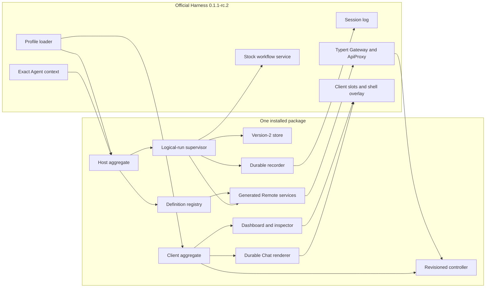
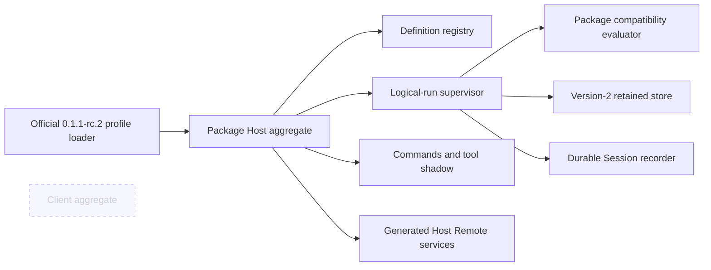

# Package architecture

English | [中文](architecture.zh.md)

This reference describes the installed architecture of `@zaalipro/dsh-workflows`: one Host/Client bundle for official DeepSeek Harness `0.1.1-rc.2`, with a package-owned MIT compatibility evaluator. The [user guide](user-guide.md) owns operating procedures, the [testing reference](testing.md) owns release evidence, and the [architecture decision](../.agents/notes/implemented/architecture/2026-08-20-installable-workflows-package.md) owns rationale and rejected alternatives.

## Scope and invariants

The package owns definition discovery, logical-run supervision, retained storage, completion delivery, commands, Agent-scoped model-tool replacement, authorized Remote reads, the Web dashboard, and the private JavaScript compatibility evaluator. Official `0.1.1-rc.2` owns the Host, Agent, Session, provider, and Client services. A Headless install evaluates no browser module. A Web install adds the Client aggregate without changing Host execution authority.

Current state: plugin `0.1.0-rc.3` is verified against official `0.1.1-rc.2`. The plugin adapts the public Agent-scoped tool/prompt, filesystem, command, Remote, and provider faces and does not modify the stock `ctx.workflowEngine`.

Four invariants organize every component:

1. A start is durable before it is visible, and a deferred private evaluator attempt has an owner before it can execute.
2. A same-process resume uses only the quiescent engine checkpoint; observe-only events never become replay authority.
3. Protected run data moves through Agent-authorized, bounded Remote pages; broadcast events carry invalidation only.
4. Teardown closes admission and drains owned work to a fixed point before releasing the storage lease.

## Package topology

### Web composition

The package's bundle patch mounts exactly one Host aggregate, advertises `lib/client.js`, and disables the stock workflow Chat renderer only where the package renderer consumes the same official durable vocabulary. It does not edit an official profile file.

### Headless composition

The headless bundle has no import path to `./client`; commands, saved aliases, the model tool, gates, supervision, persistence, and durable Session recording remain available.

## Component and event ownership

### Host components

- **Aggregate and configuration** validate official `0.1.1-rc.2` faces before filesystem access, resolve every Schemastery default, load assets relative to `import.meta.url`, and mount children under effect ownership.
- **Definition registry (`ctx.workflows`)** observes bundled, project, and user roots; re-reads authoritative bytes; publishes only coalesced `workflows/change` hints; and owns safe save publication.
- **Run store and native lease** own manifests, immutable detail sidecars, scripts, scratch files, retention, recovery, and one process-lifetime advisory lock.
- **Supervisor (`ctx.workflowSupervisor`)** owns exact Agent/Session authorization, logical identities, attempts, status transitions, budgets, checkpoints, gates, controls, and lifecycle events.
- **Completion notifier** owns the `none -> claimed -> delivered|abandoned` outbox and bounded direct Session-surface append cohorts. It never wakes the Agent or writes either inbox lane.
- **Run recorder (`ctx.workflowRunRecorder`)** projects explicitly attributed top-level runs into the official Session vocabulary.
- **Question bridge** maps an exact fenced `workflows/gate-request` to `ctx.userQuestions` and acknowledges only the current Agent/run/execution/gate tuple.
- **Commands and trusted skill** own `/workflow`, `/create-workflow`, dynamic aliases, and the protected packaged `create-workflow` definition. The Client input-trigger source exclusively owns bare `/workflows` and its overlay.
- **Tool adapter** temporarily replaces the official `workflow` tool and `tool:workflow` prompt section only in the exact Agent context where both official identities match.
- **Remote services** expose definition lists and paged run detail, members, logs, result, artifacts, chunks, and revision-checked controls.

The supervisor emits package-local `workflows/run-start`, `workflows/member-start`, `workflows/member-end`, `workflows/run-end`, `workflows/run-change`, and `workflows/gate-request`. These events are process lifecycle and invalidation signals, not durable replay authority. The recorder writes only `tool-workflow/run-start`, `tool-workflow/agent-start`, `tool-workflow/agent-end`, and `tool-workflow/run-end`; the package invents no durable phase or log event.

### Client components

- **Generated Remote mount** installs `lib/typert.remote-client.js` before any Remote consumer and unmounts it after reads and controllers abort.
- **WorkflowRunsController** keeps one lazy revisioned source per observed Session, handles paging and reconnect generations, and never recreates removed state from a late response.
- **Dashboard navigator** opens as a client-owned centered overlay modal (conversation remains visible behind dimmed chrome) and owns wide, two-pane, and mobile drill-down navigation.
- **Member inspector** distinguishes pending, JSON (including `null`), text, primitive, truncated, not-produced, evicted, unavailable-transcript, and request-error states.
- **Durable Chat renderer** folds only the four official Session events and never observes package-private run heads.

Browser HMR disposes controllers, actions, overlays, generated Remote mounts, and CSS ownership before mounting the new Client generation. A Host HMR cycle follows the full teardown sequence; it never carries a live attempt into a replacement plugin generation.

## Public subpaths and build faces

The public export map is closed: `.`, `./registry`, `./supervisor`, `./run-recorder`, `./user-questions`, `./commands`, `./tool`, `./client`, `./types`, `./invariant`, `./typert`, `./remote`, `./cordis.patch.yml`, `./skills/create-workflow/SKILL.md`, and `./package.json`. No `./src/*` path is public.

The package root owns three compiler faces: solution `tsconfig.json`, Host `tsconfig.host.json`, and Client `tsconfig.client.json`. Build order is **Host TSC -> Typert -> Client TSC -> classic lazy CJS**. A temporary copied mini-workspace provides one staging-root Host aggregate and one copied-package staging `tsconfig.json`; it has no nested Host/Client aggregate files. Focused `WorkspaceTypertGenerator.generate()` returns artifacts, and the build writes exactly `lib/typert.host.js`, `lib/typert.host.d.ts`, `lib/typert.remote-client.js`, and `lib/typert.remote-client.d.ts`, plus a map only when returned.

The final `lib/client.js` must call `window.__ModuleLoader__.load({ id: "@zaalipro/dsh-workflows", factory: (require) => ... })` with a non-empty factory. Optional-chaining `?.load` and `factory: () => ({})` placeholders fail the build and package verifier. The bundle keeps baseline Client dependencies external, inlines package Remote and `clsx` code, and lets Lightning CSS own module names and lifecycle. Skill, patch, and Client asset paths derive from `import.meta.url`, never the process cwd. The private evaluator is emitted from `vendor/workflow-engine` as `lib/compat-engine/index.js` and `worker.cjs`; it is instantiated only for the supervisor and never replaces stock `ctx.workflowEngine`. Published and Git installs ship those prebuilt artifacts; `dsh plugin add` must not run a build.

## Lifecycle authority

### Boot and startup recovery

Activation first verifies the supported official `0.1.1-rc.2` service faces. Storage then validates or creates only the owner-only runs root and permanent lock anchor, opens the anchor without following links, validates its stable identity, and acquires a nonblocking `fs-native-extensions` lifetime lease. Only the lease holder creates or validates the four store directories and performs one complete, bounded recovery before Session admission.

Recovery validates every manifest and referenced sidecar before publishing any row. Persisted active rows become terminal `interrupted`, running member heads become `cancelled`, and orphaned notice claims become `abandoned`. Recovery keeps inspection facts and display ordinals but reconstructs no execution authority.

### Durable-before-visible launch

Start validates ownership, source, args, budget, and capacity before reserving a display ordinal or path. It stages `script.js`, `scratch/`, and `details/`, publishes the single-component run directory, and commits the initial version-2 manifest row. That manifest transaction is durable admission. The supervisor then installs private starting authority, attaches all observers and a deferred evaluator attempt, publishes the in-memory row and package lifecycle, releases execution once, and returns `started` without awaiting settlement.

A caller abort before durable admission rolls back without a run directory or ordinal. After admission, the supervisor owns the detached run. A later attachment or execution failure terminalizes retained history instead of deleting it.

### Pause, resume, and gates

Pause commits `pausing`, closes new engine work, cancels the attempt, awaits its result, awaits idempotent disposal and child/scratch drainage, then reads `checkpoint()` synchronously. The supervisor commits and publishes `paused` only after that quiescent checkpoint exists.

Ordinary Resume starts a new attempt over the immutable admitted script and args plus the retained in-memory checkpoint. An `await_user` acknowledgement continues the exact live attempt and commits the satisfied gate; a `pause` acknowledgement disposes the parked attempt and replays, so an unchanged pause condition emits again. Every answer is fenced by exact Agent identity, Session, logical run, engine execution, gate id, and generation. A budget-limited run accepts only model resume with a strictly higher absolute cap up to 1,024.

### Stop and completion notice

Stop closes admission, commits `stopping`, cancels the attempt and every admitted child/scratch operation, awaits paired member endings and disposal, discards resume authority, then atomically commits terminal `cancelled` and its notice claim. A clean or failed settlement follows the same dispose-before-terminal discipline.

The terminal transaction changes `completionNotice` from `none` to `claimed` before the head becomes visible. One bounded append attempt finalizes that claim as `delivered` or `abandoned`; neither state retries. Cohorts carry at most 20 notices and 262,144 UTF-8 bytes. They append a plugin-sourced `user/message` directly to the owner Session with `surfaceOp: "append"`, making it durable and visible without opening a completion-driven model turn.

### Remote reconnect and HMR

`workflows/run-change` carries only `{ kind: 'invalidate', sessionId, revision }` or `{ kind: 'invalidate-all' }`. ApiProxy keeps keyed-latest hints for at most 256 Session keys and collapses overflow to the global form. On connection loss the Client aborts reads and marks existing sources reconnecting. After `connection/reset`, it fetches a new Agent-authorized epoch baseline before accepting later invalidations. Page, selection, Session, and connection generations suppress late responses.

### Fixed-point teardown

Host teardown closes global start admission, aborts and awaits pre-admission starts, stops and disposes published attempts, drains child/scratch operations, commits terminal rows, completes recorder prefixes, withdraws questions, and delivers or abandons notices. It repeats until completion-driven work cannot add another owner. Only then do the registry and storage close; the native lease unlock and descriptor close are last. This sequence leaves no worker, child, timer, watcher, request, or lock owner behind.

## Manifest version 2 and secure storage

The default root is `$DSH_HOME/workflow-runs` with permanent `.workflow-storage.lock`, Session manifests at `sessions/<sha256(sessionId)>/manifest.json`, and one safe 32-lowercase-hex directory per run under `runs/`. Each run directory owns `script.js`, `scratch/`, and immutable `details/<detail-id>.json` snapshots. `staging/` and `quarantine/` are separate root children.

The at-most-8-MiB manifest is a Session head/index: ownership, display ordinal high-water marks, bounded run heads, revisions, one-component directory ids, sidecar references, and notice state. It never carries absolute paths, full outputs, args, journals, gates, or Agent references. One fully fsynced detail snapshot holds bounded members, logs, result, and artifact indexes; each run has at most 32 MiB of referenced detail. Terminal retention keeps at most 256 rows per Session, and total committed storage is at most 512 MiB. Oldest eligible terminal rows evict deterministically; active and claimed-notice rows never evict, and display ordinal history remains.

Every run-storage directory walk uses the plugin-owned, fail-closed local descriptor implementation; the official filesystem service remains authoritative for definition discovery. A `script_path` read prefers a Host `readBytesNoFollow` capability. Published stock RC2 lacks that method, so only for its verified local filesystem shape the plugin authorizes and normalizes through the public Host `lstat`/`resolve`/`processPath` methods, then performs its own bounded `O_NOFOLLOW` descriptor read; unknown and remote providers fail closed. Root and components must have the current owner, restrictive `0700`/`0600` modes, expected type, one link for regular files, no symlink or junction, and stable device/inode identity. Cleanup never recurses after identity changes. The permanent kernel lock has no PID, heartbeat, stale age, retry, takeover, or deletion protocol. It coordinates cooperating same-user processes, not a malicious same-UID actor that ignores the lease.

## Replay and script containment

The journal addresses committed hooks with positive-safe-integer tuples in numeric lexicographic order and fingerprints each effective operation with lowercase SHA-256. Replay validates id, kind, and fingerprint before any new effect. Cumulative `agentSpend` and member sequence continue across attempts; replay and schema-correction calls cost no additional logical agent. An uncommitted effect may run again, so the system does not claim exactly-once external effects.

Replay-capable runs remove `Date`, `Math.random`, `Atomics`, `SharedArrayBuffer`, `WeakRef`, and `FinalizationRegistry` while preserving deterministic Math functions. `node:vm` shapes that API and keeps synchronous script work off the Host event loop; it is not a security sandbox for hostile code. Scripts retain the same trust premise as existing model shell access.

## Bounded Remote and browser presentation

Every direct Remote method receives an explicit resolved Agent first and a required `AbortSignal` last; none combines that root with `@RemoteScope`. The exact Agent and its Session authorize every run, member, artifact, cursor, and control before protected data is read. List limits default to 50 and cap at 200. Only heads are eager; detail, members, outcomes, logs, result, artifacts, and UTF-8-safe artifact chunks load after selection.

The dashboard has three panes at 1,200 px and wider, two-pane navigation below 1,200 px, and explicit runs-to-execution-to-inspector drill-down below 768 px, including 320 px. It traps and restores focus, uses real selection controls, preserves prior successful pages on errors, exposes labelled Retry actions, supports Escape and guarded P/R/X/S shortcuts, respects reduced motion, and keeps narrow actions at least 44 px.

## Compatibility provenance

Official `0.1.1-rc.2` integration uses Agent-scoped `tools.register` and `systemPrompt.section` only when the stock workflow contribution is identified; custom same-name contributions remain untouched. The package owns deferred execution, replay journal, checkpoints, gates, budget accounting, and scratch in its private compatibility evaluator.

Official `0.1.1-rc.2` is the only verified installed Host for plugin `0.1.0-rc.3`; `0.1.0-rc.8` is unsupported and later Hosts require re-verification. The compatibility evaluator is package-owned MIT source derived narrowly from the maintained workflow behavior, not a replacement for the process-global stock workflow service.

## Capacity bounds

Defaults and hard ceilings keep every path bounded: 128 agents per run by default and 1,024 maximum; deployment live concurrency; 8 MiB Host protocol frames; 64 MiB journals; 1 MiB prompts and definition/projection files; 64 KiB events; 8 MiB manifests; 32 MiB detail per run; 512 MiB committed store; 4,096 startup entries; 64 active runs per Session and 1,024 globally; 200 rows per Remote page; and 256 pending Session invalidation keys. Scratch allows at most 4,096 operations, 64 pending operations, 64 files, 1 MiB per file, and 8 MiB total unless configuration lowers a limit.
