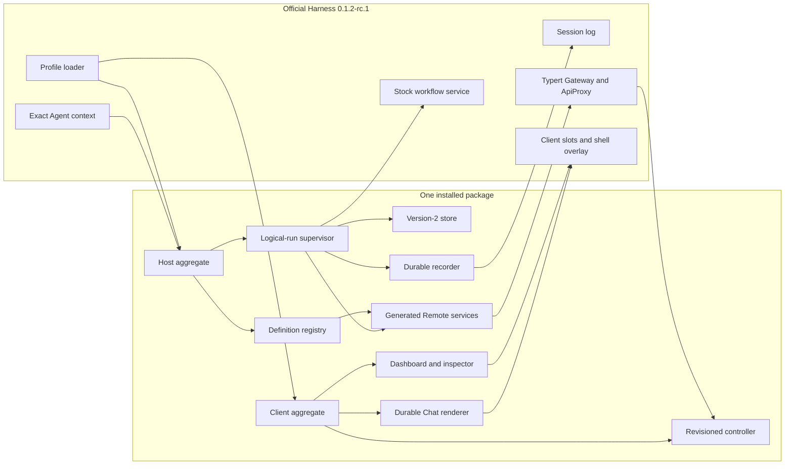
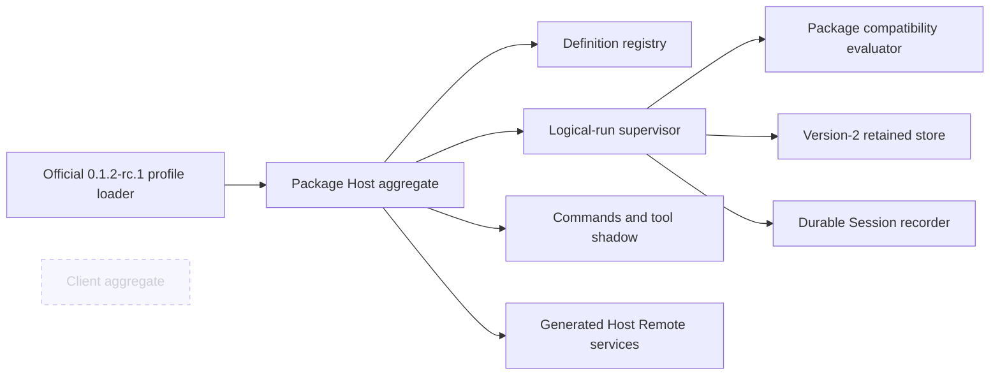

# 包架构

[English](architecture.md) | 中文

本参考说明 `@zaalipro/dsh-workflows` 的已安装架构：它是面向官方 DeepSeek Harness `0.1.2-rc.1` 的单一 Host/Client bundle，并包含 private compatibility evaluator（package-owned MIT source）。[用户指南](user-guide.zh.md)负责操作步骤，[测试参考](testing.zh.md)负责发布证据，[架构决策](../.agents/notes/implemented/architecture/2026-08-20-installable-workflows-package.zh.md)负责理由和被拒绝的替代方案。

## 范围与不变量

本包拥有 definition discovery、logical-run supervision、retained storage、completion delivery、命令、Agent-scoped model-tool replacement、授权 Remote read、Web dashboard 与 private JavaScript compatibility evaluator。官方 `0.1.2-rc.1` 拥有 Host、Agent、Session、provider 与 Client service。Headless 安装不求值任何浏览器模块；Web 安装增加 Client aggregate，但不改变 Host execution authority。

当前状态：plugin `0.1.0-rc.4` 已针对官方 `0.1.2-rc.1` 验证。Plugin 适配 public Agent-scoped tool/prompt、filesystem、command、Remote 与 provider face，不修改 stock `ctx.workflowEngine`。

四条不变量组织所有组件：

1. start 在可见前持久化，而且 deferred private evaluator attempt 在执行前已经有 owner。
2. same-process resume 只使用 quiescent engine checkpoint；observe-only event 绝不成为 replay authority。
3. 受保护的 run data 通过 Agent-authorized、bounded Remote page 传输；broadcast event 只携带 invalidation。
4. teardown 先关闭 admission 并把 owned work 排空到 fixed point，最后才释放 storage lease。

## 包拓扑

### Web composition

本包的 bundle patch 只挂载一个 Host aggregate，公布 `lib/client.js`，并且只在本包 renderer 消费相同官方 durable vocabulary 的位置禁用 stock workflow Chat renderer。它不会修改官方 profile 文件。

### Headless composition

headless bundle 没有通往 `./client` 的 import path；命令、保存的 alias、model tool、gate、supervision、persistence 和 durable Session recording 仍然可用。

## 组件与事件归属

### Host 组件

- **Aggregate 与配置**在访问 filesystem 前验证官方 `0.1.2-rc.1` 的 package version 与 service face，解析每个 Schemastery default，通过 `import.meta.url` 相对路径加载资产，并在 effect ownership 下挂载 child。
- **Definition registry (`ctx.workflows`)** 观察 bundled、project 和 user root；重新读取 authoritative byte；只发布合并后的 `workflows/change` hint；并拥有 safe save publication。
- **Run store 与 native lease** 拥有 manifest、immutable detail sidecar、script、scratch file、retention、recovery 和一个 process-lifetime advisory lock。
- **Supervisor (`ctx.workflowSupervisor`)** 拥有 exact Agent/Session authorization、logical identity、attempt、status transition、budget、checkpoint、gate、control 和 lifecycle event。
- **Completion notifier** 拥有 `none -> claimed -> delivered|abandoned` outbox 和 bounded direct Session-surface append cohort；它不会唤醒 Agent，也不会写入任何 inbox lane。
- **Run recorder (`ctx.workflowRunRecorder`)** 把明确归属的 top-level run 投影到官方 Session vocabulary。
- **Question bridge** 把 exact fenced `workflows/gate-request` 映射到 `ctx.userQuestions`，只确认当前 Agent/run/execution/gate tuple。
- **命令与 trusted skill** 拥有 `/workflow`、`/create-workflow`、dynamic alias 以及受保护的 packaged `create-workflow` definition。Client input-trigger source 独占裸 `/workflows` 及其 overlay。
- **Tool adapter** 只在两个官方 identity 都匹配的 exact Agent context 中临时替换官方 `workflow` tool 和 `tool:workflow` prompt section。
- **Remote service** 提供 definition list 以及分页的 run detail、member、log、result、artifact、chunk 和 revision-checked control。

Supervisor 发出 package-local `workflows/run-start`、`workflows/member-start`、`workflows/member-end`、`workflows/run-end`、`workflows/run-change` 和 `workflows/gate-request`。这些 event 是 process lifecycle 与 invalidation signal，不是 durable replay authority。Recorder 只写入 `tool-workflow/run-start`、`tool-workflow/agent-start`、`tool-workflow/agent-end` 和 `tool-workflow/run-end`；本包不发明 durable phase 或 log event。

### Client 组件

- **Generated Remote mount** 在任何 Remote consumer 前安装 `lib/typert.remote-client.js`，并在 read 和 controller abort 后卸载。
- **WorkflowRunsController** 为每个 observed Session 保存一个 lazy revisioned source，处理 paging 与 reconnect generation，绝不让 late response 重建已移除状态。
- **Dashboard navigator** 作为 client-owned 居中 overlay modal 打开（conversation 在 dimmed chrome 后仍可见），拥有宽屏、双 pane 和 mobile drill-down navigation。
- **Member inspector** 区分 pending、JSON（包括 `null`）、text、primitive、truncated、not-produced、evicted、unavailable-transcript 和 request-error 状态。
- **Durable Chat renderer** 只 fold 四个官方 Session event，绝不观察 package-private run head。

浏览器 HMR 会依次 dispose controller、action、overlay、generated Remote mount 和 CSS ownership，然后挂载新的 Client generation。Host HMR cycle 遵循完整 teardown sequence；它不会把 live attempt 带入替换后的 plugin generation。

## Public subpath 与 build face

public export map 是闭集：`.`、`./registry`、`./supervisor`、`./run-recorder`、`./user-questions`、`./commands`、`./tool`、`./client`、`./types`、`./invariant`、`./typert`、`./remote`、`./cordis.patch.yml`、`./skills/create-workflow/SKILL.md` 和 `./package.json`。没有公开的 `./src/*` path。

package root 拥有三个 compiler face：solution `tsconfig.json`、Host `tsconfig.host.json` 和 Client `tsconfig.client.json`。Build 顺序为 **Host TSC -> Typert -> Client TSC -> classic lazy CJS**。临时复制的 mini-workspace 提供一个 staging-root Host aggregate 和一个 copied-package staging `tsconfig.json`；其中没有嵌套 Host/Client aggregate file。Focused `WorkspaceTypertGenerator.generate()` 返回 artifact，build 会准确写入 `lib/typert.host.js`、`lib/typert.host.d.ts`、`lib/typert.remote-client.js` 和 `lib/typert.remote-client.d.ts`，并且只在返回值包含 map 时写 map。

最终的 `lib/client.js` 必须调用 `window.__ModuleLoader__.load({ id: "@zaalipro/dsh-workflows", factory: (require) => ... })`，且 factory 非空。Optional-chaining `?.load` 与 `factory: () => ({})` 占位符会使 build 与 package verifier 失败。bundle 保持 baseline Client dependency 为 external，内联 package Remote 与 `clsx` code，并由 Lightning CSS 拥有 module name 和 lifecycle。Skill、patch 与 Client asset path 来自 `import.meta.url`，绝不来自 process cwd。Private evaluator 由 `vendor/workflow-engine` 构建为 tarball 中的 `lib/compat-engine/index.js` 与 `worker.cjs`，只供 supervisor 实例化，绝不替换 stock `ctx.workflowEngine`。发布物与 Git install 带上这些预构建 artifact；`dsh plugin add` 不得在安装时构建。

## Lifecycle authority

### 启动与 startup recovery

Activation 首先验证受支持的官方 `0.1.2-rc.1` service face。Storage 随后只验证或创建 owner-only runs root 和永久 lock anchor，以 no-follow 方式打开 anchor，验证稳定 identity，并取得非阻塞 `fs-native-extensions` lifetime lease。只有 lease holder 能创建或验证四个 store directory，并在 Session admission 前完成一次完整且有界的 recovery。

Recovery 会在发布任何 row 前验证所有 manifest 和引用的 sidecar。持久化的 active row 变成 terminal `interrupted`，running member head 变成 `cancelled`，orphaned notice claim 变成 `abandoned`。Recovery 保留 inspection fact 和 display ordinal，但不重建 execution authority。

### Durable-before-visible launch

Start 在预留 display ordinal 或 path 前验证 ownership、source、args、budget 和 capacity。它 stage `script.js`、`scratch/` 和 `details/`，发布单 component run directory，然后提交 initial version-2 manifest row。该 manifest transaction 是 durable admission。Supervisor 随后安装 private starting authority，附加所有 observer 和一个 deferred evaluator attempt，发布 in-memory row 和 package lifecycle，仅 release execution 一次，并在不等待 settlement 的情况下返回 `started`。

Durable admission 前的 caller abort 会 rollback，不留下 run directory 或 ordinal。Admission 后由 supervisor 拥有 detached run。之后的 attachment 或 execution failure 会 terminalize retained history，而不是删除它。

### Pause、resume 与 gate

Pause 提交 `pausing`，关闭新的 engine work，取消 attempt，等待 result，等待 idempotent disposal 与 child/scratch drainage，然后同步读取 `checkpoint()`。Supervisor 只在该 quiescent checkpoint 存在后提交并发布 `paused`。

普通 Resume 用 immutable admitted script、args 和 retained in-memory checkpoint 启动新 attempt。`await_user` acknowledgement 会继续 exact live attempt 并提交 satisfied gate；`pause` acknowledgement 会 dispose parked attempt 并 replay，因此未改变的 pause condition 会再次 emit。每个 answer 都由 exact Agent identity、Session、logical run、engine execution、gate id 和 generation fence 保护。Budget-limited run 只接受 model resume，且绝对 cap 必须严格提高并不超过 1,024。

### Stop 与 completion notice

Stop 关闭 admission，提交 `stopping`，取消 attempt 和所有 admitted child/scratch operation，等待 paired member ending 与 disposal，丢弃 resume authority，最后原子提交 terminal `cancelled` 及其 notice claim。Clean 或 failed settlement 遵循相同的 dispose-before-terminal discipline。

Terminal transaction 在 head 可见前把 `completionNotice` 从 `none` 变成 `claimed`。一次 bounded append attempt 会把 claim finalize 为 `delivered` 或 `abandoned`；两者都不会重试。每个 cohort 最多携带 20 个 notice 和 262,144 UTF-8 byte。它通过 `surfaceOp: "append"` 把 plugin-sourced `user/message` 直接追加到 owner Session，使 notice durable 且立即可见，同时不会打开 completion-driven model turn。

### Remote reconnect 与 HMR

`workflows/run-change` 只携带 `{ kind: 'invalidate', sessionId, revision }` 或 `{ kind: 'invalidate-all' }`。ApiProxy 为最多 256 个 Session key 保留 keyed-latest hint，并把 overflow 合并成 global form。Connection loss 时 Client abort read，并把已有 source 标记为 reconnecting。`connection/reset` 后，它先获取新的 Agent-authorized epoch baseline，再接受后续 invalidation。Page、selection、Session 和 connection generation 会抑制 late response。

### Fixed-point teardown

Host teardown 关闭 global start admission，abort 并等待 pre-admission start，停止和 dispose 已发布 attempt，排空 child/scratch operation，提交 terminal row，完成 recorder prefix，withdraw question，并 deliver 或 abandon notice。它重复检查，直到 completion-driven work 无法再增加 owner。随后才关闭 registry 和 storage；native lease unlock 与 descriptor close 最后执行。该顺序不会遗留 worker、child、timer、watcher、request 或 lock owner。

## Manifest version 2 与安全存储

默认 root 是 `$DSH_HOME/workflow-runs`，其中包含永久 `.workflow-storage.lock`、位于 `sessions/<sha256(sessionId)>/manifest.json` 的 Session manifest，以及 `runs/` 下每个 run 独有的安全 32 位小写十六进制 directory。每个 run directory 拥有 `script.js`、`scratch/` 和 immutable `details/<detail-id>.json` snapshot。`staging/` 与 `quarantine/` 是独立的 root child。

最大 8 MiB 的 manifest 是 Session head/index：ownership、display ordinal high-water mark、bounded run head、revision、单 component directory id、sidecar reference 和 notice state。它从不携带 absolute path、完整 output、args、journal、gate 或 Agent reference。一个 fully fsynced detail snapshot 保存 bounded member、log、result 和 artifact index；每个 run 最多引用 32 MiB detail。Terminal retention 每个 Session 最多保留 256 row，全部 committed storage 最多 512 MiB。最旧且符合条件的 terminal row 会确定性 evict；active 与 claimed-notice row 绝不 evict，display ordinal history 保留。

每次 run-storage directory walk 都使用 plugin-owned、fail-closed local descriptor implementation；官方 filesystem service 仍负责 definition discovery。`script_path` read 优先使用 Host `readBytesNoFollow` capability。已发布的 stock RC2 没有该方法，因此 plugin 仅在验证为其 local filesystem shape 后，先通过 public Host `lstat`/`resolve`/`processPath` method 完成授权与规范化，再自行执行 bounded `O_NOFOLLOW` descriptor read；unknown 与 remote provider 会 fail closed。Root 与 component 必须属于当前 owner，具有严格 `0700`/`0600` mode、预期 type、regular file 单 link、无 symlink 或 junction，以及稳定 device/inode identity。Identity 改变后 cleanup 不会 recurse。永久 kernel lock 没有 PID、heartbeat、stale age、retry、takeover 或 deletion protocol。它协调同一用户下合作的 process，而不是忽略 lease 的 malicious same-UID actor。

## Replay 与 script containment

Journal 使用按 numeric lexicographic order 排列的 positive-safe-integer tuple 寻址 committed hook，并用小写 SHA-256 fingerprint 标识每个 effective operation。Replay 会在任何新 effect 前验证 id、kind 和 fingerprint。Cumulative `agentSpend` 和 member sequence 跨 attempt 延续；replay 与 schema-correction call 不增加 logical agent 消耗。Uncommitted effect 可能再次执行，因此系统不声称 exactly-once external effect。

Replay-capable run 移除 `Date`、`Math.random`、`Atomics`、`SharedArrayBuffer`、`WeakRef` 和 `FinalizationRegistry`，同时保留 deterministic Math function。`node:vm` 塑造该 API，并使 synchronous script work 不阻塞 Host event loop；它不是 hostile-code security sandbox。Script 与现有 model shell access 保持相同 trust premise。

## Bounded Remote 与浏览器展示

每个 direct Remote method 的首个参数都是显式 resolved Agent，最后一个参数是必需的 `AbortSignal`；没有方法把该 root 与 `@RemoteScope` 组合。Exact Agent 及其 Session 会在读取受保护数据前授权每个 run、member、artifact、cursor 和 control。List limit 默认 50，最大 200。只有 head eager load；detail、member、outcome、log、result、artifact 和 UTF-8-safe artifact chunk 都在 selection 后加载。

Dashboard 在 1,200 px 及以上使用三 pane，低于 1,200 px 使用双 pane，低于 768 px（包括 320 px）使用明确的 runs-to-execution-to-inspector drill-down。它 trap 并恢复 focus，使用真实 selection control，在 error 后保留先前成功 page，提供有 label 的 Retry action，支持 Escape 和受保护的 P/R/X/S shortcut，尊重 reduced motion，并让窄屏 action 至少为 44 px。

## 兼容性来源

官方 `0.1.2-rc.1` integration 只在识别出 stock workflow contribution 时使用 Agent-scoped `tools.register` 与 `systemPrompt.section`；同名 custom contribution 保持不变。Deferred execution、replay journal、checkpoint、gate、budget accounting 与 scratch 由 package private compatibility evaluator 提供。

官方 `0.1.2-rc.1` 是 plugin `0.1.0-rc.4` 唯一已验证的 installed Host；`0.1.0-rc.8` 不受支持，更高 Host 必须重新验证。Compatibility evaluator 是 package-owned MIT source，只窄范围承载 maintained workflow behavior，绝不替换 stock `ctx.workflowEngine` 或 process-global stock workflow service。

## Capacity bound

Default 与 hard ceiling 使所有 path 有界：每个 run 默认 128 个 agent、最多 1,024；deployment live concurrency；8 MiB Host protocol frame；64 MiB journal；1 MiB prompt 与 definition/projection file；64 KiB event；8 MiB manifest；每个 run 32 MiB detail；512 MiB committed store；4,096 个 startup entry；每个 Session 64 个 active run、全局 1,024；每个 Remote page 200 row；以及 256 个 pending Session invalidation key。Scratch 最多允许 4,096 次 operation、64 个 pending operation、64 个 file、每个 file 1 MiB、合计 8 MiB，除非 configuration 下调限制。
